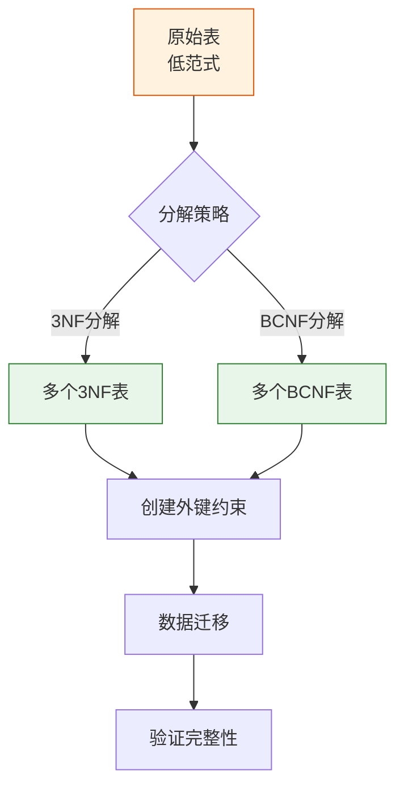

# Oracle模式分解技术

## 一、概述

### 1.1 一句话定义

Oracle模式分解技术，本质是将一个关系模式分解为多个关系模式以消除数据冗余和异常的方法。
它在Oracle数据库规范化设计中出现和使用，解决将低范式表转换为高范式表集合的问题。

### 1.2 为什么重要

- **不掌握的后果：** 无法正确分解表结构，可能丢失数据或引入新的异常
- **掌握的价值：** 系统化地将表规范化，保证分解的正确性

### 1.3 适用场景

| 场景 | 说明 |
|------|------|
| 数据库规范化 | 将低范式表分解为高范式 |
| 数据库重构 | 优化现有表结构 |
| 数据迁移 | 重新组织数据结构 |

### 1.4 版本演进

| 版本 | 变化说明 |
|------|---------|
| 12cR2 | 在线表重组（ALTER TABLE MOVE ONLINE） |
| 19c | 增强JSON/BSON支持 |
| 23ai | JSON Duality视图 |

## 二、术语与概念

### 2.1 核心术语表

| 术语 | 含义 | 类比 |
|------|------|------|
| 无损连接分解 | 分解后自然连接可恢复原关系 | 拼图能还原 |
| 保持函数依赖 | 分解后依赖关系仍可验证 | 规则不丢失 |
| 3NF分解算法 | Bernstein算法 | 系统化分解方法 |
| BCNF分解算法 | 基于违反BCNF的分解 | 更严格的分解 |

## 三、核心原理

### 3.1 无损连接分解

**定义：** 如果R分解为{R1, R2, ..., Rn}，对R的每个合法实例r，都有：

```
r = π_R1(r) ⨝ π_R2(r) ⨝ ... ⨝ π_Rn(r)
```

**判定定理：** R分解为R1和R2是无损连接的，当且仅当：

```
(R1 ∩ R2) → R1 或 (R1 ∩ R2) → R2
```

**示例：**

```sql
-- 原始表
-- R(emp_id, name, dept_id, dept_name)
-- 函数依赖：emp_id→name, dept_id, dept_name; dept_id→dept_name

-- 分解为：
-- R1(emp_id, name, dept_id)
-- R2(dept_id, dept_name)

-- R1 ∩ R2 = {dept_id}
-- dept_id → dept_name（即R2）
-- 所以是无损连接分解
```

### 3.2 保持函数依赖分解

**定义：** 分解后，原关系的所有函数依赖都能在某一个分解关系中验证。

**示例：**

```
原关系R(A, B, C)
函数依赖：A→B, B→C

分解为：R1(A, B), R2(B, C)
- A→B 在R1中可验证
- B→C 在R2中可验证
- 保持了所有函数依赖
```

### 3.3 3NF分解算法（Bernstein算法）

**算法步骤：**

1. 求出函数依赖集F的最小覆盖
2. 对最小覆盖中的每个函数依赖X→A，构成一个关系模式XA
3. 如果某个候选键未被包含在任何分解关系中，单独构成一个关系

**Oracle实现示例：**

```sql
-- 原始表（违反3NF）
-- R(emp_id, name, dept_id, dept_name, dept_location)
-- 函数依赖：
--   emp_id → name, dept_id
--   dept_id → dept_name, dept_location

-- 最小覆盖：
--   emp_id → name
--   emp_id → dept_id
--   dept_id → dept_name
--   dept_id → dept_location

-- 分解为：
-- R1(emp_id, name)
-- R2(emp_id, dept_id)
-- R3(dept_id, dept_name, dept_location)

-- Oracle DDL
CREATE TABLE employees (
    emp_id NUMBER PRIMARY KEY,
    name VARCHAR2(50) NOT NULL,
    dept_id NUMBER
);

CREATE TABLE departments (
    dept_id NUMBER PRIMARY KEY,
    dept_name VARCHAR2(50) NOT NULL,
    location VARCHAR2(100)
);

ALTER TABLE employees ADD CONSTRAINT emp_dept_fk 
    FOREIGN KEY (dept_id) REFERENCES departments(dept_id);
```

### 3.4 BCNF分解算法

**算法步骤：**

1. 结果 = {R}
2. 对结果中的每个关系模式S：
   - 如果S存在违反BCNF的函数依赖X→A（X不是超键）
   - 将S分解为：S1 = XA, S2 = S - A
   - 递归处理S1和S2

**注意：** BCNF分解不一定能保持函数依赖

**Oracle实现示例：**

```sql
-- 原始表（违反BCNF）
-- R(warehouse, product, manager)
-- 候选键：(warehouse, product), (manager, product)
-- 违反BCNF：manager → warehouse（manager不是超键）

-- 分解为：
-- R1(manager, warehouse)
-- R2(manager, product)

CREATE TABLE warehouse_managers (
    manager VARCHAR2(50) PRIMARY KEY,
    warehouse VARCHAR2(50) NOT NULL
);

CREATE TABLE product_managers (
    manager VARCHAR2(50),
    product VARCHAR2(50),
    CONSTRAINT pm_pk PRIMARY KEY (manager, product)
);
```

## 四、架构与组件

### 4.1 分解方法对比

| 方法 | 无损连接 | 保持依赖 | 目标范式 |
|------|---------|---------|---------|
| 3NF分解算法 | ✓ | ✓ | 3NF |
| BCNF分解算法 | ✓ | 不一定 | BCNF |
| 4NF分解算法 | ✓ | 不一定 | 4NF |

### 4.2 Oracle中的分解实现



## 五、配置与参数

### 5.1 Oracle在线表重组

```sql
-- Oracle 12cR2+ 在线表重组
-- 将大表分解为多个小表时，可以在线进行

-- 步骤1：创建新表
CREATE TABLE employees_new (
    emp_id NUMBER PRIMARY KEY,
    name VARCHAR2(50),
    dept_id NUMBER
);

CREATE TABLE departments_new (
    dept_id NUMBER PRIMARY KEY,
    dept_name VARCHAR2(50),
    location VARCHAR2(100)
);

-- 步骤2：迁移数据
INSERT INTO departments_new (dept_id, dept_name, location)
SELECT DISTINCT dept_id, dept_name, dept_location
FROM employees_old;

INSERT INTO employees_new (emp_id, name, dept_id)
SELECT emp_id, name, dept_id
FROM employees_old;

-- 步骤3：验证数据
SELECT COUNT(*) FROM employees_old;
SELECT COUNT(*) FROM employees_new;

-- 步骤4：切换（使用重命名）
DROP TABLE employees_old;
ALTER TABLE employees_new RENAME TO employees;
ALTER TABLE departments_new RENAME TO departments;

-- 步骤5：添加外键
ALTER TABLE employees ADD CONSTRAINT emp_dept_fk 
    FOREIGN KEY (dept_id) REFERENCES departments(dept_id);
```

### 5.2 使用DBMS_REDEFINITION在线重组

```sql
-- 在线重定义（12c+）
BEGIN
    DBMS_REDEFINITION.CAN_REDEF_TABLE(
        uname => 'HR',
        tname => 'EMPLOYEES',
        options_flag => DBMS_REDEFINITION.CONS_USE_ROWID
    );
END;
/

-- 开始重定义
BEGIN
    DBMS_REDEFINITION.START_REDEF_TABLE(
        uname => 'HR',
        orig_table => 'EMPLOYEES',
        int_table => 'EMPLOYEES_INT'
    );
END;
/

-- 同步中间表
BEGIN
    DBMS_REDEFINITION.SYNC_INTERIM_TABLE(
        uname => 'HR',
        orig_table => 'EMPLOYEES',
        int_table => 'EMPLOYEES_INT'
    );
END;
/

-- 完成重定义
BEGIN
    DBMS_REDEFINITION.FINISH_REDEF_TABLE(
        uname => 'HR',
        orig_table => 'EMPLOYEES',
        int_table => 'EMPLOYEES_INT'
    );
END;
/
```

## 六、监控与诊断

### 6.1 验证分解正确性

```sql
-- 验证无损连接
-- 分解后JOIN应恢复原始数据量
SELECT COUNT(*) FROM employees e
JOIN departments d ON e.dept_id = d.dept_id;
-- 应等于原始表行数

-- 验证函数依赖保持
-- 检查所有约束是否定义
SELECT constraint_name, constraint_type, table_name
FROM user_constraints
WHERE table_name IN ('EMPLOYEES', 'DEPARTMENTS');
```

### 6.2 性能对比

```sql
-- 分解前：单表查询
SELECT name, dept_name FROM employees_flat WHERE emp_id = 1001;

-- 分解后：需要JOIN
SELECT e.name, d.dept_name 
FROM employees e 
JOIN departments d ON e.dept_id = d.dept_id
WHERE e.emp_id = 1001;

-- 对比执行计划
SET AUTOTRACE ON
```

## 七、实战案例

### 7.1 案例背景

- **场景**：将非规范化的销售记录表分解为3NF
- **时间**：2026年
- **现象**：单表包含大量冗余

### 7.2 分解过程

**原始表：**

```sql
-- R(sale_id, customer_name, customer_city, product_name, category, quantity, unit_price)
-- 函数依赖：
--   sale_id → customer_name, customer_city, product_name, category, quantity, unit_price
--   customer_name → customer_city
--   product_name → category, unit_price
```

**步骤1：识别函数依赖**

```
sale_id → customer_name, customer_city, product_name, category, quantity, unit_price
customer_name → customer_city
product_name → category, unit_price
```

**步骤2：分解为3NF**

```sql
-- 分解结果：
-- R1(sale_id, customer_name, product_name, quantity, unit_price)
-- R2(customer_name, customer_city)
-- R3(product_name, category, unit_price)

-- Oracle DDL
CREATE TABLE customers (
    customer_name VARCHAR2(100) PRIMARY KEY,
    city VARCHAR2(50)
);

CREATE TABLE products (
    product_name VARCHAR2(200) PRIMARY KEY,
    category VARCHAR2(50),
    unit_price NUMBER(10,2)
);

CREATE TABLE sales (
    sale_id NUMBER PRIMARY KEY,
    customer_name VARCHAR2(100),
    product_name VARCHAR2(200),
    quantity NUMBER,
    unit_price NUMBER(10,2),
    CONSTRAINT sale_cust_fk FOREIGN KEY (customer_name) REFERENCES customers(customer_name),
    CONSTRAINT sale_prod_fk FOREIGN KEY (product_name) REFERENCES products(product_name)
);
```

### 7.3 分解结果

| 指标 | 分解前 | 分解后 |
|------|--------|--------|
| 表数量 | 1 | 3 |
| 冗余数据 | 大量 | 无 |
| 更新异常 | 存在 | 消除 |
| 查询复杂度 | 低 | 中（需JOIN） |

### 7.4 复盘总结

- **根因：** 系统化分解方法保证正确性
- **教训：** 分解后需验证无损连接和依赖保持

## 八、常见错误与排查

### 8.1 常见错误

| 错误 | 问题 | 解决方法 |
|------|------|---------|
| 分解丢失数据 | 非无损连接 | 检查交集函数依赖 |
| 依赖丢失 | 无法验证约束 | 使用3NF分解算法 |
| 过度分解 | 表过多JOIN复杂 | 权衡规范化程度 |

## 九、最佳实践

### 9.1 官方推荐

- 使用3NF分解算法保证依赖保持
- 分解后验证数据完整性
- 使用在线重定义减少停机

### 9.2 社区经验

- 先分析函数依赖再分解
- 分解后添加外键约束
- 性能敏感场景适度反规范化

### 9.3 反模式

| 反模式 | 问题 | 正确做法 |
|--------|------|---------|
| 随意分解 | 可能丢失数据 | 使用算法保证无损 |
| 忽视性能 | JOIN过多 | 权衡规范化程度 |
| 不验证 | 分解错误未发现 | 执行完整性检查 |

## 十、命令与视图汇总

### 10.1 命令列表

| 命令 | 适用场景 | 说明 |
|------|---------|------|
| `DBMS_REDEFINITION` | 在线重组 | 不停机表重组 |
| `ALTER TABLE MOVE` | 表重组 | 物理重组 |

### 10.2 视图列表

| 视图名 | 类型 | 用途 |
|--------|------|------|
| USER_CONSTRAINTS | 数据字典 | 约束信息 |
| USER_TAB_COLUMNS | 数据字典 | 列信息 |

## 十一、总结速查

### 11.1 黄金法则

1. **保证无损连接** - 分解后数据不丢失
2. **保持函数依赖** - 约束仍可验证
3. **权衡性能** - 不过度分解

### 11.2 一页纸检查清单

| 检查项 | 说明 |
|--------|------|
| 无损连接 | JOIN后数据量一致 |
| 依赖保持 | 所有约束可验证 |
| 外键完整 | 关系正确建立 |
| 性能可接受 | JOIN不过多 |

## 附录

### A. 官方参考

- [Oracle Database VLDB and Partitioning Guide](https://docs.oracle.com/en/database/oracle/oracle-database/19c/vldbg/)
- [Oracle Database Administrator's Guide - Online Redefinition](https://docs.oracle.com/en/database/oracle/oracle-database/19c/admin/)

### B. 修订记录

| 日期 | 版本 | 修改内容 | 修改人 |
|------|------|---------|--------|
| 2026-07-01 | v1.0 | 初始版本 | YashanDB知识库生成器 |
