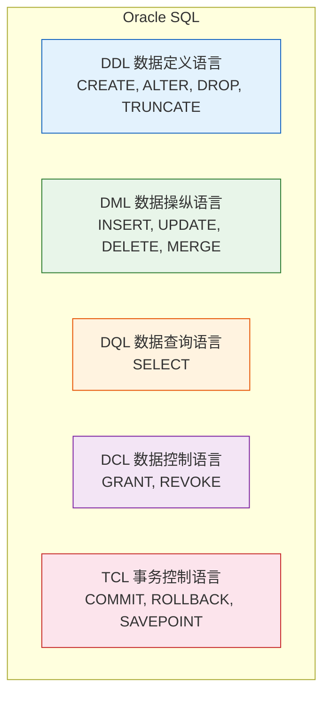
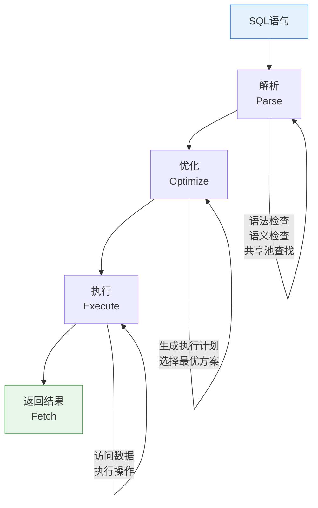

# Oracle SQL概述与分类

## 一、概述

### 1.1 一句话定义

Oracle SQL概述与分类，本质上是Oracle数据库对结构化查询语言（SQL）的完整实现和扩展体系。
它在Oracle数据库的所有操作中出现和使用，解决数据定义、数据操纵、数据控制和数据查询的问题。

### 1.2 为什么重要

- **不掌握的后果：** 无法有效操作Oracle数据库，影响开发和管理效率
- **掌握的价值：** 熟练使用SQL进行数据库开发和管理

### 1.3 适用场景

| 场景 | 说明 |
|------|------|
| 应用开发 | 编写SQL操作数据库 |
| 数据库管理 | 创建和管理数据库对象 |
| 数据分析 | 查询和统计 |
| 性能优化 | 优化SQL执行 |

### 1.4 版本演进

| 版本 | 变化说明 |
|------|---------|
| 11gR2 | 增强分析函数、WITH子句增强 |
| 12cR1 | 行限制子句（FETCH FIRST）、SQL改进 |
| 12cR2 | 增强JSON支持 |
| 19c | 多态表函数、SQL宏 |
| 21c | 区块链表、SQL宏增强 |
| 23ai | AI向量搜索、JSON Duality视图、SQL域类型 |

## 二、术语与概念

### 2.1 核心术语表

| 术语 | 含义 | 类比 |
|------|------|------|
| DDL | 数据定义语言 | 建筑图纸 |
| DML | 数据操纵语言 | 室内装修 |
| DQL | 数据查询语言 | 查找物品 |
| DCL | 数据控制语言 | 门禁系统 |
| TCL | 事务控制语言 | 操作确认 |

### 2.2 SQL分类体系



## 三、核心原理

### 3.1 DDL（数据定义语言）

DDL用于定义和管理数据库对象。

| 语句 | 用途 | 示例 |
|------|------|------|
| CREATE | 创建对象 | CREATE TABLE |
| ALTER | 修改对象 | ALTER TABLE |
| DROP | 删除对象 | DROP TABLE |
| TRUNCATE | 清空数据 | TRUNCATE TABLE |
| RENAME | 重命名 | RENAME |

**特点：**
- 隐式提交（执行后自动COMMIT）
- 操作数据字典
- 不可回滚

```sql
-- DDL示例
CREATE TABLE employees (
    emp_id NUMBER PRIMARY KEY,
    name VARCHAR2(50) NOT NULL,
    salary NUMBER(10,2)
);

ALTER TABLE employees ADD (dept_id NUMBER);

DROP TABLE employees;

TRUNCATE TABLE employees;  -- 清空数据，保留结构
```

### 3.2 DML（数据操纵语言）

DML用于操作表中的数据。

| 语句 | 用途 | 示例 |
|------|------|------|
| INSERT | 插入数据 | INSERT INTO |
| UPDATE | 更新数据 | UPDATE |
| DELETE | 删除数据 | DELETE FROM |
| MERGE | 合并插入/更新 | MERGE INTO |

**特点：**
- 需要显式提交（COMMIT）
- 可以回滚（ROLLBACK）
- 生成redo和undo

```sql
-- DML示例
INSERT INTO employees (emp_id, name, salary) VALUES (1, 'Alice', 10000);

UPDATE employees SET salary = 12000 WHERE emp_id = 1;

DELETE FROM employees WHERE emp_id = 1;

MERGE INTO employees e
USING (SELECT 2 AS emp_id, 'Bob' AS name, 15000 AS salary FROM dual) src
ON (e.emp_id = src.emp_id)
WHEN MATCHED THEN UPDATE SET e.salary = src.salary
WHEN NOT MATCHED THEN INSERT (emp_id, name, salary) VALUES (src.emp_id, src.name, src.salary);
```

### 3.3 DQL（数据查询语言）

DQL用于查询数据，核心是SELECT语句。

```sql
-- 基本查询
SELECT emp_id, name, salary FROM employees WHERE salary > 10000;

-- 聚合查询
SELECT dept_id, COUNT(*), AVG(salary) FROM employees GROUP BY dept_id;

-- 连接查询
SELECT e.name, d.dept_name 
FROM employees e 
JOIN departments d ON e.dept_id = d.dept_id;

-- 子查询
SELECT name FROM employees 
WHERE salary > (SELECT AVG(salary) FROM employees);

-- 分析函数
SELECT name, salary, 
       RANK() OVER (ORDER BY salary DESC) as rank
FROM employees;
```

**Oracle特有扩展：**
- CONNECT BY（层次查询）
- MODEL子句
- PIVOT/UNPIVOT
- MATCH_RECOGNIZE（模式匹配）
- SQL宏（SQL Macro）

### 3.4 DCL（数据控制语言）

DCL用于控制数据库访问权限。

```sql
-- 授权
GRANT SELECT, INSERT ON employees TO user1;
GRANT CREATE TABLE TO user2;
GRANT DBA TO user3;

-- 撤销权限
REVOKE INSERT ON employees FROM user1;

-- 查看权限
SELECT * FROM user_tab_privs;
SELECT * FROM user_sys_privs;
SELECT * FROM user_role_privs;
```

### 3.5 TCL（事务控制语言）

TCL用于管理事务。

```sql
-- 提交事务
COMMIT;

-- 回滚事务
ROLLBACK;

-- 设置保存点
SAVEPOINT sp1;

-- 回滚到保存点
ROLLBACK TO sp1;

-- 设置只读事务
SET TRANSACTION READ ONLY;

-- 设置事务名称
SET TRANSACTION NAME 'update_salary';
```

**事务特性（ACID）：**
- 原子性（Atomicity）：事务要么全部完成，要么全部不完成
- 一致性（Consistency）：事务前后数据保持一致
- 隔离性（Isolation）：并发事务互不干扰
- 持久性（Durability）：提交后数据永久保存

## 四、架构与组件

### 4.1 SQL执行流程



### 4.2 Oracle SQL与标准SQL对比

| 特性 | Oracle SQL | ANSI SQL |
|------|-----------|----------|
| 基本语法 | 兼容 | 标准 |
| 外连接 | (+) 和 ANSI JOIN | ANSI JOIN |
| 分页 | ROWNUM, FETCH FIRST | OFFSET/FETCH |
| 层次查询 | CONNECT BY | 无标准 |
| 分析函数 | 完整支持 | 部分支持 |
| JSON | 原生支持 | SQL/JSON标准 |
| AI向量 | 23ai支持 | 无标准 |

## 五、配置与参数

### 5.1 SQL相关参数

```sql
-- 查看SQL相关参数
SHOW PARAMETER cursor_sharing;      -- 游标共享
SHOW PARAMETER optimizer_mode;      -- 优化器模式
SHOW PARAMETER open_cursors;        -- 最大打开游标数

-- 修改参数
ALTER SYSTEM SET cursor_sharing = FORCE;
ALTER SYSTEM SET optimizer_mode = ALL_ROWS;
```

### 5.2 SQL*Plus常用命令

```sql
-- SQL*Plus命令
SET LINESIZE 200         -- 行宽
SET PAGESIZE 50          -- 每页行数
SET AUTOTRACE ON         -- 自动显示执行计划
SET TIMING ON            -- 显示执行时间
SET SERVEROUTPUT ON      -- 显示DBMS_OUTPUT

-- 常用SQL*Plus命令
DESCRIBE table_name      -- 查看表结构
SHOW ERRORS              -- 显示编译错误
SPOOL output.txt         -- 输出到文件
```

## 六、监控与诊断

### 6.1 SQL执行监控

```sql
-- 查看当前执行的SQL
SELECT sql_id, sql_text, executions, elapsed_time/1000000 elapsed_sec
FROM v$sql
WHERE executions > 0
ORDER BY elapsed_time DESC
FETCH FIRST 10 ROWS ONLY;

-- 查看SQL执行计划
SELECT * FROM TABLE(DBMS_XPLAN.DISPLAY_CURSOR('sql_id'));

-- 查看SQL统计信息
SELECT sql_id, buffer_gets, disk_reads, rows_processed
FROM v$sql
WHERE sql_id = 'your_sql_id';
```

### 6.2 SQL性能分析

```sql
-- 启用SQL跟踪
ALTER SESSION SET sql_trace = TRUE;

-- 使用10046事件
ALTER SESSION SET EVENTS '10046 trace name context forever, level 12';

-- 使用TKPROF分析跟踪文件
-- tkprof trace_file.trc output.txt
```

## 七、实战案例

### 7.1 案例背景

- **场景**：新员工学习Oracle SQL分类
- **时间**：2026年
- **现象**：需要理解各类SQL的使用场景

### 7.2 实践过程

**步骤1：DDL操作**

```sql
-- 创建表
CREATE TABLE test_table (
    id NUMBER PRIMARY KEY,
    name VARCHAR2(50),
    created_date DATE DEFAULT SYSDATE
);

-- 修改表
ALTER TABLE test_table ADD (status VARCHAR2(10) DEFAULT 'ACTIVE');

-- 查看表结构
DESCRIBE test_table;
```

**步骤2：DML操作**

```sql
-- 插入数据
INSERT INTO test_table (id, name) VALUES (1, 'Test1');
INSERT INTO test_table (id, name) VALUES (2, 'Test2');

-- 更新数据
UPDATE test_table SET status = 'INACTIVE' WHERE id = 1;

-- 提交
COMMIT;
```

**步骤3：DQL操作**

```sql
-- 查询
SELECT * FROM test_table;
SELECT id, name FROM test_table WHERE status = 'ACTIVE';
```

**步骤4：DCL操作**

```sql
-- 授权（需要DBA权限）
GRANT SELECT ON test_table TO other_user;
```

**步骤5：TCL操作**

```sql
-- 事务控制
INSERT INTO test_table (id, name) VALUES (3, 'Test3');
SAVEPOINT sp1;
INSERT INTO test_table (id, name) VALUES (4, 'Test4');
ROLLBACK TO sp1;  -- 只回滚id=4的记录
COMMIT;  -- 提交id=3的记录
```

### 7.3 实践结果

| SQL类型 | 操作 | 特点 |
|---------|------|------|
| DDL | CREATE, ALTER | 隐式提交 |
| DML | INSERT, UPDATE | 需要COMMIT |
| DQL | SELECT | 只读操作 |
| DCL | GRANT, REVOKE | 权限管理 |
| TCL | COMMIT, ROLLBACK | 事务控制 |

### 7.4 复盘总结

- **根因：** 理解SQL分类有助于正确使用各类语句
- **教训：** DDL隐式提交，DML需要显式提交

## 八、常见错误与排查

### 8.1 常见错误列表

| 错误代码 | 错误信息 | 原因 | 解决方法 |
|---------|---------|------|---------|
| ORA-00942 | table or view does not exist | 表不存在或无权限 | 检查表名和权限 |
| ORA-00904 | invalid identifier | 列名不存在 | 检查列名 |
| ORA-00918 | column ambiguously defined | 列名歧义 | 使用表别名 |
| ORA-00913 | too many values | INSERT值过多 | 检查列和值匹配 |
| ORA-01722 | invalid number | 类型转换错误 | 检查数据类型 |

### 8.2 排查步骤

1. **确认错误代码：** 查看完整错误信息
2. **检查SQL语法：** 验证语句正确性
3. **检查对象存在：** 确认表/列存在
4. **检查权限：** 确认有操作权限
5. **查看执行计划：** 分析性能问题

## 九、最佳实践

### 9.1 官方推荐

- 使用ANSI SQL标准语法
- 使用绑定变量防止SQL注入
- 合理使用Hint（谨慎）
- 定期分析SQL性能

### 9.2 社区经验

- 使用有意义的别名
- 避免SELECT *
- 使用EXISTS代替IN
- 合理使用分析函数

### 9.3 反模式

| 反模式 | 问题 | 正确做法 |
|--------|------|---------|
| SELECT * | 性能差，不灵活 | 指定需要的列 |
| 字符串拼接SQL | SQL注入风险 | 使用绑定变量 |
| 过度使用Hint | 维护困难 | 让优化器选择 |
| 不提交事务 | 资源占用 | 及时COMMIT |

## 十、命令与视图汇总

### 10.1 命令列表

| 命令 | 类型 | 说明 |
|------|------|------|
| `CREATE` | DDL | 创建对象 |
| `INSERT/UPDATE/DELETE` | DML | 操作数据 |
| `SELECT` | DQL | 查询数据 |
| `GRANT/REVOKE` | DCL | 权限管理 |
| `COMMIT/ROLLBACK` | TCL | 事务控制 |

### 10.2 视图列表

| 视图名 | 类型 | 用途 |
|--------|------|------|
| V$SQL | 动态 | SQL统计 |
| V$SQL_PLAN | 动态 | 执行计划 |
| V$SESSION | 动态 | 会话信息 |

## 十一、总结速查

### 11.1 黄金法则

1. **理解SQL分类** - DDL/DML/DQL/DCL/TCL各有用途
2. **DDL隐式提交** - 执行后无法回滚
3. **DML需要COMMIT** - 否则其他会话看不到

### 11.2 一页纸检查清单

| SQL类型 | 提交方式 | 可回滚 | 典型语句 |
|---------|---------|--------|---------|
| DDL | 隐式 | 否 | CREATE, ALTER |
| DML | 显式 | 是 | INSERT, UPDATE |
| DQL | 无需 | - | SELECT |
| DCL | 隐式 | 否 | GRANT, REVOKE |
| TCL | 控制其他 | - | COMMIT, ROLLBACK |

## 附录

### A. 官方参考

- [Oracle Database SQL Language Reference](https://docs.oracle.com/en/database/oracle/oracle-database/19c/sqlqr/)
- [Oracle Database Development Guide](https://docs.oracle.com/en/database/oracle/oracle-database/19c/adfns/)

### B. 修订记录

| 日期 | 版本 | 修改内容 | 修改人 |
|------|------|---------|--------|
| 2026-07-01 | v1.0 | 初始版本 | YashanDB知识库生成器 |
