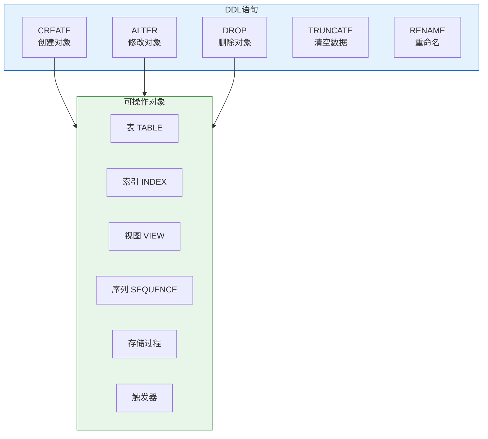

# Oracle DDL数据定义语言

## 一、概述

### 1.1 一句话定义

Oracle DDL数据定义语言，本质上是用于创建、修改和删除数据库对象（表、索引、视图等）的SQL语句集合。
它在Oracle数据库的结构管理中出现和使用，解决数据库对象的定义和维护问题。

### 1.2 为什么重要

- **不掌握的后果：** 无法创建和管理数据库结构，影响开发和管理效率
- **掌握的价值：** 高效地设计和维护数据库结构

### 1.3 适用场景

| 场景 | 说明 |
|------|------|
| 数据库设计 | 创建表、索引、视图等对象 |
| 结构变更 | 修改现有对象定义 |
| 对象管理 | 删除、重命名对象 |
| 权限管理 | 配合DCL管理对象访问 |

### 1.4 版本演进

| 版本 | 变化说明 |
|------|---------|
| 11gR2 | 虚拟列、不可见列、EDITIONING视图 |
| 12cR1 | IDENTITY列、默认值优化、临时表增强 |
| 12cR2 | 增强JSON约束 |
| 19c | 区块链表、多态表函数、私有临时表 |
| 21c | SQL宏、JSON Duality视图 |
| 23ai | 域类型、AI向量类型、ANNOTATIONS |

## 二、术语与概念

### 2.1 核心术语表

| 术语 | 含义 | 类比 |
|------|------|------|
| DDL | 数据定义语言 | 建筑图纸 |
| 隐式提交 | DDL执行前自动COMMIT | 施工前确认 |
| 数据字典 | 存储对象元数据的系统表 | 建筑档案 |
| 对象依赖 | 对象之间的引用关系 | 建筑依赖 |

### 2.2 DDL语句分类



## 三、核心原理

### 3.1 Oracle特有数据类型

#### 数值类型

| 数据类型 | 说明 | 存储大小 | 适用场景 |
|---------|------|---------|---------|
| NUMBER(p,s) | 精确数值 | 1-22字节 | 金额、计数 |
| BINARY_FLOAT | 单精度浮点 | 4字节 | 科学计算 |
| BINARY_DOUBLE | 双精度浮点 | 8字节 | 高精度计算 |
| INTEGER | 整数 | 1-22字节 | 整数 |

#### 字符类型

| 数据类型 | 说明 | 最大长度 | 适用场景 |
|---------|------|---------|---------|
| CHAR(n) | 定长字符 | 2000字节 | 固定长度编码 |
| VARCHAR2(n) | 变长字符 | 32767字节(扩展) | 通用文本 |
| NCHAR/NVARCHAR2 | 国家字符集 | 同上 | 多语言 |
| CLOB | 大文本 | 4GB | 长文本 |

#### 日期时间类型

| 数据类型 | 说明 | 精度 |
|---------|------|------|
| DATE | 日期+时间 | 秒 |
| TIMESTAMP | 时间戳 | 纳秒 |
| TIMESTAMP WITH TIME ZONE | 带时区 | 纳秒+时区 |
| INTERVAL YEAR TO MONTH | 年月间隔 | 月 |
| INTERVAL DAY TO SECOND | 日秒间隔 | 秒 |

#### Oracle 12c+新增类型

| 数据类型 | 版本 | 说明 |
|---------|------|------|
| JSON | 23ai | JSON数据原生类型 |
| VECTOR | 23ai | AI向量嵌入 |
| BOOLEAN | 23ai | 布尔类型 |

### 3.2 DDL的隐式提交

**重要特性：** Oracle DDL执行前会自动提交当前事务。

```sql
-- 示例：DDL隐式提交
INSERT INTO employees VALUES (1, 'Alice');  -- 未提交

CREATE TABLE test (id NUMBER);  -- 执行前自动COMMIT上面的INSERT

-- 此时无法ROLLBACK上面的INSERT
```

### 3.3 DDL操作数据字典

DDL操作会更新数据字典：

```sql
-- DDL执行后，数据字典自动更新
-- USER_TABLES, USER_TAB_COLUMNS, USER_CONSTRAINTS等视图反映最新状态
```

## 四、架构与组件

### 4.1 CREATE语句详解

#### CREATE TABLE

```sql
-- 完整建表语法
CREATE [GLOBAL TEMPORARY | PRIVATE TEMPORARY] TABLE [schema.]table_name (
    column_name1 datatype [DEFAULT expr] [inline_constraint],
    column_name2 datatype [DEFAULT expr] [inline_constraint],
    ...
    [out_of_line_constraint]
)
[TABLESPACE tablespace_name]
[PCTFREE integer]
[PCTUSED integer]
[INITRANS integer]
[STORAGE_clause]
[ROW MOVEMENT | NOROW MOVEMENT]
[ENABLE | DISABLE CONSTRAINT]
[AS subquery];

-- 示例：完整建表
CREATE TABLE orders (
    order_id     NUMBER GENERATED ALWAYS AS IDENTITY PRIMARY KEY,
    customer_id  NUMBER NOT NULL,
    order_date   TIMESTAMP DEFAULT SYSTIMESTAMP NOT NULL,
    amount       NUMBER(12,2) CHECK (amount > 0),
    status       VARCHAR2(20) DEFAULT 'PENDING'
        CHECK (status IN ('PENDING','PAID','SHIPPED','DELIVERED','CANCELLED')),
    notes        CLOB,
    CONSTRAINT ord_customer_fk FOREIGN KEY (customer_id) 
        REFERENCES customers(customer_id),
    CONSTRAINT ord_date_ck CHECK (order_date <= SYSTIMESTAMP)
)
TABLESPACE users
PCTFREE 10
INITRANS 4;
```

#### CREATE INDEX

```sql
-- 创建索引
CREATE [UNIQUE | BITMAP] INDEX [schema.]index_name
ON [schema.]table_name (column_name [ASC | DESC], ...)
[TABLESPACE tablespace_name]
[PCTFREE integer]
[COMPUTE STATISTICS]
[ONLINE | OFFLINE]
[PARALLEL [degree]];

-- 示例：各种索引类型
-- B树索引（默认）
CREATE INDEX idx_orders_customer ON orders(customer_id);

-- 唯一索引
CREATE UNIQUE INDEX idx_orders_uk ON orders(order_id);

-- 位图索引（适合低基数列）
CREATE BITMAP INDEX idx_orders_status ON orders(status);

-- 函数索引
CREATE INDEX idx_orders_month ON orders(EXTRACT(MONTH FROM order_date));

-- 在线创建索引（不阻塞DML）
CREATE INDEX idx_orders_date ON orders(order_date) ONLINE;
```

#### CREATE VIEW

```sql
-- 创建视图
CREATE [OR REPLACE] [FORCE | NOFORCE] VIEW [schema.]view_name
[(column_aliases)]
AS subquery
[WITH READ ONLY | WITH CHECK OPTION] [CONSTRAINT constraint_name];

-- 示例
CREATE VIEW v_active_orders AS
SELECT order_id, customer_id, order_date, amount
FROM orders
WHERE status != 'CANCELLED'
WITH READ ONLY;

-- 可更新视图
CREATE VIEW v_orders_editable AS
SELECT order_id, customer_id, amount, status
FROM orders
WHERE status = 'PENDING'
WITH CHECK OPTION CONSTRAINT v_orders_ck;
```

#### CREATE SEQUENCE（12c前）

```sql
-- 12c前使用序列生成主键
CREATE SEQUENCE seq_order_id
    START WITH 1
    INCREMENT BY 1
    NOMAXVALUE
    NOCYCLE
    CACHE 20;

-- 使用序列
INSERT INTO orders (order_id, customer_id, amount)
VALUES (seq_order_id.NEXTVAL, 1001, 299.99);
```

### 4.2 ALTER语句详解

```sql
-- 修改表结构
-- 添加列
ALTER TABLE orders ADD (
    shipping_address VARCHAR2(500),
    discount NUMBER(5,2) DEFAULT 0
);

-- 修改列
ALTER TABLE orders MODIFY (
    shipping_address VARCHAR2(1000),  -- 增大长度
    discount NUMBER(5,2) DEFAULT 0 NOT NULL  -- 添加NOT NULL
);

-- 删除列
ALTER TABLE orders DROP (discount);

-- 重命名列
ALTER TABLE orders RENAME COLUMN shipping_address TO ship_addr;

-- 重命名表
ALTER TABLE orders RENAME TO sales_orders;

-- 添加约束
ALTER TABLE orders ADD CONSTRAINT ord_amount_ck CHECK (amount > 0);

-- 启用/禁用约束
ALTER TABLE orders DISABLE CONSTRAINT ord_amount_ck;
ALTER TABLE orders ENABLE NOVALIDATE CONSTRAINT ord_amount_ck;

-- 移动表（12cR2+可在线）
ALTER TABLE orders MOVE ONLINE TABLESPACE users2;
```

### 4.3 DROP和TRUNCATE

```sql
-- 删除对象
DROP TABLE orders [CASCADE CONSTRAINTS];  -- 同时删除相关约束
DROP INDEX idx_orders_customer;
DROP VIEW v_active_orders;
DROP SEQUENCE seq_order_id;

-- TRUNCATE：快速清空数据（保留结构）
TRUNCATE TABLE orders;  -- 比DELETE快，不生成undo
TRUNCATE TABLE orders DROP STORAGE;  -- 释放空间
TRUNCATE TABLE orders REUSE STORAGE;  -- 保留空间分配
```

**DROP vs TRUNCATE vs DELETE对比：**

| 特性 | DROP | TRUNCATE | DELETE |
|------|------|---------|--------|
| 类型 | DDL | DDL | DML |
| 删除数据 | ✓ | ✓ | ✓ |
| 删除结构 | ✓ | ✗ | ✗ |
| 可回滚 | ✗ | ✗ | ✓ |
| 触发触发器 | ✗ | ✗ | ✓ |
| 速度 | 最快 | 快 | 慢 |
| 生成undo | ✗ | ✗ | ✓ |

## 五、配置与参数

### 5.1 Oracle 12c+ IDENTITY列

```sql
-- IDENTITY列（12c+）
CREATE TABLE employees (
    emp_id NUMBER GENERATED ALWAYS AS IDENTITY PRIMARY KEY,
    name VARCHAR2(50) NOT NULL
);

-- IDENTITY选项
CREATE TABLE employees (
    emp_id NUMBER GENERATED BY DEFAULT AS IDENTITY (START WITH 100 INCREMENT BY 1) PRIMARY KEY,
    name VARCHAR2(50)
);

-- GENERATED BY DEFAULT ON NULL
CREATE TABLE employees (
    emp_id NUMBER GENERATED BY DEFAULT ON NULL AS IDENTITY PRIMARY KEY,
    name VARCHAR2(50)
);
```

### 5.2 Oracle特有DDL特性

```sql
-- 虚拟列（11g+）
CREATE TABLE employees (
    emp_id NUMBER PRIMARY KEY,
    first_name VARCHAR2(50),
    last_name VARCHAR2(50),
    full_name VARCHAR2(101) GENERATED ALWAYS AS (first_name || ' ' || last_name) VIRTUAL,
    hire_date DATE,
    service_years NUMBER GENERATED ALWAYS AS (MONTHS_BETWEEN(SYSDATE, hire_date)/12) VIRTUAL
);

-- 不可见列（12c+）
CREATE TABLE employees (
    emp_id NUMBER PRIMARY KEY,
    name VARCHAR2(50),
    internal_code VARCHAR2(20) INVISIBLE  -- SELECT * 不显示
);

-- 私有临时表（19c+）
CREATE PRIVATE TEMPORARY TABLE ora$ptt_temp_data (
    id NUMBER,
    data VARCHAR2(100)
) ON COMMIT DROP DEFINITION;

-- 区块链表（19c+）
CREATE BLOCKCHAIN TABLE ledger (
    id NUMBER,
    operation VARCHAR2(100),
    amount NUMBER(12,2)
) NO DROP UNTIL 31 DAYS IDLE
  NO DELETE LOCKED
  HASHING USING "SHA2_512";

-- ANNOTATIONS（23ai+）
CREATE TABLE products (
    product_id NUMBER ANNOTATIONS(DISPLAY '产品ID', HIDE),
    name VARCHAR2(200) ANNOTATIONS(DISPLAY '产品名称')
);
```

## 六、监控与诊断

### 6.1 查看DDL操作历史

```sql
-- 查看最近的DDL操作
SELECT owner, object_name, object_type, created, last_ddl_time
FROM dba_objects
WHERE last_ddl_time > SYSDATE - 1
ORDER BY last_ddl_time DESC;

-- 查看对象依赖关系
SELECT * FROM dba_dependencies
WHERE name = 'ORDERS'
AND type = 'TABLE';

-- 查看DDL锁
SELECT * FROM dba_ddl_locks;
```

### 6.2 DDL性能监控

```sql
-- 查看DDL操作统计
SELECT sql_id, sql_text, executions, elapsed_time/1000000 elapsed_sec
FROM v$sql
WHERE sql_text LIKE 'CREATE%' OR sql_text LIKE 'ALTER%'
ORDER BY elapsed_time DESC;
```

## 七、实战案例

### 7.1 案例背景

- **场景**：创建电商系统数据库结构
- **时间**：2026年
- **现象**：需要完整的DDL脚本

### 7.2 实施过程

```sql
-- 完整的电商系统DDL

-- 1. 创建表空间
CREATE TABLESPACE ecommerce_data
    DATAFILE '/u01/app/oracle/oradata/ecommerce/ecommerce_data01.dbf'
    SIZE 100M AUTOEXTEND ON NEXT 50M MAXSIZE 2G;

-- 2. 创建用户
CREATE USER ecommerce IDENTIFIED BY "SecureP@ss123"
    DEFAULT TABLESPACE ecommerce_data
    TEMPORARY TABLESPACE temp
    QUOTA UNLIMITED ON ecommerce_data;

GRANT CONNECT, RESOURCE TO ecommerce;

-- 3. 创建表
-- 客户表
CREATE TABLE ecommerce.customers (
    customer_id NUMBER GENERATED ALWAYS AS IDENTITY PRIMARY KEY,
    name VARCHAR2(100) NOT NULL,
    email VARCHAR2(100) UNIQUE NOT NULL,
    phone VARCHAR2(20),
    register_date TIMESTAMP DEFAULT SYSTIMESTAMP NOT NULL,
    status VARCHAR2(10) DEFAULT 'ACTIVE' CHECK (status IN ('ACTIVE','INACTIVE','SUSPENDED'))
) TABLESPACE ecommerce_data;

-- 商品分类表
CREATE TABLE ecommerce.categories (
    category_id NUMBER GENERATED ALWAYS AS IDENTITY PRIMARY KEY,
    name VARCHAR2(100) NOT NULL,
    parent_id NUMBER,
    CONSTRAINT cat_parent_fk FOREIGN KEY (parent_id) REFERENCES ecommerce.categories(category_id)
);

-- 商品表
CREATE TABLE ecommerce.products (
    product_id NUMBER GENERATED ALWAYS AS IDENTITY PRIMARY KEY,
    category_id NUMBER,
    name VARCHAR2(200) NOT NULL,
    description CLOB,
    price NUMBER(10,2) NOT NULL CHECK (price >= 0),
    stock_quantity NUMBER(10) DEFAULT 0 CHECK (stock_quantity >= 0),
    created_at TIMESTAMP DEFAULT SYSTIMESTAMP,
    CONSTRAINT prod_cat_fk FOREIGN KEY (category_id) REFERENCES ecommerce.categories(category_id)
);

-- 订单表
CREATE TABLE ecommerce.orders (
    order_id NUMBER GENERATED ALWAYS AS IDENTITY PRIMARY KEY,
    customer_id NUMBER NOT NULL,
    order_date TIMESTAMP DEFAULT SYSTIMESTAMP NOT NULL,
    total_amount NUMBER(12,2) NOT NULL CHECK (total_amount >= 0),
    status VARCHAR2(20) DEFAULT 'PENDING' 
        CHECK (status IN ('PENDING','PAID','SHIPPED','DELIVERED','CANCELLED','REFUNDED')),
    shipping_address VARCHAR2(500),
    CONSTRAINT ord_cust_fk FOREIGN KEY (customer_id) REFERENCES ecommerce.customers(customer_id)
);

-- 订单明细表
CREATE TABLE ecommerce.order_items (
    order_id NUMBER,
    item_seq NUMBER,
    product_id NUMBER NOT NULL,
    quantity NUMBER(10) NOT NULL CHECK (quantity > 0),
    unit_price NUMBER(10,2) NOT NULL CHECK (unit_price >= 0),
    CONSTRAINT oi_pk PRIMARY KEY (order_id, item_seq),
    CONSTRAINT oi_order_fk FOREIGN KEY (order_id) REFERENCES ecommerce.orders(order_id) ON DELETE CASCADE,
    CONSTRAINT oi_prod_fk FOREIGN KEY (product_id) REFERENCES ecommerce.products(product_id)
);

-- 4. 创建索引
CREATE INDEX idx_customers_email ON ecommerce.customers(email);
CREATE INDEX idx_products_category ON ecommerce.products(category_id);
CREATE INDEX idx_orders_customer ON ecommerce.orders(customer_id);
CREATE INDEX idx_orders_date ON ecommerce.orders(order_date);
CREATE INDEX idx_orders_status ON ecommerce.orders(status);
CREATE INDEX idx_oi_product ON ecommerce.order_items(product_id);

-- 5. 创建视图
CREATE VIEW ecommerce.v_order_summary AS
SELECT o.order_id, c.name AS customer_name, o.order_date,
       o.total_amount, o.status,
       COUNT(oi.item_seq) AS item_count
FROM ecommerce.orders o
JOIN ecommerce.customers c ON o.customer_id = c.customer_id
LEFT JOIN ecommerce.order_items oi ON o.order_id = oi.order_id
GROUP BY o.order_id, c.name, o.order_date, o.total_amount, o.status;

-- 6. 创建序列（备用）
CREATE SEQUENCE ecommerce.seq_batch_id START WITH 1 INCREMENT BY 1 CACHE 100;
```

### 7.3 实施结果

| 对象类型 | 数量 | 说明 |
|---------|------|------|
| 表 | 5 | customers, categories, products, orders, order_items |
| 索引 | 6 | 提高查询性能 |
| 视图 | 1 | 订单汇总视图 |
| 序列 | 1 | 批处理ID生成 |

### 7.4 复盘总结

- **根因：** 完整的DDL脚本确保数据库结构正确
- **教训：** DDL需要考虑约束、索引、视图的完整设计

## 八、常见错误与排查

### 8.1 常见错误列表

| 错误代码 | 错误信息 | 原因 | 解决方法 |
|---------|---------|------|---------|
| ORA-00955 | name is already used | 对象名已存在 | 使用不同名称或DROP旧对象 |
| ORA-00942 | table or view does not exist | 对象不存在 | 检查对象名和权限 |
| ORA-00904 | invalid identifier | 列名无效 | 检查列名拼写 |
| ORA-00907 | missing right parenthesis | 语法错误 | 检查括号匹配 |
| ORA-00906 | missing left parenthesis | 语法错误 | 检查数据类型定义 |
| ORA-02270 | no matching unique or primary key | 外键引用无效 | 确保引用主键或唯一键 |
| ORA-00054 | resource busy | 对象被锁定 | 等待或杀掉锁定会话 |

## 九、最佳实践

### 9.1 官方推荐

- 使用IDENTITY列代替序列（12c+）
- 使用VARCHAR2代替CHAR
- DDL脚本版本管理
- 使用在线DDL减少停机

### 9.2 社区经验

- 命名规范：表名单数、列名下划线
- 所有外键创建索引
- 大表DDL选择低峰期
- 使用EDITIONING视图做在线变更

### 9.3 反模式

| 反模式 | 问题 | 正确做法 |
|--------|------|---------|
| 使用LONG类型 | 已废弃 | 使用CLOB |
| 不创建外键索引 | 性能问题 | 外键列建索引 |
| 大表DDL不在线 | 业务中断 | 使用ONLINE选项 |
| 不管理DDL版本 | 变更不可追溯 | 使用版本控制 |

## 十、命令与视图汇总

### 10.1 命令列表

| 命令 | 适用场景 | 说明 |
|------|---------|------|
| `CREATE TABLE` | 创建表 | 定义表结构 |
| `ALTER TABLE` | 修改表 | 增删改列和约束 |
| `DROP TABLE` | 删除表 | 删除表及数据 |
| `TRUNCATE TABLE` | 清空表 | 快速删除数据 |
| `CREATE INDEX` | 创建索引 | 提高查询性能 |
| `CREATE VIEW` | 创建视图 | 虚拟表 |

### 10.2 视图列表

| 视图名 | 类型 | 用途 |
|--------|------|------|
| USER_TABLES | 数据字典 | 用户表列表 |
| USER_TAB_COLUMNS | 数据字典 | 列信息 |
| USER_CONSTRAINTS | 数据字典 | 约束信息 |
| USER_INDEXES | 数据字典 | 索引信息 |
| DBA_OBJECTS | 数据字典 | 所有对象 |

## 十一、总结速查

### 11.1 黄金法则

1. **DDL隐式提交** - 执行前自动COMMIT当前事务
2. **使用IDENTITY列** - 12c+推荐代替序列
3. **外键创建索引** - 提高关联查询性能

### 11.2 一页纸检查清单

| 检查项 | 说明 |
|--------|------|
| 对象名唯一 | 避免ORA-00955 |
| 数据类型合适 | 选择合适类型和长度 |
| 约束完整 | PK、FK、CHECK、NOT NULL |
| 索引合理 | 外键、查询条件列 |
| 表空间分配 | 指定合适的表空间 |

## 附录

### A. 官方参考

- [Oracle Database SQL Language Reference - DDL](https://docs.oracle.com/en/database/oracle/oracle-database/19c/sqlqr/Data-Definition-Language.html)
- [Oracle Database Administrator's Guide - Managing Schema Objects](https://docs.oracle.com/en/database/oracle/oracle-database/19c/admin/)

### B. 修订记录

| 日期 | 版本 | 修改内容 | 修改人 |
|------|------|---------|--------|
| 2026-07-01 | v1.0 | 初始版本 | YashanDB知识库生成器 |
