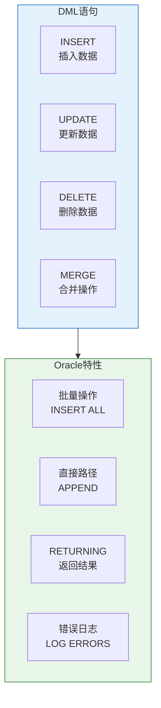
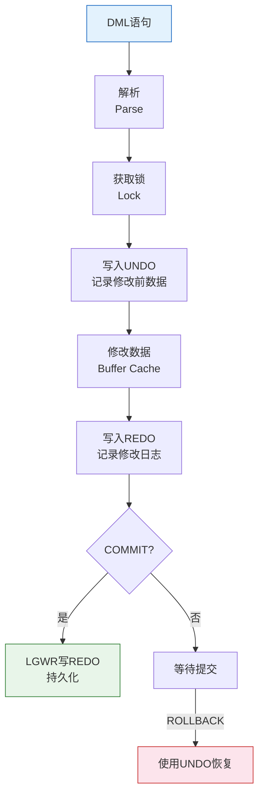

# Oracle DML数据操纵语言

## 一、概述

### 1.1 一句话定义

Oracle DML数据操纵语言，本质上是用于操作表中数据的SQL语句集合，包括插入、更新、删除和合并操作。
它在Oracle数据库的数据操作中出现和使用，解决数据的增删改问题。

### 1.2 为什么重要

- **不掌握的后果：** 无法正确操作数据，可能导致数据丢失或不一致
- **掌握的价值：** 高效准确地操作数据，保证数据完整性

### 1.3 适用场景

| 场景 | 说明 |
|------|------|
| 应用开发 | 数据的增删改操作 |
| 数据迁移 | 批量数据导入导出 |
| 数据修复 | 修正错误数据 |
| 数据同步 | 多表数据同步 |

### 1.4 版本演进

| 版本 | 变化说明 |
|------|---------|
| 11gR2 | 增强MERGE语句 |
| 12cR1 | 多态INSERT、行限制子句 |
| 12cR2 | 增强JSON操作 |
| 19c | 增强批量操作性能 |
| 21c | JSON Duality视图DML |
| 23ai | SQL/JSON Duality DML |

## 二、术语与概念

### 2.1 核心术语表

| 术语 | 含义 | 类比 |
|------|------|------|
| DML | 数据操纵语言 | 室内装修 |
| 事务 | 一组原子操作 | 打包操作 |
| 回滚段 | 存储修改前数据 | 后悔药 |
| 直接路径插入 | 绕过缓冲区直接写盘 | 快速通道 |

### 2.2 DML语句分类



## 三、核心原理

### 3.1 INSERT语句

#### 基本插入

```sql
-- 单行插入
INSERT INTO employees (emp_id, name, salary, dept_id)
VALUES (1, 'Alice', 10000, 10);

-- 指定列插入（推荐）
INSERT INTO employees (emp_id, name, salary)
VALUES (2, 'Bob', 12000);

-- 使用默认值
INSERT INTO employees (emp_id, name)
VALUES (3, 'Charlie');  -- salary使用默认值

-- 使用序列/IDENTITY
INSERT INTO employees (name, salary)
VALUES ('David', 15000);  -- emp_id自动生成
```

#### 多行插入

```sql
-- INSERT ALL（Oracle特有）
INSERT ALL
    INTO employees (emp_id, name, salary) VALUES (4, 'Eve', 8000)
    INTO employees (emp_id, name, salary) VALUES (5, 'Frank', 9000)
    INTO employees (emp_id, name, salary) VALUES (6, 'Grace', 11000)
SELECT * FROM dual;

-- 多行VALUES（23ai支持）
INSERT INTO employees (emp_id, name, salary)
VALUES 
    (7, 'Henry', 13000),
    (8, 'Ivy', 14000),
    (9, 'Jack', 16000);

-- 子查询插入
INSERT INTO employees_archive (emp_id, name, salary)
SELECT emp_id, name, salary
FROM employees
WHERE status = 'TERMINATED';
```

#### 直接路径插入

```sql
-- 直接路径插入（高性能）
INSERT /*+ APPEND */ INTO employees_archive
SELECT * FROM employees WHERE hire_date < SYSDATE - 365;

-- APPEND VALUES（单行直接路径）
INSERT /*+ APPEND_VALUES */ INTO employees (emp_id, name, salary)
VALUES (10, 'Kate', 18000);
```

**直接路径特点：**
- 绕过Buffer Cache，直接写入数据文件
- 不生成undo（NOLOGGING模式）
- 性能比常规INSERT高3-10倍
- 需要表级锁

#### RETURNING子句

```sql
-- 返回插入的值
DECLARE
    v_emp_id NUMBER;
BEGIN
    INSERT INTO employees (name, salary)
    VALUES ('Leo', 20000)
    RETURNING emp_id INTO v_emp_id;
    
    DBMS_OUTPUT.PUT_LINE('New emp_id: ' || v_emp_id);
END;
/

-- SQL*Plus中
VARIABLE new_id NUMBER
INSERT INTO employees (name, salary) VALUES ('Mike', 22000)
RETURNING emp_id INTO :new_id;
PRINT new_id
```

### 3.2 UPDATE语句

#### 基本更新

```sql
-- 条件更新
UPDATE employees SET salary = 15000 WHERE emp_id = 1;

-- 多列更新
UPDATE employees 
SET salary = 16000, dept_id = 20, updated_at = SYSDATE
WHERE emp_id = 2;

-- 使用表达式
UPDATE employees SET salary = salary * 1.1 WHERE dept_id = 10;

-- 关联更新
UPDATE employees e
SET salary = (SELECT AVG(salary) * 1.2 FROM employees WHERE dept_id = e.dept_id)
WHERE emp_id = 3;

-- 使用子查询
UPDATE (SELECT e.salary, d.avg_salary 
        FROM employees e 
        JOIN dept_stats d ON e.dept_id = d.dept_id)
SET salary = avg_salary;
```

#### RETURNING子句

```sql
-- 返回更新后的值
DECLARE
    v_new_salary NUMBER;
BEGIN
    UPDATE employees SET salary = salary * 1.1
    WHERE emp_id = 1
    RETURNING salary INTO v_new_salary;
    
    DBMS_OUTPUT.PUT_LINE('New salary: ' || v_new_salary);
END;
/
```

### 3.3 DELETE语句

#### 基本删除

```sql
-- 条件删除
DELETE FROM employees WHERE emp_id = 1;

-- 关联删除
DELETE FROM employees WHERE dept_id = (SELECT dept_id FROM departments WHERE dept_name = 'IT');

-- 使用EXISTS
DELETE FROM employees e
WHERE EXISTS (SELECT 1 FROM departments d WHERE d.dept_id = e.dept_id AND d.status = 'CLOSED');
```

#### TRUNCATE vs DELETE

| 特性 | DELETE | TRUNCATE |
|------|--------|---------|
| 类型 | DML | DDL |
| 可回滚 | ✓ | ✗ |
| 触发触发器 | ✓ | ✗ |
| 生成undo | ✓ | ✗ |
| 速度 | 慢 | 快 |
| 条件删除 | ✓ | ✗ |
| 闪回支持 | ✓ | 有限 |

```sql
-- DELETE：可回滚，触发触发器
DELETE FROM employees WHERE status = 'TERMINATED';
ROLLBACK;  -- 可以撤销

-- TRUNCATE：快速清空，不可回滚
TRUNCATE TABLE employees_temp;
```

### 3.4 MERGE语句

MERGE是Oracle强大的"UPSERT"操作。

```sql
-- 基本MERGE语法
MERGE INTO target_table t
USING source_table s
ON (t.key_column = s.key_column)
WHEN MATCHED THEN
    UPDATE SET t.column1 = s.column1, t.column2 = s.column2
WHEN NOT MATCHED THEN
    INSERT (key_column, column1, column2)
    VALUES (s.key_column, s.column1, s.column2);

-- 实际示例：同步员工信息
MERGE INTO employees e
USING (SELECT emp_id, name, salary, dept_id FROM emp_staging) s
ON (e.emp_id = s.emp_id)
WHEN MATCHED THEN
    UPDATE SET 
        e.name = s.name,
        e.salary = s.salary,
        e.dept_id = s.dept_id,
        e.updated_at = SYSDATE
WHEN NOT MATCHED THEN
    INSERT (emp_id, name, salary, dept_id, created_at)
    VALUES (s.emp_id, s.name, s.salary, s.dept_id, SYSDATE);

-- 带DELETE的MERGE（10g+）
MERGE INTO employees e
USING (SELECT emp_id, status FROM emp_staging) s
ON (e.emp_id = s.emp_id)
WHEN MATCHED THEN
    UPDATE SET e.status = s.status
    DELETE WHERE s.status = 'TERMINATED'
WHEN NOT MATCHED THEN
    INSERT (emp_id, status) VALUES (s.emp_id, s.status);
```

### 3.5 错误日志

```sql
-- 创建错误日志表
BEGIN
    DBMS_ERRLOG.CREATE_ERROR_LOG('employees', 'err_employees');
END;
/

-- INSERT with LOG ERRORS
INSERT INTO employees (emp_id, name, salary)
VALUES (1, 'Alice', -100)  -- 违反CHECK约束
LOG ERRORS INTO err_employees ('BATCH001') REJECT LIMIT UNLIMITED;

-- 查看错误
SELECT ora_err_number$, ora_err_mesg$, emp_id, name, salary
FROM err_employees
WHERE ora_err_tag$ = 'BATCH001';
```

## 四、架构与组件

### 4.1 DML执行流程



### 4.2 DML锁机制

| 锁类型 | 说明 | 模式 |
|--------|------|------|
| TX锁 | 事务锁 | 行级排他锁 |
| TM锁 | 表锁 | 表级锁 |
| 行锁 | 数据行锁 | ITL槽实现 |

```sql
-- 查看当前锁
SELECT s.sid, s.serial#, s.username, l.type, l.lmode, l.request
FROM v$session s
JOIN v$lock l ON s.sid = l.sid
WHERE s.type = 'USER';

-- 查看被锁的对象
SELECT lo.session_id, lo.object_id, o.object_name, lo.locked_mode
FROM v$locked_object lo
JOIN dba_objects o ON lo.object_id = o.object_id;
```

## 五、配置与参数

### 5.1 DML相关参数

```sql
-- 查看DML相关参数
SHOW PARAMETER transactions;        -- 最大事务数
SHOW PARAMETER dml_locks;           -- DML锁数量
SHOW PARAMETER undo_tablespace;     -- UNDO表空间
SHOW PARAMETER undo_retention;      -- UNDO保留时间

-- 修改参数
ALTER SYSTEM SET undo_retention = 3600;  -- UNDO保留1小时
```

### 5.2 批量操作优化

```sql
-- PL/SQL批量操作
DECLARE
    TYPE emp_tab IS TABLE OF employees%ROWTYPE;
    v_emps emp_tab;
BEGIN
    -- 批量查询
    SELECT * BULK COLLECT INTO v_emps FROM employees WHERE dept_id = 10;
    
    -- 修改数据
    FOR i IN 1..v_emps.COUNT LOOP
        v_emps(i).salary := v_emps(i).salary * 1.1;
    END LOOP;
    
    -- 批量更新
    FORALL i IN 1..v_emps.COUNT
        UPDATE employees SET ROW = v_emps(i) WHERE emp_id = v_emps(i).emp_id;
    
    COMMIT;
END;
/
```

## 六、监控与诊断

### 6.1 DML性能监控

```sql
-- 查看DML统计
SELECT sql_id, sql_text, executions, rows_processed,
       elapsed_time/1000000 elapsed_sec
FROM v$sql
WHERE command_type IN (2, 3, 6, 7)  -- INSERT=2, UPDATE=3, DELETE=6, MERGE=7
ORDER BY elapsed_time DESC
FETCH FIRST 10 ROWS ONLY;

-- 查看DML锁等待
SELECT 
    blocking.session AS blocking_session,
    waiting.session AS waiting_session,
    waiting.sql_id
FROM v$session blocking
JOIN v$session waiting ON blocking.sid = waiting.blocking_session;
```

### 6.2 UNDO使用监控

```sql
-- 查看UNDO使用
SELECT tablespace_name, status, COUNT(*) extents,
       ROUND(SUM(bytes)/1024/1024, 2) size_mb
FROM dba_undo_extents
GROUP BY tablespace_name, status;

-- 查看UNDO保留
SELECT MAX(MAXQUERYLEN) max_query_len, 
       MAX(EXPBLKRELCNT) expired_blocks
FROM v$undostat;
```

## 七、实战案例

### 7.1 案例背景

- **场景**：电商系统订单数据同步
- **时间**：2026年
- **现象**：需要将临时表数据合并到正式表

### 7.2 实施过程

```sql
-- 步骤1：创建临时表
CREATE TABLE orders_staging (
    order_id NUMBER,
    customer_id NUMBER,
    amount NUMBER(12,2),
    status VARCHAR2(20),
    operation VARCHAR2(10)  -- INSERT/UPDATE/DELETE
);

-- 步骤2：加载临时数据
INSERT INTO orders_staging VALUES (1001, 101, 299.99, 'PAID', 'INSERT');
INSERT INTO orders_staging VALUES (1002, 102, 599.00, 'PENDING', 'UPDATE');
INSERT INTO orders_staging VALUES (1003, 103, 0, 'CANCELLED', 'DELETE');

-- 步骤3：使用MERGE同步
MERGE INTO orders o
USING orders_staging s
ON (o.order_id = s.order_id)
WHEN MATCHED AND s.operation = 'UPDATE' THEN
    UPDATE SET o.amount = s.amount, o.status = s.status, o.updated_at = SYSDATE
WHEN MATCHED AND s.operation = 'DELETE' THEN
    DELETE
WHEN NOT MATCHED AND s.operation = 'INSERT' THEN
    INSERT (order_id, customer_id, amount, status, created_at)
    VALUES (s.order_id, s.customer_id, s.amount, s.status, SYSDATE);

-- 步骤4：验证结果
SELECT COUNT(*) FROM orders;
SELECT operation, COUNT(*) FROM orders_staging GROUP BY operation;

-- 步骤5：清理临时表
TRUNCATE TABLE orders_staging;
```

### 7.3 实施结果

| 操作 | 数量 | 说明 |
|------|------|------|
| INSERT | 1 | 新增订单 |
| UPDATE | 1 | 更新订单 |
| DELETE | 1 | 删除订单 |

### 7.4 复盘总结

- **根因：** MERGE语句高效实现数据同步
- **教训：** 使用MERGE代替多次DML操作

## 八、常见错误与排查

### 8.1 常见错误列表

| 错误代码 | 错误信息 | 原因 | 解决方法 |
|---------|---------|------|---------|
| ORA-00001 | unique constraint violated | 主键/唯一键冲突 | 检查重复值 |
| ORA-01400 | cannot insert NULL | 违反NOT NULL | 提供非空值 |
| ORA-01403 | no data found | SELECT INTO无数据 | 检查数据存在 |
| ORA-01407 | cannot update to NULL | 更新为NULL违反约束 | 检查NOT NULL列 |
| ORA-01722 | invalid number | 类型转换错误 | 检查数据类型 |
| ORA-02290 | check constraint violated | 违反CHECK约束 | 检查数据范围 |
| ORA-02291 | integrity constraint violated | 外键违反 | 确保父记录存在 |
| ORA-02292 | integrity constraint violated | 删除被引用记录 | 先删除子记录 |
| ORA-04091 | table is mutating | 触发器中访问正在修改的表 | 使用复合触发器 |
| ORA-08177 | can't serialize access | 串行化冲突 | 重试事务 |

## 九、最佳实践

### 9.1 官方推荐

- 使用绑定变量防止SQL注入
- 批量操作使用FORALL
- 大事务分批提交
- 使用MERGE代替INSERT+UPDATE

### 9.2 社区经验

- 先SELECT再UPDATE确认数据
- 使用SAVEPOINT设置回滚点
- 定期COMMIT避免UNDO空间满
- 使用LOG ERRORS处理批量错误

### 9.3 反模式

| 反模式 | 问题 | 正确做法 |
|--------|------|---------|
| 字符串拼接SQL | SQL注入风险 | 使用绑定变量 |
| 大事务不提交 | UNDO空间满 | 分批COMMIT |
| 不检查影响行数 | 误操作未发现 | 检查SQL%ROWCOUNT |
| 循环单条DML | 性能差 | 使用批量操作 |

## 十、命令与视图汇总

### 10.1 命令列表

| 命令 | 适用场景 | 说明 |
|------|---------|------|
| `INSERT` | 插入数据 | 单行/多行/子查询 |
| `UPDATE` | 更新数据 | 条件更新/关联更新 |
| `DELETE` | 删除数据 | 条件删除 |
| `MERGE` | 合并操作 | UPSERT |
| `COMMIT` | 提交事务 | 持久化修改 |
| `ROLLBACK` | 回滚事务 | 撤销修改 |

### 10.2 视图列表

| 视图名 | 类型 | 用途 |
|--------|------|------|
| V$SQL | 动态 | SQL统计 |
| V$LOCK | 动态 | 锁信息 |
| V$SESSION | 动态 | 会话信息 |
| DBA_UNDO_EXTENTS | 数据字典 | UNDO使用 |

## 十一、总结速查

### 11.1 黄金法则

1. **使用绑定变量** - 防止SQL注入，提高性能
2. **批量操作** - 使用FORALL和BULK COLLECT
3. **及时COMMIT** - 避免UNDO空间满

### 11.2 一页纸检查清单

| 检查项 | 说明 |
|--------|------|
| 绑定变量 | 防止SQL注入 |
| 事务控制 | 及时COMMIT/ROLLBACK |
| 约束检查 | 确保数据完整性 |
| 锁等待 | 避免长时间锁 |
| 错误处理 | LOG ERRORS记录错误 |

## 附录

### A. 官方参考

- [Oracle Database SQL Language Reference - DML](https://docs.oracle.com/en/database/oracle/oracle-database/19c/sqlqr/Data-Manipulation-Language.html)
- [Oracle Database Development Guide - PL/SQL Optimizations](https://docs.oracle.com/en/database/oracle/oracle-database/19c/tgpls/)

### B. 修订记录

| 日期 | 版本 | 修改内容 | 修改人 |
|------|------|---------|--------|
| 2026-07-01 | v1.0 | 初始版本 | YashanDB知识库生成器 |
