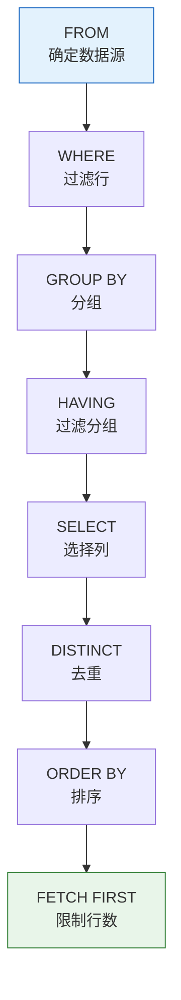

# Oracle DQL数据查询语言

## 一、概述

### 1.1 一句话定义

Oracle DQL数据查询语言，本质上是用于从数据库中检索数据的SQL语句，以SELECT为核心。
它在Oracle数据库的数据查询中出现和使用，解决数据检索、过滤、排序和分页的问题。

### 1.2 为什么重要

- **不掌握的后果：** 无法有效获取所需数据，影响应用开发和数据分析
- **掌握的价值：** 高效准确地查询数据，支持业务决策

### 1.3 适用场景

| 场景 | 说明 |
|------|------|
| 应用开发 | 查询业务数据 |
| 数据分析 | 统计和报表 |
| 问题诊断 | 排查数据问题 |
| 数据验证 | 验证数据正确性 |

### 1.4 版本演进

| 版本 | 变化说明 |
|------|---------|
| 11gR2 | 增强分析函数、PIVOT/UNPIVOT |
| 12cR1 | FETCH FIRST分页、OFFSET |
| 12cR2 | 增强JSON查询 |
| 19c | 多态表函数、SQL宏 |
| 21c | POLYMORPHIC_TABLE函数 |
| 23ai | JSON Duality视图查询、AI向量距离函数 |

## 二、术语与概念

### 2.1 核心术语表

| 术语 | 含义 | 类比 |
|------|------|------|
| DQL | 数据查询语言 | 查找物品 |
| 结果集 | 查询返回的数据集合 | 搜索结果 |
| 游标 | 结果集的指针 | 书签 |
| 谓词 | WHERE条件表达式 | 筛选规则 |

### 2.2 SELECT语句结构


**执行顺序：**
1. FROM - 确定数据源
2. WHERE - 过滤行
3. GROUP BY - 分组
4. HAVING - 过滤分组
5. SELECT - 选择列
6. ORDER BY - 排序
7. FETCH FIRST - 限制行数

## 三、核心原理

### 3.1 基本查询

```sql
-- 查询所有列（不推荐）
SELECT * FROM employees;

-- 查询指定列
SELECT emp_id, name, salary FROM employees;

-- 使用别名
SELECT emp_id AS "员工编号", name AS "姓名", salary * 12 AS "年薪"
FROM employees;

-- 去重
SELECT DISTINCT dept_id FROM employees;

-- 使用表达式
SELECT name, salary, salary * 1.1 AS new_salary,
       CASE WHEN salary > 10000 THEN '高' ELSE '低' END AS level
FROM employees;
```

### 3.2 WHERE条件过滤

```sql
-- 比较运算符
SELECT * FROM employees WHERE salary > 10000;
SELECT * FROM employees WHERE salary >= 10000 AND salary <= 20000;
SELECT * FROM employees WHERE dept_id != 10;

-- 逻辑运算符
SELECT * FROM employees WHERE dept_id = 10 AND salary > 10000;
SELECT * FROM employees WHERE dept_id = 10 OR dept_id = 20;
SELECT * FROM employees WHERE NOT (salary < 5000);

-- BETWEEN
SELECT * FROM employees WHERE salary BETWEEN 10000 AND 20000;

-- IN
SELECT * FROM employees WHERE dept_id IN (10, 20, 30);

-- LIKE
SELECT * FROM employees WHERE name LIKE 'A%';     -- 以A开头
SELECT * FROM employees WHERE name LIKE '_a%';    -- 第二个字符是a
SELECT * FROM employees WHERE name LIKE '%son%';  -- 包含son

-- NULL判断
SELECT * FROM employees WHERE commission_pct IS NULL;
SELECT * FROM employees WHERE commission_pct IS NOT NULL;

-- NVL处理NULL
SELECT name, NVL(commission_pct, 0) AS commission FROM employees;

-- NULLIF和COALESCE
SELECT name, COALESCE(phone1, phone2, phone3) AS contact_phone FROM customers;
```

### 3.3 排序

```sql
-- 升序（默认）
SELECT * FROM employees ORDER BY salary ASC;

-- 降序
SELECT * FROM employees ORDER BY salary DESC;

-- 多列排序
SELECT * FROM employees ORDER BY dept_id ASC, salary DESC;

-- 使用列位置
SELECT emp_id, name, salary FROM employees ORDER BY 3 DESC;

-- 使用表达式
SELECT name, salary * 12 AS annual_salary
FROM employees
ORDER BY salary * 12 DESC;

-- NULLS FIRST/LAST
SELECT * FROM employees ORDER BY commission_pct DESC NULLS LAST;
```

### 3.4 分页查询

#### Oracle 12c+ 标准分页

```sql
-- OFFSET...FETCH（12c+）
SELECT emp_id, name, salary
FROM employees
ORDER BY emp_id
OFFSET 20 ROWS FETCH NEXT 10 ROWS ONLY;

-- 只FETCH FIRST
SELECT * FROM employees ORDER BY emp_id FETCH FIRST 10 ROWS ONLY;

-- FETCH PERCENT
SELECT * FROM employees ORDER BY emp_id FETCH FIRST 10 PERCENT ROWS ONLY;

-- WITH TIES（包含并列）
SELECT * FROM employees ORDER BY salary DESC FETCH FIRST 5 ROWS WITH TIES;
```

#### Oracle 11g及之前版本

```sql
-- ROWNUM分页
SELECT * FROM (
    SELECT emp_id, name, salary, ROWNUM rn
    FROM (SELECT * FROM employees ORDER BY salary DESC)
    WHERE ROWNUM <= 30
) WHERE rn > 20;

-- ROWID分页（性能更好）
SELECT * FROM employees
WHERE ROWID IN (
    SELECT rid FROM (
        SELECT ROWID rid, ROWNUM rn
        FROM employees
        ORDER BY salary DESC
    ) WHERE rn BETWEEN 21 AND 30
);
```

### 3.5 Oracle特有伪列

```sql
-- ROWNUM：行号
SELECT ROWNUM, emp_id, name FROM employees WHERE ROWNUM <= 10;

-- ROWID：行物理地址
SELECT ROWID, emp_id, name FROM employees;

-- 使用ROWID快速访问
SELECT * FROM employees WHERE ROWID = 'AAAVmHAAEAAAAZzAAA';

-- ORA_ROWSCN：行修改SCN
SELECT emp_id, name, ORA_ROWSCN FROM employees;

-- LEVEL：层次查询层级
SELECT LEVEL, emp_id, name FROM employees
START WITH manager_id IS NULL
CONNECT BY PRIOR emp_id = manager_id;
```

## 四、架构与组件

### 4.1 SELECT执行流程



### 4.2 查询优化基础

```sql
-- 查看执行计划
EXPLAIN PLAN FOR
SELECT * FROM employees WHERE dept_id = 10;

SELECT * FROM TABLE(DBMS_XPLAN.DISPLAY);

-- 常见访问路径
-- TABLE ACCESS FULL - 全表扫描
-- TABLE ACCESS BY INDEX ROWID - 索引扫描
-- INDEX UNIQUE SCAN - 唯一索引扫描
-- INDEX RANGE SCAN - 范围索引扫描
```

**全表扫描 vs 索引扫描：**

| 场景 | 推荐方式 | 原因 |
|------|---------|------|
| 小表 | 全表扫描 | 表小，扫描快 |
| 大表少量数据 | 索引扫描 | 只读取需要的数据 |
| 大表大量数据 | 全表扫描 | 索引效率低 |
| 高选择性查询 | 索引扫描 | 返回少量行 |
| 低选择性查询 | 全表扫描 | 返回大量行 |

## 五、配置与参数

### 5.1 查询相关参数

```sql
-- 查看查询相关参数
SHOW PARAMETER optimizer_mode;       -- 优化器模式
SHOW PARAMETER db_file_multiblock_read_count;  -- 多块读数量
SHOW PARAMETER sort_area_size;       -- 排序区大小

-- 设置优化器模式
ALTER SESSION SET optimizer_mode = ALL_ROWS;   -- 优化吞吐量
ALTER SESSION SET optimizer_mode = FIRST_ROWS; -- 优化响应时间
```

### 5.2 查询提示（Hint）

```sql
-- 使用Hint控制执行计划
SELECT /*+ FULL(e) */ * FROM employees e WHERE dept_id = 10;  -- 强制全表扫描

SELECT /*+ INDEX(e idx_emp_dept) */ * FROM employees e WHERE dept_id = 10;  -- 指定索引

SELECT /*+ PARALLEL(e, 4) */ * FROM employees e;  -- 并行查询

SELECT /*+ NO_INDEX(e) */ * FROM employees e WHERE dept_id = 10;  -- 不使用索引
```

## 六、监控与诊断

### 6.1 查询性能监控

```sql
-- 查看SQL执行统计
SELECT sql_id, sql_text, executions, 
       buffer_gets, disk_reads, rows_processed,
       elapsed_time/1000000 AS elapsed_sec
FROM v$sql
WHERE sql_text LIKE '%employees%'
AND executions > 0
ORDER BY elapsed_time DESC;

-- 查看实际执行计划
SELECT * FROM TABLE(DBMS_XPLAN.DISPLAY_CURSOR('sql_id', NULL, 'ALLSTATS LAST'));

-- 查看SQL执行详情
SELECT * FROM v$sql_plan WHERE sql_id = 'your_sql_id';
```

### 6.2 查询调优

```sql
-- 启用SQL跟踪
ALTER SESSION SET sql_trace = TRUE;

-- 使用10046事件
ALTER SESSION SET EVENTS '10046 trace name context forever, level 12';

-- 使用SQL Tuning Advisor
DECLARE
    l_task VARCHAR2(100);
BEGIN
    l_task := DBMS_SQLTUNE.CREATE_TUNING_TASK(
        sql_id => 'your_sql_id',
        scope => 'COMPREHENSIVE',
        time_limit => 60
    );
    DBMS_SQLTUNE.EXECUTE_TUNING_TASK(l_task);
END;
/

SELECT DBMS_SQLTUNE.REPORT_TUNING_TASK('task_name') FROM dual;
```

## 七、实战案例

### 7.1 案例背景

- **场景**：电商系统订单查询优化
- **时间**：2026年
- **现象**：订单列表查询慢

### 7.2 优化过程

**原始查询（慢）：**

```sql
-- 问题查询
SELECT o.order_id, c.name, o.order_date, o.total_amount, o.status
FROM orders o
JOIN customers c ON o.customer_id = c.customer_id
WHERE o.status = 'PENDING'
AND o.order_date > SYSDATE - 30
ORDER BY o.order_date DESC;
```

**步骤1：分析执行计划**

```sql
EXPLAIN PLAN FOR
SELECT o.order_id, c.name, o.order_date, o.total_amount, o.status
FROM orders o
JOIN customers c ON o.customer_id = c.customer_id
WHERE o.status = 'PENDING'
AND o.order_date > SYSDATE - 30
ORDER BY o.order_date DESC;

SELECT * FROM TABLE(DBMS_XPLAN.DISPLAY);
```
- → 发现：ORDERS表全表扫描，无合适索引
- → 判断：需要创建复合索引

**步骤2：创建索引**

```sql
CREATE INDEX idx_orders_status_date ON orders(status, order_date DESC);
CREATE INDEX idx_orders_customer ON orders(customer_id);
```

**步骤3：优化后查询**

```sql
-- 使用分页减少返回数据量
SELECT o.order_id, c.name, o.order_date, o.total_amount, o.status
FROM orders o
JOIN customers c ON o.customer_id = c.customer_id
WHERE o.status = 'PENDING'
AND o.order_date > SYSDATE - 30
ORDER BY o.order_date DESC
FETCH FIRST 50 ROWS ONLY;
```

### 7.3 优化结果

| 指标 | 优化前 | 优化后 | 提升 |
|------|--------|--------|------|
| 执行时间 | 3.5秒 | 0.1秒 | 35倍 |
| 逻辑读 | 15000 | 200 | 75倍 |
| 物理读 | 800 | 50 | 16倍 |

### 7.4 复盘总结

- **根因：** 缺少合适索引导致全表扫描
- **教训：** 分析执行计划，创建针对性索引

## 八、常见错误与排查

### 8.1 常见错误列表

| 错误代码 | 错误信息 | 原因 | 解决方法 |
|---------|---------|------|---------|
| ORA-00904 | invalid identifier | 列名不存在 | 检查列名拼写 |
| ORA-00918 | column ambiguously defined | 列名歧义 | 使用表别名限定 |
| ORA-00936 | missing expression | 缺少表达式 | 检查SQL语法 |
| ORA-00937 | not a single-group group function | 聚合函数使用错误 | 检查GROUP BY |
| ORA-00942 | table or view does not exist | 表不存在 | 检查表名和权限 |
| ORA-01722 | invalid number | 类型转换错误 | 检查数据类型 |

## 九、最佳实践

### 9.1 官方推荐

- 避免SELECT *，指定需要的列
- 使用绑定变量
- 合理使用索引
- 使用FETCH FIRST分页

### 9.2 社区经验

- 先分析执行计划再优化
- 使用Hint谨慎
- 大表查询加分区条件
- 使用分析函数代替自连接

### 9.3 反模式

| 反模式 | 问题 | 正确做法 |
|--------|------|---------|
| SELECT * | 性能差，不灵活 | 指定需要的列 |
| 不使用索引 | 全表扫描慢 | 创建合适索引 |
| 过度使用子查询 | 性能差 | 改写为JOIN |
| 不分析执行计划 | 盲目优化 | 先看执行计划 |

## 十、命令与视图汇总

### 10.1 命令列表

| 命令 | 适用场景 | 说明 |
|------|---------|------|
| `SELECT` | 查询数据 | 基本查询 |
| `WHERE` | 过滤行 | 条件筛选 |
| `ORDER BY` | 排序 | 结果排序 |
| `FETCH FIRST` | 分页 | 限制行数 |
| `EXPLAIN PLAN` | 分析 | 查看执行计划 |

### 10.2 视图列表

| 视图名 | 类型 | 用途 |
|--------|------|------|
| V$SQL | 动态 | SQL统计 |
| V$SQL_PLAN | 动态 | 执行计划 |
| V$SQL_PLAN_STATISTICS_ALL | 动态 | 执行统计 |

## 十一、总结速查

### 11.1 黄金法则

1. **避免SELECT *** - 只查询需要的列
2. **分析执行计划** - 优化前先分析
3. **使用索引** - 提高查询性能

### 11.2 一页纸检查清单

| 检查项 | 说明 |
|--------|------|
| 指定列名 | 避免SELECT * |
| 使用索引 | 检查执行计划 |
| 分页查询 | 使用FETCH FIRST |
| 绑定变量 | 防止硬解析 |
| 避免全表扫描 | 大表必须有条件 |

## 附录

### A. 官方参考

- [Oracle Database SQL Language Reference - SELECT](https://docs.oracle.com/en/database/oracle/oracle-database/19c/sqlqr/SELECT.html)
- [Oracle Database Performance Tuning Guide](https://docs.oracle.com/en/database/oracle/oracle-database/19c/tgdba/)

### B. 修订记录

| 日期 | 版本 | 修改内容 | 修改人 |
|------|------|---------|--------|
| 2026-07-01 | v1.0 | 初始版本 | YashanDB知识库生成器 |
