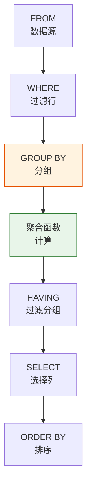

# Oracle聚合与分组查询

## 一、概述

### 1.1 一句话定义

Oracle聚合与分组查询，本质是使用聚合函数对数据进行统计计算，并通过GROUP BY将数据分组的查询方式。
它在Oracle数据分析中出现和使用，解决报表统计、数据汇总、趋势分析等问题。

### 1.2 为什么重要

- **不掌握的后果：** 无法进行数据统计和分析，影响业务决策
- **掌握的价值：** 高效生成统计报表，支持数据分析

### 1.3 适用场景

| 场景 | 说明 |
|------|------|
| 报表统计 | 销售报表、财务报表 |
| 数据分析 | 趋势分析、对比分析 |
| 数据汇总 | 按维度汇总 |
| 业务监控 | KPI指标计算 |

### 1.4 版本演进

| 版本 | 变化说明 |
|------|---------|
| 11gR2 | 增强分析函数、LISTAGG |
| 12cR1 | GROUP_ID增强 |
| 19c | 增强APPROX_COUNT_DISTINCT |
| 21c | 增强JSON聚合 |
| 23ai | JSON聚合函数增强 |

## 二、术语与概念

### 2.1 核心术语表

| 术语 | 含义 | 类比 |
|------|------|------|
| 聚合函数 | 对一组值返回单个值的函数 | 统计计算器 |
| GROUP BY | 按列分组 | 分类整理 |
| HAVING | 过滤分组 | 分组后筛选 |
| ROLLUP | 层次化小计 | 逐级汇总 |
| CUBE | 全维度组合 | 交叉汇总 |

## 三、核心原理

### 3.1 聚合函数

#### 基本聚合函数

| 函数 | 说明 | 示例 |
|------|------|------|
| COUNT | 计数 | COUNT(*) / COUNT(col) |
| SUM | 求和 | SUM(salary) |
| AVG | 平均值 | AVG(salary) |
| MAX | 最大值 | MAX(salary) |
| MIN | 最小值 | MIN(salary) |

```sql
-- 基本聚合
SELECT COUNT(*) AS total_count,
       COUNT(commission_pct) AS non_null_count,
       SUM(salary) AS total_salary,
       AVG(salary) AS avg_salary,
       MAX(salary) AS max_salary,
       MIN(salary) AS min_salary
FROM employees;

-- COUNT DISTINCT
SELECT COUNT(DISTINCT dept_id) AS dept_count FROM employees;

-- APPROX_COUNT_DISTINCT（大数据量更快）
SELECT APPROX_COUNT_DISTINCT(customer_id) AS approx_count FROM orders;
```

#### Oracle特有聚合函数

```sql
-- LISTAGG：字符串聚合（11gR2+）
SELECT dept_id, 
       LISTAGG(name, ', ') WITHIN GROUP (ORDER BY name) AS employees
FROM employees
GROUP BY dept_id;

-- 结果：10 | Alice, Bob, Charlie

-- WM_CONCAT（非官方，已废弃，用LISTAGG代替）

-- MEDIAN：中位数
SELECT dept_id, MEDIAN(salary) AS median_salary
FROM employees
GROUP BY dept_id;

-- STDDEV：标准差
SELECT dept_id, STDDEV(salary) AS salary_stddev
FROM employees
GROUP BY dept_id;

-- VARIANCE：方差
SELECT dept_id, VARIANCE(salary) AS salary_variance
FROM employees
GROUP BY dept_id;

-- FIRST/LAST：第一/最后一个值
SELECT dept_id,
       MAX(salary) KEEP (DENSE_RANK FIRST ORDER BY commission_pct DESC) AS best_commission_salary
FROM employees
GROUP BY dept_id;

-- JSON聚合（23ai）
SELECT dept_id,
       JSON_ARRAYAGG(name ORDER BY name) AS emp_names
FROM employees
GROUP BY dept_id;

SELECT dept_id,
       JSON_OBJECTAGG(name VALUE salary) AS emp_salaries
FROM employees
GROUP BY dept_id;
```

### 3.2 GROUP BY分组

```sql
-- 基本分组
SELECT dept_id, COUNT(*) AS emp_count, AVG(salary) AS avg_salary
FROM employees
GROUP BY dept_id;

-- 多列分组
SELECT dept_id, job_id, COUNT(*), AVG(salary)
FROM employees
GROUP BY dept_id, job_id;

-- 使用表达式分组
SELECT EXTRACT(YEAR FROM hire_date) AS hire_year, COUNT(*)
FROM employees
GROUP BY EXTRACT(YEAR FROM hire_date);

-- 使用列位置
SELECT dept_id, COUNT(*) FROM employees GROUP BY 1;
```

### 3.3 HAVING过滤分组

```sql
-- HAVING过滤分组
SELECT dept_id, AVG(salary) AS avg_salary
FROM employees
GROUP BY dept_id
HAVING AVG(salary) > 10000;

-- 多条件HAVING
SELECT dept_id, COUNT(*) AS emp_count, AVG(salary) AS avg_salary
FROM employees
GROUP BY dept_id
HAVING COUNT(*) > 5 AND AVG(salary) > 8000;

-- HAVING vs WHERE
-- WHERE：过滤行（分组前）
-- HAVING：过滤分组（分组后）
SELECT dept_id, COUNT(*) AS emp_count
FROM employees
WHERE hire_date > DATE '2020-01-01'  -- 先过滤行
GROUP BY dept_id
HAVING COUNT(*) > 3;                  -- 再过滤分组
```

### 3.4 GROUP BY扩展

#### ROLLUP（层次化小计）

```sql
-- ROLLUP：生成层次化小计
SELECT dept_id, job_id, SUM(salary)
FROM employees
GROUP BY ROLLUP(dept_id, job_id);

-- 结果包含：
-- 每个(dept_id, job_id)组合的汇总
-- 每个dept_id的小计（job_id为NULL）
-- 总计（dept_id和job_id都为NULL）

-- 使用GROUPING函数标识小计行
SELECT 
    CASE WHEN GROUPING(dept_id) = 1 THEN '总计' 
         ELSE TO_CHAR(dept_id) END AS dept,
    CASE WHEN GROUPING(job_id) = 1 THEN '小计'
         ELSE job_id END AS job,
    SUM(salary)
FROM employees
GROUP BY ROLLUP(dept_id, job_id);
```

#### CUBE（全维度组合）

```sql
-- CUBE：生成所有维度组合
SELECT dept_id, job_id, SUM(salary)
FROM employees
GROUP BY CUBE(dept_id, job_id);

-- 结果包含：
-- 每个(dept_id, job_id)组合
-- 每个dept_id的小计
-- 每个job_id的小计
-- 总计
```

#### GROUPING SETS（自定义组合）

```sql
-- GROUPING SETS：自定义分组组合
SELECT dept_id, job_id, SUM(salary)
FROM employees
GROUP BY GROUPING SETS (
    (dept_id, job_id),  -- 按部门和职位
    (dept_id),          -- 按部门
    ()                  -- 总计
);

-- 等价于ROLLUP(dept_id, job_id)
```

#### GROUPING函数

```sql
-- GROUPING：判断是否为小计行
SELECT 
    dept_id,
    GROUPING(dept_id) AS is_dept_subtotal,
    SUM(salary)
FROM employees
GROUP BY ROLLUP(dept_id);

-- GROUPING_ID：多维度GROUPING
SELECT 
    dept_id, job_id,
    GROUPING_ID(dept_id, job_id) AS gid,
    SUM(salary)
FROM employees
GROUP BY CUBE(dept_id, job_id);

-- GROUPING_ID返回值：二进制位表示哪些列是小计
-- 0 = 都不是小计
-- 1 = job_id是小计
-- 2 = dept_id是小计
-- 3 = 都是小计
```

## 四、架构与组件

### 4.1 聚合查询执行流程



### 4.2 ROLLUP vs CUBE vs GROUPING SETS

| 方式 | 生成组合数 | 适用场景 |
|------|-----------|---------|
| ROLLUP(a,b,c) | n+1个层次 | 层次化报表 |
| CUBE(a,b,c) | 2^n个组合 | 交叉分析 |
| GROUPING SETS | 自定义 | 灵活组合 |

## 五、配置与参数

### 5.1 聚合相关参数

```sql
-- 查看聚合相关参数
SHOW PARAMETER hash_area_size;     -- 哈希聚合内存
SHOW PARAMETER sort_area_size;     -- 排序内存

-- 使用Hint控制聚合方式
SELECT /*+ USE_HASH_AGGREGATION */ dept_id, COUNT(*)
FROM employees
GROUP BY dept_id;

SELECT /*+ USE_SORT_AGGREGATION */ dept_id, COUNT(*)
FROM employees
GROUP BY dept_id;
```

## 六、监控与诊断

### 6.1 聚合查询性能

```sql
-- 查看聚合查询执行计划
EXPLAIN PLAN FOR
SELECT dept_id, COUNT(*), AVG(salary)
FROM employees
GROUP BY dept_id;

SELECT * FROM TABLE(DBMS_XPLAN.DISPLAY);

-- 关注：HASH GROUP BY / SORT GROUP BY
-- HASH GROUP BY：内存哈希聚合，适合中等数据量
-- SORT GROUP BY：排序后聚合，适合大数据量
```

### 6.2 性能优化

```sql
-- 优化建议
-- 1. 使用索引避免全表扫描
CREATE INDEX idx_emp_dept ON employees(dept_id);

-- 2. 使用物化视图预计算
CREATE MATERIALIZED VIEW mv_dept_stats
BUILD IMMEDIATE
REFRESH ON COMMIT
AS
SELECT dept_id, COUNT(*) AS emp_count, AVG(salary) AS avg_salary
FROM employees
GROUP BY dept_id;

-- 3. 分区表提高聚合性能
-- 4. 使用APPROX_COUNT_DISTINCT代替COUNT DISTINCT
```

## 七、实战案例

### 7.1 案例背景

- **场景**：生成销售报表，需要多维度汇总
- **时间**：2026年
- **现象**：需要按地区、产品、时间汇总销售额

### 7.2 实施过程

```sql
-- 步骤1：基本分组统计
SELECT region, product_category, 
       SUM(sales_amount) AS total_sales,
       COUNT(DISTINCT customer_id) AS customer_count,
       AVG(sales_amount) AS avg_sale
FROM sales
WHERE sale_date >= DATE '2026-01-01'
GROUP BY region, product_category
ORDER BY total_sales DESC;

-- 步骤2：使用ROLLUP生成小计
SELECT 
    CASE WHEN GROUPING(region) = 1 THEN '全国' ELSE region END AS region,
    CASE WHEN GROUPING(product_category) = 1 THEN '全部品类' ELSE product_category END AS category,
    SUM(sales_amount) AS total_sales
FROM sales
WHERE sale_date >= DATE '2026-01-01'
GROUP BY ROLLUP(region, product_category)
ORDER BY region, product_category;

-- 步骤3：使用CUBE交叉分析
SELECT region, product_category,
       SUM(sales_amount) AS total_sales
FROM sales
WHERE sale_date >= DATE '2026-01-01'
GROUP BY CUBE(region, product_category);

-- 步骤4：使用LISTAGG生成汇总字符串
SELECT region,
       LISTAGG(DISTINCT product_category, ', ') WITHIN GROUP (ORDER BY product_category) AS categories,
       SUM(sales_amount) AS total_sales
FROM sales
WHERE sale_date >= DATE '2026-01-01'
GROUP BY region;
```

### 7.3 实施结果

| 报表类型 | 方法 | 说明 |
|---------|------|------|
| 基本统计 | GROUP BY | 按维度汇总 |
| 层次报表 | ROLLUP | 带小计 |
| 交叉分析 | CUBE | 全维度组合 |
| 字符串汇总 | LISTAGG | 合并字符串 |

### 7.4 复盘总结

- **根因：** 使用GROUP BY扩展生成多维度报表
- **教训：** ROLLUP适合层次报表，CUBE适合交叉分析

## 八、常见错误与排查

### 8.1 常见错误列表

| 错误代码 | 错误信息 | 原因 | 解决方法 |
|---------|---------|------|---------|
| ORA-00937 | not a single-group group function | SELECT列未在GROUP BY中 | 添加到GROUP BY或使用聚合函数 |
| ORA-00979 | not a GROUP BY expression | GROUP BY表达式错误 | 检查GROUP BY列 |
| ORA-00904 | invalid identifier | 列名不存在 | 检查列名 |

## 九、最佳实践

### 9.1 官方推荐

- 使用GROUP BY扩展生成报表
- 大数据量使用APPROX_COUNT_DISTINCT
- 使用物化视图预计算
- 使用Hint控制聚合方式

### 9.2 社区经验

- 先WHERE过滤再GROUP BY
- 使用GROUPING标识小计
- 合理使用ROLLUP/CUBE

### 9.3 反模式

| 反模式 | 问题 | 正确做法 |
|--------|------|---------|
| SELECT列不在GROUP BY | ORA-00937 | 添加到GROUP BY |
| HAVING代替WHERE | 性能差 | 行过滤用WHERE |
| 不使用索引 | 全表扫描 | 创建合适索引 |

## 十、命令与视图汇总

### 10.1 命令列表

| 命令 | 适用场景 | 说明 |
|------|---------|------|
| `GROUP BY` | 分组 | 按列分组 |
| `HAVING` | 过滤分组 | 分组后过滤 |
| `ROLLUP` | 层次汇总 | 生成小计 |
| `CUBE` | 交叉汇总 | 全维度组合 |
| `GROUPING SETS` | 自定义组合 | 灵活分组 |

### 10.2 聚合函数列表

| 函数 | 说明 |
|------|------|
| COUNT/SUM/AVG/MAX/MIN | 基本聚合 |
| LISTAGG | 字符串聚合 |
| MEDIAN | 中位数 |
| STDDEV/VARIANCE | 标准差/方差 |
| APPROX_COUNT_DISTINCT | 近似计数 |

## 十一、总结速查

### 11.1 黄金法则

1. **SELECT列必须在GROUP BY中** - 或使用聚合函数
2. **WHERE先过滤** - 减少GROUP BY数据量
3. **使用ROLLUP/CUBE** - 生成多维度报表

### 11.2 一页纸检查清单

| 检查项 | 说明 |
|--------|------|
| GROUP BY完整 | SELECT列都在GROUP BY中 |
| WHERE先过滤 | 减少数据量 |
| 使用索引 | 提高分组性能 |
| 选择合适扩展 | ROLLUP/CUBE/GROUPING SETS |

## 附录

### A. 官方参考

- [Oracle Database SQL Language Reference - Aggregate Functions](https://docs.oracle.com/en/database/oracle/oracle-database/19c/sqlqr/Aggregate-Functions.html)
- [Oracle Database Data Warehousing Guide - GROUP BY Extensions](https://docs.oracle.com/en/database/oracle/oracle-database/19c/dwhsg/)

### B. 修订记录

| 日期 | 版本 | 修改内容 | 修改人 |
|------|------|---------|--------|
| 2026-07-01 | v1.0 | 初始版本 | YashanDB知识库生成器 |
