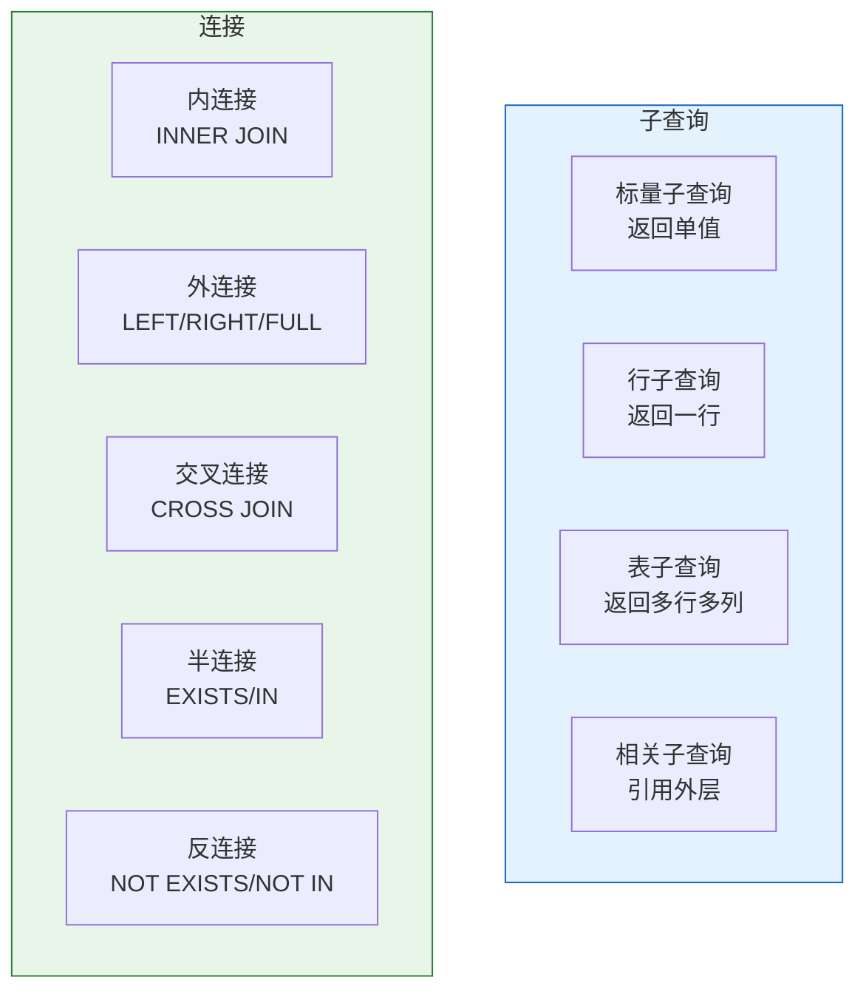
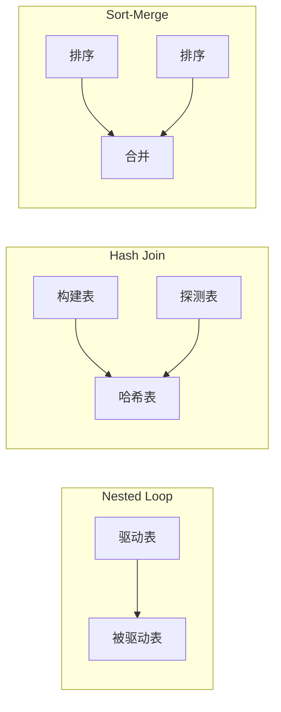

# Oracle子查询与连接操作

## 一、概述

### 1.1 一句话定义

Oracle子查询与连接操作，本质是多表数据关联查询的两种核心方式：子查询嵌套和表连接。
它在Oracle复杂查询中出现和使用，解决多表数据关联、条件过滤、数据对比等问题。

### 1.2 为什么重要

- **不掌握的后果：** 无法编写复杂的多表查询，影响开发效率
- **掌握的价值：** 高效关联多表数据，编写复杂查询

### 1.3 适用场景

| 场景 | 说明 |
|------|------|
| 多表查询 | 关联多个表获取数据 |
| 条件过滤 | 基于子查询结果过滤 |
| 数据对比 | 比较两个数据集 |
| 报表查询 | 复杂报表SQL |

### 1.4 版本演进

| 版本 | 变化说明 |
|------|---------|
| 11gR2 | 增强ANSI JOIN、递归子查询 |
| 12cR1 | LATERAL关键字、行限制 |
| 12cR2 | 增强JSON子查询 |
| 19c | 多态表函数、SQL宏 |
| 23ai | JSON Duality视图关联 |

## 二、术语与概念

### 2.1 核心术语表

| 术语 | 含义 | 类比 |
|------|------|------|
| 子查询 | 嵌套在另一个查询中的查询 | 嵌套查找 |
| 相关子查询 | 引用外层查询列的子查询 | 关联查找 |
| 连接 | 多表关联操作 | 表合并 |
| 驱动表 | 连接中首先访问的表 | 主表 |
| 被驱动表 | 连接中被驱动的表 | 从表 |

### 2.2 子查询与连接对比



## 三、核心原理

### 3.1 子查询类型

#### 标量子查询（返回单值）

```sql
-- SELECT中的标量子查询
SELECT name, salary,
       (SELECT AVG(salary) FROM employees) AS avg_salary,
       salary - (SELECT AVG(salary) FROM employees) AS diff
FROM employees;

-- WHERE中的标量子查询
SELECT name, salary FROM employees
WHERE salary > (SELECT AVG(salary) FROM employees);

-- HAVING中的标量子查询
SELECT dept_id, AVG(salary) AS avg_sal
FROM employees
GROUP BY dept_id
HAVING AVG(salary) > (SELECT AVG(salary) FROM employees);
```

#### 行子查询（返回一行）

```sql
-- 行子查询
SELECT * FROM employees
WHERE (salary, commission_pct) = (
    SELECT salary, commission_pct FROM employees WHERE emp_id = 100
);
```

#### 表子查询（返回多行多列）

```sql
-- FROM中的表子查询（内联视图）
SELECT e.name, d.dept_name
FROM employees e
JOIN (SELECT dept_id, dept_name FROM departments WHERE location = 'Beijing') d
ON e.dept_id = d.dept_id;

-- WHERE IN子查询
SELECT name FROM employees
WHERE dept_id IN (SELECT dept_id FROM departments WHERE location = 'Beijing');

-- WHERE ANY/SOME
SELECT name, salary FROM employees
WHERE salary > ANY (SELECT salary FROM employees WHERE dept_id = 10);

-- WHERE ALL
SELECT name, salary FROM employees
WHERE salary > ALL (SELECT salary FROM employees WHERE dept_id = 10);
```

#### 相关子查询

```sql
-- 相关子查询：引用外层查询列
SELECT name, salary FROM employees e
WHERE salary > (SELECT AVG(salary) FROM employees WHERE dept_id = e.dept_id);

-- EXISTS相关子查询
SELECT name FROM employees e
WHERE EXISTS (SELECT 1 FROM departments d WHERE d.dept_id = e.dept_id AND d.location = 'Beijing');

-- NOT EXISTS
SELECT name FROM employees e
WHERE NOT EXISTS (SELECT 1 FROM departments d WHERE d.dept_id = e.dept_id AND d.location = 'Beijing');
```

#### 递归子查询（11gR2+）

```sql
-- 递归CTE
WITH emp_hierarchy AS (
    -- 锚点成员
    SELECT emp_id, name, manager_id, 1 AS level
    FROM employees
    WHERE manager_id IS NULL
    
    UNION ALL
    
    -- 递归成员
    SELECT e.emp_id, e.name, e.manager_id, eh.level + 1
    FROM employees e
    JOIN emp_hierarchy eh ON e.manager_id = eh.emp_id
)
SELECT * FROM emp_hierarchy;
```

### 3.2 连接操作

#### 内连接（INNER JOIN）

```sql
-- ANSI SQL语法（推荐）
SELECT e.name, d.dept_name
FROM employees e
INNER JOIN departments d ON e.dept_id = d.dept_id;

-- 传统语法
SELECT e.name, d.dept_name
FROM employees e, departments d
WHERE e.dept_id = d.dept_id;

-- 多表连接
SELECT e.name, d.dept_name, j.job_title
FROM employees e
JOIN departments d ON e.dept_id = d.dept_id
JOIN jobs j ON e.job_id = j.job_id;
```

#### 外连接（OUTER JOIN）

```sql
-- 左外连接
SELECT e.name, d.dept_name
FROM employees e
LEFT JOIN departments d ON e.dept_id = d.dept_id;

-- 右外连接
SELECT e.name, d.dept_name
FROM employees e
RIGHT JOIN departments d ON e.dept_id = d.dept_id;

-- 全外连接
SELECT e.name, d.dept_name
FROM employees e
FULL OUTER JOIN departments d ON e.dept_id = d.dept_id;

-- Oracle传统语法（+号）
SELECT e.name, d.dept_name
FROM employees e, departments d
WHERE e.dept_id = d.dept_id(+);  -- (+)在缺少数据的一侧
```

#### 交叉连接（CROSS JOIN）

```sql
-- 交叉连接：笛卡尔积
SELECT e.name, d.dept_name
FROM employees e
CROSS JOIN departments d;
```

#### 自然连接（NATURAL JOIN）

```sql
-- 自然连接：自动匹配同名列
SELECT e.name, d.dept_name
FROM employees e
NATURAL JOIN departments d;

-- USING子句：明确连接列
SELECT e.name, d.dept_name
FROM employees e
JOIN departments d USING (dept_id);
```

#### 自连接

```sql
-- 自连接：表与自身连接
SELECT e.name AS employee, m.name AS manager
FROM employees e
LEFT JOIN employees m ON e.manager_id = m.emp_id;
```

### 3.3 半连接与反连接

```sql
-- 半连接（SEMI JOIN）：只返回匹配的行
SELECT * FROM employees e
WHERE EXISTS (SELECT 1 FROM departments d WHERE d.dept_id = e.dept_id);

-- 等价于IN
SELECT * FROM employees
WHERE dept_id IN (SELECT dept_id FROM departments);

-- 反连接（ANTI JOIN）：返回不匹配的行
SELECT * FROM employees e
WHERE NOT EXISTS (SELECT 1 FROM departments d WHERE d.dept_id = e.dept_id);

-- 等价于NOT IN（注意NULL处理）
SELECT * FROM employees
WHERE dept_id NOT IN (SELECT dept_id FROM departments WHERE dept_id IS NOT NULL);
```

### 3.4 LATERAL子句（12c+）

```sql
-- LATERAL：子查询引用外层表
SELECT d.dept_name, top3.name, top3.salary
FROM departments d,
LATERAL (SELECT name, salary FROM employees e WHERE e.dept_id = d.dept_id ORDER BY salary DESC FETCH FIRST 3 ROWS ONLY) top3;

-- OUTER LATERAL：保留无匹配的外层行
SELECT d.dept_name, top3.name
FROM departments d
LEFT OUTER JOIN LATERAL (SELECT name FROM employees e WHERE e.dept_id = d.dept_id ORDER BY salary DESC FETCH FIRST 1 ROW ONLY) top3 ON 1=1;
```

## 四、架构与组件

### 4.1 连接算法

| 算法 | 适用场景 | 特点 |
|------|---------|------|
| Nested Loop | 小表驱动，有索引 | 内存消耗小 |
| Hash Join | 大表关联 | 需要构建哈希表 |
| Sort-Merge Join | 已排序数据 | 需要先排序 |



### 4.2 子查询改写

```sql
-- 子查询改写为连接（通常性能更好）

-- 原始：IN子查询
SELECT * FROM employees WHERE dept_id IN (SELECT dept_id FROM departments WHERE location = 'Beijing');

-- 改写1：EXISTS
SELECT * FROM employees e WHERE EXISTS (SELECT 1 FROM departments d WHERE d.dept_id = e.dept_id AND d.location = 'Beijing');

-- 改写2：JOIN
SELECT DISTINCT e.* FROM employees e JOIN departments d ON e.dept_id = d.dept_id WHERE d.location = 'Beijing';

-- 改写3：SEMI JOIN Hint
SELECT * FROM employees WHERE dept_id IN (SELECT /*+ SEMIJOIN */ dept_id FROM departments WHERE location = 'Beijing');
```

## 五、配置与参数

### 5.1 连接相关Hint

```sql
-- 控制连接方式
SELECT /*+ USE_NL(e d) */ * FROM employees e JOIN departments d ON e.dept_id = d.dept_id;
SELECT /*+ USE_HASH(e d) */ * FROM employees e JOIN departments d ON e.dept_id = d.dept_id;
SELECT /*+ USE_MERGE(e d) */ * FROM employees e JOIN departments d ON e.dept_id = d.dept_id;

-- 控制驱动表
SELECT /*+ LEADING(e) */ * FROM employees e JOIN departments d ON e.dept_id = d.dept_id;

-- 控制连接顺序
SELECT /*+ ORDERED */ * FROM departments d JOIN employees e ON e.dept_id = d.dept_id;
```

## 六、监控与诊断

### 6.1 执行计划分析

```sql
-- 查看连接方式
EXPLAIN PLAN FOR
SELECT e.name, d.dept_name
FROM employees e JOIN departments d ON e.dept_id = d.dept_id;

SELECT * FROM TABLE(DBMS_XPLAN.DISPLAY);

-- 关注：
-- NESTED LOOPS / HASH JOIN / SORT-MERGE JOIN
-- 驱动表选择
-- 连接条件是否使用索引
```

### 6.2 性能对比

```sql
-- 对比不同写法性能
SET AUTOTRACE ON

-- IN vs EXISTS
SELECT * FROM employees WHERE dept_id IN (SELECT dept_id FROM departments);
SELECT * FROM employees e WHERE EXISTS (SELECT 1 FROM departments d WHERE d.dept_id = e.dept_id);

-- 关注：逻辑读、执行时间
```

## 七、实战案例

### 7.1 案例背景

- **场景**：查询每个部门工资最高的员工
- **时间**：2026年
- **现象**：需要关联查询

### 7.2 实施过程

```sql
-- 方法1：相关子查询
SELECT name, salary, dept_id
FROM employees e
WHERE salary = (SELECT MAX(salary) FROM employees WHERE dept_id = e.dept_id);

-- 方法2：JOIN + 子查询
SELECT e.name, e.salary, e.dept_id
FROM employees e
JOIN (SELECT dept_id, MAX(salary) AS max_sal FROM employees GROUP BY dept_id) m
ON e.dept_id = m.dept_id AND e.salary = m.max_sal;

-- 方法3：分析函数（推荐）
SELECT name, salary, dept_id
FROM (
    SELECT name, salary, dept_id,
           RANK() OVER (PARTITION BY dept_id ORDER BY salary DESC) AS rn
    FROM employees
)
WHERE rn = 1;

-- 方法4：FIRST/LAST聚合函数
SELECT dept_id,
       MAX(name) KEEP (DENSE_RANK FIRST ORDER BY salary DESC) AS top_earner,
       MAX(salary) AS max_salary
FROM employees
GROUP BY dept_id;
```

### 7.3 实施结果

| 方法 | 执行时间 | 逻辑读 | 推荐度 |
|------|---------|--------|--------|
| 相关子查询 | 中 | 中 | 一般 |
| JOIN+子查询 | 中 | 中 | 一般 |
| 分析函数 | 快 | 少 | 推荐 |
| FIRST/LAST | 快 | 少 | 推荐 |

### 7.4 复盘总结

- **根因：** 分析函数通常比相关子查询性能更好
- **教训：** 选择合适的方法，分析函数是Oracle的强项

## 八、常见错误与排查

### 8.1 常见错误列表

| 错误代码 | 错误信息 | 原因 | 解决方法 |
|---------|---------|------|---------|
| ORA-00904 | invalid identifier | 列名不存在 | 检查列名 |
| ORA-00913 | too many values | 子查询返回多列 | 确保子查询返回单列 |
| ORA-00918 | column ambiguously defined | 列名歧义 | 使用表别名 |
| ORA-01427 | single-row subquery returns more than one row | 标量子查询返回多行 | 确保返回单行 |
| ORA-01403 | no data found | 子查询无结果 | 处理NULL |

## 九、最佳实践

### 9.1 官方推荐

- 使用ANSI JOIN语法
- 优先使用分析函数代替相关子查询
- EXISTS代替IN（大数据集）
- 外键列创建索引

### 9.2 社区经验

- 小表驱动大表
- 使用Hint控制连接方式（谨慎）
- NOT IN注意NULL处理
- 使用LATERAL简化复杂查询

### 9.3 反模式

| 反模式 | 问题 | 正确做法 |
|--------|------|---------|
| 隐式连接 | 可读性差 | 使用显式JOIN |
| NOT IN含NULL | 结果不正确 | 使用NOT EXISTS |
| 过度子查询 | 性能差 | 改写为JOIN |
| 不使用索引 | 全表扫描 | 连接列建索引 |

## 十、命令与视图汇总

### 10.1 命令列表

| 命令 | 适用场景 | 说明 |
|------|---------|------|
| `JOIN...ON` | 表连接 | 关联查询 |
| `EXISTS/IN` | 半连接 | 存在检查 |
| `NOT EXISTS` | 反连接 | 不存在检查 |
| `LATERAL` | 关联子查询 | 12c+特性 |

### 10.2 视图列表

| 视图名 | 类型 | 用途 |
|--------|------|------|
| V$SQL_PLAN | 动态 | 执行计划 |
| V$SQL_PLAN_STATISTICS_ALL | 动态 | 执行统计 |

## 十一、总结速查

### 11.1 黄金法则

1. **使用ANSI JOIN** - 标准语法，可读性好
2. **分析函数优于相关子查询** - 性能更好
3. **NOT EXISTS代替NOT IN** - 避免NULL问题

### 11.2 一页纸检查清单

| 检查项 | 说明 |
|--------|------|
| 使用显式JOIN | 避免隐式连接 |
| 连接列有索引 | 提高性能 |
| 注意NULL处理 | NOT IN的陷阱 |
| 选择合适方法 | 分析函数优先 |

## 附录

### A. 连接类型速查

| 类型 | 语法 | 说明 |
|------|------|------|
| INNER JOIN | JOIN...ON | 只返回匹配行 |
| LEFT JOIN | LEFT JOIN...ON | 左表全部+匹配 |
| RIGHT JOIN | RIGHT JOIN...ON | 右表全部+匹配 |
| FULL JOIN | FULL OUTER JOIN | 两表全部 |
| CROSS JOIN | CROSS JOIN | 笛卡尔积 |
| NATURAL JOIN | NATURAL JOIN | 自动匹配同名列 |
| SEMI JOIN | EXISTS/IN | 存在检查 |
| ANTI JOIN | NOT EXISTS | 不存在检查 |

### B. 官方参考

- [Oracle Database SQL Language Reference - Queries](https://docs.oracle.com/en/database/oracle/oracle-database/19c/sqlqr/SQL-Queries-and-Subqueries.html)
- [Oracle Database Performance Tuning Guide - Joins](https://docs.oracle.com/en/database/oracle/oracle-database/19c/tgdba/)

### C. 修订记录

| 日期 | 版本 | 修改内容 | 修改人 |
|------|------|---------|--------|
| 2026-07-01 | v1.0 | 初始版本 | YashanDB知识库生成器 |
