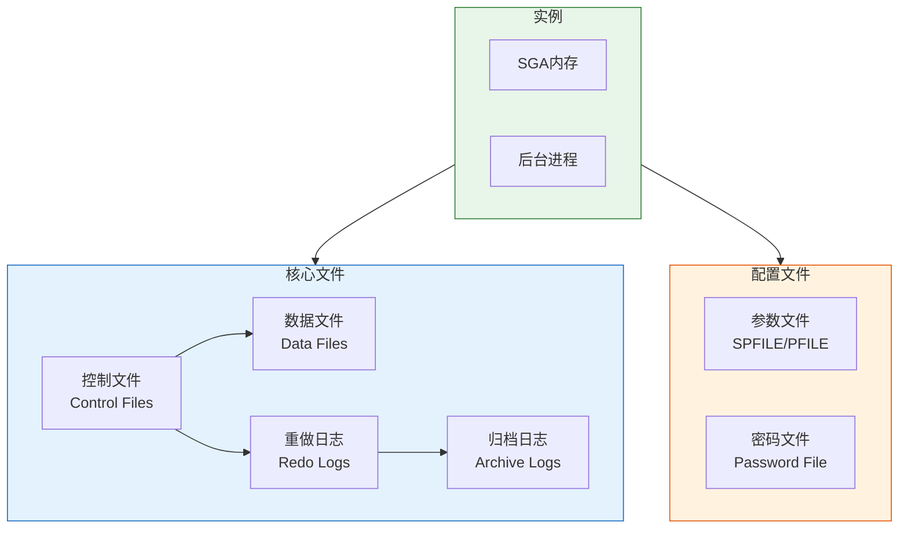

# Oracle数据库文件结构

## 一、概述

### 1.1 一句话定义

Oracle数据库文件结构，本质是Oracle数据库物理存储的组织方式，包括数据文件、控制文件、重做日志文件等核心组件。
它在Oracle数据库存储管理中出现和使用，解决数据的持久化存储、恢复和一致性问题。

### 1.2 为什么重要

- **不掌握的后果：** 无法有效管理数据库存储，影响性能和可恢复性
- **掌握的价值：** 优化存储配置，保障数据安全

### 1.3 适用场景

| 场景 | 说明 |
|------|------|
| 数据库部署 | 规划文件存储位置 |
| 性能优化 | 优化I/O分布 |
| 故障恢复 | 理解文件作用 |
| 存储管理 | 扩展和迁移 |

### 1.4 版本演进

| 版本 | 变化说明 |
|------|---------|
| 11gR2 | OMF增强、ASM改进 |
| 12cR1 | 多租户文件隔离 |
| 12cR2 | 大文件表空间增强 |
| 19c | ASM集群增强 |
| 21c | 云存储集成 |

## 二、术语与概念

### 2.1 核心术语表

| 术语 | 含义 | 类比 |
|------|------|------|
| 数据文件 | 存储表、索引等数据的文件 | 书架 |
| 控制文件 | 记录数据库结构信息的二进制文件 | 目录索引 |
| 重做日志 | 记录所有变更的文件 | 操作日志 |
| 归档日志 | 已填满的重做日志备份 | 历史档案 |
| 参数文件 | 数据库启动配置参数 | 启动配置 |
| 密码文件 | 存储特权用户密码 | 管理员钥匙 |

### 2.2 文件关系图



## 三、核心原理

### 3.1 数据文件（Data Files）

数据文件存储数据库的所有数据，包括表、索引、回滚段等。

```sql
-- 查看数据文件
SELECT file_name, tablespace_name, bytes/1024/1024 AS size_mb,
       autoextensible, maxbytes/1024/1024 AS max_mb
FROM dba_data_files
ORDER BY tablespace_name, file_name;

-- 查看临时文件
SELECT file_name, tablespace_name, bytes/1024/1024 AS size_mb
FROM dba_temp_files;

-- 数据文件状态
SELECT file#, status, enabled, name
FROM v$datafile;
```

**数据文件特点：**
- 属于特定表空间
- 可自动扩展或手动扩展
- 一个表空间可包含多个数据文件
- 一个数据文件只能属于一个表空间

### 3.2 控制文件（Control Files）

控制文件是二进制文件，记录数据库的物理结构信息。

**控制文件包含的信息：**
- 数据库名称和SID
- 数据文件和日志文件列表
- 表空间信息
- 检查点信息
- RMAN备份信息

```sql
-- 查看控制文件位置
SHOW PARAMETER control_files;

-- 查看控制文件记录
SELECT type, record_size, record_count, bytes_used
FROM v$controlfile_record_section;

-- 控制文件内容
SELECT * FROM v$controlfile;
```

**控制文件管理：**
- Oracle建议至少2个控制文件副本
- 分布在不同磁盘
- 丢失所有控制文件需要重建

### 3.3 重做日志文件（Redo Log Files）

重做日志记录所有数据变更，用于实例恢复。

```sql
-- 查看重做日志组
SELECT group#, sequence#, bytes/1024/1024 AS size_mb,
       members, status, archived
FROM v$log;

-- 查看日志成员
SELECT group#, member, status
FROM v$logfile;

-- 查看日志切换历史
SELECT * FROM v$log_history ORDER BY first_time DESC;
```

**重做日志工作原理：**
- 循环使用日志组
- LGWR进程写入日志
- 日志切换时触发检查点
- 归档模式下自动归档

### 3.4 归档日志文件（Archive Log Files）

归档日志是已填满的重做日志的副本，用于介质恢复。

```sql
-- 查看归档模式
ARCHIVE LOG LIST;

-- 查看归档日志
SELECT name, sequence#, first_time, next_time, bytes/1024/1024 AS size_mb
FROM v$archived_log
WHERE first_time > SYSDATE - 7
ORDER BY first_time DESC;

-- 启用归档模式
SHUTDOWN IMMEDIATE;
STARTUP MOUNT;
ALTER DATABASE ARCHIVELOG;
ALTER DATABASE OPEN;

-- 配置归档位置
ALTER SYSTEM SET log_archive_dest_1 = 'LOCATION=/u01/archive';
```

### 3.5 参数文件（Parameter Files）

参数文件存储数据库启动配置。

```sql
-- 查看参数文件类型
SHOW PARAMETER spfile;

-- SPFILE（二进制，推荐）
-- PFILE（文本，可编辑）

-- 查看参数
SHOW PARAMETER db_name;
SHOW PARAMETER db_block_size;

-- 修改参数
ALTER SYSTEM SET processes = 500 SCOPE = SPFILE;  -- 需要重启
ALTER SYSTEM SET open_cursors = 500 SCOPE = BOTH; -- 立即生效

-- 创建PFILE从SPFILE
CREATE PFILE = '/tmp/init.ora' FROM SPFILE;

-- 创建SPFILE从PFILE
CREATE SPFILE FROM PFILE = '/tmp/init.ora';
```

### 3.6 密码文件（Password File）

密码文件存储特权用户（SYSDBA、SYSOPER）的密码。

```bash
# 创建密码文件
orapwd file=orapwORCL password=Oracle123 entries=10

# 密码文件位置
# Linux: $ORACLE_HOME/dbs/orapw<SID>
# Windows: $ORACLE_HOME\database\PWD<SID>.ora
```

```sql
-- 查看密码文件用户
SELECT * FROM v$pwfile_users;

-- 授予SYSDBA
GRANT SYSDBA TO sys;
```

## 四、架构与组件

### 4.1 Oracle Managed Files (OMF)

OMF自动管理文件命名和位置。

```sql
-- 启用OMF
ALTER SYSTEM SET db_create_file_dest = '/u01/app/oracle/oradata';
ALTER SYSTEM SET db_create_online_log_dest_1 = '/u01/app/oracle/oradata';

-- 创建表空间（自动命名）
CREATE TABLESPACE users;  -- 自动创建数据文件

-- 添加日志组（自动命名）
ALTER DATABASE ADD LOGFILE GROUP 4 SIZE 100M;
```

### 4.2 ASM（Automatic Storage Management）

ASM是Oracle专用的卷管理器和文件系统。

```sql
-- 查看ASM磁盘组
SELECT name, state, type, total_mb, free_mb
FROM v$asm_diskgroup;

-- 查看ASM磁盘
SELECT path, name, state, total_mb, free_mb
FROM v$asm_disk;

-- 使用ASM创建表空间
CREATE TABLESPACE users DATAFILE '+DATA' SIZE 100M;
```

## 五、配置与参数

### 5.1 文件位置配置

```sql
-- 关键参数
SHOW PARAMETER db_create_file_dest;           -- OMF数据文件位置
SHOW PARAMETER db_recovery_file_dest;         -- 快速恢复区
SHOW PARAMETER db_recovery_file_dest_size;    -- 快速恢复区大小
SHOW PARAMETER control_files;                 -- 控制文件位置
SHOW PARAMETER log_archive_dest_1;            -- 归档位置

-- 配置快速恢复区
ALTER SYSTEM SET db_recovery_file_dest = '/u01/app/oracle/fast_recovery_area';
ALTER SYSTEM SET db_recovery_file_dest_size = 10G;
```

### 5.2 文件管理命令

```sql
-- 添加数据文件
ALTER TABLESPACE users ADD DATAFILE '/u01/oradata/users02.dbf' SIZE 100M AUTOEXTEND ON NEXT 50M;

-- 调整数据文件大小
ALTER DATABASE DATAFILE '/u01/oradata/users01.dbf' RESIZE 500M;

-- 添加日志组
ALTER DATABASE ADD LOGFILE GROUP 4 ('/u01/oradata/redo04.log') SIZE 100M;

-- 添加日志成员
ALTER DATABASE ADD LOGFILE MEMBER '/u02/oradata/redo01b.log' TO GROUP 1;

-- 删除日志组
ALTER DATABASE DROP LOGFILE GROUP 4;

-- 重命名数据文件（离线方式）
ALTER TABLESPACE users OFFLINE;
-- OS命令移动文件
ALTER DATABASE RENAME FILE '/old/users01.dbf' TO '/new/users01.dbf';
ALTER TABLESPACE users ONLINE;

-- 重命名数据文件（在线方式，12cR2+）
ALTER DATABASE MOVE DATAFILE '/old/users01.dbf' TO '/new/users01.dbf';
```

## 六、监控与诊断

### 6.1 文件I/O监控

```sql
-- 查看文件I/O统计
SELECT name, phyrds, phywrts, readtim, writetim
FROM v$filestat fs
JOIN v$datafile df ON fs.file# = df.file#
ORDER BY phyrds + phywrts DESC;

-- 查看表空间I/O
SELECT tablespace_name, 
       SUM(phyrds) AS reads,
       SUM(phywrts) AS writes
FROM v$filestat fs
JOIN dba_data_files df ON fs.file# = df.file_id
GROUP BY tablespace_name
ORDER BY reads + writes DESC;
```

### 6.2 空间监控

```sql
-- 表空间使用率
SELECT tablespace_name,
       ROUND(total_mb, 2) AS total_mb,
       ROUND(used_mb, 2) AS used_mb,
       ROUND(free_mb, 2) AS free_mb,
       ROUND(used_mb/total_mb*100, 2) AS used_pct
FROM (
    SELECT tablespace_name,
           SUM(bytes)/1024/1024 AS total_mb
    FROM dba_data_files
    GROUP BY tablespace_name
) t
JOIN (
    SELECT tablespace_name,
           SUM(bytes)/1024/1024 AS used_mb
    FROM dba_segments
    GROUP BY tablespace_name
) s USING (tablespace_name)
JOIN (
    SELECT tablespace_name,
           SUM(bytes)/1024/1024 AS free_mb
    FROM dba_free_space
    GROUP BY tablespace_name
) f USING (tablespace_name)
ORDER BY used_pct DESC;

-- 快速恢复区使用
SELECT name, space_limit/1024/1024/1024 AS limit_gb,
       space_used/1024/1024/1024 AS used_gb,
       space_reclaimable/1024/1024/1024 AS reclaimable_gb
FROM v$recovery_file_dest;
```

## 七、实战案例

### 7.1 案例背景

- **场景**：数据库存储优化
- **时间**：2026年
- **现象**：I/O性能瓶颈

### 7.2 优化过程

**步骤1：分析I/O分布**

```sql
SELECT name, phyrds, phywrts, readtim, writetim
FROM v$filestat fs
JOIN v$datafile df ON fs.file# = df.file#
WHERE phyrds + phywrts > 10000
ORDER BY phyrds + phywrts DESC;
```
- → 发现：USERS表空间I/O集中

**步骤2：优化方案**

```sql
-- 1. 分离热点数据
CREATE TABLESPACE hot_data DATAFILE '/ssd/hot01.dbf' SIZE 10G;

-- 2. 移动热点表
ALTER TABLE hot_table MOVE TABLESPACE hot_data ONLINE;

-- 3. 分离索引
CREATE TABLESPACE idx_data DATAFILE '/ssd/idx01.dbf' SIZE 5G;
ALTER INDEX hot_index REBUILD TABLESPACE idx_data ONLINE;
```

### 7.3 优化结果

| 指标 | 优化前 | 优化后 |
|------|--------|--------|
| 平均读时间 | 15ms | 3ms |
| I/O等待 | 高 | 低 |

### 7.4 复盘总结

- **根因：** I/O分布不均导致热点
- **教训：** 合理分布数据文件到不同磁盘

## 八、常见错误与排查

### 8.1 常见错误列表

| 错误代码 | 错误信息 | 原因 | 解决方法 |
|---------|---------|------|---------|
| ORA-01157 | cannot identify/lock data file | 数据文件丢失 | 恢复数据文件 |
| ORA-01110 | data file has errors | 数据文件损坏 | 块恢复或介质恢复 |
| ORA-00257 | archiver is stuck | 归档空间满 | 清理归档日志 |
| ORA-00205 | error in identifying control file | 控制文件问题 | 检查控制文件 |

## 九、最佳实践

### 9.1 官方推荐

- 控制文件至少2个副本
- 使用OMF简化文件管理
- 启用归档模式
- 使用ASM管理存储

### 9.2 社区经验

- 数据文件和日志文件分离到不同磁盘
- 定期监控表空间使用率
- 使用快速恢复区集中管理

### 9.3 反模式

| 反模式 | 问题 | 正确做法 |
|--------|------|---------|
| 单控制文件 | 单点故障 | 多副本分布 |
| 所有文件同一磁盘 | I/O瓶颈 | 分离到不同磁盘 |
| 不监控空间 | 空间满导致停机 | 设置告警阈值 |

## 十、命令与视图汇总

### 10.1 命令列表

| 命令 | 适用场景 | 说明 |
|------|---------|------|
| `ALTER DATABASE DATAFILE` | 管理数据文件 | 调整大小、重命名 |
| `ALTER DATABASE ADD LOGFILE` | 管理日志 | 添加日志组 |
| `ALTER SYSTEM SET` | 修改参数 | 配置文件位置 |

### 10.2 视图列表

| 视图名 | 类型 | 用途 |
|--------|------|------|
| DBA_DATA_FILES | 数据字典 | 数据文件信息 |
| V$DATAFILE | 动态 | 数据文件状态 |
| V$LOG | 动态 | 日志组信息 |
| V$CONTROLFILE | 动态 | 控制文件信息 |

## 十一、总结速查

### 11.1 黄金法则

1. **控制文件多副本** - 避免单点故障
2. **启用归档模式** - 保证可恢复性
3. **分离I/O热点** - 优化性能

### 11.2 一页纸检查清单

| 检查项 | 说明 |
|--------|------|
| 控制文件副本 | 至少2个 |
| 归档模式 | 生产环境必须启用 |
| 表空间监控 | 设置告警阈值 |
| 文件分布 | 避免I/O热点 |

## 附录

### A. 官方参考

- [Oracle Database Administrator's Guide - Managing Control Files](https://docs.oracle.com/en/database/oracle/oracle-database/19c/admin/)
- [Oracle Database Administrator's Guide - Managing Redo Log Files](https://docs.oracle.com/en/database/oracle/oracle-database/19c/admin/)

### B. 修订记录

| 日期 | 版本 | 修改内容 | 修改人 |
|------|------|---------|--------|
| 2026-07-02 | v1.0 | 初始版本 | YashanDB知识库生成器 |
