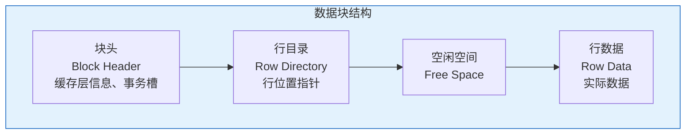
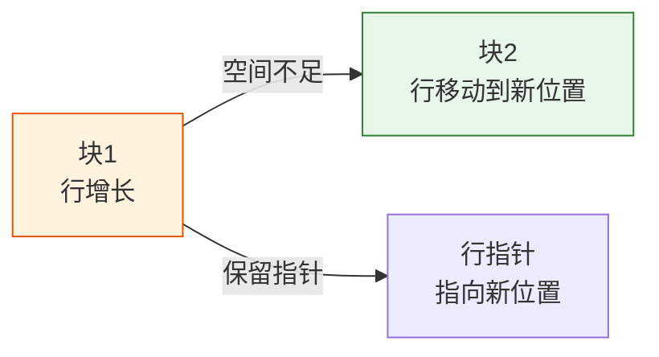

# Oracle数据块结构详解

## 一、概述

### 1.1 一句话定义

Oracle数据块结构，本质是Oracle数据库最小的I/O单位，是数据在磁盘和内存之间传输的基本单元。
它在Oracle存储管理中出现和使用，理解数据块结构对性能优化至关重要。

### 1.2 为什么重要

- **不掌握的后果：** 无法有效优化存储和I/O性能，难以诊断行迁移/链接问题
- **掌握的价值：** 优化块空间使用，减少行迁移，提高查询性能

### 1.3 适用场景

| 场景 | 说明 |
|------|------|
| 性能优化 | 优化块空间使用 |
| 存储管理 | 配置块大小 |
| 问题诊断 | 诊断行迁移/链接 |
| 表设计 | 选择合适的PCTFREE |

### 1.4 版本演进

| 版本 | 变化说明 |
|------|---------|
| 11gR2 | 块压缩增强 |
| 12cR1 | 多块大小支持增强 |
| 19c | 块级加密增强 |

## 二、术语与概念

### 2.1 核心术语表

| 术语 | 含义 | 类比 |
|------|------|------|
| 数据块 | 最小I/O单位 | 集装箱 |
| 块头 | 块的元数据区域 | 集装箱标签 |
| 行目录 | 存储行位置信息 | 目录索引 |
| 行数据 | 实际存储的行内容 | 货物 |
| PCTFREE | 预留空闲空间百分比 | 预留空间 |
| PCTUSED | 块使用率阈值 | 重用阈值 |
| 行迁移 | 行增长导致移动到其他块 | 搬家 |
| 行链接 | 一行跨多个块存储 | 拆分存储 |

### 2.2 数据块结构



## 三、核心原理

### 3.1 数据块组成

**块头（Block Header）：**
- 块地址（DBA: Data Block Address）
- 段类型（表段、索引段等）
- 事务槽（ITL - Interested Transaction List）
- SCN（System Change Number）

**行目录（Row Directory）：**
- 存储块中每行的位置偏移
- 按行号排序
- 大小约20-24字节

**行数据（Row Data）：**
- 实际存储的行内容
- 包含行头、列长度、列数据

**空闲空间（Free Space）：**
- 可用于INSERT和UPDATE的空间
- 由PCTFREE控制预留

### 3.2 块大小配置

```sql
-- 查看数据库块大小
SHOW PARAMETER db_block_size;

-- 查看非标准块大小
SHOW PARAMETER db_2k_cache_size;
SHOW PARAMETER db_4k_cache_size;
SHOW PARAMETER db_8k_cache_size;
SHOW PARAMETER db_16k_cache_size;
SHOW PARAMETER db_32k_cache_size;

-- 创建非标准块大小表空间
CREATE TABLESPACE ts_16k
    DATAFILE '/u01/oradata/ts_16k.dbf' SIZE 100M
    BLOCKSIZE 16K;
```

**块大小选择：**
- 默认8KB：适合OLTP
- 16KB/32KB：适合数据仓库、大行
- 4KB：适合小行、高并发

### 3.3 PCTFREE和PCTUSED

**PCTFREE：** 块中预留的空闲空间百分比，用于UPDATE时的行增长。

```sql
-- 创建表时设置PCTFREE
CREATE TABLE employees (
    emp_id NUMBER,
    name VARCHAR2(100),
    description VARCHAR2(1000)
)
PCTFREE 20;  -- 预留20%空间用于UPDATE

-- 修改PCTFREE
ALTER TABLE employees PCTFREE 30;
```

**PCTUSED：** 块使用率低于此值时，块可以被重新使用（仅用于手动段空间管理）。

```sql
-- 手动段空间管理（不推荐）
CREATE TABLE employees (
    emp_id NUMBER,
    name VARCHAR2(100)
)
PCTFREE 10
PCTUSED 40;
```

**ASSM（自动段空间管理）：**
- 10g+默认使用ASSM
- 不使用PCTUSED
- 使用位图块管理空闲空间

```sql
-- ASSM表空间（默认）
CREATE TABLESPACE users
    DATAFILE '/u01/oradata/users01.dbf' SIZE 100M
    EXTENT MANAGEMENT LOCAL
    SEGMENT SPACE MANAGEMENT AUTO;
```

### 3.4 行迁移（Row Migration）

行迁移发生在UPDATE导致行增长，当前块空间不足时。



**检测行迁移：**

```sql
-- 分析表
ANALYZE TABLE employees COMPUTE STATISTICS;

-- 查看行迁移统计
SELECT name, value FROM v$sysstat WHERE name = 'table fetch continued row';

-- 使用CHAINED_ROWS表
CREATE TABLE chained_rows (
    owner_name VARCHAR2(30),
    table_name VARCHAR2(30),
    cluster_name VARCHAR2(30),
    partition_name VARCHAR2(30),
    subpartition_name VARCHAR2(30),
    head_rowid ROWID,
    analyze_timestamp DATE
);

ANALYZE TABLE employees LIST CHAINED ROWS;

SELECT * FROM chained_rows WHERE table_name = 'EMPLOYEES';
```

**消除行迁移：**

```sql
-- 方法1：重建表
CREATE TABLE employees_temp AS SELECT * FROM employees;
TRUNCATE TABLE employees;
INSERT INTO employees SELECT * FROM employees_temp;
DROP TABLE employees_temp;

-- 方法2：导出导入
-- expdp/impdp

-- 方法3：移动表（12cR2+）
ALTER TABLE employees MOVE ONLINE;

-- 方法4：增大PCTFREE
ALTER TABLE employees PCTFREE 30;
```

### 3.5 行链接（Row Chaining）

行链接发生在行太大，一个块无法容纳时。

**常见场景：**
- 包含LOB列
- 行长度超过块大小

**检测行链接：**

```sql
-- 查看行链接
SELECT name, value FROM v$sysstat WHERE name = 'table fetch continued row';

-- 分析表
ANALYZE TABLE employees LIST CHAINED ROWS;
```

**减少行链接：**
- 增大块大小
- 避免过长的VARCHAR2
- LOB使用SECUREFILE

## 四、架构与组件

### 4.1 ITL（Interested Transaction List）

ITL是块头中的事务槽，记录正在访问该块的事务。

```sql
-- 查看ITL信息
SELECT * FROM v$transaction;

-- 配置INITRANS（初始ITL槽数）
CREATE TABLE employees (
    emp_id NUMBER,
    name VARCHAR2(100)
)
INITRANS 4;  -- 初始4个事务槽

-- 配置MAXTRANS（最大ITL槽数）
CREATE TABLE employees (
    emp_id NUMBER,
    name VARCHAR2(100)
)
MAXTRANS 255;  -- 最大255个事务槽（默认）
```

### 4.2 块转储（Block Dump）

```sql
-- 获取行的ROWID
SELECT rowid, emp_id, name FROM employees WHERE emp_id = 100;

-- 解析ROWID
-- AAAVmHAAEAAAAZzAAA
-- AAAVmH = 数据对象号
-- AAE = 文件号
-- AAAAAZz = 块号
-- AAA = 行号

-- 转储数据块
ALTER SYSTEM DUMP DATAFILE 4 BLOCK 1234;

-- 查看转储文件
-- 位置：$ORACLE_BASE/diag/rdbms/<db>/<instance>/trace/<instance>_ora_<pid>.trc
```

## 五、配置与参数

### 5.1 块相关参数

```sql
-- 查看块相关参数
SHOW PARAMETER db_block_size;
SHOW PARAMETER db_file_multiblock_read_count;

-- 配置多块读
ALTER SYSTEM SET db_file_multiblock_read_count = 128;
```

### 5.2 表存储参数

```sql
-- 完整表存储参数
CREATE TABLE employees (
    emp_id NUMBER,
    name VARCHAR2(100)
)
TABLESPACE users
PCTFREE 10
PCTUSED 40
INITRANS 1
MAXTRANS 255
STORAGE (
    INITIAL 64K
    NEXT 64K
    MINEXTENTS 1
    MAXEXTENTS UNLIMITED
    PCTINCREASE 0
);
```

## 六、监控与诊断

### 6.1 块空间监控

```sql
-- 查看段空间使用
SELECT segment_name, segment_type, bytes/1024/1024 AS size_mb,
       blocks, extents
FROM dba_segments
WHERE segment_name = 'EMPLOYEES';

-- 使用DBMS_SPACE分析
DECLARE
    v_unformatted_blocks NUMBER;
    v_unformatted_bytes NUMBER;
    v_fs1_blocks NUMBER;
    v_fs1_bytes NUMBER;
    v_fs2_blocks NUMBER;
    v_fs2_bytes NUMBER;
    v_fs3_blocks NUMBER;
    v_fs3_bytes NUMBER;
    v_fs4_blocks NUMBER;
    v_fs4_bytes NUMBER;
    v_full_blocks NUMBER;
    v_full_bytes NUMBER;
BEGIN
    DBMS_SPACE.SPACE_USAGE(
        segment_owner => 'HR',
        segment_name => 'EMPLOYEES',
        segment_type => 'TABLE',
        unformatted_blocks => v_unformatted_blocks,
        unformatted_bytes => v_unformatted_bytes,
        fs1_blocks => v_fs1_blocks,
        fs1_bytes => v_fs1_bytes,
        fs2_blocks => v_fs2_blocks,
        fs2_bytes => v_fs2_bytes,
        fs3_blocks => v_fs3_blocks,
        fs3_bytes => v_fs3_bytes,
        fs4_blocks => v_fs4_blocks,
        fs4_bytes => v_fs4_bytes,
        full_blocks => v_full_blocks,
        full_bytes => v_full_bytes
    );
    
    DBMS_OUTPUT.PUT_LINE('Full blocks: ' || v_full_blocks);
    DBMS_OUTPUT.PUT_LINE('FS1 blocks (0-25% free): ' || v_fs1_blocks);
    DBMS_OUTPUT.PUT_LINE('FS2 blocks (25-50% free): ' || v_fs2_blocks);
    DBMS_OUTPUT.PUT_LINE('FS3 blocks (50-75% free): ' || v_fs3_blocks);
    DBMS_OUTPUT.PUT_LINE('FS4 blocks (75-100% free): ' || v_fs4_blocks);
END;
/
```

### 6.2 行迁移监控

```sql
-- 查看行迁移统计
SELECT name, value FROM v$sysstat
WHERE name IN ('table fetch continued row', 'row migration');

-- 高水位线
SELECT segment_name, blocks, empty_blocks, num_rows
FROM dba_tables
WHERE table_name = 'EMPLOYEES';
```

## 七、实战案例

### 7.1 案例背景

- **场景**：表性能下降，存在大量行迁移
- **时间**：2026年
- **现象**：查询性能下降

### 7.2 诊断过程

**步骤1：检查行迁移**

```sql
ANALYZE TABLE employees LIST CHAINED ROWS;
SELECT COUNT(*) FROM chained_rows;
-- 发现：5000行迁移
```

**步骤2：分析原因**

```sql
-- 检查PCTFREE
SELECT pct_free FROM dba_tables WHERE table_name = 'EMPLOYEES';
-- 发现：PCTFREE=10，UPDATE导致行增长

-- 检查行长度
SELECT AVG_ROW_LEN FROM dba_tables WHERE table_name = 'EMPLOYEES';
-- 发现：平均行长200字节
```

**步骤3：修复**

```sql
-- 增大PCTFREE
ALTER TABLE employees PCTFREE 30;

-- 重建表消除行迁移
ALTER TABLE employees MOVE ONLINE;

-- 重建索引
ALTER INDEX idx_emp_id REBUILD ONLINE;
```

### 7.3 修复结果

| 指标 | 修复前 | 修复后 |
|------|--------|--------|
| 行迁移数 | 5000 | 0 |
| 查询时间 | 2.5秒 | 0.3秒 |

### 7.4 复盘总结

- **根因：** PCTFREE设置过小，UPDATE导致行迁移
- **教训：** 频繁UPDATE的表需要较大的PCTFREE

## 八、常见错误与排查

### 8.1 常见错误

| 错误 | 问题 | 解决方法 |
|------|------|---------|
| 行迁移过多 | 查询性能差 | 增大PCTFREE，重建表 |
| 行链接 | LOB或大行 | 增大块大小 |
| 块空间不足 | INSERT失败 | 扩展表空间 |

## 九、最佳实践

### 9.1 官方推荐

- 默认块大小8KB
- OLTP表PCTFREE 10-20
- 频繁UPDATE的表PCTFREE 20-30
- 使用ASSM管理段空间

### 9.2 社区经验

- 定期分析行迁移
- 监控高水位线
- 使用SHRINK回收空间

### 9.3 反模式

| 反模式 | 问题 | 正确做法 |
|--------|------|---------|
| PCTFREE=0 | 行迁移严重 | 预留空间 |
| 不分析行迁移 | 性能问题未发现 | 定期分析 |
| 块大小不匹配 | I/O效率低 | 选择合适块大小 |

## 十、命令与视图汇总

### 10.1 命令列表

| 命令 | 适用场景 | 说明 |
|------|---------|------|
| `ANALYZE TABLE` | 分析表 | 统计信息、行迁移 |
| `ALTER TABLE MOVE` | 重建表 | 消除行迁移 |
| `ALTER SYSTEM DUMP` | 转储块 | 调试分析 |

### 10.2 视图列表

| 视图名 | 类型 | 用途 |
|--------|------|------|
| DBA_TABLES | 数据字典 | 表信息 |
| DBA_SEGMENTS | 数据字典 | 段信息 |
| V$SYSSTAT | 动态 | 统计信息 |

## 十一、总结速查

### 11.1 黄金法则

1. **合理设置PCTFREE** - 避免行迁移
2. **定期分析行迁移** - 及时发现性能问题
3. **选择合适块大小** - 优化I/O效率

### 11.2 一页纸检查清单

| 检查项 | 说明 |
|--------|------|
| PCTFREE设置 | 频繁UPDATE表设置20-30 |
| 行迁移检查 | 定期分析 |
| 块大小 | 默认8KB，大行考虑16KB |
| ASSM | 使用自动段空间管理 |

## 附录

### A. 官方参考

- [Oracle Database Concepts - Data Blocks](https://docs.oracle.com/en/database/oracle/oracle-database/19c/cncpt/data-blocks.html)
- [Oracle Database Administrator's Guide - Managing Storage](https://docs.oracle.com/en/database/oracle/oracle-database/19c/admin/)

### B. 修订记录

| 日期 | 版本 | 修改内容 | 修改人 |
|------|------|---------|--------|
| 2026-07-02 | v1.0 | 初始版本 | YashanDB知识库生成器 |
