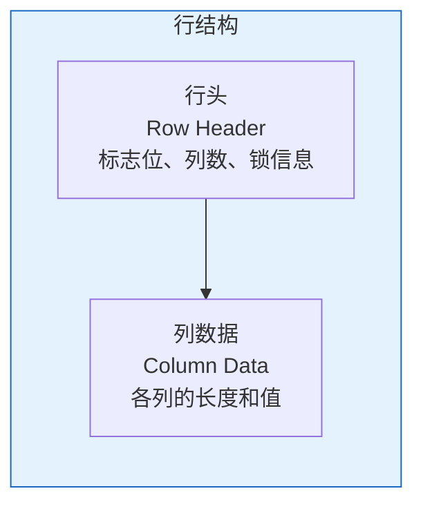
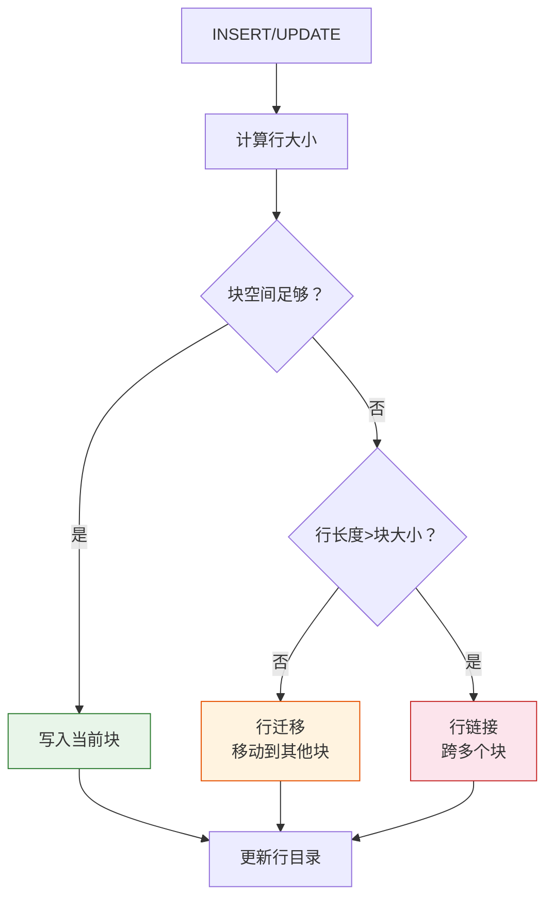

# Oracle行格式与存储机制

## 一、概述

### 1.1 一句话定义

Oracle行格式与存储机制，本质是Oracle数据库中一行数据在块内的物理存储格式和组织方式。
它在Oracle存储管理中出现和使用，理解行格式对性能优化和数据恢复至关重要。

### 1.2 为什么重要

- **不掌握的后果：** 无法深入理解存储机制，难以诊断存储相关问题
- **掌握的价值：** 优化行存储，提高查询和DML性能

### 1.3 适用场景

| 场景 | 说明 |
|------|------|
| 性能优化 | 优化行存储格式 |
| 存储管理 | 减少存储空间 |
| 数据恢复 | 理解行物理结构 |
| 问题诊断 | 诊断行迁移/链接 |

### 1.4 版本演进

| 版本 | 变化说明 |
|------|---------|
| 11gR2 | 高级行压缩（OLTP） |
| 12cR1 | 增强压缩算法 |
| 19c | 压缩增强 |
| 21c | JSON行存储优化 |

## 二、术语与概念

### 2.1 核心术语表

| 术语 | 含义 | 类比 |
|------|------|------|
| 行头 | 行的元数据（标志位、列数等） | 行标签 |
| 行数据 | 实际存储的列值 | 行内容 |
| ROWID | 行的物理地址 | 行地址 |
| 行压缩 | 减少行存储空间的技术 | 压缩打包 |
| NULL存储 | NULL值的特殊存储方式 | 空标记 |

### 2.2 行结构组成



## 三、核心原理

### 3.1 行头结构

行头（Row Header）包含以下信息：

| 字段 | 大小 | 说明 |
|------|------|------|
| 标志位 | 1字节 | 行类型标志 |
| 锁标志 | 1字节 | 事务锁信息 |
| 列数 | 1-3字节 | 行的列数 |
| 行链接标志 | 1字节 | 行链接/迁移标志 |

**标志位含义：**
- 0x00：普通行
- 0x20：行链接（第一块）
- 0x40：行链接（中间块）
- 0x80：行链接（最后一块）
- 0xC0：行迁移（指针行）

### 3.2 列数据存储

每列的存储格式：

```
[列长度][列数据]
```

**列长度编码：**
- 0-250字节：1字节长度
- 251-65535字节：3字节长度
- NULL：特殊标志0xFF

**示例：一行数据**

```sql
-- 表结构
CREATE TABLE test (
    id NUMBER,
    name VARCHAR2(20),
    salary NUMBER(8,2)
);

-- 插入数据
INSERT INTO test VALUES (1, 'Alice', 10000.50);

-- 行存储格式（简化）
-- 行头: [flag][lock][col_count]
-- 列1: [len=1][value=1]
-- 列2: [len=5][value='Alice']
-- 列3: [len=5][value=10000.50]
```

### 3.3 ROWID结构

ROWID是Oracle行的物理地址，格式如下：

```
格式：OOOOOOFFFBBBBBBRRR

OOOOOO  - 数据对象号（6位）
FFF     - 相对文件号（3位）
BBBBBB  - 块号（6位）
RRR     - 行号（3位）
```

```sql
-- 查看ROWID
SELECT rowid, id, name FROM test;

-- ROWID示例：AAAVmHAAEAAAAZzAAA
-- AAAVmH = 数据对象号（十进制：22343）
-- AAE = 文件号（十进制：4）
-- AAAAAZz = 块号（十进制：1675）
-- AAA = 行号（十进制：0）

-- 使用ROWID快速访问
SELECT * FROM test WHERE rowid = 'AAAVmHAAEAAAAZzAAA';

-- 解析ROWID
SELECT 
    DBMS_ROWID.ROWID_OBJECT(rowid) AS object_id,
    DBMS_ROWID.ROWID_RELATIVE_FNO(rowid) AS file_no,
    DBMS_ROWID.ROWID_BLOCK_NUMBER(rowid) AS block_no,
    DBMS_ROWID.ROWID_ROW_NUMBER(rowid) AS row_no
FROM test;
```

### 3.4 NULL值存储

Oracle对NULL值有特殊优化：

- 尾部连续NULL列不存储
- 中间NULL列存储0xFF标志
- 减少存储空间

```sql
-- 示例：表有10列，最后3列为NULL
-- 只存储前7列，节省空间

CREATE TABLE test_null (
    c1 VARCHAR2(10),
    c2 VARCHAR2(10),
    c3 VARCHAR2(10),
    c4 VARCHAR2(10),  -- NULL
    c5 VARCHAR2(10)   -- NULL
);

INSERT INTO test_null VALUES ('A', 'B', 'C', NULL, NULL);
-- 只存储c1, c2, c3
```

### 3.5 行长度限制

```sql
-- 单行最大长度
-- 限制：不能跨块（除非行链接）
-- 理论最大：块大小 - 块头开销

-- 查看行长度
SELECT AVG_ROW_LEN FROM dba_tables WHERE table_name = 'TEST';

-- 计算行长度
SELECT SUM(
    CASE 
        WHEN data_type = 'NUMBER' THEN 22
        WHEN data_type IN ('VARCHAR2', 'CHAR') THEN data_length
        WHEN data_type = 'DATE' THEN 7
        ELSE data_length
    END
) AS estimated_row_len
FROM user_tab_columns
WHERE table_name = 'TEST';
```

### 3.6 行压缩

Oracle提供多种行压缩技术：

#### 基本压缩（Basic Compression）

```sql
-- 创建压缩表
CREATE TABLE test_compress (
    id NUMBER,
    name VARCHAR2(100),
    data VARCHAR2(1000)
)
COMPRESS BASIC;

-- 压缩现有表
ALTER TABLE test_compress MOVE COMPRESS BASIC;

-- 特点：
-- - 只压缩INSERT
-- - 不压缩UPDATE
-- - 无CPU开销
```

#### OLTP压缩（Advanced Compression）

```sql
-- 需要Advanced Compression选项
CREATE TABLE test_oltp (
    id NUMBER,
    name VARCHAR2(100),
    data VARCHAR2(1000)
)
COMPRESS FOR OLTP;

-- 特点：
-- - 压缩INSERT和UPDATE
-- - 轻微CPU开销
-- - 适合OLTP系统
```

#### 仓库压缩（Warehouse Compression）

```sql
-- 适合数据仓库
CREATE TABLE test_wh (
    id NUMBER,
    name VARCHAR2(100)
)
COMPRESS FOR QUERY;  -- 查询优化
-- 或
COMPRESS FOR ARCHIVE;  -- 归档优化
```

**压缩效果对比：**

| 压缩类型 | 压缩比 | CPU开销 | 适用场景 |
|---------|--------|---------|---------|
| 无压缩 | 1x | 无 | 默认 |
| BASIC | 2-4x | 无 | 批量加载 |
| OLTP | 2-3x | 低 | OLTP |
| QUERY | 3-5x | 中 | 数据仓库 |
| ARCHIVE | 5-10x | 中 | 归档 |

## 四、架构与组件

### 4.1 行存储流程



### 4.2 行格式转储

```sql
-- 转储行数据
-- 先获取ROWID
SELECT rowid FROM test WHERE id = 1;

-- 解析ROWID获取块信息
SELECT 
    DBMS_ROWID.ROWID_RELATIVE_FNO('AAAVmHAAEAAAAZzAAA') AS file_no,
    DBMS_ROWID.ROWID_BLOCK_NUMBER('AAAVmHAAEAAAAZzAAA') AS block_no
FROM dual;

-- 转储块
ALTER SYSTEM DUMP DATAFILE 4 BLOCK 1675;

-- 查看转储文件
-- 位置：trace目录
```

## 五、配置与参数

### 5.1 行相关参数

```sql
-- 查看行相关参数
SHOW PARAMETER db_block_size;

-- 配置压缩
ALTER TABLE test COMPRESS FOR OLTP;

-- 查看压缩信息
SELECT table_name, compression, compress_for
FROM dba_tables
WHERE compression = 'ENABLED';
```

### 5.2 行迁移配置

```sql
-- 减少行迁移
ALTER TABLE test PCTFREE 20;  -- 预留空间

-- 监控行迁移
ANALYZE TABLE test LIST CHAINED ROWS;
SELECT COUNT(*) FROM chained_rows;
```

## 六、监控与诊断

### 6.1 行统计信息

```sql
-- 查看表行统计
SELECT num_rows, avg_row_len, blocks, empty_blocks
FROM dba_tables
WHERE table_name = 'TEST';

-- 查看行迁移统计
SELECT name, value FROM v$sysstat
WHERE name LIKE '%row%' OR name LIKE '%chained%';

-- 行链接统计
SELECT name, value FROM v$sysstat
WHERE name = 'table fetch continued row';
```

### 6.2 压缩效果监控

```sql
-- 查看压缩效果
SELECT segment_name, bytes/1024/1024 AS size_mb,
       blocks, extents
FROM dba_segments
WHERE segment_name = 'TEST';

-- 对比压缩前后
-- 压缩前：100MB
-- 压缩后：30MB
-- 压缩比：3.3x
```

## 七、实战案例

### 7.1 案例背景

- **场景**：大表存储空间优化
- **时间**：2026年
- **现象**：表占用空间过大

### 7.2 优化过程

**步骤1：分析现状**

```sql
SELECT bytes/1024/1024/1024 AS size_gb,
       num_rows, avg_row_len
FROM dba_tables
WHERE table_name = 'LARGE_TABLE';

-- 结果：50GB，1000万行，平均行长5KB
```

**步骤2：启用压缩**

```sql
-- 启用OLTP压缩
ALTER TABLE large_table MOVE COMPRESS FOR OLTP ONLINE;

-- 重建索引
ALTER INDEX idx_large REBUILD ONLINE;
```

**步骤3：验证效果**

```sql
SELECT bytes/1024/1024/1024 AS size_gb
FROM dba_segments
WHERE segment_name = 'LARGE_TABLE';

-- 结果：15GB（压缩比3.3x）
```

### 7.3 优化结果

| 指标 | 优化前 | 优化后 | 提升 |
|------|--------|--------|------|
| 存储空间 | 50GB | 15GB | 70% |
| 查询性能 | 基准 | +10% | I/O减少 |
| DML性能 | 基准 | -5% | 轻微开销 |

### 7.4 复盘总结

- **根因：** 大量重复数据未压缩
- **教训：** 读多写少的表适合压缩

## 八、常见错误与排查

### 8.1 常见错误

| 错误 | 问题 | 解决方法 |
|------|------|---------|
| 行过长 | 超过块大小 | 使用行链接或增大块 |
| 压缩失败 | 不支持的数据类型 | 检查压缩兼容性 |
| 行迁移严重 | PCTFREE过小 | 增大PCTFREE |

## 九、最佳实践

### 9.1 官方推荐

- 默认块大小8KB
- 频繁UPDATE的表PCTFREE 20-30
- 读多写少的表启用压缩
- 定期分析行迁移

### 9.2 社区经验

- 使用ROWID快速访问
- 监控行长度变化
- 压缩前测试性能影响

### 9.3 反模式

| 反模式 | 问题 | 正确做法 |
|--------|------|---------|
| PCTFREE=0 | 行迁移严重 | 预留空间 |
| 不监控行长度 | 性能问题未发现 | 定期分析 |
| 盲目压缩 | DML性能下降 | 评估读写比例 |

## 十、命令与视图汇总

### 10.1 命令列表

| 命令 | 适用场景 | 说明 |
|------|---------|------|
| `ALTER TABLE MOVE` | 重建表 | 消除行迁移 |
| `ALTER TABLE COMPRESS` | 启用压缩 | 减少存储空间 |
| `DBMS_ROWID` | 解析ROWID | 获取行位置 |

### 10.2 视图列表

| 视图名 | 类型 | 用途 |
|--------|------|------|
| DBA_TABLES | 数据字典 | 表统计信息 |
| V$SYSSTAT | 动态 | 行统计 |
| CHAINED_ROWS | 用户表 | 行迁移信息 |

## 十一、总结速查

### 11.1 黄金法则

1. **理解行格式** - 优化存储基础
2. **合理使用压缩** - 减少存储空间
3. **监控行迁移** - 保证查询性能

### 11.2 一页纸检查清单

| 检查项 | 说明 |
|--------|------|
| 行长度 | 不超过块大小 |
| PCTFREE | 预留足够空间 |
| 压缩策略 | 读多写少启用压缩 |
| 行迁移 | 定期分析清理 |

## 附录

### A. 官方参考

- [Oracle Database Concepts - Row Format](https://docs.oracle.com/en/database/oracle/oracle-database/19c/cncpt/data-blocks.html)
- [Oracle Database Administrator's Guide - Compression](https://docs.oracle.com/en/database/oracle/oracle-database/19c/admin/)

### B. 修订记录

| 日期 | 版本 | 修改内容 | 修改人 |
|------|------|---------|--------|
| 2026-07-02 | v1.0 | 初始版本 | YashanDB知识库生成器 |
