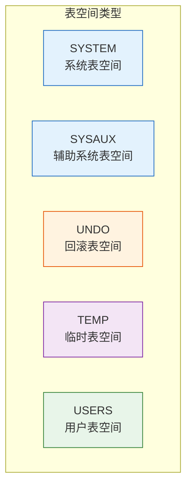

# Oracle表空间管理

## 一、概述

### 1.1 一句话定义

Oracle表空间管理，本质是Oracle数据库中逻辑存储单元的组织和管理方式，用于将数据文件组织成逻辑组。
它在Oracle存储管理中出现和使用，解决数据的逻辑组织、权限控制和空间管理问题。

### 1.2 为什么重要

- **不掌握的后果：** 无法有效管理数据库存储，影响性能和可维护性
- **掌握的价值：** 合理组织数据存储，优化空间使用

### 1.3 适用场景

| 场景 | 说明 |
|------|------|
| 数据库设计 | 规划表空间布局 |
| 空间管理 | 扩展和回收空间 |
| 权限控制 | 按表空间分配配额 |
| 性能优化 | 分离I/O热点 |

### 1.4 版本演进

| 版本 | 变化说明 |
|------|---------|
| 11gR2 | 大文件表空间增强 |
| 12cR1 | 多租户表空间隔离 |
| 12cR2 | 在线表空间移动 |
| 19c | 表空间加密增强 |

## 二、术语与概念

### 2.1 核心术语表

| 术语 | 含义 | 类比 |
|------|------|------|
| 表空间 | 逻辑存储单元 | 仓库区域 |
| 数据文件 | 表空间的物理文件 | 仓库货架 |
| 段（Segment） | 表或索引的存储空间 | 货物 |
| 区（Extent） | 连续的块集合 | 集装箱 |
| 块（Block） | 最小I/O单位 | 箱子 |

### 2.2 表空间类型



## 三、核心原理

### 3.1 系统表空间（SYSTEM）

存储数据字典和系统对象。

```sql
-- 查看SYSTEM表空间
SELECT tablespace_name, status, contents
FROM dba_tablespaces
WHERE tablespace_name = 'SYSTEM';

-- 查看SYSTEM表空间的数据文件
SELECT file_name, bytes/1024/1024 AS size_mb
FROM dba_data_files
WHERE tablespace_name = 'SYSTEM';

-- 注意：不要将用户对象存储在SYSTEM表空间
```

### 3.2 SYSAUX表空间

存储Oracle组件数据（AWR、ADDM等）。

```sql
-- 查看SYSAUX组件占用
SELECT occupant_name, occupant_desc, 
       space_usage_kbytes/1024 AS size_mb
FROM v$sysaux_occupants
ORDER BY space_usage_kbytes DESC;

-- 清理SYSAUX空间
-- 清理AWR数据
EXEC DBMS_WORKLOAD_REPOSITORY.DROP_SNAPSHOT_RANGE(
    low_snap_id => 1, 
    high_snap_id => 1000
);
```

### 3.3 UNDO表空间

存储事务的回滚信息。

```sql
-- 查看当前UNDO表空间
SHOW PARAMETER undo_tablespace;

-- 查看UNDO表空间信息
SELECT tablespace_name, status, contents
FROM dba_tablespaces
WHERE contents = 'UNDO';

-- 查看UNDO使用情况
SELECT tablespace_name, 
       ROUND(SUM(bytes)/1024/1024, 2) AS size_mb
FROM dba_undo_extents
GROUP BY tablespace_name;

-- 创建UNDO表空间
CREATE UNDO TABLESPACE undo2
    DATAFILE '/u01/oradata/undo2_01.dbf' SIZE 2G AUTOEXTEND ON;

-- 切换UNDO表空间
ALTER SYSTEM SET undo_tablespace = undo2;
```

### 3.4 临时表空间（TEMP）

存储排序、哈希等临时数据。

```sql
-- 查看临时表空间
SELECT tablespace_name, status, contents
FROM dba_tablespaces
WHERE contents = 'TEMPORARY';

-- 查看临时文件
SELECT file_name, tablespace_name, bytes/1024/1024 AS size_mb
FROM dba_temp_files;

-- 创建临时表空间
CREATE TEMPORARY TABLESPACE temp2
    TEMPFILE '/u01/oradata/temp2_01.dbf' SIZE 2G AUTOEXTEND ON;

-- 设置默认临时表空间
ALTER DATABASE DEFAULT TEMPORARY TABLESPACE temp2;

-- 临时表空间组（10g+）
CREATE TEMPORARY TABLESPACE temp_group
    TEMPFILE '/u01/oradata/temp_group_01.dbf' SIZE 1G
    TABLESPACE GROUP temp_grp;

ALTER TABLESPACE temp2 TABLESPACE GROUP temp_grp;
ALTER DATABASE DEFAULT TEMPORARY TABLESPACE temp_grp;
```

### 3.5 用户表空间

存储用户数据。

```sql
-- 创建表空间
CREATE TABLESPACE users_data
    DATAFILE '/u01/oradata/users_data01.dbf' 
    SIZE 1G AUTOEXTEND ON NEXT 100M MAXSIZE 10G
    EXTENT MANAGEMENT LOCAL
    SEGMENT SPACE MANAGEMENT AUTO;

-- 创建用户并指定表空间
CREATE USER app_user IDENTIFIED BY password
    DEFAULT TABLESPACE users_data
    TEMPORARY TABLESPACE temp
    QUOTA 100M ON users_data;

-- 查看表空间使用率
SELECT tablespace_name,
       ROUND(total_mb, 2) AS total_mb,
       ROUND(used_mb, 2) AS used_mb,
       ROUND(free_mb, 2) AS free_mb,
       ROUND(used_mb/total_mb*100, 2) AS used_pct
FROM (
    SELECT tablespace_name,
           SUM(bytes)/1024/1024 AS total_mb
    FROM dba_data_files
    GROUP BY tablespace_name
) t
LEFT JOIN (
    SELECT tablespace_name,
           SUM(bytes)/1024/1024 AS free_mb
    FROM dba_free_space
    GROUP BY tablespace_name
) f USING (tablespace_name)
LEFT JOIN (
    SELECT tablespace_name,
           SUM(bytes)/1024/1024 AS used_mb
    FROM dba_segments
    GROUP BY tablespace_name
) s USING (tablespace_name)
ORDER BY used_pct DESC NULLS LAST;
```

### 3.6 大文件表空间（Bigfile Tablespace）

只包含一个大数据文件的表空间。

```sql
-- 创建大文件表空间
CREATE BIGFILE TABLESPACE big_ts
    DATAFILE '/u01/oradata/big_ts01.dbf' 
    SIZE 10G AUTOEXTEND ON MAXSIZE 100G;

-- 查看大文件表空间
SELECT tablespace_name, bigfile
FROM dba_tablespaces
WHERE bigfile = 'YES';

-- 大文件表空间特点：
-- - 只能有一个数据文件
-- - 最大32TB（8KB块）
-- - 简化管理
-- - 不适合频繁扩展/收缩
```

## 四、架构与组件

### 4.1 表空间管理命令

```sql
-- 添加数据文件
ALTER TABLESPACE users_data 
    ADD DATAFILE '/u01/oradata/users_data02.dbf' 
    SIZE 1G AUTOEXTEND ON NEXT 100M;

-- 调整数据文件大小
ALTER DATABASE DATAFILE '/u01/oradata/users_data01.dbf' RESIZE 2G;

-- 启用/禁用自动扩展
ALTER DATABASE DATAFILE '/u01/oradata/users_data01.dbf' AUTOEXTEND OFF;
ALTER DATABASE DATAFILE '/u01/oradata/users_data01.dbf' AUTOEXTEND ON NEXT 100M MAXSIZE 10G;

-- 删除数据文件（空文件）
ALTER TABLESPACE users_data DROP DATAFILE '/u01/oradata/users_data02.dbf';

-- 重命名数据文件（离线方式）
ALTER TABLESPACE users_data OFFLINE;
-- OS命令移动文件
ALTER DATABASE RENAME FILE '/old/users_data01.dbf' TO '/new/users_data01.dbf';
ALTER TABLESPACE users_data ONLINE;

-- 重命名数据文件（在线方式，12cR2+）
ALTER DATABASE MOVE DATAFILE '/old/users_data01.dbf' TO '/new/users_data01.dbf';

-- 删除表空间
DROP TABLESPACE users_data INCLUDING CONTENTS AND DATAFILES;
```

### 4.2 表空间配额管理

```sql
-- 查看用户配额
SELECT username, tablespace_name, 
       bytes/1024/1024 AS used_mb,
       max_bytes/1024/1024 AS max_mb
FROM dba_ts_quotas;

-- 设置配额
ALTER USER app_user QUOTA 500M ON users_data;
ALTER USER app_user QUOTA UNLIMITED ON users_data;

-- 撤销配额
ALTER USER app_user QUOTA 0 ON users_data;
```

## 五、配置与参数

### 5.1 表空间相关参数

```sql
-- 查看表空间相关参数
SHOW PARAMETER db_create_file_dest;        -- OMF位置
SHOW PARAMETER db_recovery_file_dest;      -- 快速恢复区
SHOW PARAMETER undo_tablespace;            -- UNDO表空间
SHOW PARAMETER temporary_tablespace;       -- 临时表空间

-- 配置默认表空间
ALTER DATABASE DEFAULT TABLESPACE users_data;
ALTER DATABASE DEFAULT TEMPORARY TABLESPACE temp;
```

### 5.2 表空间加密

```sql
-- 创建加密表空间（需要Oracle Wallet）
CREATE ENCRYPTED TABLESPACE secure_ts
    DATAFILE '/u01/oradata/secure_ts01.dbf' SIZE 1G
    ENCRYPTION USING 'AES256' DEFAULT STORAGE(ENCRYPT);

-- 查看加密表空间
SELECT tablespace_name, encrypted
FROM dba_tablespaces
WHERE encrypted = 'YES';
```

## 六、监控与诊断

### 6.1 表空间监控

```sql
-- 查看表空间状态
SELECT tablespace_name, status, contents, extent_management
FROM dba_tablespaces;

-- 查看表空间I/O
SELECT tablespace_name,
       SUM(phyrds) AS reads,
       SUM(phywrts) AS writes
FROM v$filestat fs
JOIN dba_data_files df ON fs.file# = df.file_id
GROUP BY tablespace_name
ORDER BY reads + writes DESC;

-- 查看表空间碎片
SELECT tablespace_name,
       COUNT(*) AS free_extents,
       SUM(bytes)/1024/1024 AS free_mb,
       MAX(bytes)/1024/1024 AS max_extent_mb
FROM dba_free_space
GROUP BY tablespace_name
ORDER BY free_extents DESC;
```

### 6.2 空间告警

```sql
-- 设置表空间告警阈值
EXEC DBMS_SERVER_ALERT.SET_THRESHOLD(
    metrics_id => DBMS_SERVER_ALERT.TABLESPACE_PCT_FULL,
    warning_operator => DBMS_SERVER_ALERT.OPERATOR_GE,
    warning_value => '85',
    critical_operator => DBMS_SERVER_ALERT.OPERATOR_GE,
    critical_value => '95',
    observation_period => 1,
    consecutive_occurrences => 1,
    instance_name => NULL,
    object_type => DBMS_SERVER_ALERT.OBJECT_TYPE_TABLESPACE,
    object_name => 'USERS_DATA'
);
```

## 七、实战案例

### 7.1 案例背景

- **场景**：表空间空间不足
- **时间**：2026年
- **现象**：INSERT报错ORA-01653

### 7.2 处理过程

**步骤1：诊断问题**

```sql
-- 查看表空间使用率
SELECT tablespace_name,
       ROUND(used_mb/total_mb*100, 2) AS used_pct
FROM (
    SELECT tablespace_name,
           SUM(bytes)/1024/1024 AS total_mb
    FROM dba_data_files
    GROUP BY tablespace_name
) t
JOIN (
    SELECT tablespace_name,
           SUM(bytes)/1024/1024 AS used_mb
    FROM dba_segments
    GROUP BY tablespace_name
) s USING (tablespace_name)
WHERE tablespace_name = 'USERS_DATA';

-- 结果：98%使用率
```

**步骤2：扩展空间**

```sql
-- 方法1：添加数据文件
ALTER TABLESPACE users_data
    ADD DATAFILE '/u01/oradata/users_data02.dbf'
    SIZE 2G AUTOEXTEND ON NEXT 500M MAXSIZE 10G;

-- 方法2：扩展现有文件
ALTER DATABASE DATAFILE '/u01/oradata/users_data01.dbf'
    RESIZE 5G;

-- 方法3：启用自动扩展
ALTER DATABASE DATAFILE '/u01/oradata/users_data01.dbf'
    AUTOEXTEND ON NEXT 500M MAXSIZE 10G;
```

**步骤3：回收空间**

```sql
-- 查找大对象
SELECT segment_name, segment_type, bytes/1024/1024 AS size_mb
FROM dba_segments
WHERE tablespace_name = 'USERS_DATA'
ORDER BY bytes DESC
FETCH FIRST 10 ROWS ONLY;

-- 收缩表空间（12cR2+）
ALTER TABLESPACE users_data SHRINK SPACE;
```

### 7.3 处理结果

| 指标 | 处理前 | 处理后 |
|------|--------|--------|
| 使用率 | 98% | 65% |
| 可用空间 | 100MB | 3GB |

### 7.4 复盘总结

- **根因：** 表空间空间不足
- **教训：** 设置空间告警阈值，定期监控

## 八、常见错误与排查

### 8.1 常见错误列表

| 错误代码 | 错误信息 | 原因 | 解决方法 |
|---------|---------|------|---------|
| ORA-01653 | unable to extend table | 表空间空间不足 | 扩展表空间 |
| ORA-01654 | unable to extend index | 索引表空间不足 | 扩展表空间 |
| ORA-01652 | unable to extend temp segment | 临时表空间不足 | 扩展临时表空间 |
| ORA-01536 | space quota exceeded | 用户配额超限 | 增加配额 |

## 九、最佳实践

### 9.1 官方推荐

- 分离数据和索引到不同表空间
- 使用OMF简化文件管理
- 设置空间告警阈值
- 定期监控表空间使用率

### 9.2 社区经验

- 大表使用大文件表空间
- 临时表空间使用表空间组
- 加密敏感数据表空间

### 9.3 反模式

| 反模式 | 问题 | 正确做法 |
|--------|------|---------|
| 所有对象一个表空间 | 管理困难 | 按用途分离 |
| 不监控空间 | 空间满导致停机 | 设置告警 |
| 不回收空间 | 空间浪费 | 定期清理 |

## 十、命令与视图汇总

### 10.1 命令列表

| 命令 | 适用场景 | 说明 |
|------|---------|------|
| `CREATE TABLESPACE` | 创建表空间 | 定义逻辑存储 |
| `ALTER TABLESPACE` | 修改表空间 | 添加文件、离线等 |
| `DROP TABLESPACE` | 删除表空间 | 删除表空间和数据文件 |

### 10.2 视图列表

| 视图名 | 类型 | 用途 |
|--------|------|------|
| DBA_TABLESPACES | 数据字典 | 表空间信息 |
| DBA_DATA_FILES | 数据字典 | 数据文件信息 |
| DBA_FREE_SPACE | 数据字典 | 空闲空间 |
| DBA_SEGMENTS | 数据字典 | 段信息 |

## 十一、总结速查

### 11.1 黄金法则

1. **分离表空间** - 按用途分离数据和索引
2. **监控空间** - 设置告警阈值
3. **定期回收** - 清理无用对象

### 11.2 一页纸检查清单

| 检查项 | 说明 |
|--------|------|
| 表空间分离 | 数据、索引、临时分离 |
| 空间监控 | 设置85%告警 |
| 自动扩展 | 启用自动扩展 |
| 配额管理 | 合理设置用户配额 |

## 附录

### A. 官方参考

- [Oracle Database Administrator's Guide - Managing Tablespaces](https://docs.oracle.com/en/database/oracle/oracle-database/19c/admin/)
- [Oracle Database Concepts - Tablespaces](https://docs.oracle.com/en/database/oracle/oracle-database/19c/cncpt/tablespaces.html)

### B. 修订记录

| 日期 | 版本 | 修改内容 | 修改人 |
|------|------|---------|--------|
| 2026-07-02 | v1.0 | 初始版本 | YashanDB知识库生成器 |
