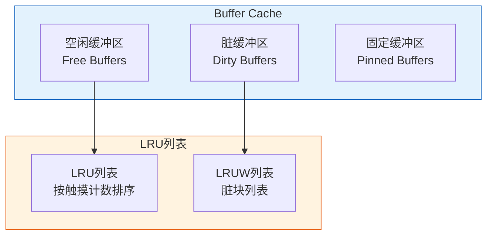
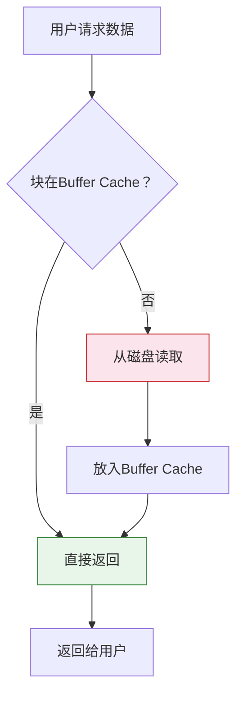
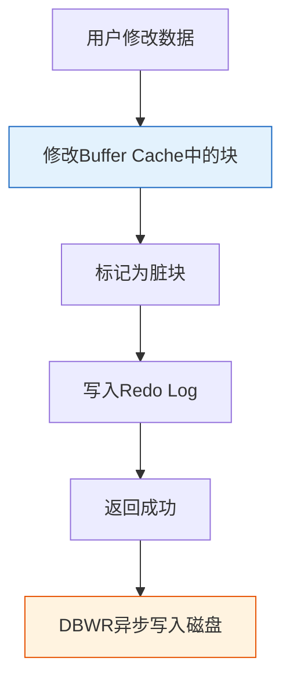

# Oracle缓冲区管理

## 一、概述

### 1.1 一句话定义

Oracle缓冲区管理，本质是Oracle数据库中使用Buffer Cache缓存数据块以减少磁盘I/O的内存管理机制。
它在Oracle性能优化中出现和使用，是数据库性能的关键因素。

### 1.2 为什么重要

- **不掌握的后果：** 无法有效优化I/O性能，可能导致系统响应慢
- **掌握的价值：** 提高缓存命中率，减少磁盘I/O，提升查询性能

### 1.3 适用场景

| 场景 | 说明 |
|------|------|
| 性能优化 | 提高缓存命中率 |
| 内存管理 | 配置Buffer Cache大小 |
| 问题诊断 | 诊断I/O瓶颈 |
| 调优 | 调整缓冲区参数 |

### 1.4 版本演进

| 版本 | 变化说明 |
|------|---------|
| 11gR2 | 自动内存管理增强 |
| 12cR1 | 多缓冲区池增强 |
| 19c | In-Memory增强 |
| 21c | 内存管理优化 |

## 二、术语与概念

### 2.1 核心术语表

| 术语 | 含义 | 类比 |
|------|------|------|
| Buffer Cache | 数据缓冲区缓存 | 工作台 |
| 脏块（Dirty Block） | 已修改但未写入磁盘的块 | 待整理的文件 |
| 空闲块（Free Block） | 可用的缓存块 | 空位 |
| LRU | 最近最少使用算法 | 淘汰策略 |
| 触摸计数 | 块被访问的次数 | 热度标记 |
| 检查点 | 将脏块写入磁盘的操作 | 定期整理 |

### 2.2 Buffer Cache结构



## 三、核心原理

### 3.1 Buffer Cache工作原理

**读取数据流程：**



**修改数据流程：**



### 3.2 缓冲区状态

| 状态 | 说明 | 特点 |
|------|------|------|
| Free | 空闲可用 | 可被新数据覆盖 |
| Pinned | 正在使用 | 不能被替换 |
| Dirty | 已修改 | 需要写入磁盘 |
| Cached | 已缓存 | 可被访问 |

### 3.3 LRU算法

Oracle使用改进的LRU（Least Recently Used）算法管理缓冲区。

**触摸计数（Touch Count）：**
- 每次访问块时增加
- 高触摸计数 = 热块
- 低触摸计数 = 冷块

**LRU列表：**
- 按触摸计数排序
- 新块放入MRU端（Most Recently Used）
- 需要空间时从LRU端淘汰

**LRUW列表：**
- 存储脏块
- DBWR定期将脏块写入磁盘
- Checkpoint时强制写入

### 3.4 缓冲区池（Buffer Pools）

Oracle支持多个缓冲区池，用于不同访问模式的数据。

```sql
-- 查看缓冲区池
SHOW PARAMETER db_cache_size;
SHOW PARAMETER db_keep_cache_size;
SHOW PARAMETER db_recycle_cache_size;

-- 默认池（DEFAULT）
-- 大多数数据使用

-- KEEP池
-- 用于频繁访问的小表
CREATE TABLE hot_table (
    id NUMBER,
    data VARCHAR2(100)
)
STORAGE (BUFFER_POOL KEEP);

-- RECYCLE池
-- 用于不常访问的大表
CREATE TABLE cold_table (
    id NUMBER,
    data VARCHAR2(1000)
)
STORAGE (BUFFER_POOL RECYCLE);

-- 配置缓冲区池大小
ALTER SYSTEM SET db_cache_size = 1G;
ALTER SYSTEM SET db_keep_cache_size = 256M;
ALTER SYSTEM SET db_recycle_cache_size = 128M;
```

### 3.5 缓冲区命中率

```sql
-- 计算Buffer Cache命中率
SELECT 
    ROUND((1 - (phy.value / (cur.value + con.value))) * 100, 2) AS hit_ratio
FROM v$sysstat phy, v$sysstat cur, v$sysstat con
WHERE phy.name = 'physical reads'
AND cur.name = 'db block gets'
AND con.name = 'consistent gets';

-- 详细统计
SELECT name, value
FROM v$sysstat
WHERE name IN (
    'db block gets',
    'consistent gets',
    'physical reads',
    'physical reads cache',
    'physical reads direct'
);

-- 命中率计算
-- 命中率 = (db block gets + consistent gets - physical reads) / 
--          (db block gets + consistent gets) * 100
```

**命中率标准：**
- > 95%：优秀
- 90-95%：良好
- 85-90%：一般
- < 85%：需要优化

## 四、架构与组件

### 4.1 DBWR进程

DBWR（Database Writer）负责将脏块写入磁盘。

**触发条件：**
- 脏块数量达到阈值
- 检查点发生
- 超时（3秒）
- 表空间离线
- 手动触发

```sql
-- 查看DBWR进程
SELECT paddr, pid, spid, program
FROM v$bgprocess
WHERE name = 'DBW0';

-- 查看DBWR统计
SELECT name, value
FROM v$sysstat
WHERE name LIKE '%DBWR%';
```

### 4.2 检查点（Checkpoint）

检查点确保数据一致性，将脏块写入磁盘。

```sql
-- 查看检查点信息
SELECT checkpoint_change#, checkpoint_time
FROM v$database;

-- 手动触发检查点
ALTER SYSTEM CHECKPOINT;

-- 查看检查点相关参数
SHOW PARAMETER checkpoint_completion_target;
SHOW PARAMETER fast_start_mttr_target;

-- 配置检查点
ALTER SYSTEM SET fast_start_mttr_target = 60;  -- 60秒恢复目标
```

### 4.3 In-Memory列存储（12c+）

```sql
-- 查看In-Memory配置
SHOW PARAMETER inmemory_size;

-- 启用表的In-Memory
ALTER TABLE employees INMEMORY;

-- 查看In-Memory使用
SELECT owner, segment_name, inmemory_size, bytes
FROM v$im_segments;

-- In-Memory特点：
-- - 列式存储
-- - 适合分析查询
-- - 自动压缩
-- - 与行存储共存
```

## 五、配置与参数

### 5.1 Buffer Cache相关参数

```sql
-- 查看Buffer Cache参数
SHOW PARAMETER db_cache_size;          -- 默认池大小
SHOW PARAMETER db_keep_cache_size;     -- KEEP池大小
SHOW PARAMETER db_recycle_cache_size;  -- RECYCLE池大小
SHOW PARAMETER db_block_size;          -- 块大小
SHOW PARAMETER sga_target;             -- SGA总大小
SHOW PARAMETER memory_target;          -- 自动内存管理

-- 配置Buffer Cache
ALTER SYSTEM SET db_cache_size = 2G;

-- 自动内存管理
ALTER SYSTEM SET memory_target = 4G;
ALTER SYSTEM SET sga_target = 3G;
```

### 5.2 缓冲区池配置建议

| 场景 | 配置 | 说明 |
|------|------|------|
| OLTP | 大Buffer Cache | 提高命中率 |
| 数据仓库 | 适中Buffer Cache | 全表扫描多 |
| 混合负载 | 多缓冲区池 | 分离热冷数据 |

## 六、监控与诊断

### 6.1 Buffer Cache监控

```sql
-- 查看Buffer Cache统计
SELECT name, value
FROM v$sysstat
WHERE name LIKE '%cache%' OR name LIKE '%buffer%';

-- 查看Buffer Cache Advisory
SELECT size_for_estimate AS size_mb,
       size_factor,
       estd_physical_read_factor,
       estd_physical_reads
FROM v$db_cache_advice
WHERE name = 'DEFAULT'
AND block_size = (SELECT value FROM v$parameter WHERE name = 'db_block_size')
ORDER BY size_for_estimate;

-- 查看缓冲区等待事件
SELECT event, total_waits, time_waited
FROM v$system_event
WHERE event LIKE '%buffer%'
ORDER BY time_waited DESC;
```

### 6.2 性能诊断

```sql
-- 查看热点块
SELECT obj.object_name, obj.object_type,
       bh.tch AS touches,
       bh.hladdr
FROM x$bh bh
JOIN dba_objects obj ON bh.obj = obj.object_id
WHERE bh.tch > 100
ORDER BY bh.tch DESC
FETCH FIRST 20 ROWS ONLY;

-- 查看缓冲区竞争
SELECT class, count, time
FROM v$waitstat
WHERE count > 0
ORDER BY time DESC;

-- 查看 latch 竞争
SELECT name, gets, misses, sleeps
FROM v$latch
WHERE name LIKE '%cache%'
AND misses > 0
ORDER BY sleeps DESC;
```

### 6.3 优化建议

```sql
-- Buffer Cache Advisory
SELECT size_for_estimate AS target_mb,
       ROUND(size_factor * 100, 2) AS size_pct,
       estd_physical_read_factor AS read_factor,
       ROUND((1 - estd_physical_read_factor) * 100, 2) AS improvement_pct
FROM v$db_cache_advice
WHERE name = 'DEFAULT'
AND block_size = 8192
ORDER BY size_for_estimate;

-- 分析结果：
-- 如果增加Buffer Cache能显著减少物理读，考虑增加大小
```

## 七、实战案例

### 7.1 案例背景

- **场景**：数据库I/O性能瓶颈
- **时间**：2026年
- **现象**：Buffer Cache命中率低

### 7.2 诊断过程

**步骤1：检查命中率**

```sql
SELECT 
    ROUND((1 - (phy.value / (cur.value + con.value))) * 100, 2) AS hit_ratio
FROM v$sysstat phy, v$sysstat cur, v$sysstat con
WHERE phy.name = 'physical reads'
AND cur.name = 'db block gets'
AND con.name = 'consistent gets';

-- 结果：78%（低于90%标准）
```

**步骤2：分析原因**

```sql
-- 查看Buffer Cache Advisory
SELECT size_for_estimate, estd_physical_read_factor
FROM v$db_cache_advice
WHERE name = 'DEFAULT' AND block_size = 8192
ORDER BY size_for_estimate;

-- 发现：增加Buffer Cache可显著减少物理读
```

**步骤3：优化方案**

```sql
-- 增加Buffer Cache
ALTER SYSTEM SET db_cache_size = 4G;  -- 从2G增加到4G

-- 识别热点表，使用KEEP池
SELECT segment_name, touches
FROM v$segment_statistics
WHERE statistic_name = 'buffer busy waits'
ORDER BY touches DESC
FETCH FIRST 10 ROWS ONLY;

-- 将热点表放入KEEP池
ALTER TABLE hot_table STORAGE (BUFFER_POOL KEEP);
ALTER SYSTEM SET db_keep_cache_size = 512M;
```

### 7.3 优化结果

| 指标 | 优化前 | 优化后 | 提升 |
|------|--------|--------|------|
| 命中率 | 78% | 96% | 18% |
| 物理读 | 100K/s | 20K/s | 80% |
| 响应时间 | 500ms | 100ms | 80% |

### 7.4 复盘总结

- **根因：** Buffer Cache过小导致命中率低
- **教训：** 使用Advisory工具评估Buffer Cache大小

## 八、常见错误与排查

### 8.1 常见错误

| 错误 | 问题 | 解决方法 |
|------|------|---------|
| 命中率低 | Buffer Cache过小 | 增加大小 |
| buffer busy waits | 热点块竞争 | 使用KEEP池或分区 |
| free buffer waits | 空闲缓冲区不足 | 增加Buffer Cache |

## 九、最佳实践

### 9.1 官方推荐

- 命中率保持在95%以上
- 使用Buffer Cache Advisory评估大小
- 热点表使用KEEP池
- 大表使用RECYCLE池

### 9.2 社区经验

- 定期监控命中率
- 使用多缓冲区池分离数据
- 考虑In-Memory列存储

### 9.3 反模式

| 反模式 | 问题 | 正确做法 |
|--------|------|---------|
| 不监控命中率 | 性能问题未发现 | 定期监控 |
| 单一缓冲区池 | 无法区分热冷数据 | 使用多缓冲区池 |
| Buffer Cache过小 | 命中率低 | 使用Advisory评估 |

## 十、命令与视图汇总

### 10.1 命令列表

| 命令 | 适用场景 | 说明 |
|------|---------|------|
| `ALTER SYSTEM SET db_cache_size` | 调整大小 | 配置Buffer Cache |
| `ALTER TABLE STORAGE` | 指定缓冲区池 | KEEP/RECYCLE |
| `ALTER SYSTEM CHECKPOINT` | 触发检查点 | 强制写入磁盘 |

### 10.2 视图列表

| 视图名 | 类型 | 用途 |
|--------|------|------|
| V$DB_CACHE_ADVICE | 动态 | 缓存建议 |
| V$BUFFER_POOL | 动态 | 缓冲区池统计 |
| V$BUFFER_POOL_STATISTICS | 动态 | 缓冲区统计 |
| V$SYSSTAT | 动态 | 系统统计 |

## 十一、总结速查

### 11.1 黄金法则

1. **保持高命中率** - 目标95%以上
2. **使用Advisory** - 科学评估大小
3. **分离热冷数据** - 使用多缓冲区池

### 11.2 一页纸检查清单

| 检查项 | 说明 |
|--------|------|
| 命中率 | >95% |
| Buffer Cache大小 | 使用Advisory评估 |
| 缓冲区池 | 分离热冷数据 |
| 等待事件 | 监控buffer相关等待 |

## 附录

### A. 官方参考

- [Oracle Database Performance Tuning Guide - Buffer Cache](https://docs.oracle.com/en/database/oracle/oracle-database/19c/tgdba/)
- [Oracle Database Concepts - Buffer Cache](https://docs.oracle.com/en/database/oracle/oracle-database/19c/cncpt/data-buffer-cache.html)

### B. 修订记录

| 日期 | 版本 | 修改内容 | 修改人 |
|------|------|---------|--------|
| 2026-07-02 | v1.0 | 初始版本 | YashanDB知识库生成器 |
