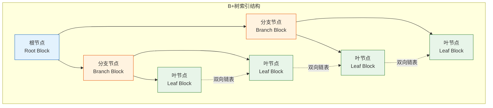

# Oracle B+树索引原理与实现

## 一、概述

### 1.1 一句话定义

Oracle B+树索引，本质是Oracle数据库中最常用的索引类型，使用平衡多叉树结构实现高效的等值和范围查询。
它在Oracle查询优化中出现和使用，是提升查询性能的核心技术。

### 1.2 为什么重要

- **不掌握的后果：** 无法有效优化查询性能，可能导致全表扫描
- **掌握的价值：** 设计和维护高效索引，显著提升查询速度

### 1.3 适用场景

| 场景 | 说明 |
|------|------|
| 等值查询 | WHERE col = value |
| 范围查询 | WHERE col BETWEEN a AND b |
| 排序 | ORDER BY col |
| 连接 | JOIN条件列 |

### 1.4 版本演进

| 版本 | 变化说明 |
|------|---------|
| 11gR2 | 索引可见性控制 |
| 12cR1 | 在线索引重建增强 |
| 12cR2 | 自动索引（Autonomous） |
| 19c | 自动索引GA |
| 21c | 索引优化增强 |

## 二、术语与概念

### 2.1 核心术语表

| 术语 | 含义 | 类比 |
|------|------|------|
| B+树 | 平衡多叉树结构 | 字典目录 |
| 根节点 | 树的顶层节点 | 书的封面 |
| 分支节点 | 中间层节点 | 章节索引 |
| 叶节点 | 最底层节点，包含ROWID | 具体页码 |
| 索引键 | 索引列的值 | 查找关键字 |
| ROWID | 指向数据行的指针 | 页码 |

### 2.2 B+树结构



**B+树特点：**
- 所有数据都在叶节点
- 叶节点通过双向链表连接
- 平衡树，所有叶节点在同一层
- 适合范围查询

## 三、核心原理

### 3.1 索引创建

```sql
-- 创建B+树索引（默认）
CREATE INDEX idx_emp_dept ON employees(dept_id);

-- 唯一索引
CREATE UNIQUE INDEX idx_emp_id ON employees(emp_id);

-- 复合索引
CREATE INDEX idx_emp_dept_job ON employees(dept_id, job_id);

-- 降序索引
CREATE INDEX idx_emp_salary_desc ON employees(salary DESC);

-- 在线创建（不阻塞DML）
CREATE INDEX idx_emp_name ON employees(name) ONLINE;

-- 指定表空间
CREATE INDEX idx_emp_hire ON employees(hire_date) TABLESPACE idx_ts;

-- 指定存储参数
CREATE INDEX idx_emp_mgr ON employees(manager_id)
    PCTFREE 10
    TABLESPACE idx_ts
    COMPUTE STATISTICS;
```

### 3.2 索引存储结构

**索引块结构：**
- 块头（Block Header）
- 索引条目（Index Entries）
  - 索引键值
  - ROWID
  - 锁信息

```sql
-- 查看索引结构
SELECT index_name, blevel, leaf_blocks, distinct_keys, 
       avg_leaf_blocks_per_key, avg_data_blocks_per_key
FROM dba_indexes
WHERE index_name = 'IDX_EMP_DEPT';

-- 查看索引详细信息
SELECT * FROM index_stats;  -- 需要先分析索引

-- 分析索引
ANALYZE INDEX idx_emp_dept COMPUTE STATISTICS;

-- 查看索引统计
SELECT name, value FROM v$sysstat WHERE name LIKE '%index%';
```

### 3.3 索引扫描方式

#### 索引唯一扫描（INDEX UNIQUE SCAN）

```sql
-- 唯一索引等值查询
SELECT * FROM employees WHERE emp_id = 100;

-- 执行计划：INDEX UNIQUE SCAN
-- 特点：精确定位，最快
```

#### 索引范围扫描（INDEX RANGE SCAN）

```sql
-- 范围查询
SELECT * FROM employees WHERE dept_id BETWEEN 10 AND 20;

-- 执行计划：INDEX RANGE SCAN
-- 特点：扫描一定范围的叶节点
```

#### 索引全扫描（INDEX FULL SCAN）

```sql
-- 需要索引所有数据，按索引顺序
SELECT dept_id FROM employees ORDER BY dept_id;

-- 执行计划：INDEX FULL SCAN
-- 特点：扫描所有叶节点，按顺序返回
```

#### 索引快速全扫描（INDEX FAST FULL SCAN）

```sql
-- 不需要顺序，只需要索引数据
SELECT COUNT(*) FROM employees WHERE dept_id IS NOT NULL;

-- 执行计划：INDEX FAST FULL SCAN
-- 特点：多块读取，类似全表扫描，但不访问表
```

#### 索引跳跃扫描（INDEX SKIP SCAN）

```sql
-- 复合索引，查询条件不包含前导列
-- 索引：(dept_id, job_id)
-- 查询：WHERE job_id = 'IT_PROG'

SELECT * FROM employees WHERE job_id = 'IT_PROG';

-- 执行计划：INDEX SKIP SCAN
-- 特点：跳过前导列，扫描多个范围
```

### 3.4 索引选择性

索引选择性 = 不同值的数量 / 总行数

```sql
-- 计算索引选择性
SELECT index_name, distinct_keys, num_rows,
       ROUND(distinct_keys / num_rows * 100, 2) AS selectivity_pct
FROM dba_indexes
WHERE table_name = 'EMPLOYEES';

-- 选择性标准：
-- > 30%：优秀，适合建索引
-- 10-30%：良好
-- 1-10%：一般
-- < 1%：差，可能不适合建索引
```

### 3.5 索引键压缩

```sql
-- 创建压缩索引
CREATE INDEX idx_emp_dept_job ON employees(dept_id, job_id) COMPRESS 1;

-- COMPRESS 1：压缩前导列（dept_id）
-- 适合：前导列重复值多

-- 查看压缩效果
SELECT index_name, leaf_blocks, distinct_keys
FROM dba_indexes
WHERE index_name = 'IDX_EMP_DEPT_JOB';
```

## 四、架构与组件

### 4.1 索引维护

```sql
-- 重建索引
ALTER INDEX idx_emp_dept REBUILD;

-- 在线重建
ALTER INDEX idx_emp_dept REBUILD ONLINE;

-- 合并碎片
ALTER INDEX idx_emp_dept COALESCE;

-- 查看索引碎片
SELECT index_name, blevel, leaf_blocks, 
       ROUND((leaf_blocks - distinct_keys/leaf_blocks) / leaf_blocks * 100, 2) AS fragmentation_pct
FROM dba_indexes
WHERE table_name = 'EMPLOYEES';

-- 删除索引
DROP INDEX idx_emp_dept;

-- 不可见索引（12c+）
ALTER INDEX idx_emp_dept INVISIBLE;
ALTER INDEX idx_emp_dept VISIBLE;
```

### 4.2 索引与DML

**DML对索引的影响：**
- INSERT：插入索引条目
- UPDATE：如果更新索引列，需要更新索引
- DELETE：删除索引条目

```sql
-- 监控索引维护开销
SELECT name, value FROM v$sysstat
WHERE name IN ('leaf node splits', 'branch node splits', 'leaf node flushes');

-- 高维护开销的索引：
-- - 频繁更新的列
-- - 高基数列
-- - 宽索引（多列）
```

## 五、配置与参数

### 5.1 索引相关参数

```sql
-- 查看索引相关参数
SHOW PARAMETER db_index_compression;

-- 配置自动索引（19c+）
ALTER SYSTEM SET auto_index_mode = 'IMPLEMENT';  -- 自动创建索引
```

### 5.2 索引存储参数

```sql
-- 创建索引时指定存储参数
CREATE INDEX idx_test ON test(id)
    PCTFREE 10        -- 预留空间
    INITRANS 2        -- 初始事务槽
    MAXTRANS 255      -- 最大事务槽
    TABLESPACE idx_ts -- 表空间
    STORAGE (
        INITIAL 64K
        NEXT 64K
        MINEXTENTS 1
        MAXEXTENTS UNLIMITED
    );
```

## 六、监控与诊断

### 6.1 索引使用监控

```sql
-- 监控索引使用情况
ALTER INDEX idx_emp_dept MONITORING USAGE;

-- 查看使用情况
SELECT * FROM v$object_usage WHERE index_name = 'IDX_EMP_DEPT';

-- 停止监控
ALTER INDEX idx_emp_dept NOMONITORING USAGE;

-- 查看未使用的索引
SELECT table_name, index_name, monitoring, used
FROM v$object_usage
WHERE used = 'NO';
```

### 6.2 索引性能分析

```sql
-- 查看索引扫描统计
SELECT name, value FROM v$sysstat
WHERE name LIKE '%index%'
ORDER BY value DESC;

-- 查看索引等待事件
SELECT event, total_waits, time_waited
FROM v$system_event
WHERE event LIKE '%index%'
ORDER BY time_waited DESC;

-- 执行计划分析
EXPLAIN PLAN FOR
SELECT * FROM employees WHERE dept_id = 10;

SELECT * FROM TABLE(DBMS_XPLAN.DISPLAY);
-- 关注：INDEX UNIQUE SCAN / INDEX RANGE SCAN
```

### 6.3 索引健康检查

```sql
-- 分析索引结构
ANALYZE INDEX idx_emp_dept VALIDATE STRUCTURE;

-- 查看索引统计
SELECT height, blocks, lf_rows, del_lf_rows,
       ROUND(del_lf_rows / lf_rows * 100, 2) AS deleted_pct
FROM index_stats;

-- 如果deleted_pct > 20%，考虑重建索引
```

## 七、实战案例

### 7.1 案例背景

- **场景**：查询性能优化
- **时间**：2026年
- **现象**：全表扫描导致查询慢

### 7.2 优化过程

**步骤1：分析执行计划**

```sql
EXPLAIN PLAN FOR
SELECT * FROM employees WHERE dept_id = 10 AND hire_date > DATE '2020-01-01';

SELECT * FROM TABLE(DBMS_XPLAN.DISPLAY);
-- 发现：TABLE ACCESS FULL
```

**步骤2：创建索引**

```sql
-- 创建复合索引
CREATE INDEX idx_emp_dept_hire ON employees(dept_id, hire_date);

-- 重新分析
EXPLAIN PLAN FOR
SELECT * FROM employees WHERE dept_id = 10 AND hire_date > DATE '2020-01-01';

SELECT * FROM TABLE(DBMS_XPLAN.DISPLAY);
-- 现在：INDEX RANGE SCAN
```

**步骤3：验证效果**

```sql
-- 对比执行时间
SET TIMING ON

-- 优化前：2.5秒
-- 优化后：0.05秒
```

### 7.3 优化结果

| 指标 | 优化前 | 优化后 | 提升 |
|------|--------|--------|------|
| 执行时间 | 2.5秒 | 0.05秒 | 50倍 |
| 逻辑读 | 15000 | 20 | 750倍 |
| 访问方式 | 全表扫描 | 索引范围扫描 | - |

### 7.4 复盘总结

- **根因：** 缺少合适索引导致全表扫描
- **教训：** 根据查询条件设计复合索引

## 八、常见错误与排查

### 8.1 常见错误

| 错误 | 问题 | 解决方法 |
|------|------|---------|
| 索引未被使用 | 选择性差或查询不匹配 | 检查索引设计和查询条件 |
| 索引碎片严重 | 频繁DML | 重建或合并索引 |
| 索引维护开销大 | 频繁更新索引列 | 考虑函数索引或延迟维护 |

## 九、最佳实践

### 9.1 官方推荐

- 主键和唯一约束自动创建索引
- 外键列创建索引
- 高选择性列创建索引
- 定期监控索引使用情况

### 9.2 社区经验

- 复合索引遵循最左前缀原则
- 频繁更新的列谨慎建索引
- 使用在线创建避免阻塞

### 9.3 反模式

| 反模式 | 问题 | 正确做法 |
|--------|------|---------|
| 过度索引 | DML性能差 | 只建必要索引 |
| 低选择性索引 | 不被使用 | 检查选择性 |
| 不监控使用 | 无用索引浪费空间 | 定期清理 |

## 十、命令与视图汇总

### 10.1 命令列表

| 命令 | 适用场景 | 说明 |
|------|---------|------|
| `CREATE INDEX` | 创建索引 | 定义索引结构 |
| `ALTER INDEX REBUILD` | 重建索引 | 消除碎片 |
| `ALTER INDEX COALESCE` | 合并碎片 | 轻量维护 |
| `DROP INDEX` | 删除索引 | 移除索引 |

### 10.2 视图列表

| 视图名 | 类型 | 用途 |
|--------|------|------|
| DBA_INDEXES | 数据字典 | 索引信息 |
| DBA_IND_COLUMNS | 数据字典 | 索引列 |
| V$OBJECT_USAGE | 动态 | 索引使用监控 |
| INDEX_STATS | 统计 | 索引结构分析 |

## 十一、总结速查

### 11.1 黄金法则

1. **高选择性建索引** - 提高查询效率
2. **外键必须建索引** - 提高连接性能
3. **定期监控使用** - 清理无用索引

### 11.2 一页纸检查清单

| 检查项 | 说明 |
|--------|------|
| 索引选择性 | >30%优秀 |
| 索引使用率 | 监控并清理未使用索引 |
| 索引碎片 | deleted_pct < 20% |
| 复合索引顺序 | 高选择性列在前 |

## 附录

### A. 官方参考

- [Oracle Database Concepts - Indexes](https://docs.oracle.com/en/database/oracle/oracle-database/19c/cncpt/indexes.html)
- [Oracle Database Performance Tuning Guide - Indexes](https://docs.oracle.com/en/database/oracle/oracle-database/19c/tgdba/)

### B. 修订记录

| 日期 | 版本 | 修改内容 | 修改人 |
|------|------|---------|--------|
| 2026-07-02 | v1.0 | 初始版本 | YashanDB知识库生成器 |
