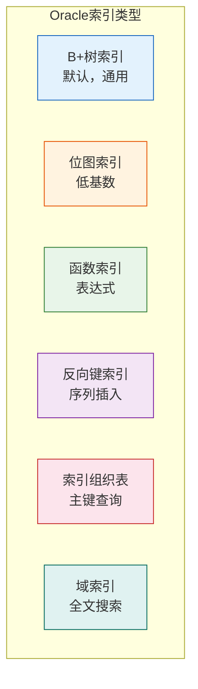
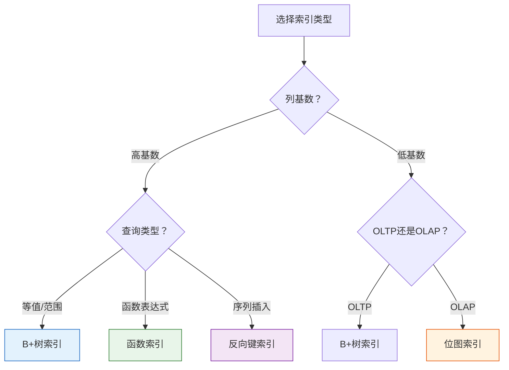

# Oracle其他索引类型详解

## 一、概述

### 1.1 一句话定义

Oracle其他索引类型，本质是除B+树索引外的特殊索引类型，针对特定场景优化查询性能。
它在Oracle查询优化中出现和使用，解决B+树索引无法高效处理的特殊查询需求。

### 1.2 为什么重要

- **不掌握的后果：** 无法充分利用Oracle索引特性，可能错过性能优化机会
- **掌握的价值：** 针对特定场景选择合适索引类型，显著提升性能

### 1.3 适用场景

| 场景 | 推荐索引类型 |
|------|-------------|
| 低基数列（如性别、状态） | 位图索引 |
| 函数表达式查询 | 函数索引 |
| 序列值频繁插入 | 反向键索引 |
| 主键查询为主 | 索引组织表 |
| 全文搜索 | 域索引（Oracle Text） |

### 1.4 版本演进

| 版本 | 变化说明 |
|------|---------|
| 11gR2 | 虚拟列索引增强 |
| 12cR1 | 在线索引操作增强 |
| 19c | 自动索引支持更多类型 |
| 21c | JSON索引增强 |

## 二、术语与概念

### 2.1 核心术语表

| 术语 | 含义 | 适用场景 |
|------|------|---------|
| 位图索引 | 使用位图存储索引数据 | 低基数列 |
| 函数索引 | 基于函数或表达式 | 函数查询 |
| 反向键索引 | 反转索引键值 | 序列插入 |
| IOT | 索引组织表 | 主键查询 |
| 域索引 | 特定应用索引 | 全文搜索 |

### 2.2 索引类型对比



## 三、核心原理

### 3.1 位图索引（Bitmap Index）

位图索引使用位图存储索引数据，适合低基数列。

```sql
-- 创建位图索引
CREATE BITMAP INDEX idx_emp_gender ON employees(gender);
CREATE BITMAP INDEX idx_emp_status ON employees(status);

-- 位图索引特点：
-- - 适合低基数列（<100个不同值）
-- - 适合OLAP，不适合OLTP
-- - 支持AND/OR/NOT位图运算
-- - 并发DML性能差（锁整个位图段）

-- 位图连接索引（物化视图替代）
CREATE BITMAP INDEX idx_sales_cust_region
ON sales(customers.region)
FROM sales, customers
WHERE sales.cust_id = customers.cust_id;
```

**位图索引结构：**
```
gender列：
M: 1 0 1 1 0 1 0 0 1 1
F: 0 1 0 0 1 0 1 1 0 0
```

**使用场景：**
- 数据仓库
- 报表查询
- 多列组合查询

**不适用场景：**
- OLTP系统（并发DML）
- 高基数列
- 频繁更新的列

### 3.2 函数索引（Function-Based Index）

函数索引基于函数或表达式创建。

```sql
-- 创建函数索引
CREATE INDEX idx_emp_upper_name ON employees(UPPER(name));

-- 查询使用函数索引
SELECT * FROM employees WHERE UPPER(name) = 'ALICE';

-- 日期函数索引
CREATE INDEX idx_emp_hire_year ON employees(EXTRACT(YEAR FROM hire_date));

-- 查询
SELECT * FROM employees WHERE EXTRACT(YEAR FROM hire_date) = 2020;

-- 表达式索引
CREATE INDEX idx_emp_annual_salary ON employees(salary * 12);

-- 确定性函数索引
CREATE INDEX idx_emp_json_type ON employees(JSON_TYPE(data));

-- 虚拟列 + 索引（11g+推荐）
ALTER TABLE employees ADD (upper_name GENERATED ALWAYS AS (UPPER(name)) VIRTUAL);
CREATE INDEX idx_emp_upper_name2 ON employees(upper_name);
```

**函数索引要求：**
- 函数必须是DETERMINISTIC
- 不能使用PL/SQL函数（除非标记为DETERMINISTIC）
- 需要QUERY_REWRITE_ENABLED参数

### 3.3 反向键索引（Reverse Key Index）

反向键索引反转索引键的字节顺序。

```sql
-- 创建反向键索引
CREATE INDEX idx_emp_id_reverse ON employees(emp_id) REVERSE;

-- 反向键索引特点：
-- - 将键值反转：1234 -> 4321
-- - 分散插入到索引块
-- - 减少右侧热点
-- - 不支持范围扫描

-- 适用场景：
-- - 序列值频繁插入
-- - RAC环境减少块竞争
-- - 不需要范围查询

-- 不适用场景：
-- - 范围查询
-- - 排序操作
```

**原理：**
```
原始键：00001234
反转后：43210000

插入分布更均匀，减少右侧叶节点热点
```

### 3.4 索引组织表（Index-Organized Table, IOT）

IOT将数据存储在索引结构中。

```sql
-- 创建IOT
CREATE TABLE employees_iot (
    emp_id NUMBER PRIMARY KEY,
    name VARCHAR2(100),
    salary NUMBER(10,2),
    dept_id NUMBER
)
ORGANIZATION INDEX
INCLUDING name
PCTTHRESHOLD 20
OVERFLOW TABLESPACE users;

-- IOT特点：
-- - 数据存储在B+树叶节点
-- - 主键查询极快
-- - 不需要ROWID访问
-- - 适合主键查询场景

-- 溢出段（Overflow Segment）：
-- - 当行太大时，非主键列存储在溢出段
-- - PCTTHRESHOLD控制叶节点存储比例

-- 查看IOT信息
SELECT table_name, iot_type, iot_name
FROM dba_tables
WHERE iot_type = 'IOT';
```

**适用场景：**
- 主键查询为主
- 代码查找表
- 不需要全表扫描

**不适用场景：**
- 频繁全表扫描
- 需要范围查询非主键列
- 行非常大

### 3.5 域索引（Domain Index）

域索引是为特定应用定制的索引类型。

```sql
-- Oracle Text域索引（全文搜索）
CREATE INDEX idx_doc_content ON documents(content)
INDEXTYPE IS CTXSYS.CONTEXT;

-- 全文搜索查询
SELECT * FROM documents
WHERE CONTAINS(content, 'Oracle AND database') > 0;

-- 空间索引（Oracle Spatial）
CREATE INDEX idx_location ON locations(geom)
INDEXTYPE IS MDSYS.SPATIAL_INDEX;

-- JSON索引（12c+）
CREATE INDEX idx_emp_data_json ON employees
(JSON_DATA(job));

-- 自定义域索引
-- 需要实现ODCI接口
```

## 四、架构与组件

### 4.1 索引类型选择指南



### 4.2 索引类型对比表

| 索引类型 | 适用场景 | 优点 | 缺点 |
|---------|---------|------|------|
| B+树 | 通用 | 支持所有查询 | 高基数最佳 |
| 位图 | 低基数OLAP | 组合查询快 | 并发DML差 |
| 函数 | 表达式查询 | 避免运行时计算 | 维护成本高 |
| 反向键 | 序列插入 | 减少热点 | 不支持范围 |
| IOT | 主键查询 | 查询极快 | 不适合全表扫描 |
| 域索引 | 特殊应用 | 定制优化 | 需要额外组件 |

## 五、配置与参数

### 5.1 索引相关参数

```sql
-- 查看索引相关参数
SHOW PARAMETER query_rewrite_enabled;    -- 函数索引重写
SHOW PARAMETER optimizer_index_cost_adj; -- 索引成本调整

-- 配置参数
ALTER SYSTEM SET query_rewrite_enabled = TRUE;
ALTER SYSTEM SET optimizer_index_cost_adj = 50;  -- 更倾向于使用索引
```

### 5.2 创建索引语法

```sql
-- 位图索引
CREATE BITMAP INDEX idx_name ON table(column);

-- 函数索引
CREATE INDEX idx_name ON table(function(column));

-- 反向键索引
CREATE INDEX idx_name ON table(column) REVERSE;

-- IOT
CREATE TABLE table_name (...) ORGANIZATION INDEX;

-- 域索引
CREATE INDEX idx_name ON table(column) INDEXTYPE IS indextype_name;
```

## 六、监控与诊断

### 6.1 索引使用监控

```sql
-- 监控索引使用
ALTER INDEX idx_name MONITORING USAGE;

-- 查看使用情况
SELECT * FROM v$object_usage;

-- 停止监控
ALTER INDEX idx_name NOMONITORING USAGE;

-- 查看位图索引统计
SELECT name, value FROM v$sysstat
WHERE name LIKE '%bitmap%';
```

### 6.2 性能分析

```sql
-- 执行计划分析
EXPLAIN PLAN FOR
SELECT * FROM employees WHERE UPPER(name) = 'ALICE';

SELECT * FROM TABLE(DBMS_XPLAN.DISPLAY);
-- 关注：是否使用了函数索引

-- 位图索引分析
EXPLAIN PLAN FOR
SELECT * FROM employees WHERE gender = 'M' AND status = 'ACTIVE';

SELECT * FROM TABLE(DBMS_XPLAN.DISPLAY);
-- 关注：BITMAP CONVERSION / BITMAP AND
```

## 七、实战案例

### 7.1 案例背景

- **场景**：数据仓库查询优化
- **时间**：2026年
- **现象**：多列组合查询慢

### 7.2 优化过程

**步骤1：分析查询**

```sql
-- 原始查询
SELECT COUNT(*) FROM sales
WHERE region = 'North'
AND product_category = 'Electronics'
AND year = 2025;

-- 执行计划：TABLE ACCESS FULL
```

**步骤2：创建位图索引**

```sql
-- 创建位图索引
CREATE BITMAP INDEX idx_sales_region ON sales(region);
CREATE BITMAP INDEX idx_sales_category ON sales(product_category);
CREATE BITMAP INDEX idx_sales_year ON sales(year);

-- 重新分析
EXPLAIN PLAN FOR
SELECT COUNT(*) FROM sales
WHERE region = 'North'
AND product_category = 'Electronics'
AND year = 2025;

-- 执行计划：BITMAP CONVERSION / BITMAP AND
```

**步骤3：验证效果**

```sql
-- 优化前：15秒
-- 优化后：0.5秒
```

### 7.3 优化结果

| 指标 | 优化前 | 优化后 | 提升 |
|------|--------|--------|------|
| 执行时间 | 15秒 | 0.5秒 | 30倍 |
| 逻辑读 | 500000 | 500 | 1000倍 |
| 访问方式 | 全表扫描 | 位图AND | - |

### 7.4 复盘总结

- **根因：** 多列组合查询缺少合适索引
- **教训：** 数据仓库场景使用位图索引

## 八、常见错误与排查

### 8.1 常见错误

| 错误 | 问题 | 解决方法 |
|------|------|---------|
| 位图索引并发问题 | OLTP系统锁等待 | OLTP使用B+树 |
| 函数索引未使用 | 查询不匹配 | 检查查询条件 |
| 反向键范围查询失败 | 不支持范围 | 使用B+树 |
| IOT全表扫描慢 | 不适合全表扫描 | 使用堆表 |

## 九、最佳实践

### 9.1 官方推荐

- OLTP使用B+树索引
- 数据仓库使用位图索引
- 函数查询使用函数索引或虚拟列
- 序列插入考虑反向键索引

### 9.2 社区经验

- 位图索引不超过5个
- 函数索引使用虚拟列
- IOT适合小表

### 9.3 反模式

| 反模式 | 问题 | 正确做法 |
|--------|------|---------|
| OLTP使用位图 | 并发性能差 | 使用B+树 |
| 高基数位图 | 空间浪费 | 使用B+树 |
| 非确定性函数索引 | 索引失效 | 使用确定性函数 |

## 十、命令与视图汇总

### 10.1 命令列表

| 命令 | 适用场景 | 说明 |
|------|---------|------|
| `CREATE BITMAP INDEX` | 位图索引 | 低基数列 |
| `CREATE INDEX ... ON table(func(col))` | 函数索引 | 表达式查询 |
| `CREATE INDEX ... REVERSE` | 反向键索引 | 序列插入 |
| `CREATE TABLE ... ORGANIZATION INDEX` | IOT | 主键查询 |

### 10.2 视图列表

| 视图名 | 类型 | 用途 |
|--------|------|------|
| DBA_INDEXES | 数据字典 | 索引信息 |
| DBA_INDEXES | 数据字典 | 索引类型 |
| V$OBJECT_USAGE | 动态 | 索引使用 |

## 十一、总结速查

### 11.1 黄金法则

1. **OLTP用B+树** - 并发性能好
2. **OLAP用位图** - 组合查询快
3. **函数查询用函数索引** - 避免运行时计算

### 11.2 一页纸检查清单

| 检查项 | 说明 |
|--------|------|
| 索引类型选择 | 根据场景选择 |
| 位图索引限制 | 不用于OLTP |
| 函数索引匹配 | 查询条件匹配 |
| IOT适用性 | 主键查询为主 |

## 附录

### A. 官方参考

- [Oracle Database Concepts - Index Types](https://docs.oracle.com/en/database/oracle/oracle-database/19c/cncpt/indexes.html)
- [Oracle Database Data Warehousing Guide - Bitmap Indexes](https://docs.oracle.com/en/database/oracle/oracle-database/19c/dwhsg/)

### B. 修订记录

| 日期 | 版本 | 修改内容 | 修改人 |
|------|------|---------|--------|
| 2026-07-02 | v1.0 | 初始版本 | YashanDB知识库生成器 |
