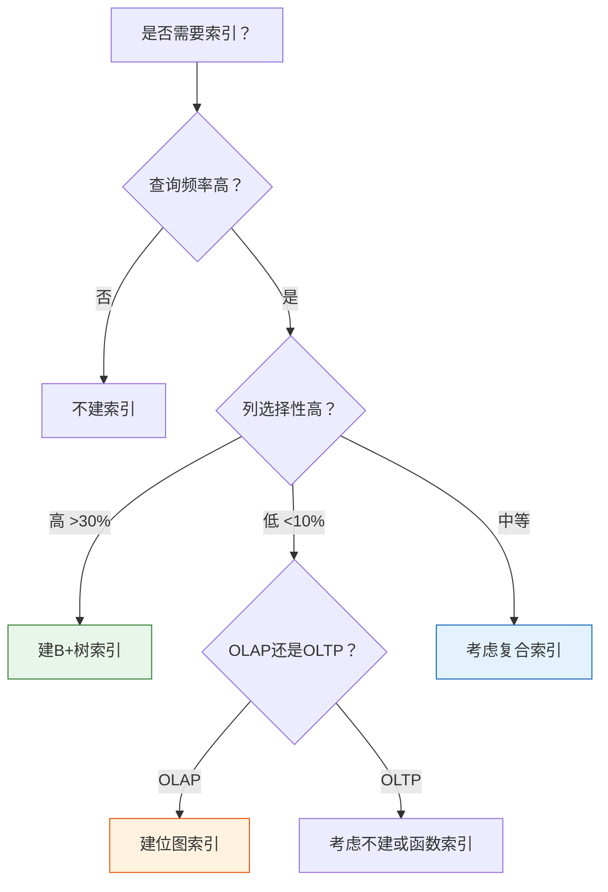
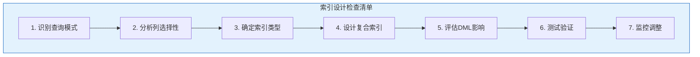

# Oracle索引设计原则

## 一、概述

### 1.1 一句话定义

Oracle索引设计原则，本质是指导如何为数据库表设计合理索引的方法论，平衡查询性能和DML开销。
它在Oracle数据库设计中出现和使用，解决索引创建策略和优化的问题。

### 1.2 为什么重要

- **不掌握的后果：** 索引设计不当导致查询慢或DML性能差
- **掌握的价值：** 设计高效索引，显著提升系统整体性能

### 1.3 适用场景

| 场景 | 说明 |
|------|------|
| 新系统设计 | 规划索引策略 |
| 性能优化 | 添加或调整索引 |
| 索引维护 | 清理无用索引 |
| 架构评审 | 评估索引设计 |

### 1.4 版本演进

| 版本 | 变化说明 |
|------|---------|
| 12cR1 | 自动索引概念引入 |
| 12cR2 | 在线索引操作增强 |
| 19c | 自动索引GA |
| 21c | 索引优化建议增强 |

## 二、术语与概念

### 2.1 核心术语表

| 术语 | 含义 | 类比 |
|------|------|------|
| 索引选择性 | 不同值数量/总行数 | 区分度 |
| 最左前缀 | 复合索引的左侧列 | 字典查找顺序 |
| 索引覆盖 | 查询所需列都在索引中 | 自给自足 |
| 索引膨胀 | 索引占用过多空间 | 过度索引 |

### 2.2 索引设计决策树



## 三、核心原理

### 3.1 何时创建索引

**应该创建索引的场景：**

1. **主键和唯一约束** - 自动创建
2. **外键列** - 提高连接性能
3. **WHERE条件列** - 高选择性列
4. **JOIN条件列** - 连接性能
5. **ORDER BY列** - 避免排序
6. **GROUP BY列** - 分组性能

**不应该创建索引的场景：**

1. **低选择性列** - 如性别、状态（OLTP）
2. **频繁更新的列** - 维护开销大
3. **小表** - 全表扫描更快
4. **很少查询的列** - 浪费空间
5. **大文本列** - CLOB、BLOB

### 3.2 复合索引设计

**最左前缀原则：**

```sql
-- 复合索引：(A, B, C)
-- 可以使用索引的查询：
WHERE A = value                    -- ✓ 使用A
WHERE A = value AND B = value      -- ✓ 使用A,B
WHERE A = value AND B = value AND C = value  -- ✓ 使用A,B,C
WHERE B = value                    -- ✗ 不使用索引
WHERE C = value                    -- ✗ 不使用索引
WHERE B = value AND C = value      -- ✗ 不使用索引
```

**列顺序原则：**

1. **等值查询列在前** - 选择性高的列
2. **范围查询列在后** - 选择性低的列
3. **排序列考虑** - 如果需要排序

```sql
-- 示例：查询条件
WHERE dept_id = 10              -- 等值
AND hire_date > DATE '2020-01-01'  -- 范围
AND salary > 10000              -- 范围

-- 推荐索引
CREATE INDEX idx_emp_dept_hire_sal 
ON employees(dept_id, hire_date, salary);

-- 列顺序：
-- 1. dept_id（等值，高选择性）
-- 2. hire_date（范围）
-- 3. salary（范围）
```

### 3.3 索引覆盖（Index Only Scan）

当查询所需列都在索引中时，不需要访问表。

```sql
-- 表：employees(emp_id, name, salary, dept_id)
-- 索引：idx_emp_dept_salary(dept_id, salary)

-- 索引覆盖查询
SELECT dept_id, salary FROM employees WHERE dept_id = 10;
-- 执行计划：INDEX RANGE SCAN（不访问表）

-- 非索引覆盖查询
SELECT * FROM employees WHERE dept_id = 10;
-- 执行计划：INDEX RANGE SCAN + TABLE ACCESS BY INDEX ROWID
```

**索引覆盖优化：**

```sql
-- 添加包含列到索引
CREATE INDEX idx_emp_covering 
ON employees(dept_id, salary, name);

-- 现在可以覆盖更多查询
SELECT dept_id, salary, name FROM employees WHERE dept_id = 10;
```

### 3.4 索引数量权衡

**索引过多的问题：**
- DML性能下降
- 存储空间增加
- 维护成本增加

**索引过少的问题：**
- 查询性能差
- 全表扫描多

**平衡原则：**
- OLTP系统：每个表3-7个索引
- 数据仓库：可以更多，但需要评估

### 3.5 索引选择性计算

```sql
-- 计算列选择性
SELECT column_name,
       num_distinct,
       num_rows,
       ROUND(num_distinct / num_rows * 100, 2) AS selectivity_pct
FROM dba_tab_columns
WHERE table_name = 'EMPLOYEES'
ORDER BY selectivity_pct DESC;

-- 选择性标准：
-- > 30%：优秀，适合建索引
-- 10-30%：良好
-- 1-10%：一般，考虑复合索引
-- < 1%：差，OLTP不建议建索引
```

## 四、架构与组件

### 4.1 索引设计检查清单



### 4.2 索引设计流程

**步骤1：分析查询模式**

```sql
-- 查看SQL统计
SELECT sql_text, executions, buffer_gets
FROM v$sql
WHERE sql_text LIKE '%employees%'
ORDER BY executions DESC;

-- 识别高频查询
-- 找出WHERE、JOIN、ORDER BY、GROUP BY列
```

**步骤2：评估列选择性**

```sql
-- 计算选择性
SELECT column_name, num_distinct, num_rows,
       ROUND(num_distinct / num_rows * 100, 2) AS selectivity
FROM dba_tab_columns
WHERE table_name = 'EMPLOYEES';
```

**步骤3：设计索引**

```sql
-- 根据查询模式和选择性设计
CREATE INDEX idx_emp_dept ON employees(dept_id);
CREATE INDEX idx_emp_dept_hire ON employees(dept_id, hire_date);
```

**步骤4：测试验证**

```sql
-- 执行计划分析
EXPLAIN PLAN FOR
SELECT * FROM employees WHERE dept_id = 10 AND hire_date > SYSDATE - 365;

SELECT * FROM TABLE(DBMS_XPLAN.DISPLAY);
```

## 五、配置与参数

### 5.1 索引相关参数

```sql
-- 查看索引相关参数
SHOW PARAMETER optimizer_index_cost_adj;  -- 索引成本调整
SHOW PARAMETER optimizer_index_caching;   -- 索引缓存假设

-- 配置参数
ALTER SYSTEM SET optimizer_index_cost_adj = 50;  -- 更倾向于使用索引
ALTER SYSTEM SET optimizer_index_caching = 50;   -- 假设50%索引在缓存
```

### 5.2 自动索引（19c+）

```sql
-- 启用自动索引
ALTER SYSTEM SET auto_index_mode = 'IMPLEMENT';

-- 查看自动索引
SELECT owner, index_name, table_name, auto_index_type
FROM dba_indexes
WHERE auto_index_type != 'MANUAL';

-- 自动索引特点：
-- - 自动识别需要索引的查询
-- - 自动创建和删除索引
-- - 定期评估索引效果
```

## 六、监控与诊断

### 6.1 索引使用监控

```sql
-- 监控索引使用
ALTER INDEX idx_name MONITORING USAGE;

-- 查看使用情况
SELECT index_name, used, start_monitoring, end_monitoring
FROM v$object_usage;

-- 查找未使用的索引
SELECT table_name, index_name, monitoring, used
FROM v$object_usage
WHERE used = 'NO'
AND monitoring = 'YES';

-- 停止监控
ALTER INDEX idx_name NOMONITORING USAGE;
```

### 6.2 索引性能分析

```sql
-- 查看索引扫描统计
SELECT name, value FROM v$sysstat
WHERE name LIKE '%index%'
ORDER BY value DESC;

-- 查看索引等待事件
SELECT event, total_waits, time_waited
FROM v$system_event
WHERE event LIKE '%index%'
ORDER BY time_waited DESC;

-- 分析执行计划
EXPLAIN PLAN FOR
SELECT * FROM employees WHERE dept_id = 10;

SELECT * FROM TABLE(DBMS_XPLAN.DISPLAY);
-- 关注：是否使用了预期的索引
```

### 6.3 索引健康检查

```sql
-- 分析索引碎片
ANALYZE INDEX idx_name VALIDATE STRUCTURE;

SELECT name, height, lf_rows, del_lf_rows,
       ROUND(del_lf_rows / NULLIF(lf_rows, 0) * 100, 2) AS deleted_pct
FROM index_stats;

-- 如果deleted_pct > 20%，考虑重建
ALTER INDEX idx_name REBUILD ONLINE;
```

## 七、实战案例

### 7.1 案例背景

- **场景**：电商系统订单查询优化
- **时间**：2026年
- **现象**：多个查询性能差

### 7.2 优化过程

**步骤1：分析查询模式**

```sql
-- 高频查询1
SELECT * FROM orders WHERE customer_id = 1001 AND status = 'PENDING';

-- 高频查询2
SELECT * FROM orders WHERE order_date BETWEEN SYSDATE - 30 AND SYSDATE;

-- 高频查询3
SELECT customer_id, COUNT(*) FROM orders GROUP BY customer_id;
```

**步骤2：评估列选择性**

```sql
SELECT column_name, num_distinct, num_rows,
       ROUND(num_distinct / num_rows * 100, 2) AS selectivity
FROM dba_tab_columns
WHERE table_name = 'ORDERS';

-- 结果：
-- customer_id: 50000, 1000000, 5.00%
-- status: 5, 1000000, 0.0005%
-- order_date: 3650, 1000000, 0.365%
```

**步骤3：设计索引**

```sql
-- 查询1：customer_id + status
CREATE INDEX idx_orders_cust_status ON orders(customer_id, status);

-- 查询2：order_date范围
CREATE INDEX idx_orders_date ON orders(order_date);

-- 查询3：customer_id分组
-- idx_orders_cust_status已覆盖
```

**步骤4：验证效果**

```sql
-- 查询1优化前：2.5秒，优化后：0.05秒
-- 查询2优化前：3.0秒，优化后：0.1秒
-- 查询3优化前：5.0秒，优化后：0.2秒
```

### 7.3 优化结果

| 查询 | 优化前 | 优化后 | 提升 |
|------|--------|--------|------|
| 查询1 | 2.5秒 | 0.05秒 | 50倍 |
| 查询2 | 3.0秒 | 0.1秒 | 30倍 |
| 查询3 | 5.0秒 | 0.2秒 | 25倍 |

### 7.4 复盘总结

- **根因：** 缺少针对查询模式的索引
- **教训：** 根据实际查询设计索引，考虑复合索引列顺序

## 八、常见错误与排查

### 8.1 常见错误

| 错误 | 问题 | 解决方法 |
|------|------|---------|
| 索引未被使用 | 查询不匹配或选择性差 | 检查查询条件和选择性 |
| 复合索引顺序错误 | 不遵循最左前缀 | 调整列顺序 |
| 过度索引 | DML性能差 | 清理无用索引 |
| 索引碎片严重 | 查询性能下降 | 重建索引 |

## 九、最佳实践

### 9.1 官方推荐

- 主键、外键必须建索引
- 高选择性列建索引
- 复合索引遵循最左前缀
- 定期监控索引使用

### 9.2 社区经验

- 先分析查询模式再设计索引
- 使用自动索引辅助决策
- 索引覆盖减少表访问
- 定期清理无用索引

### 9.3 反模式

| 反模式 | 问题 | 正确做法 |
|--------|------|---------|
| 盲目建索引 | DML性能差 | 分析查询模式 |
| 低选择性建索引 | 不被使用 | 检查选择性 |
| 复合索引顺序随意 | 无法使用 | 遵循最左前缀 |
| 不监控索引使用 | 无用索引浪费 | 定期监控清理 |

## 十、命令与视图汇总

### 10.1 命令列表

| 命令 | 适用场景 | 说明 |
|------|---------|------|
| `CREATE INDEX` | 创建索引 | 定义索引 |
| `ALTER INDEX REBUILD` | 重建索引 | 消除碎片 |
| `DROP INDEX` | 删除索引 | 移除索引 |
| `ANALYZE INDEX` | 分析索引 | 统计信息 |

### 10.2 视图列表

| 视图名 | 类型 | 用途 |
|--------|------|------|
| DBA_INDEXES | 数据字典 | 索引信息 |
| DBA_IND_COLUMNS | 数据字典 | 索引列 |
| DBA_TAB_COLUMNS | 数据字典 | 列选择性 |
| V$OBJECT_USAGE | 动态 | 索引使用监控 |

## 十一、总结速查

### 11.1 黄金法则

1. **分析查询模式** - 根据实际查询设计
2. **高选择性建索引** - 提高查询效率
3. **复合索引最左前缀** - 正确使用索引
4. **定期监控清理** - 避免索引膨胀

### 11.2 一页纸检查清单

| 检查项 | 说明 |
|--------|------|
| 查询模式分析 | 识别高频查询 |
| 列选择性 | >30%优秀 |
| 复合索引顺序 | 等值在前，范围在后 |
| 索引覆盖 | 减少表访问 |
| 使用监控 | 定期清理无用索引 |

## 附录

### A. 官方参考

- [Oracle Database Performance Tuning Guide - Indexes](https://docs.oracle.com/en/database/oracle/oracle-database/19c/tgdba/)
- [Oracle Database Concepts - Index Design](https://docs.oracle.com/en/database/oracle/oracle-database/19c/cncpt/indexes.html)

### B. 修订记录

| 日期 | 版本 | 修改内容 | 修改人 |
|------|------|---------|--------|
| 2026-07-02 | v1.0 | 初始版本 | YashanDB知识库生成器 |
