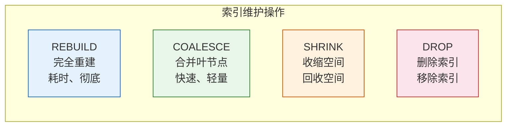

# Oracle索引维护与管理

## 一、概述

### 1.1 一句话定义

Oracle索引维护与管理，本质是确保索引保持高效状态的一系列操作，包括监控、重建、合并和清理。
它在Oracle数据库运维中出现和使用，解决索引性能退化和空间浪费的问题。

### 1.2 为什么重要

- **不掌握的后果：** 索引碎片导致查询性能下降，无用索引浪费空间
- **掌握的价值：** 保持索引高效，优化存储空间

### 1.3 适用场景

| 场景 | 说明 |
|------|------|
| 性能优化 | 消除索引碎片 |
| 空间管理 | 回收索引空间 |
| 日常运维 | 定期维护索引 |
| 问题诊断 | 诊断索引问题 |

### 1.4 版本演进

| 版本 | 变化说明 |
|------|---------|
| 11gR2 | 在线重建增强 |
| 12cR1 | 在线移动增强 |
| 12cR2 | 自动索引 |
| 19c | 自动索引GA |

## 二、术语与概念

### 2.1 核心术语表

| 术语 | 含义 | 类比 |
|------|------|------|
| 索引碎片 | 索引中的空闲空间 | 书架空隙 |
| 重建（REBUILD） | 完全重建索引 | 重新整理书架 |
| 合并（COALESCE） | 合并相邻叶节点 | 压缩空隙 |
| 监控（MONITORING） | 跟踪索引使用 | 记录使用情况 |

### 2.2 维护操作对比



## 三、核心原理

### 3.1 索引碎片产生

**碎片产生原因：**
- DELETE操作：留下空洞
- UPDATE操作：行大小变化
- INSERT操作：页分裂

**碎片影响：**
- 增加I/O操作
- 降低缓存效率
- 增加空间占用

### 3.2 检测索引碎片

```sql
-- 分析索引结构
ANALYZE INDEX idx_emp_dept VALIDATE STRUCTURE;

-- 查看碎片统计
SELECT name, height, blocks, lf_rows, del_lf_rows,
       ROUND(del_lf_rows / NULLIF(lf_rows, 0) * 100, 2) AS deleted_pct,
       ROUND((lf_blocks - br_blocks) * 8 / 1024, 2) AS size_mb
FROM index_stats;

-- 碎片标准：
-- deleted_pct > 20%：建议重建
-- deleted_pct > 30%：必须重建
-- height增加：可能需要重建
```

### 3.3 重建索引（REBUILD）

```sql
-- 基本重建
ALTER INDEX idx_emp_dept REBUILD;

-- 在线重建（不阻塞DML）
ALTER INDEX idx_emp_dept REBUILD ONLINE;

-- 指定表空间
ALTER INDEX idx_emp_dept REBUILD TABLESPACE idx_ts;

-- 指定存储参数
ALTER INDEX idx_emp_dept REBUILD 
    PCTFREE 10 
    INITRANS 2 
    STORAGE (INITIAL 64K NEXT 64K);

-- 并行重建
ALTER INDEX idx_emp_dept REBUILD PARALLEL 4;

-- 重建后取消并行
ALTER INDEX idx_emp_dept NOPARALLEL;
```

**REBUILD特点：**
- 完全重建索引结构
- 消除所有碎片
- 需要额外空间（临时）
- 耗时较长
- 可以改变存储参数

### 3.4 合并索引（COALESCE）

```sql
-- 合并叶节点
ALTER INDEX idx_emp_dept COALESCE;

-- 合并并回收空间
ALTER INDEX idx_emp_dept COALESCE COMPACT;

-- 合并并压缩
ALTER INDEX idx_emp_dept COALESCE COMPACT SORTKEY_RELEASE;
```

**COALESCE特点：**
- 只合并相邻叶节点
- 不重建整个索引
- 速度快，资源消耗少
- 不能改变存储参数
- 适合轻度碎片

### 3.5 REBUILD vs COALESCE

| 特性 | REBUILD | COALESCE |
|------|---------|----------|
| 重建范围 | 整个索引 | 相邻叶节点 |
| 耗时 | 长 | 短 |
| 资源消耗 | 高 | 低 |
| 消除碎片 | 完全 | 部分 |
| 改变参数 | 可以 | 不可以 |
| 需要额外空间 | 是 | 否 |
| 在线操作 | 支持 | 支持 |
| 适用场景 | 重度碎片 | 轻度碎片 |

### 3.6 索引监控

```sql
-- 开始监控
ALTER INDEX idx_emp_dept MONITORING USAGE;

-- 查看使用情况
SELECT index_name, table_name, monitoring, used, 
       start_monitoring, end_monitoring
FROM v$object_usage
WHERE table_name = 'EMPLOYEES';

-- 停止监控
ALTER INDEX idx_emp_dept NOMONITORING USAGE;

-- 查找未使用的索引
SELECT table_name, index_name, monitoring, used
FROM v$object_usage
WHERE used = 'NO'
AND monitoring = 'YES'
AND end_monitoring IS NOT NULL;

-- 批量监控
BEGIN
    FOR rec IN (SELECT index_name FROM dba_indexes WHERE table_name = 'EMPLOYEES') LOOP
        EXECUTE IMMEDIATE 'ALTER INDEX ' || rec.index_name || ' MONITORING USAGE';
    END LOOP;
END;
/
```

### 3.7 删除无用索引

```sql
-- 删除单个索引
DROP INDEX idx_emp_dept;

-- 删除表时自动删除索引
DROP TABLE employees CASCADE CONSTRAINTS;

-- 查找候选删除的索引
SELECT i.table_name, i.index_name, i.distinct_keys, i.num_rows,
       ROUND(i.distinct_keys / NULLIF(i.num_rows, 0) * 100, 2) AS selectivity,
       o.used
FROM dba_indexes i
LEFT JOIN v$object_usage o ON i.index_name = o.index_name
WHERE i.table_owner = 'HR'
AND (o.used = 'NO' OR i.distinct_keys < 10)
ORDER BY i.num_rows DESC;
```

## 四、架构与组件

### 4.1 索引维护计划


### 4.2 自动化维护脚本

```sql
-- 索引维护脚本
-- 1. 检查碎片
BEGIN
    FOR rec IN (SELECT index_name FROM dba_indexes WHERE owner = 'HR') LOOP
        EXECUTE IMMEDIATE 'ANALYZE INDEX ' || rec.index_name || ' VALIDATE STRUCTURE';
        
        INSERT INTO index_stats_log
        SELECT SYSDATE, name, height, lf_rows, del_lf_rows,
               ROUND(del_lf_rows / NULLIF(lf_rows, 0) * 100, 2)
        FROM index_stats;
    END LOOP;
    COMMIT;
END;
/

-- 2. 重建高碎片索引
BEGIN
    FOR rec IN (
        SELECT name, deleted_pct
        FROM index_stats_log
        WHERE check_date = TRUNC(SYSDATE)
        AND deleted_pct > 20
    ) LOOP
        EXECUTE IMMEDIATE 'ALTER INDEX ' || rec.name || ' REBUILD ONLINE';
    END LOOP;
END;
/
```

## 五、配置与参数

### 5.1 索引维护参数

```sql
-- 查看相关参数
SHOW PARAMETER skip_unusable_indexes;  -- 跳过不可用索引
SHOW PARAMETER optimizer_index_cost_adj;

-- 配置参数
ALTER SYSTEM SET skip_unusable_indexes = TRUE;
```

### 5.2 不可用索引

```sql
-- 创建不可用索引
CREATE INDEX idx_test ON test(id) UNUSABLE;

-- 重建不可用索引
ALTER INDEX idx_test REBUILD;

-- 设置跳过不可用索引
ALTER SESSION SET skip_unusable_indexes = TRUE;

-- 查看不可用索引
SELECT owner, index_name, table_name, status
FROM dba_indexes
WHERE status = 'UNUSABLE';
```

## 六、监控与诊断

### 6.1 索引性能监控

```sql
-- 查看索引统计
SELECT name, value FROM v$sysstat
WHERE name LIKE '%index%'
ORDER BY value DESC;

-- 查看索引等待事件
SELECT event, total_waits, time_waited
FROM v$system_event
WHERE event LIKE '%index%'
ORDER BY time_waited DESC;

-- 查看索引I/O
SELECT obj.owner, obj.object_name,
       SUM(stat.value) AS logical_reads
FROM v$segment_statistics stat
JOIN dba_objects obj ON stat.obj# = obj.object_id
WHERE stat.statistic_name = 'logical reads'
AND obj.object_type = 'INDEX'
GROUP BY obj.owner, obj.object_name
ORDER BY logical_reads DESC
FETCH FIRST 20 ROWS ONLY;
```

### 6.2 索引空间监控

```sql
-- 查看索引空间使用
SELECT owner, segment_name, segment_type,
       bytes/1024/1024 AS size_mb,
       extents, blocks
FROM dba_segments
WHERE segment_type LIKE 'INDEX%'
ORDER BY bytes DESC
FETCH FIRST 20 ROWS ONLY;

-- 查看表空间索引空间
SELECT tablespace_name,
       COUNT(*) AS index_count,
       SUM(bytes)/1024/1024 AS total_mb
FROM dba_segments
WHERE segment_type = 'INDEX'
GROUP BY tablespace_name
ORDER BY total_mb DESC;
```

### 6.3 索引健康检查报告

```sql
-- 生成索引健康报告
SELECT i.owner, i.table_name, i.index_name,
       i.index_type, i.distinct_keys, i.num_rows,
       ROUND(i.distinct_keys / NULLIF(i.num_rows, 0) * 100, 2) AS selectivity,
       s.bytes/1024/1024 AS size_mb,
       NVL(u.used, 'UNKNOWN') AS used_status
FROM dba_indexes i
JOIN dba_segments s ON i.owner = s.owner AND i.index_name = s.segment_name
LEFT JOIN v$object_usage u ON i.index_name = u.index_name
WHERE i.owner = 'HR'
ORDER BY s.bytes DESC;
```

## 七、实战案例

### 7.1 案例背景

- **场景**：索引性能下降
- **时间**：2026年
- **现象**：查询性能逐渐变慢

### 7.2 诊断过程

**步骤1：检查索引碎片**

```sql
ANALYZE INDEX idx_orders_date VALIDATE STRUCTURE;

SELECT name, height, lf_rows, del_lf_rows,
       ROUND(del_lf_rows / NULLIF(lf_rows, 0) * 100, 2) AS deleted_pct
FROM index_stats;

-- 结果：deleted_pct = 35%
```

**步骤2：重建索引**

```sql
ALTER INDEX idx_orders_date REBUILD ONLINE;

-- 重新分析
ANALYZE INDEX idx_orders_date VALIDATE STRUCTURE;

SELECT deleted_pct FROM index_stats;
-- 结果：deleted_pct = 2%
```

**步骤3：验证效果**

```sql
-- 查询性能对比
-- 优化前：1.5秒
-- 优化后：0.3秒
```

### 7.3 优化结果

| 指标 | 优化前 | 优化后 | 提升 |
|------|--------|--------|------|
| 碎片率 | 35% | 2% | 94% |
| 查询时间 | 1.5秒 | 0.3秒 | 5倍 |
| 索引大小 | 500MB | 350MB | 30% |

### 7.4 复盘总结

- **根因：** 索引碎片严重导致性能下降
- **教训：** 定期监控和维护索引

## 八、常见错误与排查

### 8.1 常见错误

| 错误 | 问题 | 解决方法 |
|------|------|---------|
| 索引不可用 | 查询失败 | 重建索引 |
| 重建失败 | 空间不足 | 扩展表空间 |
| 监控数据丢失 | 未定期查看 | 定期导出监控数据 |

## 九、最佳实践

### 9.1 官方推荐

- 定期分析索引碎片
- deleted_pct > 20%时重建
- 使用在线重建避免阻塞
- 监控索引使用情况

### 9.2 社区经验

- 建立索引维护计划
- 自动化维护脚本
- 保留监控历史记录

### 9.3 反模式

| 反模式 | 问题 | 正确做法 |
|--------|------|---------|
| 不监控碎片 | 性能逐渐下降 | 定期检查 |
| 频繁重建 | 资源浪费 | 根据碎片率决定 |
| 不监控使用 | 无用索引浪费 | 定期清理 |

## 十、命令与视图汇总

### 10.1 命令列表

| 命令 | 适用场景 | 说明 |
|------|---------|------|
| `ALTER INDEX REBUILD` | 重建索引 | 消除碎片 |
| `ALTER INDEX COALESCE` | 合并索引 | 轻量维护 |
| `ALTER INDEX MONITORING` | 监控使用 | 跟踪使用 |
| `ANALYZE INDEX` | 分析索引 | 统计信息 |
| `DROP INDEX` | 删除索引 | 移除索引 |

### 10.2 视图列表

| 视图名 | 类型 | 用途 |
|--------|------|------|
| DBA_INDEXES | 数据字典 | 索引信息 |
| INDEX_STATS | 统计 | 索引结构 |
| V$OBJECT_USAGE | 动态 | 使用监控 |
| DBA_SEGMENTS | 数据字典 | 空间使用 |

## 十一、总结速查

### 11.1 黄金法则

1. **定期监控碎片** - 及时发现性能问题
2. **deleted_pct > 20%重建** - 保持索引高效
3. **监控索引使用** - 清理无用索引
4. **在线操作** - 避免业务中断

### 11.2 一页纸检查清单

| 检查项 | 说明 |
|--------|------|
| 碎片检查 | 每月分析 |
| 重建阈值 | deleted_pct > 20% |
| 使用监控 | 定期查看 |
| 空间监控 | 防止空间不足 |

## 附录

### A. 官方参考

- [Oracle Database Administrator's Guide - Managing Indexes](https://docs.oracle.com/en/database/oracle/oracle-database/19c/admin/)
- [Oracle Database Performance Tuning Guide - Index Maintenance](https://docs.oracle.com/en/database/oracle/oracle-database/19c/tgdba/)

### B. 修订记录

| 日期 | 版本 | 修改内容 | 修改人 |
|------|------|---------|--------|
| 2026-07-02 | v1.0 | 初始版本 | YashanDB知识库生成器 |
