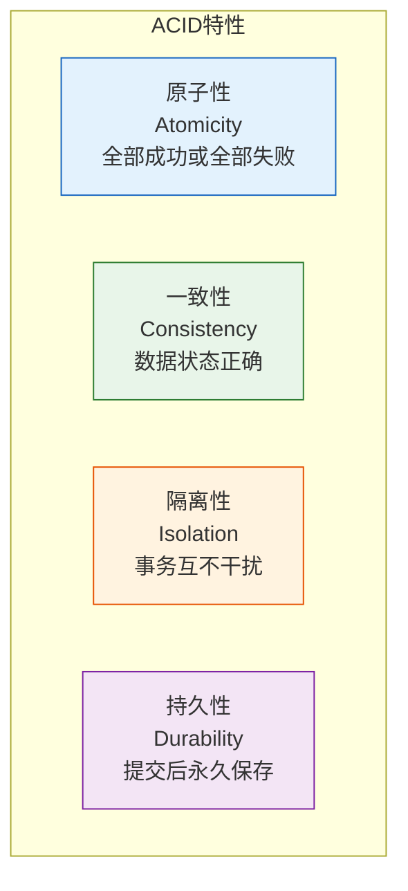
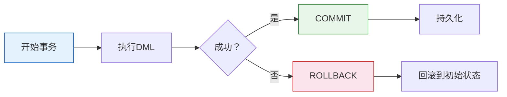

# Oracle事务概念与ACID特性

## 一、概述

### 1.1 一句话定义

Oracle事务概念与ACID特性，本质是Oracle数据库保证数据一致性和可靠性的核心机制，确保事务的原子性、一致性、隔离性和持久性。
它在Oracle数据操作中出现和使用，解决并发操作下的数据正确性问题。

### 1.2 为什么重要

- **不掌握的后果：** 无法正确管理事务，可能导致数据不一致或丢失
- **掌握的价值：** 设计可靠的事务处理，保证数据完整性

### 1.3 适用场景

| 场景 | 说明 |
|------|------|
| 应用开发 | 设计事务逻辑 |
| 数据一致性 | 保证数据正确 |
| 并发控制 | 处理并发操作 |
| 故障恢复 | 保证数据持久 |

### 1.4 版本演进

| 版本 | 变化说明 |
|------|---------|
| 11gR2 | 事务管理增强 |
| 12cR1 | 多租户事务隔离 |
| 19c | 事务性能优化 |
| 21c | 分布式事务增强 |

## 二、术语与概念

### 2.1 核心术语表

| 术语 | 含义 | 类比 |
|------|------|------|
| 事务 | 一组原子操作 | 打包操作 |
| ACID | 原子性、一致性、隔离性、持久性 | 四大保障 |
| COMMIT | 提交事务 | 确认操作 |
| ROLLBACK | 回滚事务 | 撤销操作 |
| SAVEPOINT | 保存点 | 中间标记 |
| UNDO | 回滚段 | 后悔药 |
| REDO | 重做日志 | 操作记录 |

### 2.2 ACID特性



## 三、核心原理

### 3.1 事务定义

事务是一组逻辑相关的SQL操作，作为整体执行。

```sql
-- 事务示例：转账
-- 从账户A转100元到账户B

-- 开始事务（隐式）
UPDATE accounts SET balance = balance - 100 WHERE account_id = 'A';
UPDATE accounts SET balance = balance + 100 WHERE account_id = 'B';

-- 提交事务
COMMIT;

-- 如果任何一步失败，回滚
-- ROLLBACK;
```

### 3.2 原子性（Atomicity）

事务中的操作要么全部成功，要么全部失败。

**Oracle实现：**
- UNDO段记录修改前数据
- 失败时使用UNDO回滚
- 系统崩溃时自动回滚

```sql
-- 原子性示例
BEGIN
    -- 操作1
    UPDATE accounts SET balance = balance - 100 WHERE account_id = 'A';
    
    -- 操作2（如果失败，自动回滚）
    UPDATE accounts SET balance = balance + 100 WHERE account_id = 'B';
    
    -- 提交
    COMMIT;
EXCEPTION
    WHEN OTHERS THEN
        ROLLBACK;
        RAISE;
END;
/
```

### 3.3 一致性（Consistency）

事务执行前后，数据从一个正确状态转换到另一个正确状态。

**Oracle实现：**
- 约束检查（主键、外键、CHECK）
- 触发器验证
- 业务规则保证

```sql
-- 一致性示例
-- 约束保证余额不为负
ALTER TABLE accounts ADD CONSTRAINT ck_balance CHECK (balance >= 0);

-- 事务必须保证一致性
UPDATE accounts SET balance = balance - 100 WHERE account_id = 'A';
-- 如果balance < 0，违反约束，事务失败
```

### 3.4 隔离性（Isolation）

并发事务之间互不干扰。

**Oracle实现：**
- 默认READ COMMITTED隔离级别
- MVCC（多版本并发控制）
- 读不阻塞写，写不阻塞读

```sql
-- 隔离性示例
-- 事务1
SELECT balance FROM accounts WHERE account_id = 'A';  -- 读取
-- 事务2同时修改
UPDATE accounts SET balance = balance + 100 WHERE account_id = 'A';
-- 事务1再次读取
SELECT balance FROM accounts WHERE account_id = 'A';  -- 看到事务2的修改（READ COMMITTED）

-- 设置隔离级别
SET TRANSACTION ISOLATION LEVEL SERIALIZABLE;
-- 或
SET TRANSACTION ISOLATION LEVEL READ COMMITTED;  -- 默认
```

### 3.5 持久性（Durability）

事务提交后，数据永久保存，即使系统崩溃。

**Oracle实现：**
- REDO日志记录所有修改
- LGWR进程将REDO写入磁盘
- 崩溃恢复使用REDO重做

```sql
-- 持久性保证
UPDATE accounts SET balance = balance - 100 WHERE account_id = 'A';
COMMIT;  -- 提交后，即使系统崩溃，数据也不会丢失

-- 崩溃恢复
-- Oracle启动时自动进行实例恢复
-- 使用REDO日志重做已提交事务
-- 使用UNDO回滚未提交事务
```

### 3.6 事务控制语句

```sql
-- COMMIT：提交事务
COMMIT;
COMMIT WRITE IMMEDIATE;  -- 立即写入
COMMIT WRITE BATCH;      -- 批量写入
COMMIT WRITE WAIT;       -- 等待写入完成
COMMIT WRITE NOWAIT;     -- 不等待

-- ROLLBACK：回滚事务
ROLLBACK;
ROLLBACK TO savepoint_name;  -- 回滚到保存点

-- SAVEPOINT：设置保存点
SAVEPOINT sp1;
UPDATE accounts SET balance = balance - 50 WHERE account_id = 'A';
SAVEPOINT sp2;
UPDATE accounts SET balance = balance - 50 WHERE account_id = 'A';
ROLLBACK TO sp1;  -- 只回滚sp1之后的操作

-- SET TRANSACTION：设置事务属性
SET TRANSACTION READ ONLY;  -- 只读事务
SET TRANSACTION READ WRITE; -- 读写事务（默认）
SET TRANSACTION NAME 'transfer';  -- 事务名称
SET TRANSACTION USE ROLLBACK SEGMENT rbs1;  -- 指定回滚段
```

### 3.7 隐式事务与显式事务

```sql
-- 隐式事务：DDL自动提交
CREATE TABLE test (id NUMBER);  -- 自动提交之前的DML

-- 显式事务：需要手动提交
INSERT INTO test VALUES (1);
INSERT INTO test VALUES (2);
COMMIT;  -- 必须显式提交

-- 自动提交设置
SET AUTOCOMMIT ON;   -- SQL*Plus
SET AUTOCOMMIT OFF;  -- 默认
```

## 四、架构与组件

### 4.1 事务生命周期



### 4.2 UNDO和REDO

**UNDO（回滚段）：**
- 存储修改前数据
- 用于ROLLBACK
- 用于MVCC读一致性
- 用于实例恢复

**REDO（重做日志）：**
- 存储所有修改
- 用于实例恢复
- 用于介质恢复
- 保证持久性

```sql
-- 查看UNDO使用
SELECT tablespace_name, status, COUNT(*)
FROM dba_undo_extents
GROUP BY tablespace_name, status;

-- 查看REDO生成
SELECT name, value FROM v$sysstat WHERE name = 'redo size';

-- 查看当前事务
SELECT s.sid, s.serial#, s.username, t.xidusn, t.xidslot, t.xidsqn
FROM v$session s
JOIN v$transaction t ON s.saddr = t.ses_addr;
```

## 五、配置与参数

### 5.1 事务相关参数

```sql
-- 查看事务参数
SHOW PARAMETER transactions;           -- 最大事务数
SHOW PARAMETER transactions_per_session; -- 每会话最大事务数
SHOW PARAMETER undo_tablespace;        -- UNDO表空间
SHOW PARAMETER undo_retention;         -- UNDO保留时间
SHOW PARAMETER commit_write;           -- 提交写入方式

-- 配置参数
ALTER SYSTEM SET transactions = 500;
ALTER SYSTEM SET undo_retention = 3600;  -- 1小时
ALTER SYSTEM SET commit_write = 'IMMEDIATE,WAIT';
```

### 5.2 事务监控

```sql
-- 查看活动事务
SELECT s.sid, s.serial#, s.username, s.status,
       t.start_time, t.used_ublk, t.used_urec
FROM v$session s
JOIN v$transaction t ON s.saddr = t.ses_addr
WHERE s.status = 'ACTIVE';

-- 查看长事务
SELECT s.sid, s.serial#, s.username,
       t.start_time,
       ROUND(t.used_ublk * 8 / 1024, 2) AS undo_mb,
       t.used_urec AS undo_records
FROM v$session s
JOIN v$transaction t ON s.saddr = t.ses_addr
WHERE t.used_ublk > 1000
ORDER BY t.used_ublk DESC;
```

## 六、监控与诊断

### 6.1 事务性能监控

```sql
-- 查看事务统计
SELECT name, value FROM v$sysstat
WHERE name LIKE '%transaction%' OR name LIKE '%commit%' OR name LIKE '%rollback%';

-- 查看事务等待事件
SELECT event, total_waits, time_waited
FROM v$system_event
WHERE event LIKE '%transaction%' OR event LIKE '%enq%'
ORDER BY time_waited DESC;

-- 查看事务I/O
SELECT name, value FROM v$sysstat
WHERE name IN ('user commits', 'user rollbacks', 'transaction tables consistent reads');
```

### 6.2 事务问题诊断

```sql
-- 诊断长事务
SELECT s.sid, s.serial#, s.username, s.program,
       t.start_time, t.used_ublk, t.used_urec,
       s.sql_id
FROM v$session s
JOIN v$transaction t ON s.saddr = t.ses_addr
WHERE t.start_time < SYSDATE - 1/24;  -- 超过1小时

-- 诊断锁等待
SELECT 
    blocking.session AS blocking_sid,
    waiting.session AS waiting_sid,
    waiting.sql_id
FROM v$session blocking
JOIN v$session waiting ON blocking.sid = waiting.blocking_session;
```

## 七、实战案例

### 7.1 案例背景

- **场景**：银行转账系统
- **时间**：2026年
- **现象**：需要保证转账的原子性和一致性

### 7.2 实施过程

```sql
-- 转账存储过程
CREATE OR REPLACE PROCEDURE transfer_money(
    p_from_account IN VARCHAR2,
    p_to_account IN VARCHAR2,
    p_amount IN NUMBER
) AS
    v_from_balance NUMBER;
BEGIN
    -- 检查源账户余额
    SELECT balance INTO v_from_balance
    FROM accounts
    WHERE account_id = p_from_account
    FOR UPDATE;  -- 加锁
    
    -- 检查余额是否足够
    IF v_from_balance < p_amount THEN
        RAISE_APPLICATION_ERROR(-20001, '余额不足');
    END IF;
    
    -- 扣款
    UPDATE accounts
    SET balance = balance - p_amount
    WHERE account_id = p_from_account;
    
    -- 入账
    UPDATE accounts
    SET balance = balance + p_amount
    WHERE account_id = p_to_account;
    
    -- 记录日志
    INSERT INTO transfer_log (from_account, to_account, amount, transfer_time)
    VALUES (p_from_account, p_to_account, p_amount, SYSDATE);
    
    -- 提交事务
    COMMIT;
    
EXCEPTION
    WHEN OTHERS THEN
        ROLLBACK;
        RAISE;
END;
/

-- 调用
EXEC transfer_money('A', 'B', 100);
```

### 7.3 实施结果

- 保证转账原子性：扣款和入账要么都成功，要么都失败
- 保证数据一致性：余额不会为负
- 保证并发安全：使用SELECT FOR UPDATE加锁

### 7.4 复盘总结

- **根因：** 使用事务保证多步操作的原子性
- **教训：** 关键业务操作必须使用事务，并处理异常

## 八、常见错误与排查

### 8.1 常见错误

| 错误 | 问题 | 解决方法 |
|------|------|---------|
| ORA-01555 | snapshot too old | 增大UNDO保留时间 |
| ORA-01562 | failed to extend rollback segment | 扩展UNDO表空间 |
| ORA-02049 | timeout: distributed transaction | 检查分布式事务 |
| 长事务 | 占用资源过多 | 分批提交 |

## 九、最佳实践

### 9.1 官方推荐

- 事务尽量短小
- 及时提交或回滚
- 使用SAVEPOINT分段
- 合理设置UNDO保留时间

### 9.2 社区经验

- 避免长事务
- 使用批量操作减少事务数
- 监控活动事务

### 9.3 反模式

| 反模式 | 问题 | 正确做法 |
|--------|------|---------|
| 长事务 | 占用资源，阻塞其他 | 分批提交 |
| 不提交 | 资源泄漏 | 及时COMMIT |
| 过度回滚 | 性能差 | 合理使用SAVEPOINT |

## 十、命令与视图汇总

### 10.1 命令列表

| 命令 | 适用场景 | 说明 |
|------|---------|------|
| `COMMIT` | 提交事务 | 持久化修改 |
| `ROLLBACK` | 回滚事务 | 撤销修改 |
| `SAVEPOINT` | 设置保存点 | 分段回滚 |
| `SET TRANSACTION` | 设置事务属性 | 隔离级别等 |

### 10.2 视图列表

| 视图名 | 类型 | 用途 |
|--------|------|------|
| V$TRANSACTION | 动态 | 活动事务 |
| V$SESSION | 动态 | 会话信息 |
| DBA_UNDO_EXTENTS | 数据字典 | UNDO使用 |
| V$SYSSTAT | 动态 | 事务统计 |

## 十一、总结速查

### 11.1 黄金法则

1. **事务尽量短小** - 减少资源占用
2. **及时提交或回滚** - 避免资源泄漏
3. **使用SAVEPOINT** - 分段控制
4. **处理异常** - 保证回滚

### 11.2 一页纸检查清单

| 检查项 | 说明 |
|--------|------|
| 事务长度 | 避免长事务 |
| 提交策略 | 及时COMMIT |
| 异常处理 | ROLLBACK处理 |
| UNDO空间 | 监控使用率 |

## 附录

### A. 官方参考

- [Oracle Database Concepts - Transactions](https://docs.oracle.com/en/database/oracle/oracle-database/19c/cncpt/transactions.html)
- [Oracle Database Development Guide - Transaction Management](https://docs.oracle.com/en/database/oracle/oracle-database/19c/adfns/)

### B. 修订记录

| 日期 | 版本 | 修改内容 | 修改人 |
|------|------|---------|--------|
| 2026-07-02 | v1.0 | 初始版本 | YashanDB知识库生成器 |
