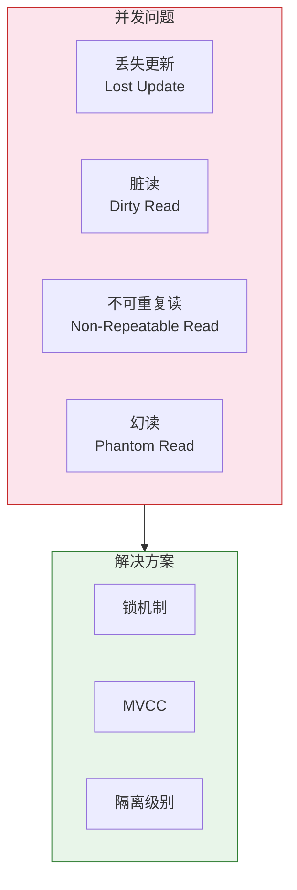
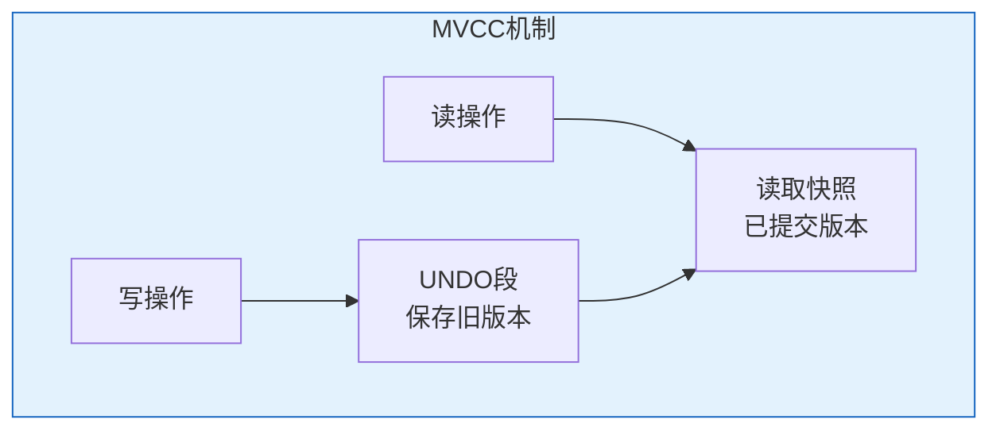
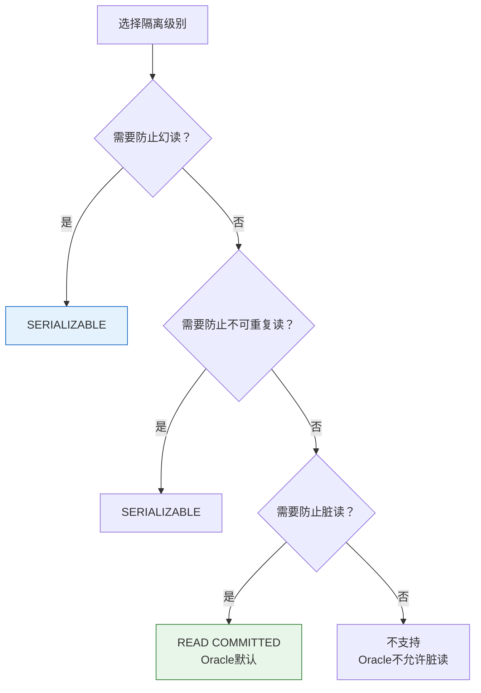

# Oracle并发控制问题详解

## 一、概述

### 1.1 一句话定义

Oracle并发控制问题，本质是多个事务同时访问相同数据时可能出现的数据不一致现象，包括丢失更新、脏读、不可重复读和幻读。
它在Oracle并发控制中出现和使用，解决多用户环境下的数据一致性问题。

### 1.2 为什么重要

- **不掌握的后果：** 无法正确设计并发控制，可能导致数据不一致
- **掌握的价值：** 选择合适的隔离级别，保证数据一致性

### 1.3 适用场景

| 场景 | 说明 |
|------|------|
| 并发开发 | 设计并发安全的应用 |
| 问题诊断 | 诊断数据不一致 |
| 隔离级别选择 | 选择合适的隔离级别 |
| 性能优化 | 平衡一致性和性能 |

### 1.4 版本演进

| 版本 | 变化说明 |
|------|---------|
| 11gR2 | MVCC增强 |
| 12cR1 | 隔离级别优化 |
| 19c | 并发性能提升 |
| 21c | 分布式并发增强 |

## 二、术语与概念

### 2.1 核心术语表

| 术语 | 含义 | 类比 |
|------|------|------|
| 丢失更新 | 两个事务更新同一数据，一个被覆盖 | 两人同时改文件 |
| 脏读 | 读取未提交的数据 | 看到半成品 |
| 不可重复读 | 同一事务两次读取结果不同 | 文件被修改 |
| 幻读 | 同一查询两次返回不同行数 | 文件数量变化 |
| MVCC | 多版本并发控制 | 快照隔离 |

### 2.2 并发问题分类



## 三、核心原理

### 3.1 丢失更新（Lost Update）

两个事务同时更新同一数据，一个更新被覆盖。

```sql
-- 丢失更新示例
-- 事务1                          -- 事务2
SELECT balance FROM accounts       
WHERE account_id = 'A';            SELECT balance FROM accounts
-- 返回1000                        WHERE account_id = 'A';
                                   -- 返回1000
UPDATE accounts                    
SET balance = 1000 - 100           
WHERE account_id = 'A';            UPDATE accounts
                                   SET balance = 1000 + 200
                                   WHERE account_id = 'A';
COMMIT;                            COMMIT;
-- 最终余额：1200（丢失了-100）
```

**Oracle解决方案：**
- 默认READ COMMITTED隔离级别防止丢失更新
- 使用SELECT FOR UPDATE加锁

```sql
-- 正确的做法：使用SELECT FOR UPDATE
-- 事务1                          -- 事务2
SELECT balance FROM accounts       
WHERE account_id = 'A'             
FOR UPDATE;                        SELECT balance FROM accounts
-- 返回1000，加锁                   WHERE account_id = 'A' FOR UPDATE;
                                   -- 等待锁
UPDATE accounts                    
SET balance = balance - 100        
WHERE account_id = 'A';            
COMMIT;                            -- 锁释放，继续
-- 最终余额：1100                   SELECT balance FROM accounts
                                   WHERE account_id = 'A' FOR UPDATE;
                                   -- 返回1100
                                   UPDATE accounts
                                   SET balance = balance + 200
                                   WHERE account_id = 'A';
                                   COMMIT;
                                   -- 最终余额：1300
```

### 3.2 脏读（Dirty Read）

读取其他事务未提交的数据。

```sql
-- 脏读示例
-- 事务1                          -- 事务2
UPDATE accounts                    
SET balance = 2000                 
WHERE account_id = 'A';            
                                   SELECT balance FROM accounts
                                   WHERE account_id = 'A';
                                   -- 如果允许脏读，返回2000
                                   
ROLLBACK;                          -- 事务1回滚
                                   -- 但事务2已经读取了未提交的数据
```

**Oracle特点：**
- Oracle默认READ COMMITTED隔离级别**不允许脏读**
- Oracle使用MVCC，读不阻塞写，写不阻塞读
- 只能读取已提交的数据

```sql
-- Oracle默认行为（READ COMMITTED）
-- 事务1                          -- 事务2
UPDATE accounts                    
SET balance = 2000                 
WHERE account_id = 'A';            
                                   SELECT balance FROM accounts
                                   WHERE account_id = 'A';
                                   -- 返回1000（修改前的值）
                                   -- 因为事务1未提交
                                   
COMMIT;                            SELECT balance FROM accounts
                                   WHERE account_id = 'A';
                                   -- 返回2000（事务1已提交）
```

### 3.3 不可重复读（Non-Repeatable Read）

同一事务中，两次读取同一数据结果不同。

```sql
-- 不可重复读示例
-- 事务1                          -- 事务2
SELECT balance FROM accounts       
WHERE account_id = 'A';            
-- 返回1000                       
                                   UPDATE accounts
                                   SET balance = 2000
                                   WHERE account_id = 'A';
                                   COMMIT;
                                   
SELECT balance FROM accounts       
WHERE account_id = 'A';            
-- 返回2000（不同于第一次）
```

**Oracle解决方案：**
- READ COMMITTED（默认）：允许不可重复读
- SERIALIZABLE：防止不可重复读

```sql
-- 使用SERIALIZABLE防止不可重复读
SET TRANSACTION ISOLATION LEVEL SERIALIZABLE;

-- 事务1                          -- 事务2
SELECT balance FROM accounts       
WHERE account_id = 'A';            
-- 返回1000                       
                                   UPDATE accounts
                                   SET balance = 2000
                                   WHERE account_id = 'A';
                                   COMMIT;
                                   
SELECT balance FROM accounts       
WHERE account_id = 'A';            
-- 仍然返回1000（快照隔离）
```

### 3.4 幻读（Phantom Read）

同一事务中，两次查询返回不同数量的行。

```sql
-- 幻读示例
-- 事务1                          -- 事务2
SELECT COUNT(*) FROM accounts      
WHERE dept_id = 10;                
-- 返回5                          
                                   INSERT INTO accounts (account_id, dept_id, balance)
                                   VALUES ('NEW', 10, 1000);
                                   COMMIT;
                                   
SELECT COUNT(*) FROM accounts      
WHERE dept_id = 10;                
-- 返回6（出现了"幻影"行）
```

**Oracle解决方案：**
- READ COMMITTED：允许幻读
- SERIALIZABLE：防止幻读

```sql
-- 使用SERIALIZABLE防止幻读
SET TRANSACTION ISOLATION LEVEL SERIALIZABLE;

-- 事务1                          -- 事务2
SELECT COUNT(*) FROM accounts      
WHERE dept_id = 10;                
-- 返回5                          
                                   INSERT INTO accounts (account_id, dept_id, balance)
                                   VALUES ('NEW', 10, 1000);
                                   COMMIT;
                                   
SELECT COUNT(*) FROM accounts      
WHERE dept_id = 10;                
-- 仍然返回5（快照隔离）
```

### 3.5 Oracle隔离级别

| 隔离级别 | 丢失更新 | 脏读 | 不可重复读 | 幻读 |
|---------|---------|------|-----------|------|
| READ UNCOMMITTED | ✓ | ✗ | ✗ | ✗ |
| READ COMMITTED（Oracle默认） | ✓ | ✓ | ✗ | ✗ |
| REPEATABLE READ | ✓ | ✓ | ✓ | ✗ |
| SERIALIZABLE | ✓ | ✓ | ✓ | ✓ |

**Oracle特点：**
- 不支持READ UNCOMMITTED（不允许脏读）
- 不支持REPEATABLE READ
- 默认READ COMMITTED
- 支持SERIALIZABLE

### 3.6 Oracle MVCC实现

Oracle使用MVCC（多版本并发控制）实现读一致性。



**MVCC工作原理：**
- 写操作生成UNDO，不阻塞读
- 读操作使用UNDO构建快照
- 读已提交的数据版本

```sql
-- MVCC示例
-- 事务1                          -- 事务2
UPDATE accounts                    
SET balance = 2000                 
WHERE account_id = 'A';            
-- 生成UNDO，记录旧值1000         
                                   SELECT balance FROM accounts
                                   WHERE account_id = 'A';
                                   -- 使用UNDO读取旧值1000
                                   -- 因为事务1未提交
                                   
COMMIT;                            SELECT balance FROM accounts
                                   WHERE account_id = 'A';
                                   -- 读取新值2000
                                   -- 因为事务1已提交
```

## 四、架构与组件

### 4.1 锁与MVCC对比

| 特性 | 锁机制 | MVCC |
|------|--------|------|
| 读写冲突 | 读阻塞写 | 读不阻塞写 |
| 实现方式 | 加锁 | 多版本 |
| 并发度 | 低 | 高 |
| 资源消耗 | 锁管理开销 | UNDO空间 |
| Oracle使用 | SELECT FOR UPDATE | 默认读一致性 |

### 4.2 隔离级别选择指南



## 五、配置与参数

### 5.1 隔离级别设置

```sql
-- 设置会话隔离级别
SET TRANSACTION ISOLATION LEVEL READ COMMITTED;  -- 默认
SET TRANSACTION ISOLATION LEVEL SERIALIZABLE;

-- 查看当前隔离级别
SELECT s.sid, s.serial#, s.username,
       DECODE(s.taddr, NULL, 'READ COMMITTED', 'SERIALIZABLE') AS isolation_level
FROM v$session s
WHERE s.sid = SYS_CONTEXT('USERENV', 'SID');
```

### 5.2 锁监控

```sql
-- 查看当前锁
SELECT s.sid, s.serial#, s.username, l.type, l.lmode, l.request
FROM v$session s
JOIN v$lock l ON s.sid = l.sid
WHERE s.type = 'USER';

-- 查看锁等待
SELECT 
    blocking.sid AS blocking_sid,
    waiting.sid AS waiting_sid,
    waiting.sql_id
FROM v$session blocking
JOIN v$session waiting ON blocking.sid = waiting.blocking_session;

-- 查看被锁的对象
SELECT lo.session_id, lo.object_id, o.object_name, lo.locked_mode
FROM v$locked_object lo
JOIN dba_objects o ON lo.object_id = o.object_id;
```

## 六、监控与诊断

### 6.1 并发问题诊断

```sql
-- 查看等待事件
SELECT event, total_waits, time_waited
FROM v$system_event
WHERE event LIKE '%enq%' OR event LIKE '%lock%'
ORDER BY time_waited DESC;

-- 查看行锁竞争
SELECT name, value FROM v$sysstat
WHERE name IN ('table lock waits', 'row lock waits', 'leaf node splits');

-- 查看MVCC相关统计
SELECT name, value FROM v$sysstat
WHERE name LIKE '%consistent%' OR name LIKE '%undo%';
```

### 6.2 ORA-08177诊断

```sql
-- SERIALIZABLE事务冲突
-- 事务1                          -- 事务2
SET TRANSACTION ISOLATION LEVEL SERIALIZABLE;
                                   SET TRANSACTION ISOLATION LEVEL SERIALIZABLE;
                                   
SELECT * FROM accounts WHERE account_id = 'A';
                                   SELECT * FROM accounts WHERE account_id = 'A';
                                   
UPDATE accounts SET balance = 2000 WHERE account_id = 'A';
                                   UPDATE accounts SET balance = 3000 WHERE account_id = 'A';
                                   
COMMIT;                            COMMIT;
                                   -- ORA-08177: can't serialize access
```

**解决方法：**
- 重试事务
- 降低隔离级别
- 优化事务逻辑

## 七、实战案例

### 7.1 案例背景

- **场景**：电商库存扣减
- **时间**：2026年
- **现象**：并发扣减导致超卖

### 7.2 解决方案

```sql
-- 问题代码（丢失更新）
-- 事务1                          -- 事务2
SELECT stock FROM products         
WHERE product_id = 1;              
-- 返回10                         
                                   SELECT stock FROM products
                                   WHERE product_id = 1;
                                   -- 返回10
                                   
UPDATE products                    
SET stock = 10 - 1                 
WHERE product_id = 1;              
                                   UPDATE products
                                   SET stock = 10 - 1
                                   WHERE product_id = 1;
                                   
COMMIT;                            COMMIT;
-- 最终库存：9（应该8）

-- 正确代码（使用SELECT FOR UPDATE）
-- 事务1                          -- 事务2
SELECT stock FROM products         
WHERE product_id = 1               
FOR UPDATE;                        
-- 返回10，加锁                   
                                   SELECT stock FROM products
                                   WHERE product_id = 1
                                   FOR UPDATE;
                                   -- 等待锁
                                   
UPDATE products                    
SET stock = stock - 1              
WHERE product_id = 1;              
COMMIT;                            -- 锁释放
                                   SELECT stock FROM products
                                   WHERE product_id = 1
                                   FOR UPDATE;
                                   -- 返回9
                                   UPDATE products
                                   SET stock = stock - 1
                                   WHERE product_id = 1;
                                   COMMIT;
-- 最终库存：8（正确）
```

### 7.3 优化结果

- 使用SELECT FOR UPDATE防止丢失更新
- 保证库存扣减的正确性
- 避免超卖问题

### 7.4 复盘总结

- **根因：** 并发更新导致丢失更新
- **教训：** 使用SELECT FOR UPDATE或乐观锁

## 八、常见错误与排查

### 8.1 常见错误

| 错误 | 问题 | 解决方法 |
|------|------|---------|
| ORA-08177 | 序列化失败 | 重试事务 |
| ORA-00060 | 死锁 | 检查事务顺序 |
| ORA-01555 | 快照过旧 | 增大UNDO保留 |
| 锁等待超时 | 长时间锁等待 | 优化事务逻辑 |

## 九、最佳实践

### 9.1 官方推荐

- 默认使用READ COMMITTED
- 使用SELECT FOR UPDATE防止丢失更新
- 短事务，及时提交
- 避免长事务

### 9.2 社区经验

- 乐观锁适合低冲突场景
- 悲观锁适合高冲突场景
- 使用MVCC提高并发

### 9.3 反模式

| 反模式 | 问题 | 正确做法 |
|--------|------|---------|
| 不使用锁 | 丢失更新 | SELECT FOR UPDATE |
| 长事务 | 锁持有时间长 | 分批提交 |
| 过度使用SERIALIZABLE | 冲突多 | 使用READ COMMITTED |

## 十、命令与视图汇总

### 10.1 命令列表

| 命令 | 适用场景 | 说明 |
|------|---------|------|
| `SET TRANSACTION ISOLATION LEVEL` | 设置隔离级别 | 选择隔离级别 |
| `SELECT ... FOR UPDATE` | 加锁查询 | 防止丢失更新 |
| `LOCK TABLE` | 表锁 | 锁定整个表 |

### 10.2 视图列表

| 视图名 | 类型 | 用途 |
|--------|------|------|
| V$LOCK | 动态 | 锁信息 |
| V$SESSION | 动态 | 会话信息 |
| V$LOCKED_OBJECT | 动态 | 锁定对象 |
| V$SYSSTAT | 动态 | 锁统计 |

## 十一、总结速查

### 11.1 黄金法则

1. **默认READ COMMITTED** - Oracle默认隔离级别
2. **SELECT FOR UPDATE** - 防止丢失更新
3. **短事务** - 减少锁持有时间
4. **MVCC** - 读不阻塞写

### 11.2 一页纸检查清单

| 检查项 | 说明 |
|--------|------|
| 隔离级别 | 默认READ COMMITTED |
| 并发更新 | 使用SELECT FOR UPDATE |
| 事务长度 | 避免长事务 |
| 锁等待 | 监控锁等待 |

## 附录

### A. 官方参考

- [Oracle Database Concepts - Concurrency Control](https://docs.oracle.com/en/database/oracle/oracle-database/19c/cncpt/concurrency-control.html)
- [Oracle Database Development Guide - Transaction Management](https://docs.oracle.com/en/database/oracle/oracle-database/19c/adfns/)

### B. 修订记录

| 日期 | 版本 | 修改内容 | 修改人 |
|------|------|---------|--------|
| 2026-07-02 | v1.0 | 初始版本 | YashanDB知识库生成器 |
