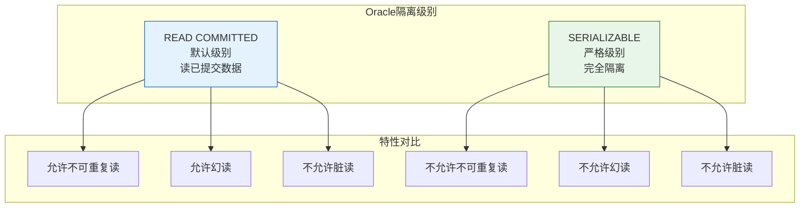
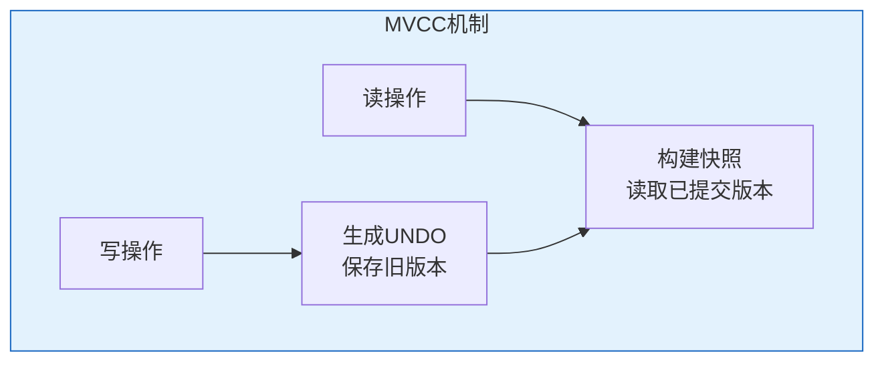
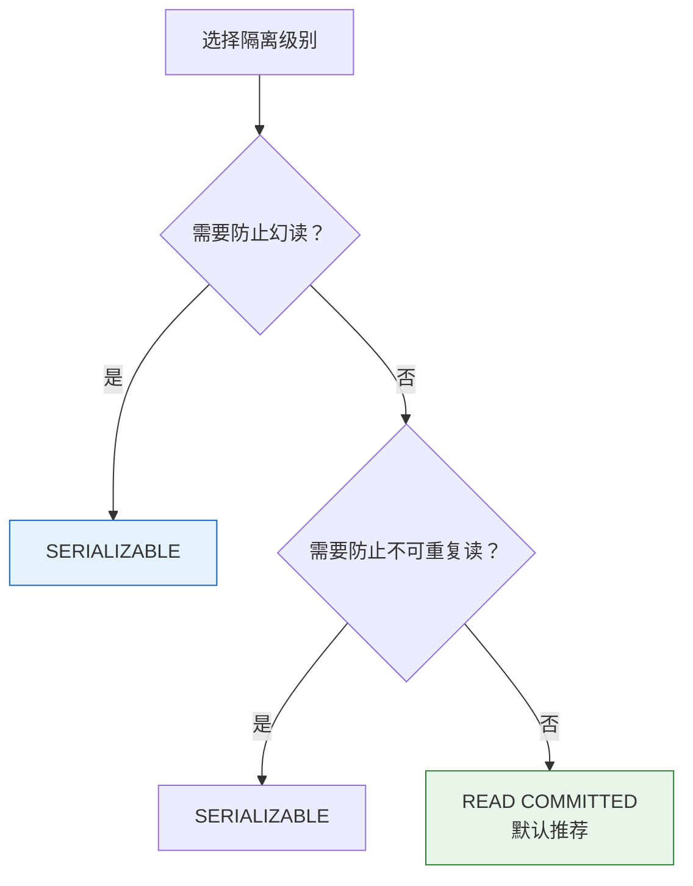

# Oracle事务隔离级别

## 一、概述

### 1.1 一句话定义

Oracle事务隔离级别，本质是控制事务之间可见性和干扰程度的机制，决定一个事务能看到其他事务的哪些修改。
它在Oracle并发控制中出现和使用，解决数据一致性和并发性能的平衡问题。

### 1.2 为什么重要

- **不掌握的后果：** 无法正确控制并发行为，可能导致数据不一致或性能问题
- **掌握的价值：** 选择合适的隔离级别，平衡一致性和性能

### 1.3 适用场景

| 场景 | 说明 |
|------|------|
| 并发开发 | 选择合适隔离级别 |
| 报表查询 | 保证查询一致性 |
| 金融交易 | 严格一致性 |
| 性能优化 | 提高并发度 |

### 1.4 版本演进

| 版本 | 变化说明 |
|------|---------|
| 11gR2 | MVCC增强 |
| 12cR1 | 隔离级别优化 |
| 19c | 性能提升 |
| 21c | 分布式事务增强 |

## 二、术语与概念

### 2.1 核心术语表

| 术语 | 含义 | 类比 |
|------|------|------|
| READ COMMITTED | 读已提交 | 只看完成的 |
| SERIALIZABLE | 可串行化 | 完全隔离 |
| MVCC | 多版本并发控制 | 快照隔离 |
| 快照 | 事务开始时的数据状态 | 时间点照片 |

### 2.2 隔离级别对比



## 三、核心原理

### 3.1 READ COMMITTED（默认）

Oracle默认隔离级别，只能读取已提交的数据。

**特点：**
- 不允许脏读
- 允许不可重复读
- 允许幻读
- 读不阻塞写，写不阻塞读
- 使用MVCC实现

```sql
-- READ COMMITTED示例
-- 事务1                          -- 事务2
SELECT balance FROM accounts       
WHERE account_id = 'A';            
-- 返回1000                       
                                   UPDATE accounts
                                   SET balance = 2000
                                   WHERE account_id = 'A';
                                   
                                   SELECT balance FROM accounts
                                   WHERE account_id = 'A';
                                   -- 返回1000（事务1未提交）
                                   
COMMIT;                            SELECT balance FROM accounts
                                   WHERE account_id = 'A';
                                   -- 返回2000（事务1已提交）

-- 不可重复读示例
-- 事务1                          -- 事务2
SELECT balance FROM accounts       
WHERE account_id = 'A';            
-- 返回1000                       
                                   UPDATE accounts
                                   SET balance = 2000
                                   WHERE account_id = 'A';
                                   COMMIT;
                                   
SELECT balance FROM accounts       
WHERE account_id = 'A';            
-- 返回2000（不同于第一次）
```

### 3.2 SERIALIZABLE

最严格的隔离级别，事务看起来是串行执行的。

**特点：**
- 不允许脏读
- 不允许不可重复读
- 不允许幻读
- 使用快照隔离
- 可能遇到ORA-08177错误

```sql
-- 设置SERIALIZABLE
SET TRANSACTION ISOLATION LEVEL SERIALIZABLE;

-- SERIALIZABLE示例
-- 事务1                          -- 事务2
SET TRANSACTION ISOLATION LEVEL SERIALIZABLE;
                                   SET TRANSACTION ISOLATION LEVEL SERIALIZABLE;
                                   
SELECT balance FROM accounts       
WHERE account_id = 'A';            
-- 返回1000                       
                                   UPDATE accounts
                                   SET balance = 2000
                                   WHERE account_id = 'A';
                                   COMMIT;
                                   
SELECT balance FROM accounts       
WHERE account_id = 'A';            
-- 仍然返回1000（快照）

-- 幻读防止
-- 事务1                          -- 事务2
SET TRANSACTION ISOLATION LEVEL SERIALIZABLE;
                                   SET TRANSACTION ISOLATION LEVEL SERIALIZABLE;
                                   
SELECT COUNT(*) FROM accounts      
WHERE dept_id = 10;                
-- 返回5                          
                                   INSERT INTO accounts VALUES ('NEW', 10, 1000);
                                   COMMIT;
                                   
SELECT COUNT(*) FROM accounts      
WHERE dept_id = 10;                
-- 仍然返回5（快照）
```

### 3.3 Oracle不支持的隔离级别

**Oracle不支持：**
- READ UNCOMMITTED（不允许脏读）
- REPEATABLE READ（使用SERIALIZABLE替代）

**与SQL标准对比：**

| SQL标准 | Oracle实现 | 说明 |
|---------|-----------|------|
| READ UNCOMMITTED | 不支持 | Oracle不允许脏读 |
| READ COMMITTED | ✓ 支持 | 默认级别 |
| REPEATABLE READ | 不支持 | 使用SERIALIZABLE |
| SERIALIZABLE | ✓ 支持 | 最严格 |

### 3.4 MVCC实现原理

Oracle使用MVCC实现读一致性。



**READ COMMITTED的MVCC：**
- 每条语句开始时获取快照
- 语句内看到一致的数据
- 语句间可以看到其他事务的提交

**SERIALIZABLE的MVCC：**
- 事务开始时获取快照
- 整个事务内看到一致的数据
- 看不到其他事务的修改

```sql
-- READ COMMITTED：语句级快照
-- 事务1                          -- 事务2
SELECT balance FROM accounts       
WHERE account_id = 'A';            
-- 语句开始，获取快照             
                                   UPDATE accounts
                                   SET balance = 2000
                                   WHERE account_id = 'A';
                                   
                                   -- 语句内看到一致数据
                                   
COMMIT;                            
                                   
SELECT balance FROM accounts       
WHERE account_id = 'A';            
-- 新语句，新快照，看到2000

-- SERIALIZABLE：事务级快照
-- 事务1                          -- 事务2
SET TRANSACTION ISOLATION LEVEL SERIALIZABLE;
                                   SET TRANSACTION ISOLATION LEVEL SERIALIZABLE;
                                   
SELECT balance FROM accounts       
WHERE account_id = 'A';            
-- 事务开始，获取快照             
                                   UPDATE accounts
                                   SET balance = 2000
                                   WHERE account_id = 'A';
                                   COMMIT;
                                   
SELECT balance FROM accounts       
WHERE account_id = 'A';            
-- 同一事务，同一快照，看到1000
```

### 3.5 隔离级别选择



**选择建议：**
- **READ COMMITTED**：大多数场景，平衡一致性和性能
- **SERIALIZABLE**：需要严格一致性，如金融报表

## 四、架构与组件

### 4.1 隔离级别与并发问题

| 隔离级别 | 丢失更新 | 脏读 | 不可重复读 | 幻读 |
|---------|---------|------|-----------|------|
| READ COMMITTED | ✓防止 | ✓防止 | ✗允许 | ✗允许 |
| SERIALIZABLE | ✓防止 | ✓防止 | ✓防止 | ✓防止 |

### 4.2 性能对比

| 特性 | READ COMMITTED | SERIALIZABLE |
|------|---------------|--------------|
| 并发度 | 高 | 低 |
| 冲突概率 | 低 | 高（ORA-08177） |
| 资源消耗 | 低 | 高（UNDO保留） |
| 适用场景 | OLTP | 报表、批处理 |

## 五、配置与参数

### 5.1 设置隔离级别

```sql
-- 会话级设置
SET TRANSACTION ISOLATION LEVEL READ COMMITTED;
SET TRANSACTION ISOLATION LEVEL SERIALIZABLE;

-- 查看当前隔离级别
SELECT s.sid, s.serial#, 
       CASE 
           WHEN BITAND(t.flag, POWER(2, 28)) != 0 THEN 'SERIALIZABLE'
           ELSE 'READ COMMITTED'
       END AS isolation_level
FROM v$session s
JOIN v$transaction t ON s.saddr = t.ses_addr
WHERE s.sid = SYS_CONTEXT('USERENV', 'SID');
```

### 5.2 SERIALIZABLE参数

```sql
-- 相关参数
SHOW PARAMETER transactions;
SHOW PARAMETER undo_retention;

-- SERIALIZABLE需要足够的UNDO空间
ALTER SYSTEM SET undo_retention = 3600;  -- 1小时
```

## 六、监控与诊断

### 6.1 隔离级别监控

```sql
-- 查看会话隔离级别
SELECT s.sid, s.serial#, s.username, s.status,
       CASE 
           WHEN BITAND(t.flag, POWER(2, 28)) != 0 THEN 'SERIALIZABLE'
           ELSE 'READ COMMITTED'
       END AS isolation_level,
       t.start_time, t.used_ublk
FROM v$session s
JOIN v$transaction t ON s.saddr = t.ses_addr
WHERE s.status = 'ACTIVE';

-- 查看SERIALIZABLE事务冲突
SELECT name, value FROM v$sysstat
WHERE name LIKE '%serialize%' OR name LIKE '%transaction%';
```

### 6.2 ORA-08177诊断

```sql
-- SERIALIZABLE冲突处理
-- 事务1                          -- 事务2
SET TRANSACTION ISOLATION LEVEL SERIALIZABLE;
                                   SET TRANSACTION ISOLATION LEVEL SERIALIZABLE;
                                   
SELECT * FROM accounts WHERE account_id = 'A';
                                   SELECT * FROM accounts WHERE account_id = 'A';
                                   
UPDATE accounts SET balance = 2000 WHERE account_id = 'A';
                                   UPDATE accounts SET balance = 3000 WHERE account_id = 'A';
                                   
COMMIT;                            COMMIT;
                                   -- ORA-08177: can't serialize access

-- 解决方法：重试事务
BEGIN
    FOR i IN 1..3 LOOP
        BEGIN
            SET TRANSACTION ISOLATION LEVEL SERIALIZABLE;
            -- 业务逻辑
            COMMIT;
            EXIT;
        EXCEPTION
            WHEN OTHERS THEN
                IF SQLCODE = -8177 THEN
                    ROLLBACK;
                    DBMS_LOCK.SLEEP(1);  -- 等待后重试
                ELSE
                    RAISE;
                END IF;
        END;
    END LOOP;
END;
/
```

## 七、实战案例

### 7.1 案例背景

- **场景**：财务报表生成
- **时间**：2026年
- **现象**：需要保证报表数据一致性

### 7.2 实施过程

```sql
-- 问题：READ COMMITTED下报表数据不一致
-- 事务1（报表生成）
SELECT SUM(balance) FROM accounts;  -- 10000
-- 期间其他事务修改数据
SELECT SUM(balance) FROM accounts;  -- 12000（不一致）

-- 解决：使用SERIALIZABLE
SET TRANSACTION ISOLATION LEVEL SERIALIZABLE;

SELECT SUM(balance) FROM accounts;  -- 10000
-- 期间其他事务修改数据
SELECT SUM(balance) FROM accounts;  -- 10000（一致）
```

### 7.3 实施结果

- 使用SERIALIZABLE保证报表数据一致性
- 报表生成期间看不到其他事务的修改
- 保证报表准确性

### 7.4 复盘总结

- **根因：** READ COMMITTED允许不可重复读
- **教训：** 报表生成使用SERIALIZABLE

## 八、常见错误与排查

### 8.1 常见错误

| 错误 | 问题 | 解决方法 |
|------|------|---------|
| ORA-08177 | 序列化冲突 | 重试事务 |
| ORA-01555 | 快照过旧 | 增大UNDO保留 |
| 性能下降 | SERIALIZABLE冲突多 | 改用READ COMMITTED |

## 九、最佳实践

### 9.1 官方推荐

- 默认使用READ COMMITTED
- 报表使用SERIALIZABLE
- 短事务，及时提交
- 监控SERIALIZABLE冲突

### 9.2 社区经验

- 大多数场景使用READ COMMITTED
- SERIALIZABLE用于关键报表
- 使用MVCC提高并发

### 9.3 反模式

| 反模式 | 问题 | 正确做法 |
|--------|------|---------|
| 过度使用SERIALIZABLE | 冲突多，性能差 | 默认READ COMMITTED |
| 不处理ORA-08177 | 事务失败 | 重试机制 |
| 长事务SERIALIZABLE | UNDO空间不足 | 分批处理 |

## 十、命令与视图汇总

### 10.1 命令列表

| 命令 | 适用场景 | 说明 |
|------|---------|------|
| `SET TRANSACTION ISOLATION LEVEL` | 设置隔离级别 | 选择隔离级别 |

### 10.2 视图列表

| 视图名 | 类型 | 用途 |
|--------|------|------|
| V$SESSION | 动态 | 会话信息 |
| V$TRANSACTION | 动态 | 事务信息 |
| V$SYSSTAT | 动态 | 统计信息 |

## 十一、总结速查

### 11.1 黄金法则

1. **默认READ COMMITTED** - 平衡一致性和性能
2. **报表用SERIALIZABLE** - 保证数据一致性
3. **处理ORA-08177** - 重试机制
4. **短事务** - 减少冲突

### 11.2 一页纸检查清单

| 检查项 | 说明 |
|--------|------|
| 隔离级别选择 | 默认READ COMMITTED |
| SERIALIZABLE使用 | 关键报表场景 |
| 冲突处理 | 重试机制 |
| UNDO空间 | 足够保留 |

## 附录

### A. 官方参考

- [Oracle Database Concepts - Transaction Isolation Levels](https://docs.oracle.com/en/database/oracle/oracle-database/19c/cncpt/concurrency-control.html)
- [Oracle Database Development Guide - SET TRANSACTION](https://docs.oracle.com/en/database/oracle/oracle-database/19c/adfns/)

### B. 修订记录

| 日期 | 版本 | 修改内容 | 修改人 |
|------|------|---------|--------|
| 2026-07-02 | v1.0 | 初始版本 | YashanDB知识库生成器 |
