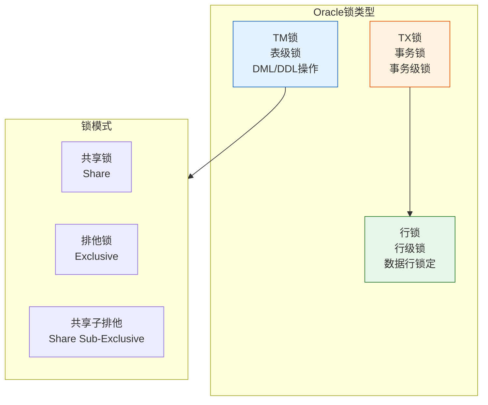
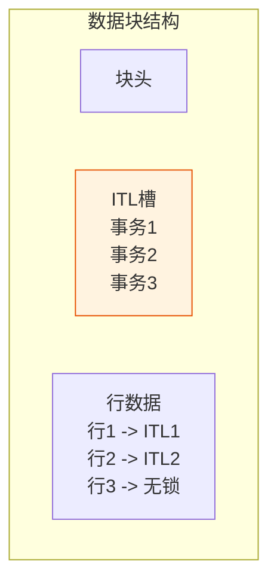
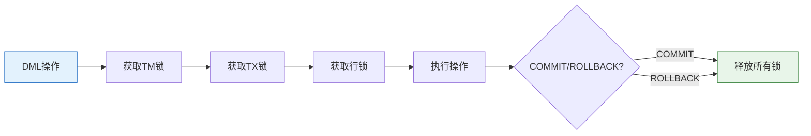

# Oracle锁机制基础

## 一、概述

### 1.1 一句话定义

Oracle锁机制基础，本质是Oracle数据库用于控制并发访问、保证数据一致性的 synchronization 机制。
它在Oracle并发控制中出现和使用，解决多用户同时访问相同数据时的冲突问题。

### 1.2 为什么重要

- **不掌握的后果：** 无法诊断和解决锁等待、死锁等问题
- **掌握的价值：** 优化并发性能，诊断锁相关问题

### 1.3 适用场景

| 场景 | 说明 |
|------|------|
| 并发控制 | 防止数据冲突 |
| 问题诊断 | 诊断锁等待 |
| 性能优化 | 减少锁竞争 |
| 死锁处理 | 解决死锁问题 |

### 1.4 版本演进

| 版本 | 变化说明 |
|------|---------|
| 11gR2 | 锁管理优化 |
| 12cR1 | 锁监控增强 |
| 19c | 锁性能提升 |
| 21c | 分布式锁增强 |

## 二、术语与概念

### 2.1 核心术语表

| 术语 | 含义 | 类比 |
|------|------|------|
| TM锁 | 表锁（Table Lock） | 锁定整个表 |
| TX锁 | 事务锁（Transaction Lock） | 锁定事务 |
| 行锁 | 数据行级别的锁 | 锁定单行 |
| 模式 | 锁的兼容性模式 | 共享/排他 |
| ITL | 事务兴趣列表 | 块级锁信息 |

### 2.2 锁类型分类



## 三、核心原理

### 3.1 TM锁（表锁）

TM锁保护表结构，防止DDL操作与DML冲突。

**TM锁模式：**

| 模式 | 名称 | 说明 | 典型操作 |
|------|------|------|---------|
| 0 | None | 无锁 | - |
| 1 | Null | 空锁 | SELECT |
| 2 | Row Share (RS) | 行共享 | SELECT FOR UPDATE |
| 3 | Row Exclusive (RX) | 行排他 | INSERT/UPDATE/DELETE |
| 4 | Share (S) | 共享 | LOCK TABLE IN SHARE MODE |
| 5 | Share Row Exclusive (SRX) | 共享行排他 | LOCK TABLE IN SHARE ROW EXCLUSIVE MODE |
| 6 | Exclusive (X) | 排他 | LOCK TABLE IN EXCLUSIVE MODE |

```sql
-- 查看TM锁
SELECT s.sid, s.serial#, s.username, l.type, l.lmode, l.request, o.object_name
FROM v$session s
JOIN v$lock l ON s.sid = l.sid
JOIN dba_objects o ON l.id1 = o.object_id
WHERE l.type = 'TM';

-- 手动加表锁
LOCK TABLE employees IN EXCLUSIVE MODE;
LOCK TABLE employees IN SHARE MODE;
LOCK TABLE employees IN ROW EXCLUSIVE MODE;

-- 释放锁
COMMIT;  -- 或 ROLLBACK
```

**TM锁兼容性矩阵：**

| 请求\持有 | 2(RS) | 3(RX) | 4(S) | 5(SRX) | 6(X) |
|----------|-------|-------|------|--------|------|
| 2(RS) | ✓ | ✓ | ✓ | ✓ | ✗ |
| 3(RX) | ✓ | ✓ | ✗ | ✗ | ✗ |
| 4(S) | ✓ | ✗ | ✓ | ✗ | ✗ |
| 5(SRX) | ✓ | ✗ | ✗ | ✗ | ✗ |
| 6(X) | ✗ | ✗ | ✗ | ✗ | ✗ |

### 3.2 TX锁（事务锁）

TX锁保护事务，保证事务的原子性。

**TX锁特点：**
- 每个事务一个TX锁
- 事务开始时获取
- 事务结束时释放
- 不直接锁定数据，通过行锁实现

```sql
-- 查看TX锁
SELECT s.sid, s.serial#, s.username, l.type, l.lmode, l.request, t.start_time
FROM v$session s
JOIN v$lock l ON s.sid = l.sid
JOIN v$transaction t ON s.saddr = t.ses_addr
WHERE l.type = 'TX';

-- TX锁ID组成
-- ID1 = USN<<16 | SLOT
-- ID2 = WRAP
```

### 3.3 行锁

Oracle行锁通过数据块中的ITL（Interested Transaction List）实现。

**行锁特点：**
- 锁存储在数据块中
- 不占用额外内存
- 只锁定修改的行
- 读不阻塞写，写不阻塞读



```sql
-- 行锁示例
-- 事务1                          -- 事务2
UPDATE employees                 
SET salary = 10000               
WHERE emp_id = 100;              
-- 锁定emp_id=100的行             
                                   UPDATE employees
                                   SET salary = 12000
                                   WHERE emp_id = 100;
                                   -- 等待行锁
                                   
COMMIT;                            -- 锁释放，继续执行
                                   UPDATE employees
                                   SET salary = 12000
                                   WHERE emp_id = 100;
                                   COMMIT;

-- 查看行锁
SELECT s.sid, s.serial#, s.username, s.row_wait_obj#, s.row_wait_file#, 
       s.row_wait_block#, s.row_wait_row#
FROM v$session s
WHERE s.row_wait_obj# IS NOT NULL;
```

### 3.4 DDL锁

DDL操作需要获取排他锁。

```sql
-- DDL锁示例
-- 事务1                          -- 事务2
ALTER TABLE employees              
ADD (new_col NUMBER);              
-- 获取排他锁                     
                                   UPDATE employees SET salary = 10000;
                                   -- 等待DDL锁释放
                                   
COMMIT;                            -- DDL完成，锁释放
                                   -- 继续执行UPDATE
```

**DDL锁特点：**
- DDL操作获取排他锁
- 阻塞所有DML
- DDL完成后自动释放
- DDL前自动提交当前事务

### 3.5 锁等待与超时

```sql
-- 设置锁等待超时
ALTER SESSION SET ddl_lock_timeout = 10;  -- 10秒

-- 查看锁等待
SELECT 
    blocking.sid AS blocking_sid,
    blocking.serial# AS blocking_serial,
    blocking.username AS blocking_user,
    waiting.sid AS waiting_sid,
    waiting.serial# AS waiting_serial,
    waiting.username AS waiting_user,
    waiting.sql_id
FROM v$session blocking
JOIN v$session waiting ON blocking.sid = waiting.blocking_session;

-- 杀掉阻塞会话
ALTER SYSTEM KILL SESSION 'sid,serial#' IMMEDIATE;
```

## 四、架构与组件

### 4.1 锁的获取与释放



### 4.2 ITL（Interested Transaction List）

ITL是数据块头中的事务槽，记录正在访问该块的事务。

```sql
-- 查看ITL信息
SELECT * FROM v$transaction;

-- 配置ITL
CREATE TABLE employees (
    emp_id NUMBER,
    name VARCHAR2(100)
)
INITRANS 4;  -- 初始4个ITL槽

ALTER TABLE employees INITRANS 8;  -- 修改ITL数量

-- ITL参数：
-- INITRANS：初始事务槽数（默认1）
-- MAXTRANS：最大事务槽数（默认255）
```

## 五、配置与参数

### 5.1 锁相关参数

```sql
-- 查看锁相关参数
SHOW PARAMETER transactions;           -- 最大事务数
SHOW PARAMETER dml_locks;              -- DML锁数量
SHOW PARAMETER enqueue_resources;      -- 队列资源
SHOW PARAMETER ddl_lock_timeout;       -- DDL锁超时

-- 配置参数
ALTER SYSTEM SET transactions = 500;
ALTER SYSTEM SET dml_locks = 1000;
ALTER SYSTEM SET ddl_lock_timeout = 30;
```

### 5.2 锁监控视图

```sql
-- 查看所有锁
SELECT * FROM v$lock;

-- 查看锁定的对象
SELECT lo.session_id, lo.object_id, o.object_name, lo.locked_mode
FROM v$locked_object lo
JOIN dba_objects o ON lo.object_id = o.object_id;

-- 查看锁等待
SELECT * FROM v$lock WHERE request > 0;
```

## 六、监控与诊断

### 6.1 锁监控

```sql
-- 查看当前锁
SELECT s.sid, s.serial#, s.username, s.program,
       l.type, l.id1, l.id2, l.lmode, l.request, l.block
FROM v$session s
JOIN v$lock l ON s.sid = l.sid
WHERE s.type = 'USER'
ORDER BY l.type, s.sid;

-- 查看阻塞关系
SELECT 
    'Blocker: ' || b.sid || ',' || b.serial# || ' (' || b.username || ')' AS blocker,
    'Waiting: ' || w.sid || ',' || w.serial# || ' (' || w.username || ')' AS waiter,
    w.sql_id AS waiting_sql
FROM v$session b
JOIN v$session w ON b.sid = w.blocking_session
WHERE b.blocking_session IS NULL;

-- 查看锁等待时间
SELECT s.sid, s.serial#, s.username, s.event, s.seconds_in_wait
FROM v$session s
WHERE s.wait_class = 'Application'
AND s.event LIKE '%enq%'
ORDER BY s.seconds_in_wait DESC;
```

### 6.2 死锁检测

```sql
-- 查看死锁
SELECT * FROM v$lock WHERE request > 0;

-- 死锁告警
-- ORA-00060: deadlock detected while waiting for resource

-- 死锁跟踪文件
-- 位置：$ORACLE_BASE/diag/rdbms/<db>/<instance>/trace/<instance>_lmd*_trace.trc

-- 查看死锁历史
SELECT * FROM v$diag_alert_ext WHERE message_text LIKE '%deadlock%';
```

### 6.3 锁性能分析

```sql
-- 查看锁统计
SELECT name, value FROM v$sysstat
WHERE name LIKE '%lock%' OR name LIKE '%enqueue%';

-- 查看锁等待事件
SELECT event, total_waits, time_waited
FROM v$system_event
WHERE event LIKE '%enq%' OR event LIKE '%lock%'
ORDER BY time_waited DESC;

-- 查看行锁竞争
SELECT name, value FROM v$sysstat
WHERE name IN ('table lock waits', 'row lock waits');
```

## 七、实战案例

### 7.1 案例背景

- **场景**：订单系统锁等待
- **时间**：2026年
- **现象**：订单更新阻塞

### 7.2 诊断过程

**步骤1：查看锁等待**

```sql
SELECT 
    blocking.sid || ',' || blocking.serial# AS blocker,
    blocking.username AS blocker_user,
    waiting.sid || ',' || waiting.serial# AS waiter,
    waiting.username AS waiter_user,
    waiting.sql_id
FROM v$session blocking
JOIN v$session waiting ON blocking.sid = waiting.blocking_session;

-- 结果：会话100阻塞会话200
```

**步骤2：分析阻塞SQL**

```sql
SELECT sql_text FROM v$sql WHERE sql_id = 'xxx';

-- 结果：UPDATE orders SET status = 'SHIPPED' WHERE order_id = 1001
```

**步骤3：解决阻塞**

```sql
-- 方法1：等待事务完成
-- 方法2：杀掉阻塞会话
ALTER SYSTEM KILL SESSION '100,12345' IMMEDIATE;

-- 方法3：优化事务，减少锁持有时间
```

### 7.3 优化方案

```sql
-- 优化前：长事务
BEGIN
    FOR rec IN (SELECT * FROM orders WHERE status = 'PENDING') LOOP
        UPDATE orders SET status = 'PROCESSING' WHERE order_id = rec.order_id;
        -- 处理逻辑
        UPDATE orders SET status = 'SHIPPED' WHERE order_id = rec.order_id;
    END LOOP;
    COMMIT;  -- 长事务，锁持有时间长
END;

-- 优化后：分批提交
BEGIN
    FOR rec IN (SELECT * FROM orders WHERE status = 'PENDING') LOOP
        UPDATE orders SET status = 'PROCESSING' WHERE order_id = rec.order_id;
        -- 处理逻辑
        UPDATE orders SET status = 'SHIPPED' WHERE order_id = rec.order_id;
        COMMIT;  -- 每行提交，减少锁持有时间
    END LOOP;
END;
```

### 7.4 优化结果

| 指标 | 优化前 | 优化后 |
|------|--------|--------|
| 锁等待 | 频繁 | 减少 |
| 事务长度 | 长 | 短 |
| 并发度 | 低 | 高 |

### 7.5 复盘总结

- **根因：** 长事务导致锁持有时间长
- **教训：** 分批提交，减少锁持有时间

## 八、常见错误与排查

### 8.1 常见错误

| 错误 | 问题 | 解决方法 |
|------|------|---------|
| ORA-00060 | 死锁 | 检查事务顺序 |
| ORA-00054 | 资源忙 | 等待或优化 |
| ORA-01555 | 快照过旧 | 增大UNDO保留 |
| 锁等待超时 | 长时间等待 | 优化事务 |

## 九、最佳实践

### 9.1 官方推荐

- 短事务，及时提交
- 按相同顺序访问资源
- 使用合适的隔离级别
- 监控锁等待

### 9.2 社区经验

- 避免长事务
- 使用SELECT FOR UPDATE谨慎
- 定期监控锁

### 9.3 反模式

| 反模式 | 问题 | 正确做法 |
|--------|------|---------|
| 长事务 | 锁持有时间长 | 分批提交 |
| 不一致的访问顺序 | 死锁 | 统一顺序 |
| 过度使用表锁 | 并发度低 | 使用行锁 |

## 十、命令与视图汇总

### 10.1 命令列表

| 命令 | 适用场景 | 说明 |
|------|---------|------|
| `LOCK TABLE` | 手动加表锁 | 锁定表 |
| `ALTER SYSTEM KILL SESSION` | 杀掉会话 | 解决阻塞 |
| `SELECT ... FOR UPDATE` | 行锁 | 锁定行 |

### 10.2 视图列表

| 视图名 | 类型 | 用途 |
|--------|------|------|
| V$LOCK | 动态 | 锁信息 |
| V$SESSION | 动态 | 会话信息 |
| V$LOCKED_OBJECT | 动态 | 锁定对象 |
| V$TRANSACTION | 动态 | 事务信息 |

## 十一、总结速查

### 11.1 黄金法则

1. **短事务** - 减少锁持有时间
2. **统一访问顺序** - 避免死锁
3. **行锁优于表锁** - 提高并发
4. **监控锁等待** - 及时发现问题

### 11.2 一页纸检查清单

| 检查项 | 说明 |
|--------|------|
| 事务长度 | 避免长事务 |
| 访问顺序 | 统一顺序 |
| 锁类型 | 优先行锁 |
| 锁监控 | 定期监控 |

## 附录

### A. 官方参考

- [Oracle Database Concepts - Locks](https://docs.oracle.com/en/database/oracle/oracle-database/19c/cncpt/concurrency-control.html)
- [Oracle Database Administrator's Guide - Managing Locks](https://docs.oracle.com/en/database/oracle/oracle-database/19c/admin/)

### B. 修订记录

| 日期 | 版本 | 修改内容 | 修改人 |
|------|------|---------|--------|
| 2026-07-02 | v1.0 | 初始版本 | YashanDB知识库生成器 |
