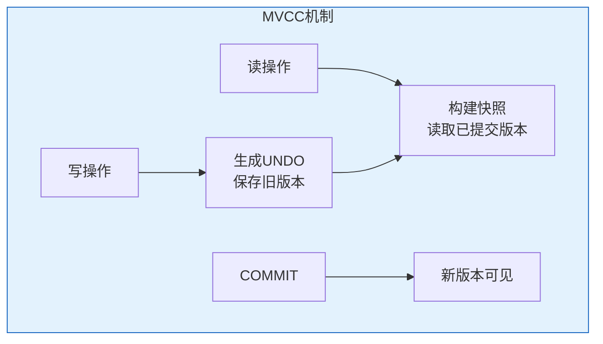
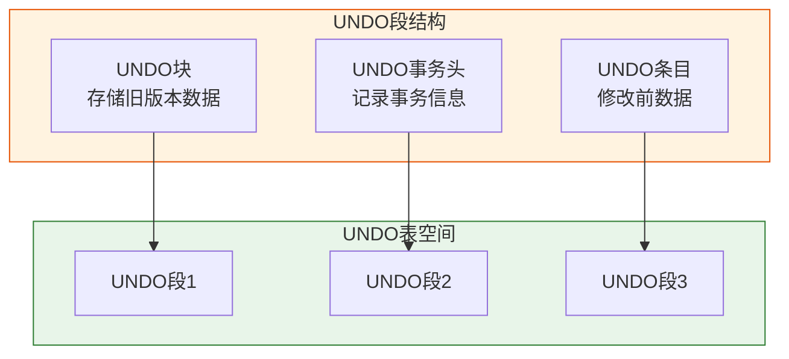
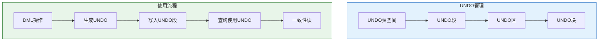

# Oracle MVCC多版本并发控制

## 一、概述

### 1.1 一句话定义

Oracle MVCC多版本并发控制，本质是Oracle数据库通过维护数据多个版本来实现读不阻塞写、写不阻塞读的并发控制机制。
它在Oracle事务管理中出现和使用，解决读写冲突，提高并发性能。

### 1.2 为什么重要

- **不掌握的后果：** 无法理解Oracle的并发行为，难以诊断ORA-01555等问题
- **掌握的价值：** 优化并发性能，正确配置UNDO空间

### 1.3 适用场景

| 场景 | 说明 |
|------|------|
| 并发优化 | 提高读写并发 |
| UNDO管理 | 配置UNDO空间 |
| 问题诊断 | 诊断ORA-01555 |
| 报表查询 | 保证读一致性 |

### 1.4 版本演进

| 版本 | 变化说明 |
|------|---------|
| 11gR2 | MVCC增强 |
| 12cR1 | Flashback增强 |
| 19c | UNDO管理优化 |
| 21c | MVCC性能提升 |

## 二、术语与概念

### 2.1 核心术语表

| 术语 | 含义 | 类比 |
|------|------|------|
| MVCC | 多版本并发控制 | 多版本文件 |
| UNDO | 回滚段，存储旧版本 | 历史版本 |
| 读一致性 | 读取已提交的数据 | 快照读取 |
| SCN | 系统变更号 | 时间戳 |
| ORA-01555 | 快照过旧错误 | 历史版本丢失 |

### 2.2 MVCC工作原理



## 三、核心原理

### 3.1 MVCC实现机制

**写操作：**
1. 修改数据块
2. 将修改前数据写入UNDO段
3. 生成REDO日志
4. 提交时标记新版本

**读操作：**
1. 获取当前SCN
2. 读取数据块
3. 如果数据块SCN > 查询SCN，使用UNDO构建旧版本
4. 返回一致性快照

```sql
-- MVCC示例
-- 事务1                          -- 事务2
SELECT balance FROM accounts       
WHERE account_id = 'A';            
-- SCN=100, 返回1000              
                                   UPDATE accounts
                                   SET balance = 2000
                                   WHERE account_id = 'A';
                                   -- 生成UNDO，记录旧值1000
                                   -- SCN=101
                                   
                                   -- 事务2未提交
                                   
SELECT balance FROM accounts       
WHERE account_id = 'A';            
-- SCN=102, 但事务2未提交         
-- 使用UNDO构建SCN=100的快照      
-- 返回1000（一致性读）
                                   
                                   COMMIT;
                                   -- SCN=103
                                   
SELECT balance FROM accounts       
WHERE account_id = 'A';            
-- SCN=104, 事务2已提交           
-- 返回2000（新版本）
```

### 3.2 UNDO段结构



```sql
-- 查看UNDO段
SELECT segment_name, tablespace_name, status
FROM dba_rollback_segs;

-- 查看UNDO使用
SELECT tablespace_name, status, COUNT(*)
FROM dba_undo_extents
GROUP BY tablespace_name, status;

-- 查看UNDO统计
SELECT name, value FROM v$sysstat
WHERE name LIKE '%undo%' OR name LIKE '%consistent%';
```

### 3.3 读一致性类型

**语句级读一致性（READ COMMITTED）：**
- 每条语句开始时获取快照
- 语句内看到一致的数据
- 语句间可以看到其他事务的提交

**事务级读一致性（SERIALIZABLE）：**
- 事务开始时获取快照
- 整个事务内看到一致的数据
- 看不到其他事务的修改

```sql
-- 语句级读一致性
-- 事务1                          -- 事务2
SELECT balance FROM accounts       
WHERE account_id = 'A';            
-- 语句开始，SCN=100              
                                   UPDATE accounts
                                   SET balance = 2000
                                   WHERE account_id = 'A';
                                   COMMIT;
                                   
SELECT balance FROM accounts       
WHERE account_id = 'A';            
-- 新语句，新SCN=102              
-- 看到2000（事务2已提交）

-- 事务级读一致性
-- 事务1                          -- 事务2
SET TRANSACTION ISOLATION LEVEL SERIALIZABLE;
                                   SET TRANSACTION ISOLATION LEVEL SERIALIZABLE;
                                   
SELECT balance FROM accounts       
WHERE account_id = 'A';            
-- 事务开始，SCN=100              
                                   UPDATE accounts
                                   SET balance = 2000
                                   WHERE account_id = 'A';
                                   COMMIT;
                                   
SELECT balance FROM accounts       
WHERE account_id = 'A';            
-- 同一事务，同一SCN=100          
-- 看到1000（快照）
```

### 3.4 SCN（System Change Number）

SCN是Oracle内部的时间戳，用于标识数据版本。

```sql
-- 查看当前SCN
SELECT current_scn FROM v$database;

-- 查看SCN与时间映射
SELECT SCN, TO_CHAR(TIME_DP, 'YYYY-MM-DD HH24:MI:SS') AS time
FROM sys.smon_scn_time
ORDER BY time DESC
FETCH FIRST 10 ROWS ONLY;

-- SCN与事务
SELECT xidusn, xidslot, xidsqn, start_scn, commit_scn
FROM v$transaction;
```

### 3.5 ORA-01555：快照过旧

当UNDO空间不足，旧版本被覆盖时，出现ORA-01555错误。

**产生原因：**
- 长查询需要旧版本
- UNDO空间不足
- 旧版本被覆盖

**解决方法：**
1. 增大UNDO表空间
2. 增加UNDO保留时间
3. 优化长查询
4. 避免在DML高峰期运行长查询

```sql
-- 查看UNDO保留时间
SHOW PARAMETER undo_retention;

-- 增加UNDO保留时间
ALTER SYSTEM SET undo_retention = 3600;  -- 1小时

-- 查看UNDO表空间大小
SELECT tablespace_name, 
       ROUND(SUM(bytes)/1024/1024/1024, 2) AS size_gb
FROM dba_data_files
WHERE tablespace_name LIKE '%UNDO%'
GROUP BY tablespace_name;

-- 扩展UNDO表空间
ALTER DATABASE DATAFILE '/u01/oradata/undo01.dbf' RESIZE 10G;

-- 添加UNDO数据文件
ALTER TABLESPACE undotbs1 
    ADD DATAFILE '/u01/oradata/undo02.dbf' SIZE 5G AUTOEXTEND ON;

-- 保证UNDO保留
ALTER TABLESPACE undotbs1 RETENTION GUARANTEE;
```

## 四、架构与组件

### 4.1 MVCC与锁对比

| 特性 | MVCC | 锁机制 |
|------|------|--------|
| 读写冲突 | 读不阻塞写 | 读阻塞写 |
| 实现方式 | 多版本 | 加锁 |
| 并发度 | 高 | 低 |
| 资源消耗 | UNDO空间 | 锁管理 |
| Oracle使用 | 默认读一致性 | SELECT FOR UPDATE |

### 4.2 UNDO管理架构



## 五、配置与参数

### 5.1 UNDO相关参数

```sql
-- 查看UNDO参数
SHOW PARAMETER undo_management;      -- AUTO/MANUAL
SHOW PARAMETER undo_tablespace;      -- UNDO表空间
SHOW PARAMETER undo_retention;       -- UNDO保留时间（秒）
SHOW PARAMETER _undo_autotune;       -- 自动调优

-- 配置UNDO
ALTER SYSTEM SET undo_management = AUTO;
ALTER SYSTEM SET undo_tablespace = undotbs1;
ALTER SYSTEM SET undo_retention = 3600;

-- 启用自动调优
ALTER SYSTEM SET "_undo_autotune" = TRUE;
```

### 5.2 UNDO表空间管理

```sql
-- 创建UNDO表空间
CREATE UNDO TABLESPACE undotbs2
    DATAFILE '/u01/oradata/undotbs2_01.dbf'
    SIZE 2G AUTOEXTEND ON NEXT 100M MAXSIZE 10G;

-- 切换UNDO表空间
ALTER SYSTEM SET undo_tablespace = undotbs2;

-- 删除UNDO表空间（先切换）
DROP TABLESPACE undotbs1 INCLUDING CONTENTS AND DATAFILES;

-- 查看UNDO使用
SELECT tablespace_name, status, 
       ROUND(SUM(bytes)/1024/1024, 2) AS size_mb
FROM dba_undo_extents
GROUP BY tablespace_name, status;
```

## 六、监控与诊断

### 6.1 UNDO监控

```sql
-- 查看UNDO使用率
SELECT tablespace_name,
       ROUND(SUM(CASE WHEN status = 'ACTIVE' THEN bytes ELSE 0 END)/1024/1024, 2) AS active_mb,
       ROUND(SUM(CASE WHEN status = 'UNEXPIRED' THEN bytes ELSE 0 END)/1024/1024, 2) AS unexpired_mb,
       ROUND(SUM(CASE WHEN status = 'EXPIRED' THEN bytes ELSE 0 END)/1024/1024, 2) AS expired_mb
FROM dba_undo_extents
GROUP BY tablespace_name;

-- 查看UNDO保留统计
SELECT MAX(MAXQUERYLEN) AS max_query_len,
       MAX(EXPBLKRELCNT) AS expired_blocks,
       MAX(UNXPBLKRELCNT) AS unexpired_blocks
FROM v$undostat;

-- 查看长查询
SELECT s.sid, s.serial#, s.username, s.sql_id,
       s.last_call_et AS elapsed_seconds
FROM v$session s
WHERE s.status = 'ACTIVE'
AND s.last_call_et > 3600;  -- 超过1小时
```

### 6.2 ORA-01555诊断

```sql
-- 查看ORA-01555历史
SELECT * FROM v$diag_alert_ext 
WHERE message_text LIKE '%ORA-01555%'
ORDER ORIGINATING_TIMESTAMP DESC;

-- 分析原因
SELECT undoblksdestroyed, undoblksreleased, 
       ssolderrcnt, nospacerrcnt
FROM v$undostat
WHERE ssolderrcnt > 0;

-- 解决方法
-- 1. 增大UNDO保留时间
ALTER SYSTEM SET undo_retention = 7200;  -- 2小时

-- 2. 扩展UNDO表空间
ALTER DATABASE DATAFILE '/u01/oradata/undo01.dbf' RESIZE 20G;

-- 3. 优化长查询
-- 4. 避免在DML高峰期运行长查询
```

### 6.3 MVCC性能监控

```sql
-- 查看一致性读统计
SELECT name, value FROM v$sysstat
WHERE name IN (
    'consistent gets',
    'consistent gets from cache',
    'consistent gets direct',
    'consistent changes'
);

-- 查看UNDO生成
SELECT name, value FROM v$sysstat
WHERE name LIKE '%undo%';

-- 查看回滚统计
SELECT name, value FROM v$sysstat
WHERE name LIKE '%rollback%';
```

## 七、实战案例

### 7.1 案例背景

- **场景**：报表查询出现ORA-01555
- **时间**：2026年
- **现象**：长查询失败

### 7.2 诊断过程

**步骤1：查看错误**

```sql
-- 错误日志
-- ORA-01555: snapshot too old: rollback segment number 5 with name "_SYSS5" too small
```

**步骤2：分析原因**

```sql
-- 查看查询时长
SELECT sql_id, elapsed_time/1000000 AS elapsed_sec
FROM v$sql
WHERE sql_id = 'xxx';
-- 结果：查询运行2小时

-- 查看UNDO保留
SHOW PARAMETER undo_retention;
-- 结果：900秒（15分钟）

-- 问题：查询时长 > UNDO保留时间
```

**步骤3：解决方案**

```sql
-- 方案1：增加UNDO保留时间
ALTER SYSTEM SET undo_retention = 7200;  -- 2小时

-- 方案2：扩展UNDO表空间
ALTER TABLESPACE undotbs1 
    ADD DATAFILE '/u01/oradata/undo02.dbf' SIZE 10G;

-- 方案3：保证UNDO保留
ALTER TABLESPACE undotbs1 RETENTION GUARANTEE;

-- 方案4：优化查询
-- 将长查询拆分为多个短查询
```

### 7.3 优化结果

| 指标 | 优化前 | 优化后 |
|------|--------|--------|
| ORA-01555 | 频繁 | 消除 |
| UNDO保留 | 15分钟 | 2小时 |
| UNDO空间 | 5GB | 15GB |

### 7.4 复盘总结

- **根因：** UNDO保留时间不足
- **教训：** 长查询需要足够的UNDO保留

## 八、常见错误与排查

### 8.1 常见错误

| 错误 | 问题 | 解决方法 |
|------|------|---------|
| ORA-01555 | 快照过旧 | 增大UNDO保留 |
| ORA-30036 | UNDO表空间满 | 扩展UNDO空间 |
| ORA-01628 | 无法扩展回滚段 | 增加UNDO数据文件 |

## 九、最佳实践

### 9.1 官方推荐

- 启用自动UNDO管理
- 设置合理的UNDO保留时间
- 监控UNDO使用率
- 使用RETENTION GUARANTEE

### 9.2 社区经验

- UNDO保留时间 > 最长查询时间
- UNDO空间预留20%余量
- 定期清理过期UNDO

### 9.3 反模式

| 反模式 | 问题 | 正确做法 |
|--------|------|---------|
| UNDO保留过短 | ORA-01555 | 根据查询时长设置 |
| UNDO空间不足 | 事务失败 | 预留足够空间 |
| 不监控UNDO | 问题未发现 | 定期监控 |

## 十、命令与视图汇总

### 10.1 命令列表

| 命令 | 适用场景 | 说明 |
|------|---------|------|
| `ALTER SYSTEM SET undo_retention` | 设置保留时间 | 配置UNDO保留 |
| `ALTER TABLESPACE ... RETENTION GUARANTEE` | 保证保留 | 强制保留 |
| `CREATE UNDO TABLESPACE` | 创建UNDO表空间 | 扩展UNDO |

### 10.2 视图列表

| 视图名 | 类型 | 用途 |
|--------|------|------|
| DBA_UNDO_EXTENTS | 数据字典 | UNDO使用 |
| V$UNDOSTAT | 动态 | UNDO统计 |
| V$TRANSACTION | 动态 | 事务信息 |
| V$SYSSTAT | 动态 | 系统统计 |

## 十一、总结速查

### 11.1 黄金法则

1. **UNDO保留 > 最长查询** - 避免ORA-01555
2. **预留UNDO空间** - 保证事务执行
3. **监控UNDO使用** - 及时发现问题
4. **使用RETENTION GUARANTEE** - 保证关键查询

### 11.2 一页纸检查清单

| 检查项 | 说明 |
|--------|------|
| UNDO保留时间 | > 最长查询时间 |
| UNDO空间 | 预留20%余量 |
| 自动管理 | 启用AUTO |
| 监控告警 | 定期监控 |

## 附录

### A. 官方参考

- [Oracle Database Administrator's Guide - Managing Undo](https://docs.oracle.com/en/database/oracle/oracle-database/19c/admin/)
- [Oracle Database Concepts - Undo](https://docs.oracle.com/en/database/oracle/oracle-database/19c/cncpt/undo.html)

### B. 修订记录

| 日期 | 版本 | 修改内容 | 修改人 |
|------|------|---------|--------|
| 2026-07-02 | v1.0 | 初始版本 | YashanDB知识库生成器 |
