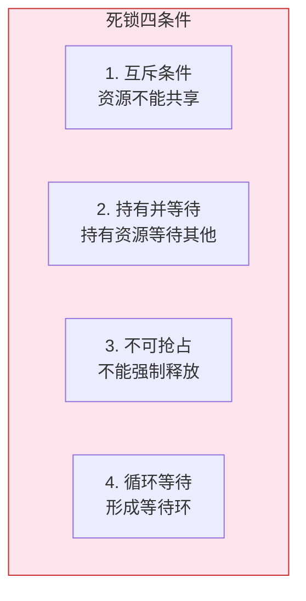
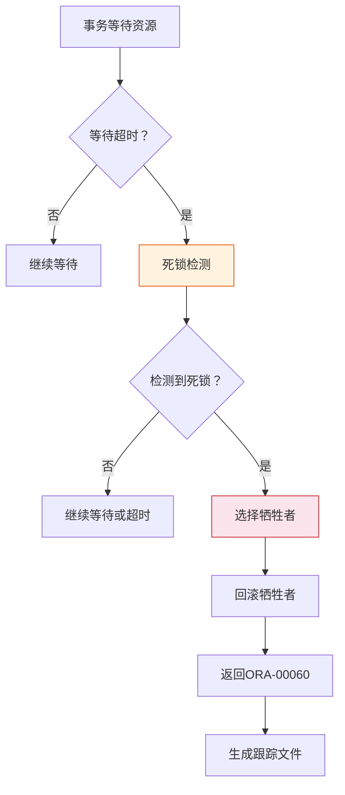

# Oracle死锁检测与处理

## 一、概述

### 1.1 一句话定义

Oracle死锁检测与处理，本质是Oracle数据库自动检测并解决多个事务相互等待对方持有的资源的情况。
它在Oracle并发控制中出现和使用，解决事务循环等待导致的系统僵死问题。

### 1.2 为什么重要

- **不掌握的后果：** 无法诊断和解决死锁问题，影响系统可用性
- **掌握的价值：** 快速定位死锁原因，预防死锁发生

### 1.3 适用场景

| 场景 | 说明 |
|------|------|
| 问题诊断 | 诊断ORA-00060 |
| 性能优化 | 减少死锁发生 |
| 应用开发 | 预防死锁 |
| 系统运维 | 处理死锁 |

### 1.4 版本演进

| 版本 | 变化说明 |
|------|---------|
| 11gR2 | 死锁检测优化 |
| 12cR1 | 死锁诊断增强 |
| 19c | 死锁跟踪改进 |
| 21c | 分布式死锁增强 |

## 二、术语与概念

### 2.1 核心术语表

| 术语 | 含义 | 类比 |
|------|------|------|
| 死锁 | 两个或多个事务相互等待 | 两人互不让路 |
| ORA-00060 | 死锁检测错误 | 死锁告警 |
| 死锁检测 | Oracle自动检测死锁 | 交通警察 |
| 牺牲者 | 被回滚的事务 | 退让的一方 |

### 2.2 死锁形成条件



## 三、核心原理

### 3.1 死锁示例

```sql
-- 死锁示例
-- 事务1                          -- 事务2
UPDATE accounts                    
SET balance = 1000                 
WHERE account_id = 'A';            
-- 锁定行A                        
                                   UPDATE accounts
                                   SET balance = 2000
                                   WHERE account_id = 'B';
                                   -- 锁定行B
                                   
UPDATE accounts                    
SET balance = 1100                 
WHERE account_id = 'B';            
-- 等待行B（被事务2锁定）         
                                   UPDATE accounts
                                   SET balance = 2100
                                   WHERE account_id = 'A';
                                   -- 等待行A（被事务1锁定）
                                   
-- 死锁形成！Oracle检测到死锁     
-- ORA-00060: deadlock detected   
```

### 3.2 Oracle死锁检测机制

**检测频率：** 每3秒检测一次

**检测算法：** 等待图（Wait-for Graph）


**处理流程：**
1. 检测到循环等待
2. 选择牺牲者（通常是最近执行的语句）
3. 回滚牺牲者的语句
4. 返回ORA-00060错误
5. 生成死锁跟踪文件

### 3.3 死锁跟踪文件

```sql
-- 查看死锁跟踪文件位置
SHOW PARAMETER user_dump_dest;
-- 或
SELECT value FROM v$diag_info WHERE name = 'Diag Trace';

-- 跟踪文件内容示例
-- Deadlock graph:
-- -------Blocker(s)--------  -------Waiter(s)---------
-- Resource Name          Process  Session  Opcodes  Process  Session  Opcodes
-- TX-000A0005-00000123   50       100      0x54     51       101      0x54
-- TX-000B0006-00000124   51       101      0x54     50       100      0x54

-- 分析：
-- 事务100等待事务101持有的资源
-- 事务101等待事务100持有的资源
-- 形成死锁
```

### 3.4 死锁类型

**数据库层死锁：**
- 行锁死锁
- 表锁死锁
- ITL死锁

**应用层死锁：**
- 逻辑死锁（应用逻辑导致）
- 分布式死锁（跨数据库）

```sql
-- ITL死锁示例
-- 多个事务同时更新同一块的不同行
-- 块头ITL槽不足导致死锁

-- 解决：增加INITRANS
ALTER TABLE employees INITRANS 8;
```

### 3.5 死锁预防

**预防策略：**

1. **统一访问顺序**
```sql
-- 所有事务按相同顺序访问资源
-- 事务1和事务2都先访问A，再访问B
UPDATE accounts SET balance = 1000 WHERE account_id = 'A';
UPDATE accounts SET balance = 2000 WHERE account_id = 'B';
```

2. **缩短事务**
```sql
-- 减少锁持有时间
BEGIN
    UPDATE accounts SET balance = 1000 WHERE account_id = 'A';
    COMMIT;  -- 及时提交
    
    UPDATE accounts SET balance = 2000 WHERE account_id = 'B';
    COMMIT;
END;
```

3. **使用超时**
```sql
-- 设置锁等待超时
ALTER SESSION SET ddl_lock_timeout = 10;
```

4. **乐观锁**
```sql
-- 使用版本号避免死锁
UPDATE accounts 
SET balance = 1000, version = version + 1
WHERE account_id = 'A' AND version = 1;
```

## 四、架构与组件

### 4.1 死锁检测流程



### 4.2 等待图构建

Oracle通过等待图检测死锁：

```
等待图节点：事务
等待图边：事务A等待事务B持有的资源

检测算法：深度优先搜索（DFS）查找环
```

## 五、配置与参数

### 5.1 死锁相关参数

```sql
-- 查看死锁相关参数
SHOW PARAMETER _deadlock_detection;  -- 死锁检测间隔（隐藏参数）

-- 设置锁等待超时
ALTER SYSTEM SET ddl_lock_timeout = 30;  -- DDL锁超时
ALTER SESSION SET ddl_lock_timeout = 10;
```

### 5.2 死锁监控

```sql
-- 查看当前锁等待
SELECT 
    blocking.sid AS blocker_sid,
    blocking.serial# AS blocker_serial,
    waiting.sid AS waiter_sid,
    waiting.serial# AS waiter_serial,
    waiting.sql_id
FROM v$session blocking
JOIN v$session waiting ON blocking.sid = waiting.blocking_session;

-- 查看死锁历史
SELECT * FROM v$diag_alert_ext 
WHERE message_text LIKE '%ORA-00060%'
ORDER BY originating_timestamp DESC;
```

## 六、监控与诊断

### 6.1 死锁诊断

```sql
-- 查看死锁跟踪文件
-- 位置：$ORACLE_BASE/diag/rdbms/<db>/<instance>/trace/

-- 分析跟踪文件
-- 查找"Deadlock graph"部分
-- 识别涉及的事务和会话

-- 查看相关SQL
SELECT sql_id, sql_text FROM v$sql 
WHERE sql_id IN (
    SELECT sql_id FROM v$session 
    WHERE sid IN (100, 101)
);
```

### 6.2 死锁统计

```sql
-- 查看死锁统计
SELECT name, value FROM v$sysstat
WHERE name LIKE '%deadlock%';

-- 查看锁等待统计
SELECT name, value FROM v$sysstat
WHERE name LIKE '%lock%' OR name LIKE '%wait%';
```

### 6.3 死锁预防检查

```sql
-- 检查ITL配置
SELECT table_name, ini_trans, max_trans
FROM dba_tables
WHERE owner = 'HR';

-- 检查热点表
SELECT object_name, statistic_name, value
FROM v$segment_statistics
WHERE statistic_name = 'row lock waits'
ORDER BY value DESC
FETCH FIRST 10 ROWS ONLY;
```

## 七、实战案例

### 7.1 案例背景

- **场景**：订单系统频繁出现ORA-00060
- **时间**：2026年
- **现象**：订单更新死锁

### 7.2 诊断过程

**步骤1：查看死锁跟踪文件**

```
Deadlock graph:
-------Blocker(s)--------  -------Waiter(s)---------
Resource Name          Process  Session  Process  Session
TX-000A0005-00000123   50       100      51       101
TX-000B0006-00000124   51       101      50       100

Current SQL:
UPDATE orders SET status = 'SHIPPED' WHERE order_id = 1001
```

**步骤2：分析应用逻辑**

```sql
-- 问题代码
-- 事务1：更新订单A，然后更新订单B
-- 事务2：更新订单B，然后更新订单A
-- 访问顺序不一致导致死锁
```

**步骤3：修复方案**

```sql
-- 方案1：统一访问顺序
-- 所有事务按order_id排序后访问
SELECT order_id FROM orders WHERE status = 'PENDING' ORDER BY order_id;

-- 方案2：使用SELECT FOR UPDATE NOWAIT
UPDATE orders SET status = 'PROCESSING' 
WHERE order_id = 1001 AND status = 'PENDING';

-- 方案3：使用乐观锁
UPDATE orders 
SET status = 'SHIPPED', version = version + 1
WHERE order_id = 1001 AND version = 1;
```

### 7.3 修复结果

| 指标 | 修复前 | 修复后 |
|------|--------|--------|
| ORA-00060 | 频繁 | 消除 |
| 死锁次数 | 100+/天 | 0 |
| 系统稳定性 | 差 | 良好 |

### 7.4 复盘总结

- **根因：** 事务访问资源顺序不一致
- **教训：** 统一资源访问顺序，使用乐观锁

## 八、常见错误与排查

### 8.1 常见错误

| 错误 | 问题 | 解决方法 |
|------|------|---------|
| ORA-00060 | 死锁检测 | 分析跟踪文件，修复应用逻辑 |
| ORA-00054 | 资源忙 | 等待或优化 |
| 应用层死锁 | 逻辑错误 | 统一访问顺序 |

## 九、最佳实践

### 9.1 官方推荐

- 统一资源访问顺序
- 缩短事务长度
- 使用NOWAIT或SKIP LOCKED
- 监控死锁统计

### 9.2 社区经验

- 使用乐观锁避免死锁
- 定期分析死锁跟踪文件
- 增加ITL减少ITL死锁

### 9.3 反模式

| 反模式 | 问题 | 正确做法 |
|--------|------|---------|
| 不一致的访问顺序 | 死锁 | 统一顺序 |
| 长事务 | 锁持有时间长 | 分批提交 |
| 不处理ORA-00060 | 事务失败 | 重试机制 |

## 十、命令与视图汇总

### 10.1 命令列表

| 命令 | 适用场景 | 说明 |
|------|---------|------|
| `SELECT ... FOR UPDATE NOWAIT` | 避免等待 | 立即返回错误 |
| `SELECT ... FOR UPDATE SKIP LOCKED` | 跳过锁定行 | 处理队列 |
| `ALTER SYSTEM KILL SESSION` | 杀掉会话 | 解决阻塞 |

### 10.2 视图列表

| 视图名 | 类型 | 用途 |
|--------|------|------|
| V$LOCK | 动态 | 锁信息 |
| V$SESSION | 动态 | 会话信息 |
| V$DIAG_ALERT_EXT | 动态 | 告警信息 |

## 十一、总结速查

### 11.1 黄金法则

1. **统一访问顺序** - 预防死锁
2. **缩短事务** - 减少锁持有时间
3. **使用NOWAIT** - 避免长时间等待
4. **分析跟踪文件** - 定位死锁原因

### 11.2 一页纸检查清单

| 检查项 | 说明 |
|--------|------|
| 访问顺序 | 统一顺序 |
| 事务长度 | 避免长事务 |
| 死锁监控 | 定期查看 |
| 跟踪文件 | 分析ORA-00060 |

## 附录

### A. 官方参考

- [Oracle Database Administrator's Guide - Deadlocks](https://docs.oracle.com/en/database/oracle/oracle-database/19c/admin/)
- [Oracle Database Concepts - Deadlock Detection](https://docs.oracle.com/en/database/oracle/oracle-database/19c/cncpt/concurrency-control.html)

### B. 修订记录

| 日期 | 版本 | 修改内容 | 修改人 |
|------|------|---------|--------|
| 2026-07-02 | v1.0 | 初始版本 | YashanDB知识库生成器 |
