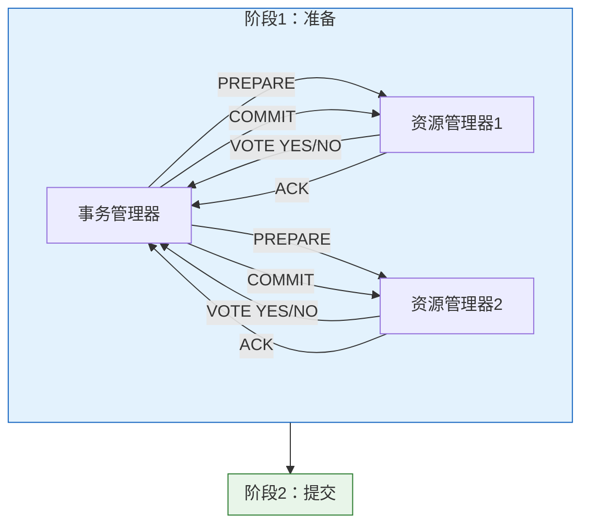
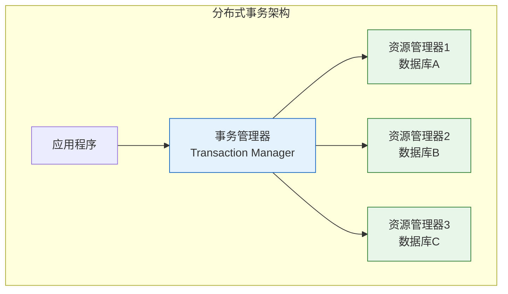

# Oracle分布式事务管理

## 一、概述

### 1.1 一句话定义

Oracle分布式事务管理，本质是跨多个数据库节点保证事务原子性的机制，使用两阶段提交（2PC）协议协调多个资源管理器。
它在Oracle分布式数据库中出现和使用，解决跨数据库事务的一致性问题。

### 1.2 为什么重要

- **不掌握的后果：** 无法保证跨数据库事务一致性，可能出现悬挂事务
- **掌握的价值：** 设计可靠的分布式应用，处理分布式事务故障

### 1.3 适用场景

| 场景 | 说明 |
|------|------|
| 跨库事务 | 多个数据库操作 |
| 微服务 | 分布式服务协调 |
| 数据同步 | 多库数据一致 |
| 容灾系统 | 跨站点事务 |

### 1.4 版本演进

| 版本 | 变化说明 |
|------|---------|
| 11gR2 | XA增强 |
| 12cR1 | 分布式事务优化 |
| 19c | 性能提升 |
| 21c | 云原生分布式事务 |

## 二、术语与概念

### 2.1 核心术语表

| 术语 | 含义 | 类比 |
|------|------|------|
| 分布式事务 | 跨多个数据库的事务 | 多地同时操作 |
| 两阶段提交 | 2PC协议 | 先投票再执行 |
| 事务管理器 | 协调分布式事务 | 总指挥 |
| 资源管理器 | 管理本地资源 | 分部经理 |
| 悬挂事务 | 未完成的分布式事务 | 半成品 |

### 2.2 两阶段提交流程



## 三、核心原理

### 3.1 两阶段提交（2PC）

**阶段1：准备（Prepare）**
1. 事务管理器向所有资源管理器发送PREPARE
2. 资源管理器执行本地事务，但不提交
3. 资源管理器将UNDO和REDO写入磁盘
4. 资源管理器投票：YES（准备就绪）或NO（失败）

**阶段2：提交/回滚（Commit/Rollback）**
- 如果所有资源管理器投票YES：发送COMMIT
- 如果任一资源管理器投票NO：发送ROLLBACK

```sql
-- 分布式事务示例
-- 数据库链接
CREATE DATABASE LINK remote_db 
CONNECT TO user IDENTIFIED BY password 
USING 'remote_db';

-- 分布式事务
BEGIN
    -- 本地操作
    UPDATE accounts SET balance = balance - 100 WHERE account_id = 'A';
    
    -- 远程操作
    UPDATE accounts@remote_db SET balance = balance + 100 WHERE account_id = 'B';
    
    -- 提交分布式事务
    COMMIT;
END;
/
```

### 3.2 XA协议

XA是X/Open组织定义的标准分布式事务协议。

```sql
-- 查看XA支持
SELECT * FROM dba_pending_transactions;

-- XA事务流程
-- 1. xa_start() - 开始XA事务
-- 2. 执行SQL操作
-- 3. xa_end() - 结束XA事务
-- 4. xa_prepare() - 准备阶段
-- 5. xa_commit() / xa_rollback() - 提交/回滚

-- Oracle XA开关
ALTER SYSTEM SET "_enable_xa" = TRUE;
```

### 3.3 悬挂事务（In-Doubt Transaction）

当2PC阶段2失败时，事务处于悬挂状态。

**产生原因：**
- 网络故障
- 节点崩溃
- 资源管理器故障

```sql
-- 查看悬挂事务
SELECT local_tran_id, global_tran_id, state, mixed, 
       host, os_user, process, branch
FROM dba_2pc_pending;

-- 悬挂事务状态
-- collecting: 收集投票
-- committed: 已提交
-- prepared: 已准备
-- forced commit: 强制提交
-- forced rollback: 强制回滚
```

### 3.4 悬挂事务处理

```sql
-- 强制提交
EXEC DBMS_TRANSACTION.PURGE_MIXED('local_tran_id');
EXEC DBMS_TRANSACTION.COMMIT_FORCE('local_tran_id');

-- 强制回滚
EXEC DBMS_TRANSACTION.ROLLBACK_FORCE('local_tran_id');

-- 清理悬挂事务
BEGIN
    FOR rec IN (SELECT local_tran_id FROM dba_2pc_pending) LOOP
        DBMS_TRANSACTION.PURGE_MIXED(rec.local_tran_id);
    END LOOP;
END;
/
```

### 3.5 分布式事务监控

```sql
-- 查看活动分布式事务
SELECT local_tran_id, global_tran_id, state, status
FROM dba_2pc_pending
WHERE state != 'committed';

-- 查看分布式事务统计
SELECT name, value FROM v$sysstat
WHERE name LIKE '%transaction%' OR name LIKE '%distributed%';

-- 查看数据库链接
SELECT * FROM dba_db_links;
```

## 四、架构与组件

### 4.1 分布式事务架构



### 4.2 事务管理器角色

**职责：**
- 协调分布式事务
- 发送PREPARE/COMMIT/ROLLBACK
- 维护事务状态
- 处理故障恢复

**Oracle实现：**
- RECO进程（Recover）
- DBA_2PC_PENDING视图
- DBMS_TRANSACTION包

## 五、配置与参数

### 5.1 分布式事务参数

```sql
-- 查看分布式事务参数
SHOW PARAMETER global_names;           -- 全局名称
SHOW PARAMETER open_links;             -- 打开的链接数
SHOW PARAMETER distributed_lock_timeout; -- 分布式锁超时
SHOW PARAMETER _enable_xa;             -- XA支持

-- 配置参数
ALTER SYSTEM SET global_names = TRUE;
ALTER SYSTEM SET open_links = 10;
ALTER SYSTEM SET distributed_lock_timeout = 60;
```

### 5.2 数据库链接配置

```sql
-- 创建数据库链接
CREATE DATABASE LINK remote_db 
CONNECT TO user IDENTIFIED BY password 
USING 'remote_db';

-- 创建公共数据库链接
CREATE PUBLIC DATABASE LINK remote_db 
CONNECT TO user IDENTIFIED BY password 
USING 'remote_db';

-- 测试数据库链接
SELECT * FROM dual@remote_db;

-- 关闭数据库链接
ALTER SESSION CLOSE DATABASE LINK remote_db;
```

## 六、监控与诊断

### 6.1 分布式事务监控

```sql
-- 查看活动分布式事务
SELECT s.sid, s.serial#, s.username, s.status,
       t.local_tran_id, t.global_tran_id, t.state
FROM v$session s
JOIN v$transaction t ON s.saddr = t.ses_addr
WHERE t.state != 'ACTIVE';

-- 查看悬挂事务
SELECT local_tran_id, global_tran_id, state, 
       host, os_user, process
FROM dba_2pc_pending;

-- 查看数据库链接使用
SELECT * FROM v$dblink;
```

### 6.2 故障诊断

```sql
-- 诊断悬挂事务
SELECT local_tran_id, global_tran_id, state, 
       mixed, host, os_user, process, branch
FROM dba_2pc_pending
WHERE state = 'prepared';

-- 分析事务日志
-- 位置：$ORACLE_HOME/diag/rdbms/<db>/<instance>/trace/

-- 查看RECO进程
SELECT paddr, pid, spid, program
FROM v$bgprocess
WHERE name = 'RECO';
```

### 6.3 性能监控

```sql
-- 查看分布式事务统计
SELECT name, value FROM v$sysstat
WHERE name LIKE '%distributed%' OR name LIKE '%remote%';

-- 查看数据库链接性能
SELECT db_link, owner, in_use, update_sent
FROM v$dblink;
```

## 七、实战案例

### 7.1 案例背景

- **场景**：跨数据中心转账
- **时间**：2026年
- **现象**：分布式事务悬挂

### 7.2 诊断过程

**步骤1：查看悬挂事务**

```sql
SELECT local_tran_id, global_tran_id, state, host
FROM dba_2pc_pending;

-- 结果：1个悬挂事务
-- local_tran_id: 1.23.456
-- state: prepared
```

**步骤2：分析原因**

```
-- 事务日志显示：
-- 阶段1完成，所有资源管理器投票YES
-- 阶段2开始时，网络故障
-- 一个资源管理器未收到COMMIT
```

**步骤3：处理悬挂事务**

```sql
-- 强制提交
EXEC DBMS_TRANSACTION.COMMIT_FORCE('1.23.456');

-- 或强制回滚
EXEC DBMS_TRANSACTION.ROLLBACK_FORCE('1.23.456');

-- 清理
EXEC DBMS_TRANSACTION.PURGE_MIXED('1.23.456');
```

### 7.3 预防措施

```sql
-- 1. 增加超时时间
ALTER SYSTEM SET distributed_lock_timeout = 120;

-- 2. 监控网络
-- 3. 定期清理悬挂事务
BEGIN
    FOR rec IN (SELECT local_tran_id FROM dba_2pc_pending) LOOP
        DBMS_TRANSACTION.PURGE_MIXED(rec.local_tran_id);
    END LOOP;
END;
/
```

### 7.4 复盘总结

- **根因：** 网络故障导致2PC阶段2失败
- **教训：** 增加超时时间，定期清理悬挂事务

## 八、常见错误与排查

### 8.1 常见错误

| 错误 | 问题 | 解决方法 |
|------|------|---------|
| ORA-02049 | 分布式事务超时 | 增加超时时间 |
| ORA-02050 | 分布式事务回滚 | 检查网络和资源 |
| ORA-02054 | 分布式事务提交失败 | 处理悬挂事务 |
| ORA-02055 | 分布式事务更新失败 | 检查数据库链接 |

## 九、最佳实践

### 9.1 官方推荐

- 使用XA标准协议
- 设置合理的超时时间
- 定期清理悬挂事务
- 监控分布式事务统计

### 9.2 社区经验

- 尽量减少分布式事务
- 使用消息队列替代
- 实现最终一致性

### 9.3 反模式

| 反模式 | 问题 | 正确做法 |
|--------|------|---------|
| 过度使用分布式事务 | 性能差 | 使用消息队列 |
| 不处理悬挂事务 | 资源泄漏 | 定期清理 |
| 超时时间过短 | 事务失败 | 合理设置超时 |

## 十、命令与视图汇总

### 10.1 命令列表

| 命令 | 适用场景 | 说明 |
|------|---------|------|
| `CREATE DATABASE LINK` | 创建数据库链接 | 连接远程数据库 |
| `DBMS_TRANSACTION.COMMIT_FORCE` | 强制提交 | 处理悬挂事务 |
| `DBMS_TRANSACTION.ROLLBACK_FORCE` | 强制回滚 | 处理悬挂事务 |

### 10.2 视图列表

| 视图名 | 类型 | 用途 |
|--------|------|------|
| DBA_2PC_PENDING | 数据字典 | 悬挂事务 |
| DBA_DB_LINKS | 数据字典 | 数据库链接 |
| V$DBLINK | 动态 | 链接使用 |
| V$TRANSACTION | 动态 | 事务信息 |

## 十一、总结速查

### 11.1 黄金法则

1. **尽量减少分布式事务** - 性能考虑
2. **设置合理超时** - 避免长时间等待
3. **定期清理悬挂事务** - 防止资源泄漏
4. **监控网络稳定性** - 保证2PC成功

### 11.2 一页纸检查清单

| 检查项 | 说明 |
|--------|------|
| 数据库链接 | 测试连通性 |
| 超时设置 | 合理设置 |
| 悬挂事务 | 定期清理 |
| 网络监控 | 保证稳定 |

## 附录

### A. 官方参考

- [Oracle Database Administrator's Guide - Distributed Transactions](https://docs.oracle.com/en/database/oracle/oracle-database/19c/admin/)
- [Oracle Database Development Guide - XA Applications](https://docs.oracle.com/en/database/oracle/oracle-database/19c/adfns/)

### B. 修订记录

| 日期 | 版本 | 修改内容 | 修改人 |
|------|------|---------|--------|
| 2026-07-02 | v1.0 | 初始版本 | YashanDB知识库生成器 |
