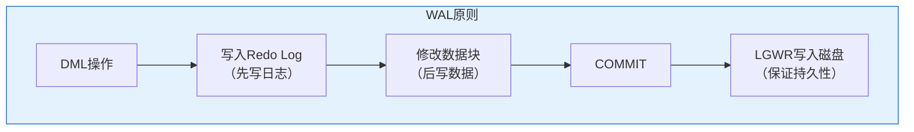
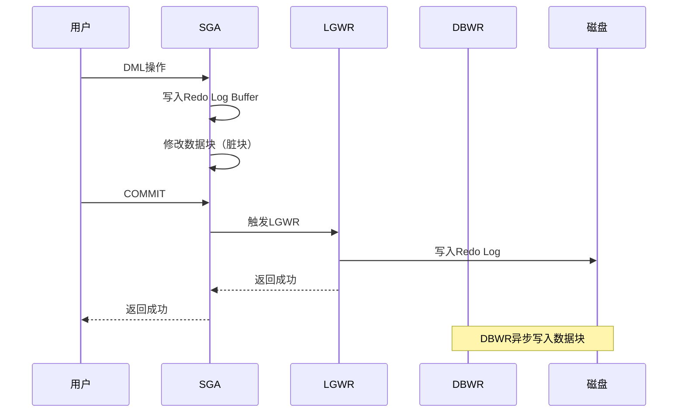

# Oracle WAL原则与Redo机制

## 一、概述

### 1.1 一句话定义

Oracle WAL（Write-Ahead Logging）原则与Redo机制，本质是Oracle数据库保证事务持久性的核心机制，通过先写日志再写数据的方式确保数据不丢失。
它在Oracle日志恢复中出现和使用，解决系统崩溃后的数据恢复问题。

### 1.2 为什么重要

- **不掌握的后果：** 无法理解Oracle的持久性保证，难以配置和优化日志系统
- **掌握的价值：** 正确配置Redo日志，优化日志写入性能

### 1.3 适用场景

| 场景 | 说明 |
|------|------|
| 持久性保证 | 保证数据不丢失 |
| 崩溃恢复 | 系统崩溃后恢复 |
| 性能优化 | 优化日志写入 |
| 介质恢复 | 数据文件恢复 |

### 1.4 版本演进

| 版本 | 变化说明 |
|------|---------|
| 11gR2 | 日志写入优化 |
| 12cR1 | 日志压缩 |
| 19c | 日志性能提升 |
| 21c | 云原生日志 |

## 二、术语与概念

### 2.1 核心术语表

| 术语 | 含义 | 类比 |
|------|------|------|
| WAL | Write-Ahead Logging | 先记账后办事 |
| Redo Log | 重做日志 | 操作记录 |
| LGWR | 日志写入进程 | 记账员 |
| SCN | 系统变更号 | 时间戳 |
| LSN | 日志序列号 | 日志编号 |

### 2.2 WAL原则



**WAL原则：**
1. 所有修改必须先写入Redo日志
2. Redo日志必须先于数据块写入磁盘
3. 保证崩溃后可以通过Redo恢复

## 三、核心原理

### 3.1 Redo Log结构


**Redo Record包含：**
- SCN（系统变更号）
- 变更类型（INSERT/UPDATE/DELETE）
- 变更前的数据（用于回滚）
- 变更后的数据（用于重做）

### 3.2 LGWR进程

LGWR（Log Writer）负责将Redo Log Buffer写入磁盘。

**触发条件：**
- COMMIT时
- Redo Log Buffer 1/3满
- 超过3秒
- DBWR需要写入时
- 日志切换时

```sql
-- 查看LGWR进程
SELECT paddr, pid, spid, program
FROM v$bgprocess
WHERE name = 'LGWR';

-- 查看LGWR统计
SELECT name, value FROM v$sysstat
WHERE name LIKE '%redo%' OR name LIKE '%log%';
```

### 3.3 Redo Log Buffer

Redo Log Buffer是SGA中的日志缓冲区。

```sql
-- 查看Redo Log Buffer大小
SHOW PARAMETER log_buffer;

-- 默认大小：
-- 小系统：几MB
-- 大系统：几十MB
-- 最大：不超过SGA的1%

-- 配置Redo Log Buffer
ALTER SYSTEM SET log_buffer = 16M;
```

### 3.4 Redo Log Group

Oracle使用日志组循环写入。

```sql
-- 查看日志组
SELECT group#, sequence#, bytes/1024/1024 AS size_mb,
       members, status, archived
FROM v$log;

-- 查看日志成员
SELECT group#, member, status
FROM v$logfile;

-- 日志组状态：
-- CURRENT：当前使用
-- ACTIVE：活动（可能需要实例恢复）
-- INACTIVE：非活动（可以覆盖）
```

### 3.5 日志切换

当日志组写满时，切换到下一个日志组。

```sql
-- 手动切换日志
ALTER SYSTEM SWITCH LOGFILE;

-- 查看切换历史
SELECT * FROM v$log_history
ORDER BY first_time DESC
FETCH FIRST 10 ROWS ONLY;

-- 日志切换触发检查点
-- 检查点将脏块写入磁盘
```

### 3.6 归档日志

归档日志是已填满的Redo日志的副本。

```sql
-- 查看归档模式
ARCHIVE LOG LIST;

-- 启用归档模式
SHUTDOWN IMMEDIATE;
STARTUP MOUNT;
ALTER DATABASE ARCHIVELOG;
ALTER DATABASE OPEN;

-- 配置归档位置
ALTER SYSTEM SET log_archive_dest_1 = 'LOCATION=/u01/archive';

-- 查看归档日志
SELECT name, sequence#, first_time, next_time, 
       bytes/1024/1024 AS size_mb
FROM v$archived_log
ORDER BY first_time DESC;
```

## 四、架构与组件

### 4.1 WAL实现流程



### 4.2 Redo与UNDO对比

| 特性 | Redo | UNDO |
|------|------|------|
| 用途 | 恢复（前滚） | 回滚（后滚） |
| 内容 | 修改后的数据 | 修改前的数据 |
| 写入时机 | DML时 | DML时 |
| 持久化 | 必须 | 可选 |
| 进程 | LGWR | 无专用进程 |

## 五、配置与参数

### 5.1 Redo相关参数

```sql
-- 查看Redo参数
SHOW PARAMETER log_buffer;           -- Redo缓冲区
SHOW PARAMETER log_archive_dest_1;   -- 归档位置
SHOW PARAMETER log_checkpoint_interval; -- 检查点间隔
SHOW PARAMETER fast_start_mttr_target;  -- MTTR目标

-- 配置参数
ALTER SYSTEM SET log_buffer = 32M;
ALTER SYSTEM SET log_archive_dest_1 = 'LOCATION=/u01/archive';
ALTER SYSTEM SET fast_start_mttr_target = 60;
```

### 5.2 Redo日志配置

```sql
-- 添加日志组
ALTER DATABASE ADD LOGFILE GROUP 4 
    ('/u01/oradata/redo04.log', '/u02/oradata/redo04.log') 
    SIZE 100M;

-- 添加日志成员
ALTER DATABASE ADD LOGFILE MEMBER 
    '/u03/oradata/redo01.log' TO GROUP 1;

-- 删除日志组
ALTER DATABASE DROP LOGFILE GROUP 4;

-- 清空日志组
ALTER DATABASE CLEAR LOGFILE GROUP 1;

-- 切换日志
ALTER SYSTEM SWITCH LOGFILE;
```

### 5.3 日志大小建议

| 场景 | 建议大小 | 说明 |
|------|---------|------|
| OLTP小系统 | 50-100MB | 频繁切换影响性能 |
| OLTP大系统 | 500MB-1GB | 减少切换频率 |
| 数据仓库 | 1-2GB | 批量加载 |
| 高并发 | 根据切换频率调整 | 避免频繁切换 |

## 六、监控与诊断

### 6.1 Redo生成监控

```sql
-- 查看Redo生成速率
SELECT name, value FROM v$sysstat
WHERE name = 'redo size';

-- 查看每秒Redo生成
SELECT ROUND(value / (SELECT seconds FROM v$timer), 2) AS redo_per_sec
FROM v$sysstat
WHERE name = 'redo size';

-- 查看日志切换频率
SELECT TO_CHAR(first_time, 'YYYY-MM-DD HH24') AS hour,
       COUNT(*) AS switches
FROM v$log_history
WHERE first_time > SYSDATE - 1
GROUP BY TO_CHAR(first_time, 'YYYY-MM-DD HH24')
ORDER BY hour;
```

### 6.2 LGWR性能监控

```sql
-- 查看LGWR等待事件
SELECT event, total_waits, time_waited
FROM v$system_event
WHERE event LIKE '%log file%'
ORDER BY time_waited DESC;

-- 常见等待事件：
-- log file sync：COMMIT等待
-- log file parallel write：LGWR写入等待
-- log file switch completion：日志切换等待

-- 查看LGWR统计
SELECT name, value FROM v$sysstat
WHERE name LIKE '%redo%' OR name LIKE '%log%';
```

### 6.3 日志切换优化

```sql
-- 日志切换过于频繁
-- 症状：log file switch等待多
-- 解决：增大日志文件大小

-- 日志切换太少
-- 症状：实例恢复时间长
-- 解决：减小日志文件大小或增加检查点频率

-- 查看MTTR
SELECT target_mttr, estimated_mttr
FROM v$instance_recovery;
```

## 七、实战案例

### 7.1 案例背景

- **场景**：系统COMMIT性能差
- **时间**：2026年
- **现象**：log file sync等待多

### 7.2 诊断过程

**步骤1：查看等待事件**

```sql
SELECT event, total_waits, time_waited
FROM v$system_event
WHERE event = 'log file sync';

-- 结果：等待时间占系统总时间的30%
```

**步骤2：分析原因**

```sql
-- 查看Redo日志大小
SELECT group#, bytes/1024/1024 AS size_mb
FROM v$log;

-- 结果：日志文件只有10MB，频繁切换

-- 查看Redo生成速率
SELECT ROUND(value / 1024 / 1024, 2) AS redo_mb
FROM v$sysstat
WHERE name = 'redo size';

-- 结果：每秒生成5MB Redo
```

**步骤3：优化方案**

```sql
-- 方案1：增大日志文件
ALTER DATABASE ADD LOGFILE GROUP 4 SIZE 500M;
ALTER DATABASE DROP LOGFILE GROUP 1;

-- 方案2：优化COMMIT频率
-- 批量操作后统一COMMIT

-- 方案3：使用异步提交
ALTER SYSTEM SET commit_write = 'NOWAIT';
```

### 7.3 优化结果

| 指标 | 优化前 | 优化后 |
|------|--------|--------|
| log file sync等待 | 30% | 5% |
| 日志切换频率 | 10次/分钟 | 1次/分钟 |
| COMMIT响应时间 | 50ms | 5ms |

### 7.4 复盘总结

- **根因：** Redo日志文件过小，频繁切换
- **教训：** 根据Redo生成速率配置日志文件大小

## 八、常见错误与排查

### 8.1 常见错误

| 错误 | 问题 | 解决方法 |
|------|------|---------|
| ORA-00257 | 归档空间满 | 清理归档日志 |
| ORA-00313 | 日志文件丢失 | 恢复日志文件 |
| ORA-00316 | 日志文件损坏 | 恢复或重建 |
| log file sync等待多 | COMMIT性能差 | 优化日志配置 |

## 九、最佳实践

### 9.1 官方推荐

- 启用归档模式
- 日志文件至少2个成员
- 根据Redo生成速率配置日志大小
- 监控日志切换频率

### 9.2 社区经验

- 日志文件大小500MB-1GB
- 日志切换频率1-2次/小时
- 使用SSD存储Redo日志
- 分离Redo和数据文件到不同磁盘

### 9.3 反模式

| 反模式 | 问题 | 正确做法 |
|--------|------|---------|
| 日志文件过小 | 频繁切换 | 增大日志文件 |
| 不启用归档 | 无法介质恢复 | 启用归档模式 |
| 单成员日志 | 单点故障 | 至少2个成员 |
| Redo和数据同磁盘 | I/O竞争 | 分离到不同磁盘 |

## 十、命令与视图汇总

### 10.1 命令列表

| 命令 | 适用场景 | 说明 |
|------|---------|------|
| `ALTER DATABASE ADD LOGFILE` | 添加日志 | 创建日志组 |
| `ALTER SYSTEM SWITCH LOGFILE` | 切换日志 | 手动切换 |
| `ALTER DATABASE ARCHIVELOG` | 启用归档 | 归档模式 |

### 10.2 视图列表

| 视图名 | 类型 | 用途 |
|--------|------|------|
| V$LOG | 动态 | 日志组信息 |
| V$LOGFILE | 动态 | 日志成员 |
| V$LOG_HISTORY | 动态 | 切换历史 |
| V$ARCHIVED_LOG | 动态 | 归档日志 |
| V$SYSSTAT | 动态 | Redo统计 |

## 十一、总结速查

### 11.1 黄金法则

1. **WAL原则** - 先写日志后写数据
2. **启用归档模式** - 保证可恢复性
3. **合理配置日志大小** - 避免频繁切换
4. **多成员日志** - 避免单点故障

### 11.2 一页纸检查清单

| 检查项 | 说明 |
|--------|------|
| 归档模式 | 生产环境必须启用 |
| 日志大小 | 500MB-1GB |
| 日志成员 | 至少2个 |
| 切换频率 | 1-2次/小时 |

## 附录

### A. 官方参考

- [Oracle Database Administrator's Guide - Managing Redo Log Files](https://docs.oracle.com/en/database/oracle/oracle-database/19c/admin/)
- [Oracle Database Concepts - Redo and Undo](https://docs.oracle.com/en/database/oracle/oracle-database/19c/cncpt/redo-and-undo.html)

### B. 修订记录

| 日期 | 版本 | 修改内容 | 修改人 |
|------|------|---------|--------|
| 2026-07-02 | v1.0 | 初始版本 | YashanDB知识库生成器 |
