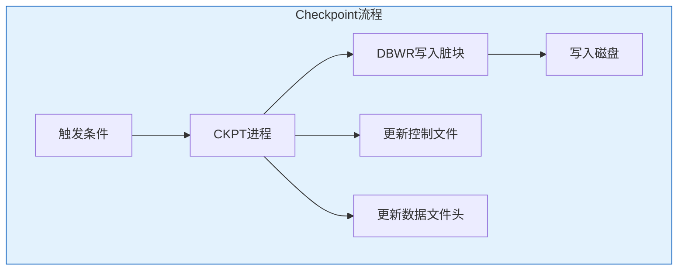
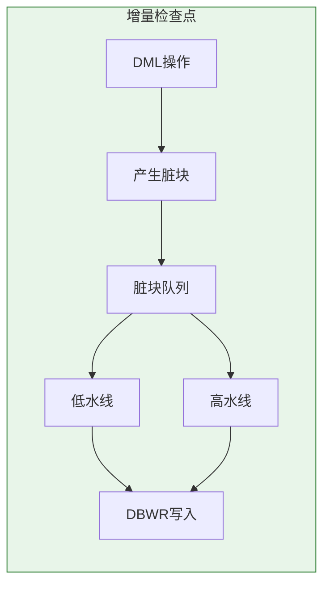
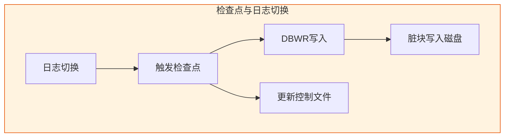

# Oracle Checkpoint机制详解

## 一、概述

### 1.1 一句话定义

Oracle Checkpoint机制，本质是将内存中的脏块写入磁盘并在控制文件和数据文件头记录检查点信息的操作，用于缩短实例恢复时间。
它在Oracle日志恢复中出现和使用，解决系统崩溃后的快速恢复问题。

### 1.2 为什么重要

- **不掌握的后果：** 无法优化实例恢复时间，可能导致恢复过长
- **掌握的价值：** 控制恢复时间，优化系统性能

### 1.3 适用场景

| 场景 | 说明 |
|------|------|
| 实例恢复 | 缩短恢复时间 |
| 性能优化 | 控制检查点频率 |
| 系统调优 | 平衡I/O和恢复 |
| 故障诊断 | 诊断恢复问题 |

### 1.4 版本演进

| 版本 | 变化说明 |
|------|---------|
| 11gR2 | 增量检查点增强 |
| 12cR1 | 自适应检查点 |
| 19c | 检查点优化 |
| 21c | 云原生检查点 |

## 二、术语与概念

### 2.1 核心术语表

| 术语 | 含义 | 类比 |
|------|------|------|
| Checkpoint | 检查点 | 里程碑 |
| CKPT | 检查点进程 | 记录员 |
| DBWR | 数据库写入进程 | 搬运工 |
| SCN | 系统变更号 | 时间戳 |
| MTTR | 平均恢复时间 | 恢复时长 |

### 2.2 Checkpoint流程



## 三、核心原理

### 3.1 Checkpoint触发条件

**自动触发：**
- 日志切换时
- 超过检查点间隔
- MTTR目标达到
- 手动触发

**手动触发：**
```sql
-- 手动检查点
ALTER SYSTEM CHECKPOINT;

-- 表空间检查点
ALTER TABLESPACE users CHECKPOINT;
```

### 3.2 Checkpoint类型

**完全检查点：**
- 所有脏块写入磁盘
- 更新所有控制文件和数据文件头
- 通常在关闭数据库时

**增量检查点：**
- 部分脏块写入磁盘
- 持续进行，避免I/O峰值
- Oracle默认使用增量检查点

```sql
-- 查看检查点信息
SELECT checkpoint_change#, checkpoint_time
FROM v$database;

-- 查看数据文件检查点
SELECT file#, checkpoint_change#, checkpoint_time
FROM v$datafile_header;
```

### 3.3 CKPT进程

CKPT（Checkpoint）进程负责协调检查点操作。

**职责：**
- 通知DBWR写入脏块
- 更新控制文件
- 更新数据文件头
- 记录检查点SCN

```sql
-- 查看CKPT进程
SELECT paddr, pid, spid, program
FROM v$bgprocess
WHERE name = 'CKPT';
```

### 3.4 DBWR进程

DBWR（Database Writer）负责将脏块写入磁盘。

**触发条件：**
- CKPT通知
- 脏块数量达到阈值
- 超时（3秒）
- 表空间离线

```sql
-- 查看DBWR进程
SELECT paddr, pid, spid, program
FROM v$bgprocess
WHERE name = 'DBW0';

-- 查看DBWR统计
SELECT name, value FROM v$sysstat
WHERE name LIKE '%DBWR%' OR name LIKE '%dirty%';
```

### 3.5 检查点SCN

检查点SCN标识检查点发生时的系统状态。

```sql
-- 查看检查点SCN
SELECT checkpoint_change# FROM v$database;

-- 查看数据文件SCN
SELECT file#, checkpoint_change#
FROM v$datafile_header;

-- 实例恢复从检查点SCN开始
```

### 3.6 MTTR（Mean Time To Recovery）

MTTR是实例恢复的目标时间。

```sql
-- 查看MTTR配置
SHOW PARAMETER fast_start_mttr_target;

-- 查看实际MTTR
SELECT target_mttr, estimated_mttr
FROM v$instance_recovery;

-- 配置MTTR
ALTER SYSTEM SET fast_start_mttr_target = 60;  -- 60秒
```

## 四、架构与组件

### 4.1 增量检查点机制



**工作原理：**
- 脏块按低SCN排序
- DBWR从低SCN开始写入
- 检查点推进低水线
- 避免I/O峰值

### 4.2 检查点与日志切换



**关系：**
- 日志切换触发检查点
- 检查点保证脏块写入
- 减少实例恢复需要重做的日志量

## 五、配置与参数

### 5.1 检查点相关参数

```sql
-- 查看检查点参数
SHOW PARAMETER checkpoint_completion_target;  -- 检查点完成目标
SHOW PARAMETER log_checkpoint_interval;       -- 检查点间隔
SHOW PARAMETER log_checkpoint_timeout;        -- 检查点超时
SHOW PARAMETER fast_start_mttr_target;        -- MTTR目标

-- 配置参数
ALTER SYSTEM SET checkpoint_completion_target = 0.9;  -- 90%日志切换时间
ALTER SYSTEM SET fast_start_mttr_target = 60;
```

### 5.2 检查点调优

```sql
-- 查看检查点统计
SELECT name, value FROM v$sysstat
WHERE name LIKE '%checkpoint%' OR name LIKE '%DBWR%';

-- 查看检查点等待
SELECT event, total_waits, time_waited
FROM v$system_event
WHERE event LIKE '%checkpoint%'
ORDER BY time_waited DESC;

-- 优化建议：
-- 1. 调整checkpoint_completion_target
-- 2. 调整fast_start_mttr_target
-- 3. 优化DBWR进程数
```

## 六、监控与诊断

### 6.1 检查点监控

```sql
-- 查看检查点频率
SELECT TO_CHAR(checkpoint_time, 'YYYY-MM-DD HH24:MI:SS') AS time,
       checkpoint_change#
FROM v$database;

-- 查看检查点延迟
SELECT name, value FROM v$sysstat
WHERE name IN ('checkpoint warnings', 'dbwr checkpoints');

-- 查看MTTR
SELECT target_mttr, estimated_mttr, write_estm, ckpt_estm
FROM v$instance_recovery;
```

### 6.2 实例恢复监控

```sql
-- 查看实例恢复统计
SELECT name, value FROM v$sysstat
WHERE name LIKE '%recovery%' OR name LIKE '%redo%';

-- 查看恢复需要的日志
SELECT * FROM v$instance_recovery;

-- 查看恢复进度
SELECT * FROM v$recovery_progress;
```

### 6.3 性能诊断

```sql
-- 检查点过于频繁
-- 症状：DBWR写入多，I/O高
-- 解决：增大fast_start_mttr_target

-- 检查点太少
-- 症状：实例恢复时间长
-- 解决：减小fast_start_mttr_target

-- 查看DBWR性能
SELECT name, value FROM v$sysstat
WHERE name LIKE '%DBWR%' OR name LIKE '%dirty%';
```

## 七、实战案例

### 7.1 案例背景

- **场景**：实例恢复时间过长
- **时间**：2026年
- **现象**：崩溃后恢复需要10分钟

### 7.2 诊断过程

**步骤1：查看MTTR**

```sql
SELECT target_mttr, estimated_mttr
FROM v$instance_recovery;

-- 结果：
-- target_mttr: 0（未设置）
-- estimated_mttr: 600（10分钟）
```

**步骤2：分析原因**

```sql
-- 查看检查点间隔
SELECT checkpoint_change#, checkpoint_time
FROM v$database;

-- 查看日志切换频率
SELECT COUNT(*) FROM v$log_history
WHERE first_time > SYSDATE - 1/24;  -- 最近1小时

-- 结果：检查点间隔过长，恢复需要重做大量日志
```

**步骤3：优化方案**

```sql
-- 设置MTTR目标
ALTER SYSTEM SET fast_start_mttr_target = 60;  -- 60秒

-- 调整检查点完成目标
ALTER SYSTEM SET checkpoint_completion_target = 0.8;

-- 验证效果
SELECT target_mttr, estimated_mttr
FROM v$instance_recovery;

-- 结果：estimated_mttr降至50秒
```

### 7.3 优化结果

| 指标 | 优化前 | 优化后 |
|------|--------|--------|
| 恢复时间 | 10分钟 | 50秒 |
| MTTR目标 | 未设置 | 60秒 |
| 检查点频率 | 低 | 适中 |

### 7.4 复盘总结

- **根因：** 未设置MTTR目标，检查点间隔过长
- **教训：** 设置合理的MTTR目标

## 八、常见错误与排查

### 8.1 常见错误

| 错误 | 问题 | 解决方法 |
|------|------|---------|
| 恢复时间过长 | 检查点间隔长 | 设置MTTR目标 |
| DBWR写入慢 | I/O瓶颈 | 优化存储 |
| 检查点警告 | 脏块过多 | 增加DBWR进程 |

## 九、最佳实践

### 9.1 官方推荐

- 设置fast_start_mttr_target
- 使用增量检查点
- 监控检查点频率
- 优化DBWR性能

### 9.2 社区经验

- MTTR目标60-300秒
- checkpoint_completion_target 0.8-0.9
- 监控检查点警告
- 分离Redo和数据I/O

### 9.3 反模式

| 反模式 | 问题 | 正确做法 |
|--------|------|---------|
| 不设置MTTR | 恢复时间不可控 | 设置MTTR目标 |
| 检查点过于频繁 | I/O峰值 | 调整参数 |
| 不监控检查点 | 问题未发现 | 定期监控 |

## 十、命令与视图汇总

### 10.1 命令列表

| 命令 | 适用场景 | 说明 |
|------|---------|------|
| `ALTER SYSTEM CHECKPOINT` | 手动检查点 | 强制写入 |
| `ALTER SYSTEM SET fast_start_mttr_target` | 设置MTTR | 控制恢复时间 |

### 10.2 视图列表

| 视图名 | 类型 | 用途 |
|--------|------|------|
| V$DATABASE | 动态 | 检查点信息 |
| V$DATAFILE_HEADER | 动态 | 文件检查点 |
| V$INSTANCE_RECOVERY | 动态 | 恢复信息 |
| V$SYSSTAT | 动态 | 检查点统计 |

## 十一、总结速查

### 11.1 黄金法则

1. **设置MTTR目标** - 控制恢复时间
2. **使用增量检查点** - 避免I/O峰值
3. **监控检查点频率** - 平衡性能和恢复
4. **优化DBWR性能** - 提高写入效率

### 11.2 一页纸检查清单

| 检查项 | 说明 |
|--------|------|
| MTTR设置 | 60-300秒 |
| 检查点频率 | 适中 |
| DBWR性能 | 监控等待 |
| 恢复时间 | 定期测试 |

## 附录

### A. 官方参考

- [Oracle Database Administrator's Guide - Instance Recovery](https://docs.oracle.com/en/database/oracle/oracle-database/19c/admin/)
- [Oracle Database Concepts - Checkpoints](https://docs.oracle.com/en/database/oracle/oracle-database/19c/cncpt/checkpoints.html)

### B. 修订记录

| 日期 | 版本 | 修改内容 | 修改人 |
|------|------|---------|--------|
| 2026-07-02 | v1.0 | 初始版本 | YashanDB知识库生成器 |
