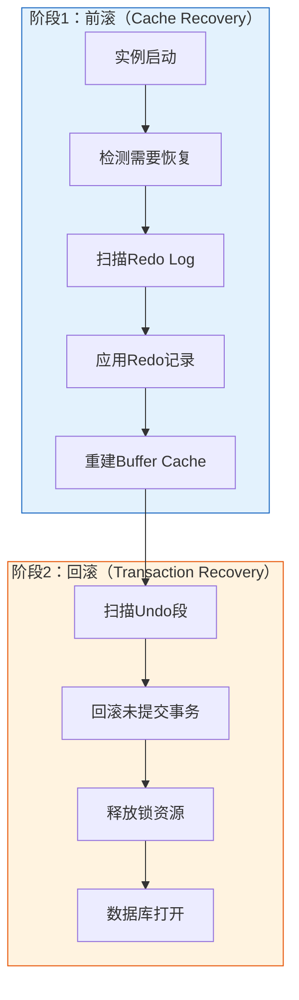
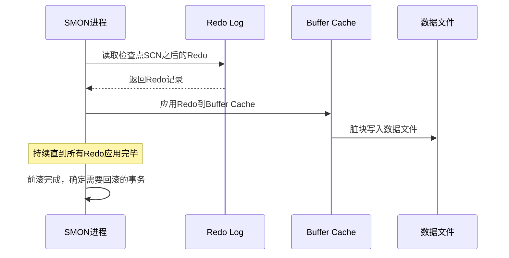
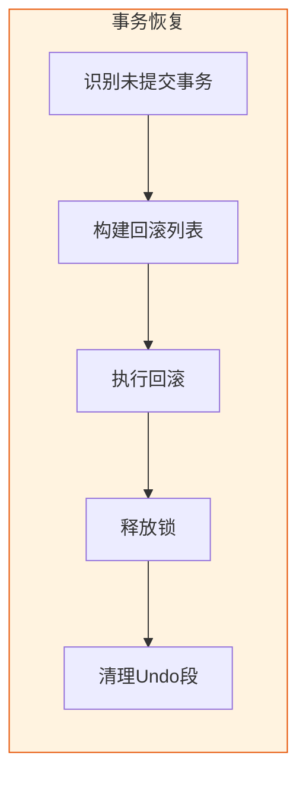
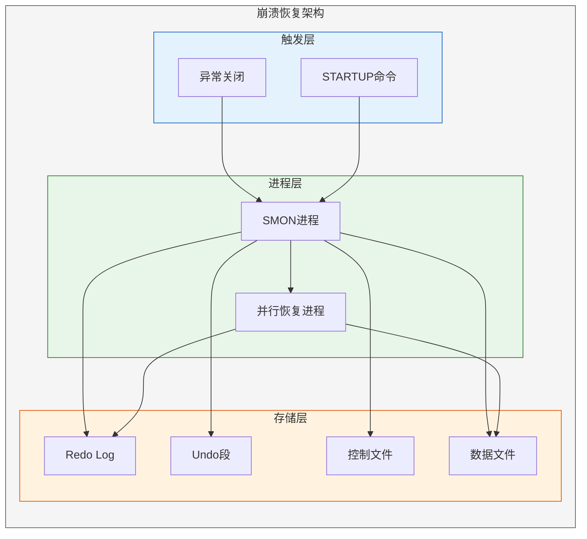
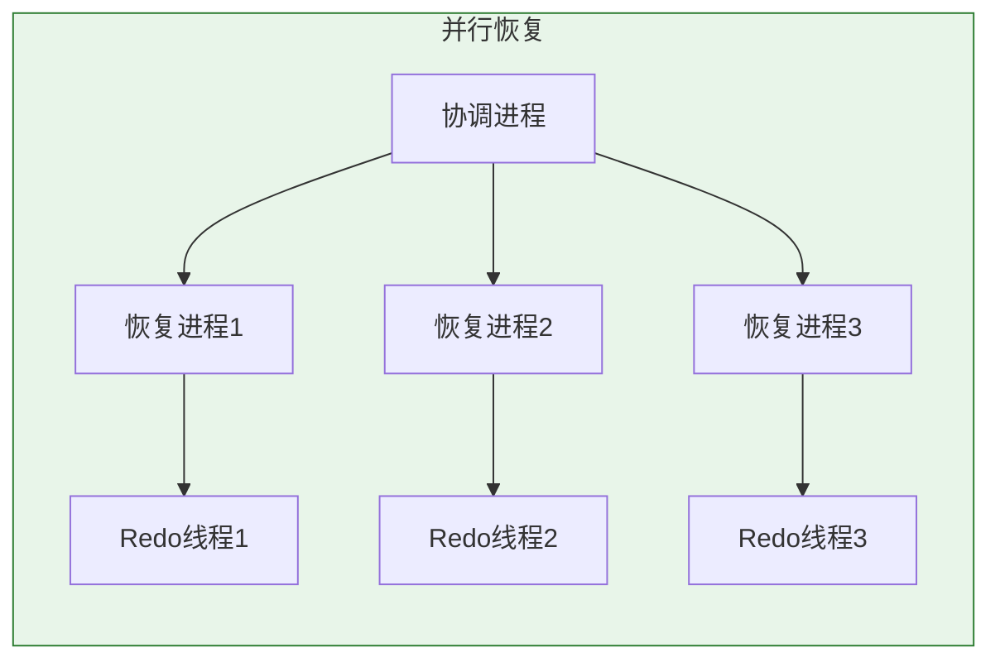
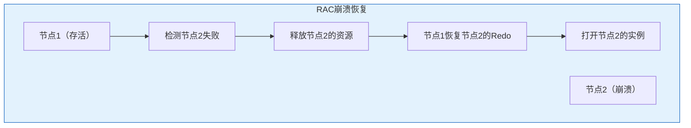
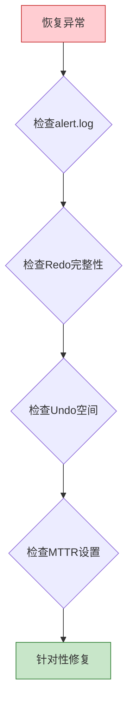

# Oracle崩溃恢复流程

## 一、概述

### 1.1 一句话定义

Oracle崩溃恢复（Crash Recovery）是实例启动时自动执行的恢复过程，通过重做日志前滚已提交事务的修改、回滚未提交事务的修改，将数据库恢复到崩溃前的一致性状态。
它是Oracle实例恢复（Instance Recovery）的核心组成部分，解决系统异常关闭后的数据一致性问题。

### 1.2 为什么重要

- **不掌握的后果：** 无法评估和控制数据库恢复时间，遇到崩溃恢复场景时无法诊断问题
- **掌握的价值：** 确保数据库高可用，优化恢复时间，诊断恢复故障

### 1.3 适用场景

| 场景 | 说明 |
|------|------|
| 实例异常关闭 | SHUTDOWN ABORT、OS崩溃、断电 |
| 单实例恢复 | 单节点数据库崩溃后重启 |
| RAC节点故障 | 某节点崩溃，存活节点进行恢复 |
| 恢复时间优化 | 评估和控制MTTR |

### 1.4 版本演进

| 版本 | 变化说明 |
|------|---------|
| 11gR2 | 引入并行实例恢复，增强FAST_START_MTTR_TARGET |
| 12cR1 | 支持跨PDB的恢复优化 |
| 12cR2 | 快速故障恢复改进 |
| 19c | 自适应恢复并行度，增强恢复监控 |
| 21c | 云环境下的恢复优化 |

## 二、术语与概念

### 2.1 核心术语表

| 术语 | 含义 | 类比 |
|------|------|------|
| Crash Recovery | 崩溃恢复 | 急救医生 |
| Instance Recovery | 实例恢复 | 全身检查 |
| Roll Forward | 前滚（重做） | 回放录像 |
| Roll Back | 回滚（撤销） | 撤回操作 |
| MTTR | 平均恢复时间 | 恢复时长 |
| Redo Apply | 重做应用 | 重播日志 |
| Undo Apply | 撤销应用 | 撤销操作 |
| SMON | 系统监控进程 | 恢复执行者 |

### 2.2 崩溃恢复两阶段流程



## 三、核心原理

### 3.1 崩溃恢复触发条件

Oracle在以下情况触发崩溃恢复：

- **实例异常关闭**：SHUTDOWN ABORT、OS崩溃、断电
- **正常启动检测**：STARTUP时检查数据文件头SCN与控制文件SCN不一致
- **RAC节点失败**：存活节点检测到失败节点需要恢复

```sql
-- 检查是否需要实例恢复
SELECT a.file#, a.status, a.checkpoint_change#,
       b.checkpoint_change# AS ctrl_change#
FROM v$datafile_header a
JOIN v$datafile b ON a.file# = b.file#
WHERE a.checkpoint_change# <> b.checkpoint_change#;
```

### 3.2 阶段1：前滚（Cache Recovery）

前滚阶段重做所有已记录在Redo Log中的变更，包括已提交和未提交的事务。

**工作原理：**
- SMON进程从最后一个检查点SCN开始
- 顺序读取Redo Log中的变更记录
- 将变更重新应用到数据块上
- 重建Buffer Cache中的数据块状态



**关键参数：**
```sql
-- 查看前滚进度
SELECT * FROM v$recovery_progress
WHERE stage = 'Active Change Apply';

-- 查看前滚统计
SELECT name, value FROM v$recovery_status
WHERE name LIKE '%redo applied%'
   OR name LIKE '%block recovered%';
```

### 3.3 阶段2：回滚（Transaction Recovery）

回滚阶段撤销前滚过程中发现的未提交事务。

**工作原理：**
- 前滚完成后，SMON识别未提交的事务
- 使用Undo段中的信息回滚这些事务
- 释放被未提交事务持有的锁
- 回滚可以异步进行（数据库已打开）



**回滚的特点：**
- 数据库在前滚完成后即可打开
- 回滚可以在数据库打开后异步进行
- 大事务的回滚可能耗时较长
- 回滚期间，相关行被锁定

```sql
-- 监控回滚进度
SELECT usertxn, undoblocksdone, undoblockstotal,
       undoblockstotal - undoblocksdone AS remaining
FROM v$fast_start_transactions;

-- 查看回滚事务的详细信息
SELECT xid, usn, state, undoblocksdone, undoblockstotal
FROM v$transaction
WHERE status = 'ACTIVE';
```

### 3.4 MTTR（Mean Time To Recovery）

MTTR是实例恢复的预期时间，由前滚时间和回滚时间组成。

**MTTR组成：**
- **前滚时间**：取决于需要重做的Redo量
- **回滚时间**：取决于未提交事务的大小和数量

```sql
-- 查看MTTR配置和建议
SELECT target_mttr,
       estimated_mttr,
       write_estm,
       ckpt_estm,
       read_estm
FROM v$instance_recovery;

-- 设置MTTR目标
ALTER SYSTEM SET fast_start_mttr_target = 60;  -- 60秒

-- 查看MTTR建议
SELECT * FROM v$mttr_target;
```

### 3.5 FAST_START_MTTR_TARGET参数

该参数是控制实例恢复时间的核心参数。

**工作原理：**
- Oracle根据MTTR目标自动调整检查点频率
- 目标越小，检查点越频繁，恢复越快，但I/O开销越大
- 设置为0表示禁用MTTR顾问

```sql
-- 查看当前设置
SHOW PARAMETER fast_start_mttr_target;

-- 设置MTTR目标
ALTER SYSTEM SET fast_start_mttr_target = 30;   -- 激进
ALTER SYSTEM SET fast_start_mttr_target = 60;   -- 推荐
ALTER SYSTEM SET fast_start_mttr_target = 300;  -- 保守

-- 查看MTTR顾问建议
SELECT mttr_target_for_estimate,
       advice_status,
       startup_estimated_mttr,
       estimated_cache_writes
FROM v$mttr_target
ORDER BY mttr_target_for_estimate;
```

### 3.6 恢复时间估算

```sql
-- 估算恢复时间
SELECT recovery_estimated_seconds
FROM v$instance_recovery;

-- 查看恢复进度（恢复过程中）
SELECT start_time, type, stage,
       sofar, total, units,
       timestamp
FROM v$recovery_progress
ORDER BY timestamp DESC;

-- 查看Redo需要量
SELECT name, value FROM v$sysstat
WHERE name IN (
    'redo size',
    'redo writes',
    'redo blocks written',
    'redo log space requests'
);
```

## 四、架构与组件

### 4.1 崩溃恢复完整架构



### 4.2 并行实例恢复

当Redo量大时，Oracle可以使用并行进程加速前滚。



```sql
-- 查看并行恢复参数
SHOW PARAMETER recovery_parallelism;

-- 设置并行恢复
ALTER SYSTEM SET recovery_parallelism = 4;

-- 监控并行恢复
SELECT server_name, status
FROM v$px_process
WHERE program LIKE '%P%';
```

### 4.3 RAC环境下的崩溃恢复



```sql
-- RAC中查看实例恢复状态
SELECT inst_id, status
FROM gv$instance;

-- 查看跨实例恢复
SELECT * FROM gv$recovery_progress;
```

## 五、配置与调优

### 5.1 关键参数配置

```sql
-- MTTR目标
ALTER SYSTEM SET fast_start_mttr_target = 60;

-- 并行恢复
ALTER SYSTEM SET recovery_parallelism = 2;

-- 检查点完成目标
ALTER SYSTEM SET checkpoint_completion_target = 0.9;

-- Undo表空间（影响回滚性能）
SHOW PARAMETER undo_tablespace;
SHOW PARAMETER undo_retention;
```

### 5.2 恢复时间优化

**优化策略：**

| 策略 | 说明 | 效果 |
|------|------|------|
| 设置MTTR目标 | 控制检查点频率 | 减少前滚量 |
| 增大Redo日志 | 减少日志切换 | 减少检查点开销 |
| 优化Undo表空间 | 加速回滚 | 减少回滚时间 |
| 并行恢复 | 多进程并行前滚 | 加速前滚 |
| 分离I/O | Redo和数据分离 | 减少I/O争用 |

```sql
-- 优化Redo日志大小
ALTER DATABASE ADD LOGFILE GROUP 4 SIZE 500M;
ALTER DATABASE DROP LOGFILE GROUP 1;

-- 优化Undo表空间
ALTER DATABASE DATAFILE '/path/to/undo01.dbf' RESIZE 10G;
```

### 5.3 监控恢复性能

```sql
-- 查看恢复统计
SELECT name, value FROM v$sysstat
WHERE name LIKE '%recovery%'
   OR name LIKE '%redo apply%'
   OR name LIKE '%rollback%';

-- 查看恢复等待事件
SELECT event, total_waits, time_waited
FROM v$system_event
WHERE event LIKE '%recovery%'
   OR event LIKE '%restore%'
ORDER BY time_waited DESC;
```

## 六、监控与诊断

### 6.1 恢复过程监控

```sql
-- 实时查看恢复进度
SELECT start_time, type, stage,
       sofar, total, units,
       ROUND(sofar/total*100, 2) AS pct_complete,
       timestamp
FROM v$recovery_progress
ORDER BY timestamp DESC;

-- 查看恢复的Redo量
SELECT name, value FROM v$sysstat
WHERE name = 'data blocks recovered';

-- 查看回滚进度
SELECT xidusn, xidslot, xidsqn,
       undoblocksdone, undoblockstotal,
       ROUND(undoblocksdone/undoblockstotal*100, 2) AS pct
FROM v$fast_start_transactions;
```

### 6.2 恢复问题诊断

```sql
-- 检查恢复是否需要（启动前）
SELECT file#, status, error
FROM v$datafile_header
WHERE error IS NOT NULL;

-- 检查Redo Log可用性
SELECT group#, status, bytes/1024/1024 AS size_mb
FROM v$log;

-- 检查Undo段状态
SELECT segment_name, status, tablespace_name
FROM dba_rollback_segs;

-- 查看恢复相关的告警
SELECT originating_timestamp, message_text
FROM v$diag_alert_ext
WHERE message_text LIKE '%recovery%'
   OR message_text LIKE '%instance recovery%'
ORDER BY originating_timestamp DESC
FETCH FIRST 10 ROWS ONLY;
```

### 6.3 常见恢复问题

| 问题 | 症状 | 排查方法 |
|------|------|---------|
| 恢复时间过长 | 启动慢 | 检查MTTR设置和Redo量 |
| 回滚卡住 | 大事务回滚 | 监控v$fast_start_transactions |
| Redo损坏 | ORA-00354 | 检查Redo Log完整性 |
| Undo不足 | ORA-01555 | 增大Undo表空间 |

## 七、实战案例

### 7.1 案例背景

- **场景**：生产数据库异常断电后恢复
- **时间**：2026年
- **现象**：数据库启动后长时间处于"recovering"状态

### 7.2 诊断过程

**步骤1：确认恢复状态**

```sql
-- 在alert.log中观察恢复进度
-- 或通过SQL查看
SELECT start_time, type, stage,
       sofar, total, units
FROM v$recovery_progress;

-- 结果：
-- 前滚阶段：已应用85%的Redo
-- 预计还需15分钟
```

**步骤2：分析原因**

```sql
-- 恢复完成后分析
SELECT checkpoint_change#, checkpoint_time
FROM v$database;

-- 查看最后的检查点时间
-- 发现检查点发生在2小时前
-- 需要重做2小时的Redo日志
```

**步骤3：优化方案**

```sql
-- 设置MTTR目标为60秒
ALTER SYSTEM SET fast_start_mttr_target = 60;

-- 增大Redo日志
ALTER DATABASE ADD LOGFILE GROUP 4 SIZE 1G;
ALTER DATABASE ADD LOGFILE GROUP 5 SIZE 1G;

-- 设置并行恢复
ALTER SYSTEM SET recovery_parallelism = 4;

-- 验证效果
SELECT target_mttr, estimated_mttr
FROM v$instance_recovery;
-- 结果：estimated_mttr = 45秒
```

### 7.3 优化结果

| 指标 | 优化前 | 优化后 |
|------|--------|--------|
| 恢复时间 | 25分钟 | 45秒 |
| MTTR目标 | 未设置 | 60秒 |
| 检查点间隔 | 2小时 | 5分钟 |
| 并行恢复 | 未启用 | 4个进程 |

### 7.4 复盘总结

- **根因：** 未设置MTTR目标，检查点间隔过长，导致需要重做大量Redo
- **教训：** 生产环境必须设置FAST_START_MTTR_TARGET参数
- **改进：** 定期测试崩溃恢复时间，确保满足SLA要求

## 八、常见错误与排查

### 8.1 常见错误

| 错误 | 问题 | 解决方法 |
|------|------|---------|
| ORA-00283 | 恢复会话取消 | 检查Redo Log可用性 |
| ORA-00354 | 损坏的Redo Log块 | 使用备份恢复 |
| ORA-01547 | 不能回滚事务 | 增大Undo表空间 |
| ORA-00600 [kclwcr_6] | 恢复内部错误 | 联系Oracle Support |
| 恢复时间过长 | MTTR未设置 | 设置fast_start_mttr_target |

### 8.2 排查流程



## 九、最佳实践

### 9.1 官方推荐

- 始终设置FAST_START_MTTR_TARGET参数
- Redo日志至少3组，每组至少2个成员
- 定期测试崩溃恢复时间
- 监控恢复相关的等待事件

### 9.2 社区经验

- MTTR目标建议60-300秒
- Redo日志大小建议500MB-2GB
- 启用并行恢复（recovery_parallelism >= 2）
- 分离Redo I/O和数据I/O到不同存储

### 9.3 反模式

| 反模式 | 问题 | 正确做法 |
|--------|------|---------|
| 不设置MTTR | 恢复时间不可控 | 设置60-300秒 |
| Redo日志太小 | 频繁日志切换 | 至少500MB |
| 单组Redo | 切换等待 | 至少3组 |
| 不测试恢复 | 问题发现晚 | 定期演练 |

## 十、命令与视图汇总

### 10.1 命令列表

| 命令 | 适用场景 | 说明 |
|------|---------|------|
| `STARTUP` | 正常启动 | 自动触发崩溃恢复 |
| `ALTER SYSTEM SET fast_start_mttr_target` | 设置MTTR | 控制恢复时间 |
| `ALTER SYSTEM SET recovery_parallelism` | 并行恢复 | 加速前滚 |
| `RECOVER DATABASE` | 手动恢复 | 介质恢复场景 |

### 10.2 视图列表

| 视图名 | 类型 | 用途 |
|--------|------|------|
| V$RECOVERY_PROGRESS | 动态 | 恢复进度监控 |
| V$INSTANCE_RECOVERY | 动态 | MTTR和恢复信息 |
| V$FAST_START_TRANSACTIONS | 动态 | 回滚进度 |
| V$RECOVERY_STATUS | 动态 | 恢复状态 |
| V$MTTR_TARGET | 动态 | MTTR顾问 |
| V$DATAFILE_HEADER | 动态 | 检查点SCN |

## 十一、总结速查

### 11.1 黄金法则

1. **设置MTTR目标** - 控制恢复时间在可接受范围
2. **保证Redo完整** - Redo是恢复的数据源
3. **优化Undo空间** - 加速回滚阶段
4. **启用并行恢复** - 大幅缩短前滚时间
5. **定期演练** - 验证恢复时间满足SLA

### 11.2 一页纸检查清单

| 检查项 | 说明 |
|--------|------|
| MTTR设置 | 60-300秒 |
| Redo日志 | ≥3组，≥500MB |
| 并行恢复 | 启用 |
| Undo空间 | 充足 |
| 恢复演练 | 定期测试 |
| 监控告警 | 配置恢复监控 |

## 附录

### A. 官方参考

- [Oracle Database Administrator's Guide - Instance Recovery](https://docs.oracle.com/en/database/oracle/oracle-database/19c/admin/)
- [Oracle Database Concepts - Crash and Instance Recovery](https://docs.oracle.com/en/database/oracle/oracle-database/19c/cncpt/oracle-database-instance.html)
- [Oracle Database Reference - V$RECOVERY_PROGRESS](https://docs.oracle.com/en/database/oracle/oracle-database/19c/refrn/)

### B. 修订记录

| 日期 | 版本 | 修改内容 | 修改人 |
|------|------|---------|--------|
| 2026-07-02 | v1.0 | 初始版本 | YashanDB知识库生成器 |
