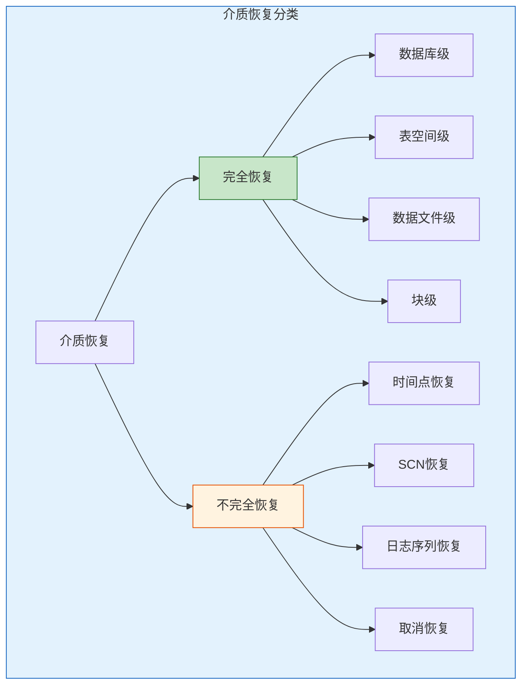
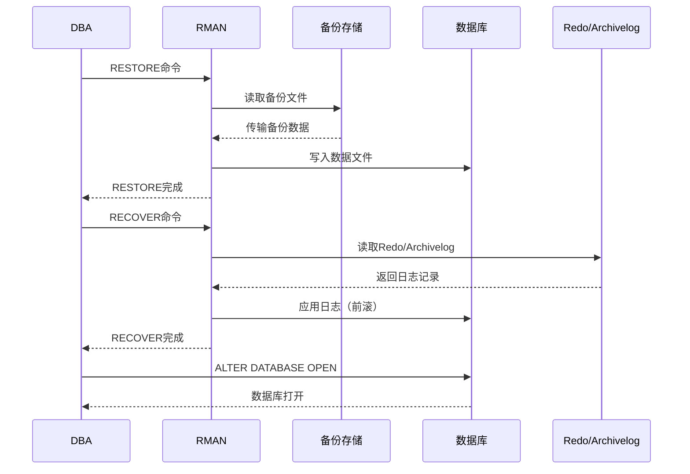
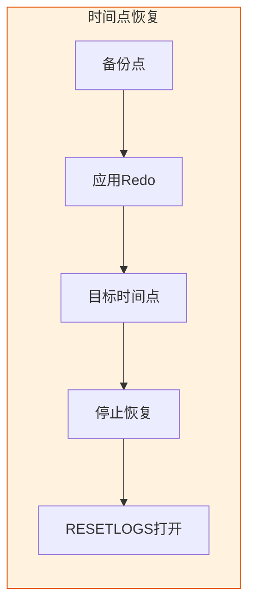
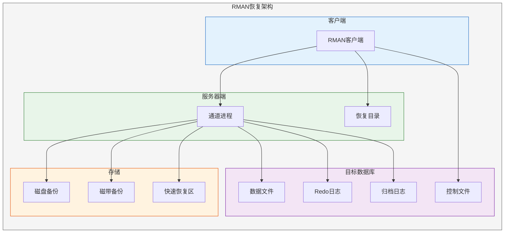
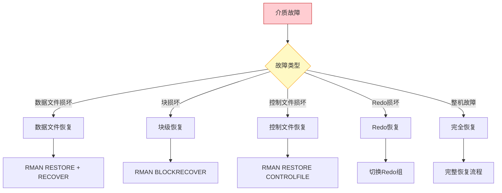
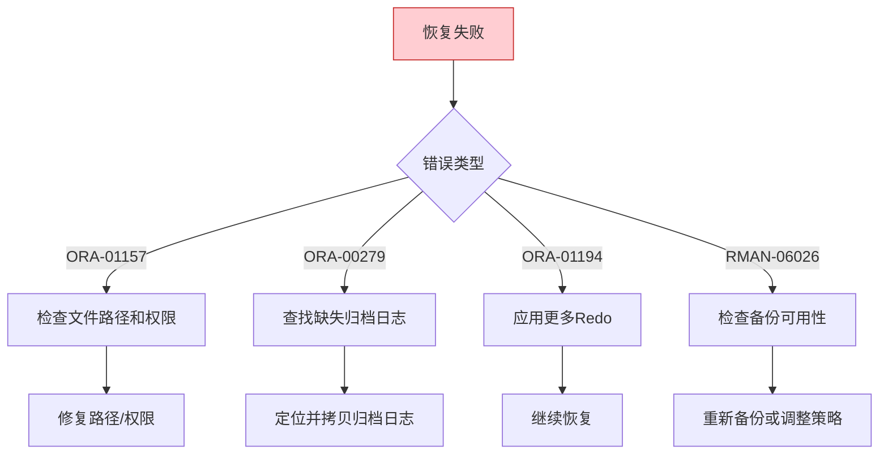

# Oracle介质恢复技术

## 一、概述

### 1.1 一句话定义

Oracle介质恢复（Media Recovery）是将备份的数据文件还原后，通过应用Redo日志将数据恢复到指定时间点或最新状态的操作。
它解决磁盘损坏、数据文件丢失等物理介质故障后的数据恢复问题。

### 1.2 为什么重要

- **不掌握的后果：** 磁盘故障时无法恢复数据，造成数据永久丢失
- **掌握的价值：** 保障数据安全，满足RPO/RTO要求，应对各种介质故障

### 1.3 适用场景

| 场景 | 说明 |
|------|------|
| 磁盘损坏 | 数据文件所在磁盘故障 |
| 文件误删除 | 数据文件被意外删除 |
| 块损坏 | 数据块出现物理损坏 |
| 归档恢复 | 需要从备份恢复到指定时间点 |
| 灾难恢复 | 整机故障后的完整恢复 |

### 1.4 版本演进

| 版本 | 变化说明 |
|------|---------|
| 11gR2 | RMAN增量备份优化，块级恢复增强 |
| 12cR1 | 跨平台恢复，多租户恢复支持 |
| 12cR2 | 自动块修复改进 |
| 19c | RMAN恢复性能优化，网络恢复增强 |
| 21c | 云原生恢复，OCI集成优化 |

## 二、术语与概念

### 2.1 核心术语表

| 术语 | 含义 | 类比 |
|------|------|------|
| Media Recovery | 介质恢复 | 物理修复 |
| Full Recovery | 完全恢复 | 恢复到最新 |
| Point-in-Time Recovery | 时间点恢复 | 时光倒流 |
| Block Recovery | 块级恢复 | 精准修复 |
| RESTORE | 还原 | 复制备份 |
| RECOVER | 恢复 | 应用日志 |
| RMAN | 恢复管理器 | 恢复工具 |
| Block Media Recovery | 块介质恢复 | 微创手术 |

### 2.2 介质恢复分类



## 三、核心原理

### 3.1 完全恢复 vs 不完全恢复

| 对比项 | 完全恢复 | 不完全恢复 |
|--------|---------|-----------|
| 恢复目标 | 恢复到最新状态 | 恢复到指定时间点 |
| Redo要求 | 需要所有Redo | 只需要部分Redo |
| 数据丢失 | 无丢失 | 丢失恢复点之后的数据 |
| 使用场景 | 介质故障 | 逻辑错误（误删数据） |
| 控制文件 | 不需要重建 | 可能需要重建 |

### 3.2 完全恢复流程



**完全恢复的前提条件：**
- 有有效的数据文件备份
- 从备份点到当前时间的所有Redo日志（包括归档日志）
- 控制文件完好（或使用备份控制文件）

```sql
-- 完全恢复示例（数据文件级）
-- 1. 将数据文件离线
ALTER DATABASE DATAFILE '/path/to/users01.dbf' OFFLINE;

-- 2. 还原数据文件
RESTORE DATAFILE '/path/to/users01.dbf';

-- 3. 恢复数据文件
RECOVER DATAFILE '/path/to/users01.dbf';

-- 4. 将数据文件上线
ALTER DATABASE DATAFILE '/path/to/users01.dbf' ONLINE;
```

### 3.3 不完全恢复（Point-in-Time Recovery）

不完全恢复将数据库恢复到指定的时间点，用于纠正逻辑错误。



**四种不完全恢复方式：**

```sql
-- 1. 基于时间的恢复
RECOVER DATABASE UNTIL TIME "TO_DATE('2026-07-02 10:00:00','YYYY-MM-DD HH24:MI:SS')";

-- 2. 基于SCN的恢复
RECOVER DATABASE UNTIL SCN 12345678;

-- 3. 基于日志序列的恢复
RECOVER DATABASE UNTIL SEQUENCE 100 THREAD 1;

-- 4. 基于取消的恢复（手动控制）
RECOVER DATABASE UNTIL CANCEL;
-- 手动应用日志，输入CANCEL停止

-- 恢复后必须使用RESETLOGS打开
ALTER DATABASE OPEN RESETLOGS;
```

### 3.4 数据文件恢复

针对单个数据文件的恢复，数据库可以保持打开。

```sql
-- 恢复单个数据文件（数据库打开状态）
-- 1. 离线数据文件
ALTER DATABASE DATAFILE 5 OFFLINE;

-- 2. 使用RMAN还原和恢复
-- RMAN> RESTORE DATAFILE 5;
-- RMAN> RECOVER DATAFILE 5;

-- 3. 上线数据文件
ALTER DATABASE DATAFILE 5 ONLINE;
```

```sql
-- 恢复SYSTEM表空间数据文件（需要MOUNT状态）
-- SYSTEM表空间不能在线恢复
SHUTDOWN IMMEDIATE;
STARTUP MOUNT;
-- RMAN> RESTORE DATAFILE 1;
-- RMAN> RECOVER DATAFILE 1;
ALTER DATABASE OPEN;
```

### 3.5 表空间恢复

```sql
-- 恢复整个表空间
-- 1. 离线表空间
ALTER TABLESPACE users OFFLINE IMMEDIATE;

-- 2. 使用RMAN恢复
-- RMAN> RESTORE TABLESPACE users;
-- RMAN> RECOVER TABLESPACE users;

-- 3. 上线表空间
ALTER TABLESPACE users ONLINE;
```

### 3.6 块级恢复（Block Media Recovery）

块级恢复是Oracle的精细恢复能力，只修复损坏的数据块。

**优势：**
- 最小化停机时间
- 不需要离线数据文件或表空间
- 只修复损坏的块，不影响其他数据


```sql
-- 检测块损坏
SELECT file#, block#, blocks, corruption_change#, corruption_type
FROM v$database_block_corruption;

-- RMAN块级恢复
-- RMAN> BLOCKRECOVER DATAFILE 5 BLOCK 100, 200, 300;

-- 或者使用SQL
RECOVER DATAFILE 5 BLOCK 100;

-- 验证修复
SELECT file#, block#, blocks
FROM v$database_block_corruption
WHERE file# = 5;
```

```sql
-- 自动块修复（19c增强）
-- 启用自动块修复
ALTER SYSTEM SET _db_block_checking = TRUE;

-- 配置RMAN自动块修复
-- RMAN> CONFIGURE MAXCORRUPT FOR DATAFILE 5 TO 10;
-- RMAN> BACKUP CHECK LOGICAL DATABASE;
-- RMAN> RECOVER CORRUPTION LIST;
```

## 四、架构与组件

### 4.1 RMAN恢复架构



### 4.2 恢复路径决策



### 4.3 恢复与控制文件的关系

```sql
-- 使用当前控制文件恢复
-- 正常恢复流程，控制文件完好

-- 使用备份控制文件恢复
-- 当控制文件损坏时
RECOVER DATABASE USING BACKUP CONTROLFILE;
ALTER DATABASE OPEN RESETLOGS;

-- 重建控制文件
CREATE CONTROLFILE REUSE DATABASE "ORCL" NORESETLOGS
    ARCHIVELOG
    LOGFILE GROUP 1 ('/path/to/redo01.log') SIZE 500M,
            GROUP 2 ('/path/to/redo02.log') SIZE 500M
    DATAFILE '/path/to/system01.dbf',
             '/path/to/sysaux01.dbf';
```

## 五、配置与调优

### 5.1 RMAN恢复配置

```sql
-- 配置RMAN参数
-- RMAN> CONFIGURE DEFAULT DEVICE TYPE TO DISK;
-- RMAN> CONFIGURE DEVICE TYPE DISK PARALLELISM 4;
-- RMAN> CONFIGURE DATAFILE BACKUP COPIES FOR DEVICE TYPE DISK TO 2;
-- RMAN> CONFIGURE ARCHIVELOG BACKUP COPIES FOR DEVICE TYPE DISK TO 2;
-- RMAN> CONFIGURE CONTROLFILE AUTOBACKUP ON;
-- RMAN> CONFIGURE CONTROLFILE AUTOBACKUP FORMAT FOR DEVICE TYPE DISK TO '/backup/%F';

-- 配置快速恢复区
ALTER SYSTEM SET db_recovery_file_dest = '/fra';
ALTER SYSTEM SET db_recovery_file_dest_size = 100G;
```

### 5.2 恢复性能优化

| 策略 | 说明 | 效果 |
|------|------|------|
| 并行通道 | 多通道并行恢复 | 提高I/O吞吐 |
| 增量备份 | 使用增量备份减少恢复量 | 减少恢复时间 |
| 块变更跟踪 | 加速增量备份 | 减少备份窗口 |
| 压缩备份 | 减少传输量 | 网络恢复加速 |
| FRA集中管理 | 自动管理归档日志 | 简化恢复操作 |

```sql
-- 启用块变更跟踪
ALTER DATABASE ENABLE BLOCK CHANGE TRACKING
    USING FILE '/path/to/changetracking.cht';

-- 查看块变更跟踪状态
SELECT filename, status, bytes
FROM v$block_change_tracking;
```

### 5.3 恢复策略配置

```sql
-- 配置恢复窗口
-- RMAN> CONFIGURE RETENTION POLICY TO RECOVERY WINDOW OF 7 DAYS;

-- 配置冗余度
-- RMAN> CONFIGURE RETENTION POLICY TO REDUNDANCY 2;

-- 配置归档日志删除策略
-- RMAN> CONFIGURE ARCHIVELOG DELETION POLICY TO APPLIED ON ALL STANDBY;
```

## 六、监控与诊断

### 6.1 恢复监控

```sql
-- 查看恢复进度
SELECT * FROM v$recovery_progress;

-- 查看恢复的文件
SELECT file#, change#, time
FROM v$recover_file;

-- 查看需要的归档日志
SELECT * FROM v$recovery_log;

-- 查看块损坏
SELECT file#, block#, blocks, corruption_change#
FROM v$database_block_corruption;

-- 查看RMAN操作历史
-- RMAN> LIST BACKUP;
-- RMAN> LIST BACKUP OF DATABASE;
-- RMAN> LIST ARCHIVELOG ALL;
```

### 6.2 恢复验证

```sql
-- 验证备份可用性
-- RMAN> RESTORE DATABASE VALIDATE;
-- RMAN> RESTORE DATABASE VALIDATE CHECK LOGICAL;

-- 验证恢复可行性
-- RMAN> RECOVER DATABASE TEST;

-- 检查数据文件状态
SELECT file#, status, error
FROM v$datafile_header;

-- 检查归档日志完整性
SELECT sequence#, first_time, next_time, blocks
FROM v$archived_log
WHERE status = 'A'
ORDER BY first_time DESC;
```

### 6.3 常见问题诊断

| 问题 | 症状 | 排查方法 |
|------|------|---------|
| 归档日志缺失 | ORA-00279 | 检查归档日志链 |
| 备份过期 | RMAN-06153 | 检查保留策略 |
| 控制文件不匹配 | ORA-01122 | 使用正确的控制文件 |
| 块损坏 | ORA-01578 | 使用块级恢复 |
| 恢复目录不同步 | RMAN-06153 | RESYNC CATALOG |

## 七、实战案例

### 7.1 案例背景

- **场景**：生产数据库数据文件损坏
- **时间**：2026年
- **现象**：ORA-01157错误，数据文件无法识别

### 7.2 诊断过程

**步骤1：确认故障**

```sql
-- 查看告警日志
-- ORA-01157: cannot identify/lock data file 5
-- ORA-01110: data file 5: '/data/orcl/users01.dbf'

-- 查看数据文件状态
SELECT file#, name, status
FROM v$datafile
WHERE file# = 5;

-- 查看损坏信息
SELECT * FROM v$datafile_header
WHERE file# = 5;
```

**步骤2：执行恢复**

```sql
-- 1. 离线数据文件
ALTER DATABASE DATAFILE 5 OFFLINE;

-- 2. 使用RMAN还原
-- RMAN> RUN {
--   ALLOCATE CHANNEL ch1 DEVICE TYPE DISK;
--   RESTORE DATAFILE 5;
--   RECOVER DATAFILE 5;
--   RELEASE CHANNEL ch1;
-- }

-- 3. 上线数据文件
ALTER DATABASE DATAFILE 5 ONLINE;

-- 4. 验证
SELECT file#, status FROM v$datafile WHERE file# = 5;
```

**步骤3：验证恢复**

```sql
-- 检查数据文件状态
SELECT file#, name, status, enabled
FROM v$datafile
WHERE file# = 5;

-- 检查块完整性
-- RMAN> BACKUP VALIDATE DATAFILE 5;

-- 检查表空间数据
SELECT COUNT(*) FROM scott.emp;
```

### 7.3 恢复结果

| 指标 | 值 |
|------|-----|
| 停机时间 | 5分钟 |
| 恢复方式 | 数据文件级完全恢复 |
| 数据丢失 | 无 |
| 恢复来源 | FRA备份 |

### 7.4 复盘总结

- **根因：** 磁盘出现坏道导致数据文件损坏
- **教训：** 启用块变更跟踪，定期验证备份
- **改进：** 配置数据文件多路复用，使用ASM

## 八、常见错误与排查

### 8.1 常见错误

| 错误 | 问题 | 解决方法 |
|------|------|---------|
| ORA-01157 | 无法锁定数据文件 | 检查文件权限和存在性 |
| ORA-01113 | 需要介质恢复 | 执行RECOVER命令 |
| ORA-00279 | 归档日志缺失 | 找到缺失的归档日志 |
| ORA-01547 | 不能回滚事务 | 增大Undo空间 |
| ORA-01194 | 数据文件需要更多恢复 | 应用更多Redo |
| ORA-01152 | 数据文件未从备份恢复 | 先RESTORE再RECOVER |
| RMAN-06026 | 目标备份不存在 | 检查备份保留策略 |

### 8.2 排查流程



## 九、最佳实践

### 9.1 官方推荐

- 启用控制文件自动备份
- 配置快速恢复区（FRA）
- 定期验证备份的可恢复性
- 使用块变更跟踪加速增量备份
- 配置适当的保留策略

### 9.2 社区经验

- 至少保留2份备份副本
- 恢复窗口覆盖最长业务周期
- 定期执行RESTORE VALIDATE
- 归档日志备份到异地
- 文档化恢复流程并定期演练

### 9.3 反模式

| 反模式 | 问题 | 正确做法 |
|--------|------|---------|
| 不验证备份 | 恢复时才发现备份无效 | 定期RESTORE VALIDATE |
| 不备份控制文件 | 控制文件损坏无法恢复 | AUTOBACKUP ON |
| 归档日志不备份 | 无法完全恢复 | 备份归档日志 |
| 不测试恢复 | 恢复流程未验证 | 定期恢复演练 |
| 恢复窗口太短 | 历史数据无法恢复 | 覆盖业务周期 |

## 十、命令与视图汇总

### 10.1 RMAN命令列表

| 命令 | 适用场景 | 说明 |
|------|---------|------|
| `RESTORE DATABASE` | 还原整个数据库 | 从备份复制文件 |
| `RESTORE DATAFILE` | 还原数据文件 | 单文件恢复 |
| `RESTORE TABLESPACE` | 还原表空间 | 表空间级恢复 |
| `RECOVER DATABASE` | 恢复数据库 | 应用Redo |
| `RECOVER DATAFILE` | 恢复数据文件 | 文件级恢复 |
| `BLOCKRECOVER` | 块级恢复 | 修复损坏块 |
| `RESTORE VALIDATE` | 验证备份 | 不实际还原 |
| `RECOVER TEST` | 测试恢复 | 不实际恢复 |

### 10.2 SQL命令列表

| 命令 | 适用场景 | 说明 |
|------|---------|------|
| `ALTER DATABASE DATAFILE ... OFFLINE` | 离线文件 | 恢复前准备 |
| `ALTER DATABASE DATAFILE ... ONLINE` | 上线文件 | 恢复后操作 |
| `RECOVER DATABASE UNTIL TIME` | 时间点恢复 | 不完全恢复 |
| `ALTER DATABASE OPEN RESETLOGS` | 重置日志 | 不完全恢复后 |

### 10.3 视图列表

| 视图名 | 类型 | 用途 |
|--------|------|------|
| V$RECOVERY_PROGRESS | 动态 | 恢复进度 |
| V$RECOVER_FILE | 动态 | 需要恢复的文件 |
| V$RECOVERY_LOG | 动态 | 需要的归档日志 |
| V$DATABASE_BLOCK_CORRUPTION | 动态 | 块损坏信息 |
| V$DATAFILE_HEADER | 动态 | 数据文件头信息 |
| V$ARCHIVED_LOG | 动态 | 归档日志信息 |
| V$BACKUP_SET | 动态 | 备份集信息 |

## 十一、总结速查

### 11.1 黄金法则

1. **定期备份验证** - 确保备份可恢复
2. **启用自动备份** - 控制文件必须自动备份
3. **配置FRA** - 集中管理恢复文件
4. **块级恢复优先** - 最小化停机时间
5. **恢复演练** - 定期测试恢复流程

### 11.2 一页纸检查清单

| 检查项 | 说明 |
|--------|------|
| 备份策略 | 全量+增量+归档 |
| 控制文件 | AUTOBACKUP ON |
| FRA配置 | 足够空间 |
| 块变更跟踪 | 已启用 |
| 恢复验证 | 定期VALIDATE |
| 恢复演练 | 每季度测试 |
| 归档日志 | 异地备份 |
| 保留策略 | 覆盖业务周期 |

## 附录

### A. 官方参考

- [Oracle Database Backup and Recovery User's Guide](https://docs.oracle.com/en/database/oracle/oracle-database/19c/backup/)
- [Oracle Database RMAN Reference](https://docs.oracle.com/en/database/oracle/oracle-database/19c/rcmrf/)
- [Oracle Database Administrator's Guide - Media Recovery](https://docs.oracle.com/en/database/oracle/oracle-database/19c/admin/)

### B. 修订记录

| 日期 | 版本 | 修改内容 | 修改人 |
|------|------|---------|--------|
| 2026-07-02 | v1.0 | 初始版本 | YashanDB知识库生成器 |
