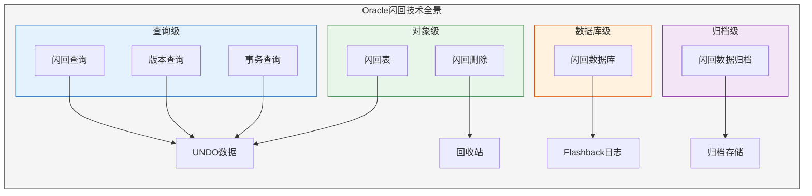
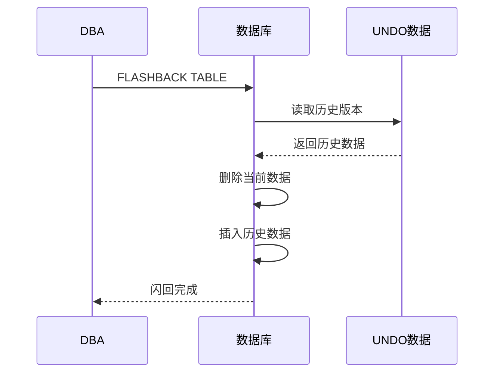
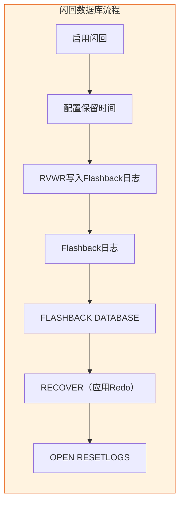
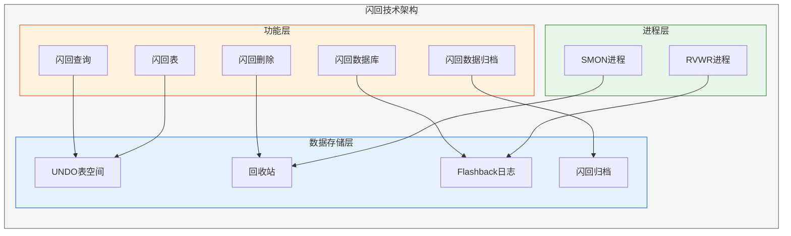

# Oracle闪回技术详解

## 一、概述

### 1.1 一句话定义

Oracle闪回技术是一组基于UNDO数据和Flashback日志的数据恢复技术集合，允许用户查看历史数据、回退误操作，而无需从备份中恢复。
它在数据保护和快速恢复中出现和使用，解决人为误操作导致的数据丢失问题。

### 1.2 为什么重要

- **不掌握的后果：** 误操作后只能通过耗时的介质恢复恢复数据，业务中断严重
- **掌握的价值：** 分钟级恢复误操作数据，大幅降低RTO

### 1.3 适用场景

| 场景 | 说明 |
|------|------|
| 误删除数据 | DELETE/UPDATE操作错误 |
| 误删除表 | DROP TABLE |
| 数据回退 | 需要查看历史数据状态 |
| 审计追踪 | 查看数据的变更历史 |
| 快速恢复 | 数据库级快速回退 |

### 1.4 版本演进

| 版本 | 变化说明 |
|------|---------|
| 11gR2 | 闪回数据归档增强 |
| 12cR1 | 闪回支持多租户，时间精度提升 |
| 12cR2 | 闪回数据库性能优化 |
| 19c | 闪回数据归档自动清理，性能增强 |
| 21c | 云环境闪回优化 |

## 二、术语与概念

### 2.1 核心术语表

| 术语 | 含义 | 类比 |
|------|------|------|
| Flashback Query | 闪回查询 | 时光望远镜 |
| Flashback Version Query | 版本查询 | 变更录像 |
| Flashback Transaction Query | 事务查询 | 操作回放 |
| Flashback Table | 闪回表 | 表级时光倒流 |
| Flashback Drop | 闪回删除 | 回收站恢复 |
| Flashback Database | 闪回数据库 | 数据库时光机 |
| Flashback Data Archive | 闪回数据归档 | 历史档案馆 |
| UNDO Tablespace | 撤销表空间 | 后悔药仓库 |

### 2.2 闪回技术全景



## 三、核心原理

### 3.1 闪回查询（Flashback Query）

查看表在过去某个时间点的数据状态。

**原理：** 基于UNDO数据，构造历史版本的查询结果。

```sql
-- 查询1小时前的数据
SELECT * FROM employees
AS OF TIMESTAMP SYSTIMESTAMP - INTERVAL '1' HOUR;

-- 查询指定SCN的数据
SELECT * FROM employees
AS OF SCN 12345678;

-- 查询指定时间的数据
SELECT * FROM employees
AS OF TIMESTAMP TO_TIMESTAMP('2026-07-02 10:00:00', 'YYYY-MM-DD HH24:MI:SS');

-- 对比当前和历史数据
SELECT '当前' AS source, e.* FROM employees e
UNION ALL
SELECT '历史', e.* FROM employees
AS OF TIMESTAMP SYSTIMESTAMP - INTERVAL '1' HOUR e;
```

**限制：**
- 受UNDO保留时间限制（默认900秒）
- 不能跨越DDL操作
- 不能查询外部表、临时表

### 3.2 闪回版本查询（Flashback Version Query）

查看行数据的所有历史版本。

```sql
-- 查看行版本历史
SELECT versions_startscn,
       versions_endscn,
       versions_starttime,
       versions_endtime,
       versions_xid,
       versions_operation,
       employee_id, first_name, salary
FROM employees
VERSIONS BETWEEN TIMESTAMP SYSTIMESTAMP - INTERVAL '1' DAY AND SYSTIMESTAMP
WHERE employee_id = 100;
```

**输出列说明：**

| 列名 | 说明 |
|------|------|
| VERSIONS_STARTSCN | 版本起始SCN |
| VERSIONS_ENDSCN | 版本结束SCN（NULL表示当前版本） |
| VERSIONS_STARTTIME | 版本起始时间 |
| VERSIONS_ENDTIME | 版本结束时间 |
| VERSIONS_XID | 事务标识 |
| VERSIONS_OPERATION | 操作类型（I/D/U） |

### 3.3 闪回事务查询（Flashback Transaction Query）

查看事务级别的变更，并生成回滚SQL。

```sql
-- 查询事务的变更
SELECT xid, operation, table_name, row_id,
       undo_sql
FROM flashback_transaction_query
WHERE xid = HEXTORAW('0600120034010000');

-- 结合版本查询找到事务ID，再查询事务详情
SELECT versions_xid, versions_operation, employee_id, salary
FROM employees
VERSIONS BETWEEN SCN MINVALUE AND MAXVALUE
WHERE employee_id = 100;

-- 使用事务ID查询变更详情
SELECT operation, table_name, undo_sql
FROM flashback_transaction_query
WHERE xid = (SELECT versions_xid
             FROM employees
             VERSIONS BETWEEN SCN MINVALUE AND MAXVALUE
             WHERE employee_id = 100
             AND versions_operation = 'U');
```

### 3.4 闪回表（Flashback Table）

将整个表回退到过去某个时间点。

**前提条件：**
- 表必须启用ROW MOVEMENT
- 有足够的UNDO数据
- 用户需要FLASHBACK TABLE权限

```sql
-- 启用行移动
ALTER TABLE employees ENABLE ROW MOVEMENT;

-- 闪回表到1小时前
FLASHBACK TABLE employees TO TIMESTAMP SYSTIMESTAMP - INTERVAL '1' HOUR;

-- 闪回表到指定SCN
FLASHBACK TABLE employees TO SCN 12345678;

-- 同时闪回多个表（有依赖关系时）
FLASHBACK TABLE employees, departments
TO TIMESTAMP SYSTIMESTAMP - INTERVAL '2' HOUR;
```



### 3.5 闪回删除（Flashback Drop）

恢复被DROP的表。

**原理：** Oracle将DROP的表放入回收站（Recycle Bin），而非真正删除。

```sql
-- 查看回收站
SELECT object_name, original_name, type, dropscn, droptime
FROM recyclebin;

-- 或者使用SHOW命令
SHOW RECYCLEBIN;

-- 恢复被删除的表
FLASHBACK TABLE employees TO BEFORE DROP;

-- 恢复并重命名
FLASHBACK TABLE employees TO BEFORE DROP
RENAME TO employees_recovered;

-- 恢复指定的表（同名多次删除）
FLASHBACK TABLE BIN$"abc123" TO BEFORE DROP;

-- 清空回收站
PURGE RECYCLEBIN;              -- 当前用户
PURGE DBA_RECYCLEBIN;          -- 所有用户（需要DBA权限）
PURGE TABLE BIN$"abc123";      -- 指定表

-- 删除时跳过回收站
DROP TABLE employees PURGE;
```

**限制：**
- 系统表空间的对象不进入回收站
- 使用PURGE选项的DROP不进入回收站
- 回收站占用空间，需要定期清理

### 3.6 闪回数据库（Flashback Database）

将整个数据库快速回退到过去某个时间点。

**原理：** 使用Flashback日志（由RVWR进程写入），不需要从备份恢复。



```sql
-- 启用闪回数据库（需要MOUNT状态）
SHUTDOWN IMMEDIATE;
STARTUP MOUNT;

-- 配置闪回保留时间（分钟）
ALTER SYSTEM SET db_flashback_retention_target = 4320;  -- 3天

-- 配置闪回恢复区
ALTER SYSTEM SET db_recovery_file_dest = '/fra';
ALTER SYSTEM SET db_recovery_file_dest_size = 100G;

-- 启用闪回
ALTER DATABASE FLASHBACK ON;
ALTER DATABASE OPEN;

-- 执行闪回数据库
SHUTDOWN IMMEDIATE;
STARTUP MOUNT;

-- 闪回到指定时间点
FLASHBACK DATABASE TO TIMESTAMP SYSTIMESTAMP - INTERVAL '2' HOUR;

-- 闪回到指定SCN
FLASHBACK DATABASE TO SCN 12345678;

-- 闪回到指定还原点
FLASHBACK DATABASE TO RESTORE POINT before_migration;

-- 打开数据库
ALTER DATABASE OPEN RESETLOGS;
```

**创建还原点：**
```sql
-- 创建普通还原点
CREATE RESTORE POINT before_migration;

-- 创建保证还原点（保证可以闪回到该点）
CREATE GUARANTEE RESTORE POINT before_migration;

-- 查看还原点
SELECT name, scn, time, guarantee_flashback_database
FROM v$restore_point;

-- 删除还原点
DROP RESTORE POINT before_migration;
```

### 3.7 闪回数据归档（Flashback Data Archive）

长期保存历史数据，不受UNDO保留时间限制。

```sql
-- 创建闪回数据归档
CREATE FLASHBACK ARCHIVE fba_3year
    TABLESPACE fba_ts
    RETENTION 3 YEAR;

-- 为表启用闪回归档
ALTER TABLE employees FLASHBACK ARCHIVE fba_3year;

-- 查询历史数据（超过UNDO保留时间）
SELECT * FROM employees
AS OF TIMESTAMP SYSTIMESTAMP - INTERVAL '1' YEAR;

-- 禁用闪回归档
ALTER TABLE employees NO FLASHBACK ARCHIVE;

-- 删除闪回归档
DROP FLASHBACK ARCHIVE fba_3year;

-- 查看闪回归档
SELECT owner_name, flashback_archive_name, tablespace_name,
       retention_in_days
FROM dba_flashback_archive;
```

## 四、架构与组件

### 4.1 闪回技术架构



### 4.2 各闪回技术对比

| 技术 | 数据源 | 恢复粒度 | 前提条件 | 保留时间 |
|------|--------|---------|---------|---------|
| 闪回查询 | UNDO | 行级 | UNDO可用 | UNDO保留期 |
| 版本查询 | UNDO | 行级 | UNDO可用 | UNDO保留期 |
| 事务查询 | UNDO+LogMiner | 事务级 | 补充日志 | UNDO保留期 |
| 闪回表 | UNDO | 表级 | ROW MOVEMENT | UNDO保留期 |
| 闪回删除 | 回收站 | 表级 | 非SYSTEM表空间 | 空间可用 |
| 闪回数据库 | Flashback日志 | 数据库级 | 启用闪回 | 配置保留期 |
| 闪回数据归档 | 归档存储 | 行级 | 创建归档 | 配置保留期 |

## 五、配置与调优

### 5.1 UNDO配置

```sql
-- 查看UNDO配置
SHOW PARAMETER undo_tablespace;
SHOW PARAMETER undo_retention;
SHOW PARAMETER undo_management;

-- 推荐配置
ALTER SYSTEM SET undo_tablespace = 'UNDOTBS1';
ALTER SYSTEM SET undo_retention = 3600;   -- 1小时
ALTER SYSTEM SET undo_management = AUTO;

-- 保证UNDO保留（防止ORA-01555）
ALTER TABLESPACE undotbs1 RETENTION GUARANTEE;
```

### 5.2 闪回数据库配置

```sql
-- 查看闪回状态
SELECT flashback_on FROM v$database;

-- 查看闪回日志使用
SELECT * FROM v$flashback_database_log;

-- 查看闪回统计
SELECT * FROM v$flashback_database_stat;

-- 优化闪回性能
-- 增大闪回恢复区
ALTER SYSTEM SET db_recovery_file_dest_size = 200G;

-- 调整保留时间
ALTER SYSTEM SET db_flashback_retention_target = 7200;  -- 5天
```

### 5.3 性能影响评估

| 技术 | 性能影响 | 建议 |
|------|---------|------|
| 闪回查询 | 低 | 正常使用 |
| 版本查询 | 中 | 避免大范围查询 |
| 闪回表 | 中 | 大表谨慎使用 |
| 闪回删除 | 低 | 定期清理回收站 |
| 闪回数据库 | RVWR I/O开销 | 监控Flashback日志 |
| 闪回归档 | 存储开销 | 合理设置保留期 |

## 六、监控与诊断

### 6.1 闪回监控

```sql
-- 查看闪回数据库状态
SELECT name, value FROM v$dash
WHERE name LIKE '%flashback%';

-- 查看闪回日志空间
SELECT estimated_flashback_size,
       flashback_size,
       con_id
FROM v$flashback_database_log;

-- 查看UNDO使用
SELECT tablespace_name, status, COUNT(*) AS extents
FROM dba_undo_extents
GROUP BY tablespace_name, status;

-- 查看回收站
SELECT owner, original_name, type,
       space * 8/1024 AS size_mb
FROM dba_recyclebin
ORDER BY droptime DESC;
```

### 6.2 常见问题诊断

```sql
-- ORA-01555: snapshot too old
-- 原因：UNDO数据被覆盖
-- 解决：增大UNDO表空间和保留时间

-- 查看UNDO不足的统计
SELECT name, value FROM v$sysstat
WHERE name LIKE '%undo%' OR name LIKE '%rollback%';

-- 查看ORA-01555发生次数
SELECT name, value FROM v$sysstat
WHERE name = 'transaction tables consistent reads - undo records applied';

-- 检查闪回日志是否充足
SELECT * FROM v$flashback_database_log
WHERE estimated_flashback_size > flashback_size;
```

## 七、实战案例

### 7.1 案例背景

- **场景**：开发人员误执行DELETE删除了重要表数据
- **时间**：2026年
- **现象**：employees表数据被清空

### 7.2 诊断与恢复

**步骤1：评估情况**

```sql
-- 确认数据被删除
SELECT COUNT(*) FROM employees;  -- 返回0

-- 检查UNDO是否可用
SELECT tablespace_name, status, SUM(bytes)/1024/1024 AS mb
FROM dba_undo_extents
GROUP BY tablespace_name, status;

-- 检查UNDO保留时间
SHOW PARAMETER undo_retention;  -- 3600秒
```

**步骤2：使用闪回查询恢复**

```sql
-- 查看删除前的数据
SELECT COUNT(*) FROM employees
AS OF TIMESTAMP SYSTIMESTAMP - INTERVAL '30' MINUTE;
-- 返回107条记录

-- 恢复数据
INSERT INTO employees
SELECT * FROM employees
AS OF TIMESTAMP SYSTIMESTAMP - INTERVAL '30' MINUTE;

-- 验证恢复
SELECT COUNT(*) FROM employees;  -- 返回107条
```

**步骤3：如果UNDO已被覆盖，使用闪回数据库**

```sql
-- 启用闪回数据库（如果未启用）
SHUTDOWN IMMEDIATE;
STARTUP MOUNT;
ALTER DATABASE FLASHBACK ON;
ALTER DATABASE OPEN;

-- 下次误操作时可以闪回
SHUTDOWN IMMEDIATE;
STARTUP MOUNT;
FLASHBACK DATABASE TO TIMESTAMP SYSTIMESTAMP - INTERVAL '1' HOUR;
ALTER DATABASE OPEN RESETLOGS;
```

### 7.3 恢复结果

| 指标 | 值 |
|------|-----|
| 恢复方式 | 闪回查询 + INSERT |
| 恢复时间 | 2分钟 |
| 数据丢失 | 无 |
| 停机时间 | 无 |

### 7.4 复盘总结

- **根因：** 开发人员直接在生产环境执行DELETE
- **教训：** 启用闪回数据库作为安全网
- **改进：** 启用闪回数据归档，限制生产环境直接操作权限

## 八、常见错误与排查

### 8.1 常见错误

| 错误 | 问题 | 解决方法 |
|------|------|---------|
| ORA-01555 | UNDO数据被覆盖 | 增大UNDO保留时间 |
| ORA-08181 | 指定的SCN无效 | 使用更近的SCN或时间 |
| ORA-01466 | 无法基于时间查询 | 表结构在查询时间后被修改 |
| ORA-55614 | 闪回归档表不能修改 | 先禁用闪回归档 |
| ORA-38701 | Flashback日志不存在 | 检查闪回保留时间 |

## 九、最佳实践

### 9.1 官方推荐

- 启用闪回数据库作为安全网
- 配置足够的UNDO保留时间
- 为关键表启用闪回数据归档
- 定期创建保证还原点

### 9.2 社区经验

- UNDO保留时间至少3600秒
- 闪回保留时间根据业务需要设置（通常1-7天）
- 监控回收站空间，定期清理
- 闪回归档保留期不超过存储容量

### 9.3 反模式

| 反模式 | 问题 | 正确做法 |
|--------|------|---------|
| 不启用闪回 | 误操作只能介质恢复 | 启用闪回数据库 |
| UNDO太小 | ORA-01555频繁 | 增大UNDO表空间 |
| 不清理回收站 | 空间浪费 | 定期PURGE |
| 不设保留策略 | 闪回数据不足 | 合理配置保留时间 |

## 十、命令与视图汇总

### 10.1 命令列表

| 命令 | 适用场景 | 说明 |
|------|---------|------|
| `AS OF TIMESTAMP/SCN` | 闪回查询 | 查看历史数据 |
| `VERSIONS BETWEEN` | 版本查询 | 查看行变更历史 |
| `FLASHBACK TABLE ... TO TIMESTAMP` | 闪回表 | 表级回退 |
| `FLASHBACK TABLE ... TO BEFORE DROP` | 闪回删除 | 恢复删除的表 |
| `FLASHBACK DATABASE` | 闪回数据库 | 数据库级回退 |
| `CREATE RESTORE POINT` | 还原点 | 创建恢复标记 |
| `PURGE RECYCLEBIN` | 清理回收站 | 释放空间 |

### 10.2 视图列表

| 视图名 | 类型 | 用途 |
|--------|------|------|
| V$FLASHBACK_DATABASE_LOG | 动态 | 闪回日志信息 |
| V$FLASHBACK_DATABASE_STAT | 动态 | 闪回统计 |
| V$RESTORE_POINT | 动态 | 还原点信息 |
| DBA_FLASHBACK_ARCHIVE | 静态 | 闪回归档信息 |
| DBA_RECYCLEBIN | 静态 | 回收站信息 |
| DBA_UNDO_EXTENTS | 静态 | UNDO使用情况 |
| FLASHBACK_TRANSACTION_QUERY | 静态 | 事务查询 |

## 十一、总结速查

### 11.1 黄金法则

1. **启用闪回数据库** - 最后的安全网
2. **合理配置UNDO** - 保证闪回查询可用
3. **创建还原点** - 关键操作前的保险
4. **闪回归档** - 关键表的长期历史
5. **定期演练** - 验证闪回能力

### 11.2 一页纸检查清单

| 检查项 | 说明 |
|--------|------|
| 闪回数据库 | 已启用 |
| UNDO配置 | 足够大，保留时间合理 |
| 还原点 | 关键操作前创建 |
| 回收站 | 定期清理 |
| 闪回归档 | 关键表已启用 |
| 监控告警 | 闪回日志空间监控 |

## 附录

### A. 官方参考

- [Oracle Database Administrator's Guide - Flashback Technology](https://docs.oracle.com/en/database/oracle/oracle-database/19c/admin/)
- [Oracle Database SQL Language Reference - Flashback Query](https://docs.oracle.com/en/database/oracle/oracle-database/19c/sqlrf/)
- [Oracle Database Development Guide - Flashback Data Archive](https://docs.oracle.com/en/database/oracle/oracle-database/19c/adfns/)

### B. 修订记录

| 日期 | 版本 | 修改内容 | 修改人 |
|------|------|---------|--------|
| 2026-07-02 | v1.0 | 初始版本 | YashanDB知识库生成器 |
