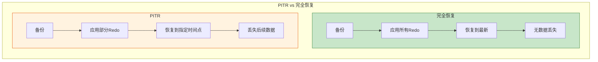
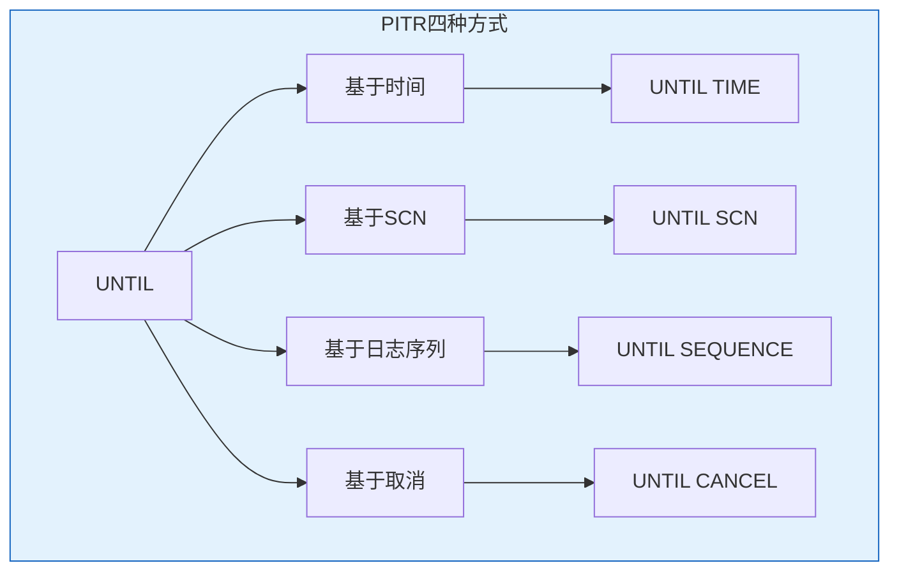
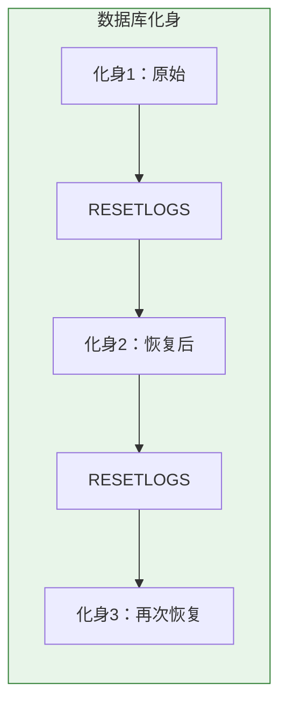
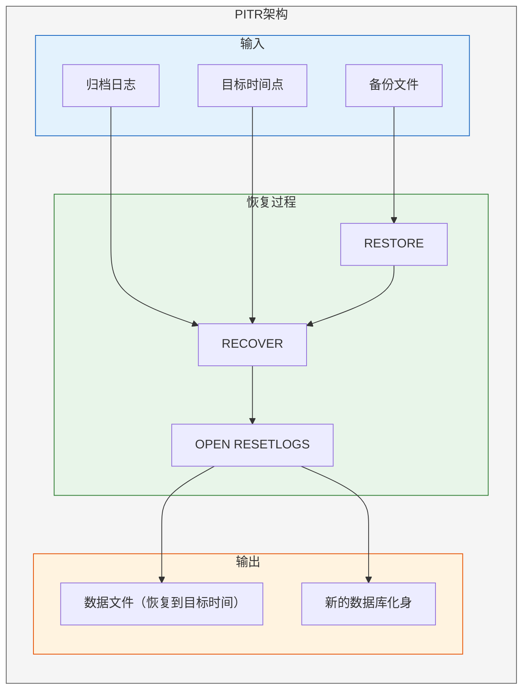
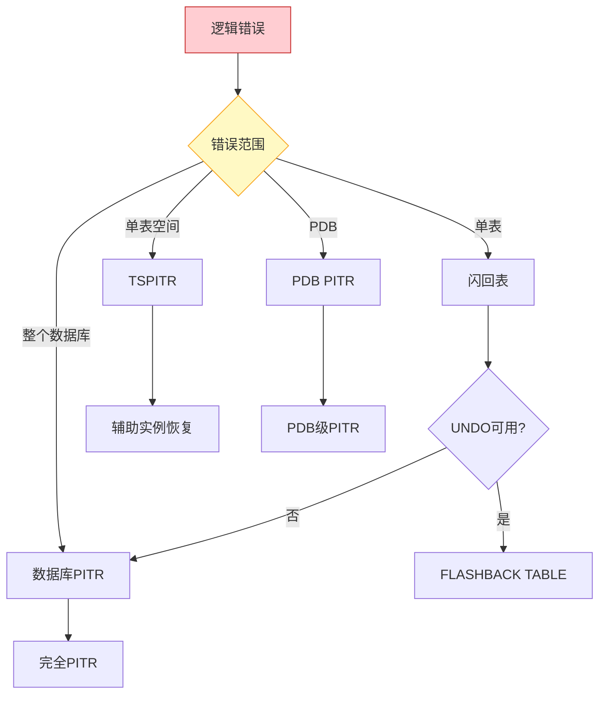

# Oracle时间点恢复（PITR）

## 一、概述

### 1.1 一句话定义

Oracle时间点恢复（Point-in-Time Recovery, PITR）是一种不完全恢复技术，将数据库或表空间恢复到过去某个特定时间点的状态，丢弃该时间点之后的所有变更。
它在数据保护和灾难恢复中出现和使用，解决人为逻辑错误（如误删数据、错误批量更新）导致的数据恢复问题。

### 1.2 为什么重要

- **不掌握的后果：** 逻辑错误发生后无法精确恢复，可能导致大量数据丢失或业务中断
- **掌握的价值：** 精确恢复到错误操作之前的状态，最大限度保护数据

### 1.3 适用场景

| 场景 | 说明 |
|------|------|
| 误删除数据 | DELETE/UPDATE操作错误 |
| 错误批处理 | 批量更新导致数据异常 |
| 应用Bug | 程序错误修改了大量数据 |
| 测试环境重置 | 将测试库恢复到特定状态 |
| 表空间级恢复 | 只恢复特定表空间 |

### 1.4 版本演进

| 版本 | 变化说明 |
|------|---------|
| 11gR2 | TSPITR增强，支持自动化辅助实例 |
| 12cR1 | 多租户PDB级时间点恢复 |
| 12cR2 | TSPITR性能优化 |
| 19c | 自动化恢复流程增强 |
| 21c | 云环境PITR优化 |

## 二、术语与概念

### 2.1 核心术语表

| 术语 | 含义 | 类比 |
|------|------|------|
| PITR | 时间点恢复 | 时光机 |
| Incomplete Recovery | 不完全恢复 | 部分回放 |
| RESETLOGS | 重置日志 | 重新开始 |
| TSPITR | 表空间时间点恢复 | 局部时光机 |
| Auxiliary Instance | 辅助实例 | 临时助手 |
| Incarnation | 数据库化身 | 平行宇宙 |

### 2.2 PITR与完全恢复对比



| 对比项 | 完全恢复 | PITR |
|--------|---------|------|
| 恢复目标 | 最新状态 | 指定时间点 |
| Redo要求 | 全部Redo | 部分Redo |
| 数据丢失 | 无 | 丢失恢复点之后数据 |
| 使用场景 | 物理故障 | 逻辑错误 |
| OPEN方式 | 正常OPEN | OPEN RESETLOGS |

## 三、核心原理

### 3.1 PITR四种方式



### 3.2 基于时间的恢复

```sql
-- RMAN方式
-- RMAN> RUN {
--   SHUTDOWN IMMEDIATE;
--   STARTUP MOUNT;
--   SET UNTIL TIME "TO_DATE('2026-07-02 10:00:00','YYYY-MM-DD HH24:MI:SS')";
--   RESTORE DATABASE;
--   RECOVER DATABASE;
--   ALTER DATABASE OPEN RESETLOGS;
-- }

-- SQL*Plus方式
SHUTDOWN IMMEDIATE;
STARTUP MOUNT;
RECOVER DATABASE UNTIL TIME "TO_DATE('2026-07-02 10:00:00','YYYY-MM-DD HH24:MI:SS')";
ALTER DATABASE OPEN RESETLOGS;
```

### 3.3 基于SCN的恢复

SCN恢复是最精确的方式，适用于已知错误操作SCN的场景。

```sql
-- 查找错误操作的SCN
-- 方法1：从LogMiner获取
SELECT scn, timestamp, operation, sql_redo
FROM v$logmnr_contents
WHERE timestamp BETWEEN SYSTIMESTAMP - INTERVAL '2' HOUR AND SYSTIMESTAMP
  AND operation = 'DELETE'
  AND seg_owner = 'HR';

-- 方法2：从闪回版本查询获取
SELECT versions_startscn, versions_endscn,
       versions_starttime, versions_operation,
       employee_id, salary
FROM employees
VERSIONS BETWEEN TIMESTAMP SYSTIMESTAMP - INTERVAL '2' HOUR AND SYSTIMESTAMP
WHERE employee_id = 100;

-- 执行SCN恢复
SHUTDOWN IMMEDIATE;
STARTUP MOUNT;

-- RMAN方式
-- RMAN> SET UNTIL SCN 12345678;
-- RMAN> RESTORE DATABASE;
-- RMAN> RECOVER DATABASE;

-- SQL*Plus方式
RECOVER DATABASE UNTIL SCN 12345678;
ALTER DATABASE OPEN RESETLOGS;
```

### 3.4 基于日志序列的恢复

```sql
-- 查看归档日志序列
SELECT sequence#, first_time, next_time, blocks
FROM v$archived_log
ORDER BY first_time DESC;

-- 恢复到指定序列之前
SHUTDOWN IMMEDIATE;
STARTUP MOUNT;

-- RMAN方式
-- RMAN> SET UNTIL SEQUENCE 100 THREAD 1;
-- RMAN> RESTORE DATABASE;
-- RMAN> RECOVER DATABASE;

-- SQL*Plus方式
RECOVER DATABASE UNTIL SEQUENCE 100 THREAD 1;
ALTER DATABASE OPEN RESETLOGS;
```

### 3.5 基于取消的恢复

手动控制恢复过程，逐个应用归档日志。

```sql
SHUTDOWN IMMEDIATE;
STARTUP MOUNT;

-- 开始恢复，手动指定每个日志
RECOVER DATABASE UNTIL CANCEL;
-- 系统提示：ORA-00279: change 12345678 generated at ...
-- 输入日志路径或AUTO
-- 输入CANCEL停止

ALTER DATABASE OPEN RESETLOGS;
```

### 3.6 RESETLOGS的作用

RESETLOGS是不完全恢复后必须执行的操作。

**作用：**
- 重置日志序列号为1
- 创建新的日志分支（新的incarnation）
- 丢弃未应用的旧日志
- 防止旧日志被误用



```sql
-- 查看数据库化身
SELECT incarnation#, status, resetlogs_time, prior_resetlogs_change#
FROM v$database_incarnation;

-- 查看当前incarnation
SELECT database_role, protection_mode, current_scn
FROM v$database;
```

### 3.7 表空间时间点恢复（TSPITR）

只恢复特定表空间，不影响其他表空间。


```sql
-- RMAN TSPITR
-- RMAN> RUN {
--   RECOVER TABLESPACE users
--     UNTIL TIME "TO_DATE('2026-07-02 10:00:00','YYYY-MM-DD HH24:MI:SS')"
--     AUXILIARY DESTINATION '/aux';
-- }

-- 或者恢复特定表
-- RMAN> RUN {
--   RECOVER TABLE HR.EMPLOYEES
--     UNTIL TIME "TO_DATE('2026-07-02 10:00:00','YYYY-MM-DD HH24:MI:SS')"
--     AUXILIARY DESTINATION '/aux'
--     DATASET DESTINATION '/data';
-- }
```

**TSPITR限制：**
- 目标表空间不能包含SYS对象
- 不能恢复SYSTEM、SYSAUX表空间
- 需要额外的磁盘空间用于辅助实例
- 恢复后表空间中的数据文件SCN会重置

### 3.8 PDB级时间点恢复（12c+）

多租户环境下可以针对单个PDB进行PITR。

```sql
-- RMAN PDB级恢复
-- RMAN> RUN {
--   ALTER PLUGGABLE DATABASE pdb1 CLOSE;
--   RECOVER PLUGGABLE DATABASE pdb1
--     UNTIL TIME "TO_DATE('2026-07-02 10:00:00','YYYY-MM-DD HH24:MI:SS')";
--   ALTER PLUGGABLE DATABASE pdb1 OPEN RESETLOGS;
-- }
```

## 四、架构与组件

### 4.1 PITR完整架构



### 4.2 恢复路径决策



## 五、配置与调优

### 5.1 PITR前提条件

```sql
-- 1. 确认有有效备份
-- RMAN> LIST BACKUP OF DATABASE;

-- 2. 确认归档日志链完整
SELECT sequence#, first_time, next_time, status
FROM v$archived_log
WHERE first_time > SYSDATE - 1
ORDER BY first_time;

-- 3. 确认目标时间点在备份范围内
SELECT MIN(first_time) AS earliest, MAX(next_time) AS latest
FROM v$archived_log;

-- 4. 确认闪回是否可用（优先使用闪回）
SELECT flashback_on FROM v$database;
```

### 5.2 PITR前准备

```sql
-- 记录当前状态
SELECT current_scn FROM v$database;
SELECT TO_CHAR(SYSDATE, 'YYYY-MM-DD HH24:MI:SS') FROM dual;

-- 备份当前状态（以防万一）
-- RMAN> BACKUP DATABASE PLUS ARCHIVELOG;

-- 确认需要恢复的时间点
-- 从应用日志或审计中找到错误操作时间
```

### 5.3 恢复后处理

```sql
-- 1. 确认数据库状态
SELECT open_mode FROM v$database;  -- 应为READ WRITE

-- 2. 确认化身
SELECT incarnation#, status, resetlogs_time
FROM v$database_incarnation
WHERE status = 'CURRENT';

-- 3. 重新备份（RESETLOGS后必须重新备份）
-- RMAN> BACKUP DATABASE PLUS ARCHIVELOG;

-- 4. 通知相关团队
-- - 应用团队：数据库已恢复到指定时间点
-- - 备份团队：需要重新执行全量备份

-- 5. 通知用户
-- - 恢复时间点之后的数据变更已丢失
-- - 需要重新执行丢失的操作
```

## 六、监控与诊断

### 6.1 恢复监控

```sql
-- 查看恢复进度
SELECT * FROM v$recovery_progress;

-- 查看恢复的文件
SELECT file#, change#, time
FROM v$recover_file;

-- 查看需要的归档日志
SELECT thread#, sequence#, name
FROM v$recovery_log;

-- 查看化身信息
SELECT incarnation#, status, resetlogs_change#, resetlogs_time
FROM v$database_incarnation;
```

### 6.2 常见问题诊断

| 问题 | 症状 | 排查方法 |
|------|------|---------|
| 归档日志缺失 | ORA-00279 | 检查日志链完整性 |
| SCN不一致 | ORA-01113 | 确认备份和日志匹配 |
| 控制文件过旧 | ORA-01122 | 使用正确的控制文件 |
| 目标时间无效 | ORA-01134 | 确认时间在备份范围内 |
| RESETLOGS失败 | ORA-01139 | 先完成RECOVER |

## 七、实战案例

### 7.1 案例背景

- **场景**：应用Bug导致批量错误更新
- **时间**：2026年
- **现象**：orders表10万条记录的status字段被错误更新

### 7.2 诊断过程

**步骤1：定位错误时间**

```sql
-- 从应用日志确认错误操作时间
-- 错误操作时间：2026-07-02 14:30:00

-- 确认当前数据状态
SELECT status, COUNT(*) FROM orders GROUP BY status;
-- 结果：所有记录status='ERROR'（异常）
```

**步骤2：选择恢复策略**

```sql
-- 评估选项
-- 1. 闪回表：UNDO保留时间3600秒，错误发生在2小时前，UNDO可能已过期
-- 2. TSPITR：只恢复orders所在表空间，影响范围小
-- 3. 数据库PITR：影响所有表空间，影响范围大

-- 决定使用TSPITR
```

**步骤3：执行TSPITR**

```sql
-- RMAN TSPITR
-- RMAN> RUN {
--   RECOVER TABLESPACE users
--     UNTIL TIME "TO_DATE('2026-07-02 14:29:00','YYYY-MM-DD HH24:MI:SS')"
--     AUXILIARY DESTINATION '/aux';
-- }

-- 验证恢复结果
SELECT status, COUNT(*) FROM orders GROUP BY status;
-- 结果：status正常分布
```

### 7.3 恢复结果

| 指标 | 值 |
|------|-----|
| 恢复方式 | TSPITR |
| 恢复时间 | 15分钟 |
| 数据丢失 | 该表空间2分钟内的变更 |
| 其他表空间 | 不受影响 |

### 7.4 复盘总结

- **根因：** 应用Bug导致批量错误更新
- **教训：** 关键表空间启用闪回数据归档
- **改进：** 应用发布前增加数据校验步骤

## 八、常见错误与排查

### 8.1 常见错误

| 错误 | 问题 | 解决方法 |
|------|------|---------|
| ORA-00279 | 归档日志缺失 | 找到缺失的归档日志 |
| ORA-01113 | 需要介质恢复 | 执行RECOVER命令 |
| ORA-01194 | 需要更多恢复 | 应用更多Redo |
| ORA-01134 | 无效的恢复时间 | 确认时间在有效范围 |
| ORA-00283 | 恢复会话取消 | 检查错误原因后重试 |

## 九、最佳实践

### 9.1 官方推荐

- 优先使用闪回技术（更快、更简单）
- 保持完整的归档日志链
- 定期验证备份的可恢复性
- 记录关键操作的时间点

### 9.2 社区经验

- PITR前必须备份当前状态
- 使用SCN恢复比时间恢复更精确
- TSPITR优于数据库级PITR
- RESETLOGS后立即执行全量备份

### 9.3 反模式

| 反模式 | 问题 | 正确做法 |
|--------|------|---------|
| 不备份就PITR | 无法回退 | PITR前备份 |
| 不验证归档日志 | 恢复中途失败 | 提前验证日志链 |
| 数据库级PITR | 影响范围大 | 优先TSPITR |
| RESETLOGS后不备份 | 新化身无备份 | 立即全量备份 |

## 十、命令与视图汇总

### 10.1 命令列表

| 命令 | 适用场景 | 说明 |
|------|---------|------|
| `RECOVER DATABASE UNTIL TIME` | 时间恢复 | 不完全恢复 |
| `RECOVER DATABASE UNTIL SCN` | SCN恢复 | 精确恢复 |
| `RECOVER DATABASE UNTIL SEQUENCE` | 序列恢复 | 日志级恢复 |
| `RECOVER DATABASE UNTIL CANCEL` | 手动恢复 | 逐个应用日志 |
| `ALTER DATABASE OPEN RESETLOGS` | 重置日志 | 恢复后打开 |
| `RECOVER TABLESPACE ... UNTIL TIME` | TSPITR | 表空间级恢复 |

### 10.2 视图列表

| 视图名 | 类型 | 用途 |
|--------|------|------|
| V$DATABASE_INCARNATION | 动态 | 数据库化身 |
| V$RECOVERY_PROGRESS | 动态 | 恢复进度 |
| V$RECOVER_FILE | 动态 | 需要恢复的文件 |
| V$RECOVERY_LOG | 动态 | 需要的归档日志 |
| V$ARCHIVED_LOG | 动态 | 归档日志信息 |

## 十一、总结速查

### 11.1 黄金法则

1. **优先闪回** - 闪回比PITR更快更简单
2. **保持日志链** - 归档日志是恢复的基础
3. **精确时间点** - 使用SCN比时间更精确
4. **最小影响范围** - TSPITR优于数据库级PITR
5. **RESETLOGS后备份** - 新化身需要新备份

### 11.2 一页纸检查清单

| 检查项 | 说明 |
|--------|------|
| 备份可用 | 验证备份完整性 |
| 归档日志 | 日志链完整 |
| 时间点确认 | 精确定位错误时间 |
| 恢复策略 | 选择最小影响范围 |
| RESETLOGS | 恢复后执行 |
| 重新备份 | RESETLOGS后立即备份 |

## 附录

### A. 官方参考

- [Oracle Database Backup and Recovery User's Guide - Incomplete Recovery](https://docs.oracle.com/en/database/oracle/oracle-database/19c/backup/)
- [Oracle Database Administrator's Guide - Point-in-Time Recovery](https://docs.oracle.com/en/database/oracle/oracle-database/19c/admin/)

### B. 修订记录

| 日期 | 版本 | 修改内容 | 修改人 |
|------|------|---------|--------|
| 2026-07-02 | v1.0 | 初始版本 | YashanDB知识库生成器 |
