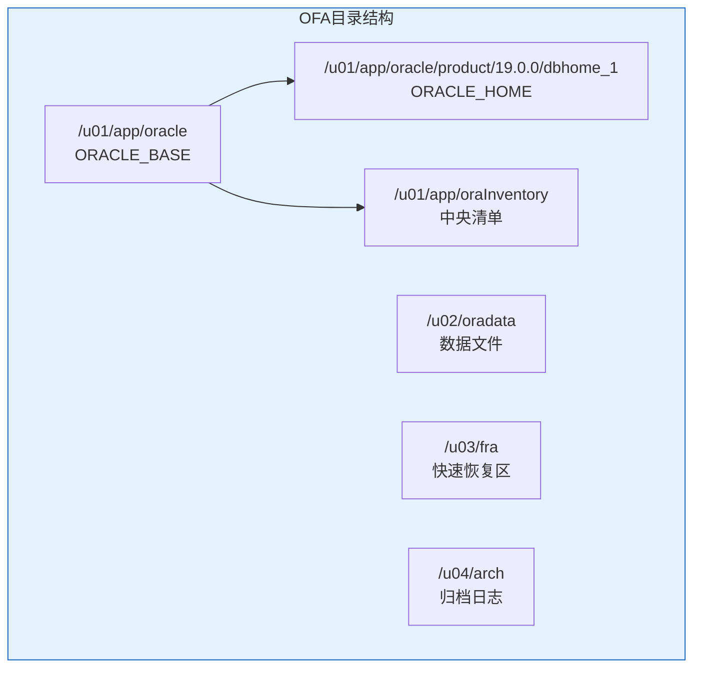
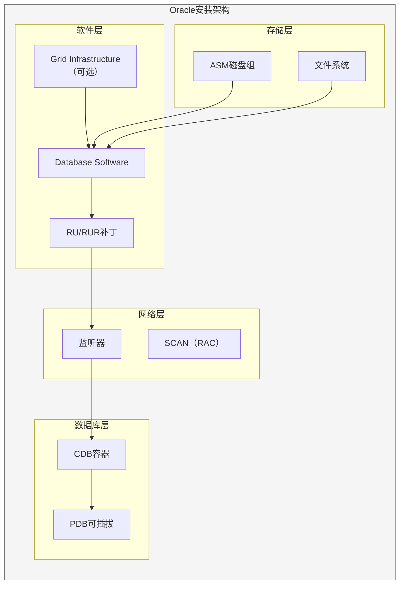

# Oracle安装规划指南

## 一、概述

### 1.1 一句话定义

Oracle安装规划是在部署Oracle数据库之前，对硬件资源、操作系统环境、目录结构、网络配置等进行全面评估和设计的过程。
它在数据库部署中出现和使用，解决因规划不足导致的性能瓶颈、安全隐患和运维困难问题。

### 1.2 为什么重要

- **不掌握的后果：** 安装后出现性能问题、空间不足、安全漏洞，甚至需要重新安装
- **掌握的价值：** 一次安装成功，长期稳定运行，降低运维成本

### 1.3 适用场景

| 场景 | 说明 |
|------|------|
| 新数据库部署 | 从零开始安装Oracle |
| 版本升级 | 从旧版本升级到19c/21c |
| 环境迁移 | 跨平台或跨机房迁移 |
| 集群部署 | RAC/GI环境安装 |

### 1.4 版本演进

| 版本 | 变化说明 |
|------|---------|
| 11gR2 | 传统安装方式，OUI图形界面 |
| 12cR1 | 多租户架构，Image安装 |
| 12cR2 | 简化安装流程 |
| 19c | Gold Image安装，OPatch自动化 |
| 21c | 云原生安装，OCI集成 |

## 二、术语与概念

### 2.1 核心术语表

| 术语 | 含义 | 类比 |
|------|------|------|
| ORACLE_BASE | Oracle基础目录 | 根目录 |
| ORACLE_HOME | Oracle软件目录 | 程序目录 |
| ORAInventory | 安装清单 | 资产清单 |
| OUI | 通用安装器 | 安装向导 |
| OPatch | 补丁工具 | 补丁管理器 |
| Gold Image | 黄金镜像 | 标准安装包 |
| OFA | 最优灵活架构 | 目录规范 |
| Pre-check | 预检查 | 安装体检 |

### 2.2 OFA目录结构



## 三、核心原理

### 3.1 硬件需求评估

**最低要求（19c）：**

| 资源 | 最低要求 | 生产推荐 |
|------|---------|---------|
| CPU | 2核 x86_64 | 8核+ |
| 内存 | 2GB | 16GB+ |
| 磁盘（软件） | 10GB | 20GB+ |
| 磁盘（数据） | 按数据量 | 预留3倍数据量 |
| Swap | 内存的1-1.5倍 | 16-32GB |
| /tmp | 1GB | 5GB+ |

**内存规划建议：**

```
SGA = 物理内存 × 60-80%
PGA = 物理内存 × 20%（非OLAP）或 物理内存 × 40%（OLAP）
总计不超过物理内存的90%
```

### 3.2 操作系统要求

**支持的Linux版本（19c）：**
- Oracle Linux 7.x / 8.x（推荐）
- Red Hat Enterprise Linux 7.x / 8.x
- SUSE Linux Enterprise Server 12/15

**内核版本要求：**
```bash
# 检查内核版本
uname -r
# 19c要求：Oracle Linux 7: 3.10.0+
# 19c要求：Oracle Linux 8: 4.14.0+
```

### 3.3 软件依赖包

```bash
# Oracle Linux 7/8 必需的软件包
yum install -y \
    binutils \
    compat-libcap1 \
    compat-libstdc++-33 \
    gcc \
    gcc-c++ \
    glibc \
    glibc-devel \
    ksh \
    libaio \
    libaio-devel \
    libgcc \
    libstdc++ \
    libstdc++-devel \
    libXi \
    libXtst \
    make \
    sysstat \
    unixODBC \
    unixODBC-devel

# 验证依赖
rpm -q binutils compat-libcap1 gcc glibc libaio make
```

### 3.4 内核参数配置

```bash
# /etc/sysctl.conf 配置
# 共享内存
vm.hugetlb_shm_group = 54321
kernel.shmmax = 68719476736    # 物理内存的80%
kernel.shmall = 4294967296

# 信号量
kernel.sem = 250 32000 100 128

# 网络
net.ipv4.ip_local_port_range = 9000 65500
net.core.rmem_default = 262144
net.core.rmem_max = 4194304
net.core.wmem_default = 262144
net.core.wmem_max = 1048576

# 文件句柄
fs.file-max = 6815744
fs.aio-max-nr = 1048576

# 应用配置
sysctl -p
```

### 3.5 系统限制配置

```bash
# /etc/security/limits.conf
oracle   soft    nofile    1024
oracle   hard    nofile    65536
oracle   soft    nproc     16384
oracle   hard    nproc     16384
oracle   soft    stack     10240
oracle   hard    stack     32768
oracle   soft    memlock   unlimited
oracle   hard    memlock   unlimited

# PAM配置
# /etc/pam.d/login
session required pam_limits.so
```

### 3.6 用户和组创建

```bash
# 创建组和用户
groupadd -g 54321 oinstall
groupadd -g 54322 dba
groupadd -g 54323 oper
groupadd -g 54324 backup
groupadd -g 54325 dgdba
groupadd -g 54326 kmdba

useradd -u 54321 -g oinstall -G dba,oper,backup,dgdba,kmdba oracle

# 设置密码
passwd oracle

# 创建目录
mkdir -p /u01/app/oracle/product/19.0.0/dbhome_1
mkdir -p /u01/app/oraInventory
mkdir -p /u02/oradata
mkdir -p /u03/fra

# 设置权限
chown -R oracle:oinstall /u01/app/oracle
chown -R oracle:oinstall /u01/app/oraInventory
chown -R oracle:oinstall /u02/oradata
chown -R oracle:oinstall /u03/fra

chmod -R 775 /u01/app/oracle
chmod -R 775 /u01/app/oraInventory
```

### 3.7 Oracle环境变量

```bash
# oracle用户的.bash_profile
export ORACLE_BASE=/u01/app/oracle
export ORACLE_HOME=$ORACLE_BASE/product/19.0.0/dbhome_1
export ORACLE_SID=orcl
export ORACLE_UNQNAME=orcl
export PATH=$ORACLE_HOME/bin:$PATH
export LD_LIBRARY_PATH=$ORACLE_HOME/lib:/lib:/usr/lib
export NLS_LANG=AMERICAN_AMERICA.AL32UTF8
export NLS_DATE_FORMAT='YYYY-MM-DD HH24:MI:SS'
export EDITOR=vi
export TMP=/tmp
export TMPDIR=/tmp

# 别名
alias sqlplus='rlwrap sqlplus'
alias rman='rlwrap rman'
alias asmcmd='rlwrap asmcmd'
```

### 3.8 OPatch补丁管理

```bash
# 检查OPatch版本
$ORACLE_HOME/OPatch/opatch version

# 更新OPatch
# 解压新版OPatch到$ORACLE_HOME/OPatch

# 查看已安装的补丁
$ORACLE_HOME/OPatch/opatch lspatches

# 查看补丁冲突
$ORACLE_HOME/OPatch/opatch prereq CheckConflictAgainstOHWithDetail -ph ./<patch_id>

# 应用补丁
cd <patch_id>
$ORACLE_HOME/OPatch/opatch apply

# 回滚补丁
cd <patch_id>
$ORACLE_HOME/OPatch/opatch rollback -id <patch_id>
```

### 3.9 安装前检查脚本

```bash
#!/bin/bash
# Oracle安装前检查脚本

echo "=== 操作系统检查 ==="
cat /etc/os-release | grep PRETTY_NAME

echo "=== 内核版本 ==="
uname -r

echo "=== 内存 ==="
free -h

echo "=== Swap ==="
swapon --show

echo "=== 磁盘空间 ==="
df -h /u01 /u02 /u03 /tmp

echo "=== CPU ==="
nproc
grep "model name" /proc/cpuinfo | head -1

echo "=== 必需用户和组 ==="
id oracle
grep -E "oinstall|dba|oper" /etc/group

echo "=== 内核参数 ==="
sysctl kernel.shmmax kernel.shmall fs.file-max net.ipv4.ip_local_port_range

echo "=== 软件包检查 ==="
for pkg in binutils gcc glibc libaio make libstdc++; do
    rpm -q $pkg > /dev/null 2>&1 && echo "$pkg: OK" || echo "$pkg: MISSING"
done

echo "=== 环境变量 ==="
su - oracle -c 'echo $ORACLE_HOME'

echo "=== 检查完成 ==="
```

## 四、架构与组件

### 4.1 安装架构



## 五、配置与调优

### 5.1 目录规划最佳实践

| 目录 | 用途 | 建议 |
|------|------|------|
| /u01 | 软件安装 | SSD，100GB+ |
| /u02 | 数据文件 | SSD/高速存储 |
| /u03 | FRA | 大容量存储 |
| /u04 | 归档日志 | 独立存储 |
| /tmp | 临时文件 | 5GB+ |

### 5.2 安全加固

```bash
# 限制Oracle目录访问
chmod 750 $ORACLE_HOME
chmod 750 $ORACLE_BASE

# 配置防火墙
firewall-cmd --permanent --add-port=1521/tcp
firewall-cmd --permanent --add-port=5500/tcp  # EM Express
firewall-cmd --reload

# 禁用不必要的服务
systemctl disable avahi-daemon
systemctl stop avahi-daemon
```

## 六、监控与诊断

### 6.1 安装验证

```bash
# 验证安装
$ORACLE_HOME/OPatch/opatch lspatches
sqlplus / as sysdba
SQL> SELECT banner FROM v$version;
SQL> SELECT comp_name, version, status FROM dba_registry;

# 验证监听
lsnrctl status
lsnrctl services

# 验证连接
sqlplus system/password@orcl
```

## 七、实战案例

### 7.1 案例背景

- **场景**：生产环境部署Oracle 19c RAC
- **规模**：2节点RAC，500GB数据量

### 7.2 规划方案

| 项目 | 配置 |
|------|------|
| 服务器 | 2×物理机，16核，128GB内存 |
| 存储 | ASM，3个磁盘组 |
| 网络 | 2×万兆网卡（Public+Private） |
| 软件 | 19c + 最新RU |

### 7.3 实施步骤

1. 操作系统安装和配置
2. Grid Infrastructure安装
3. ASM磁盘组创建
4. Database Software安装
5. 应用最新RU补丁
6. DBCA创建数据库
7. 网络配置和验证

## 八、常见错误与排查

| 错误 | 问题 | 解决方法 |
|------|------|---------|
| INS-35180 | 预检查失败 | 修复内核参数 |
| INS-32017 | ORAInventory冲突 | 清理旧清单 |
| ORA-27125 | 共享内存不足 | 调整shmmax |
| TNS-12541 | 监听失败 | 检查端口和防火墙 |

## 九、最佳实践

### 9.1 官方推荐

- 使用Gold Image安装
- 安装后立即应用最新RU
- 使用OFA规范目录结构
- 分离软件和数据存储

### 9.2 反模式

| 反模式 | 问题 | 正确做法 |
|--------|------|---------|
| 不规划直接安装 | 后期问题多 | 先规划再安装 |
| 软件数据同磁盘 | I/O争用 | 分离存储 |
| 不打补丁 | 安全漏洞 | 安装最新RU |
| 默认参数 | 性能不佳 | 按负载调优 |

## 十、命令与视图汇总

### 10.1 命令列表

| 命令 | 适用场景 | 说明 |
|------|---------|------|
| `runInstaller` | 启动OUI | 图形安装 |
| `$ORACLE_HOME/OPatch/opatch` | 补丁管理 | 应用/回滚补丁 |
| `cluvfy` | 集群验证 | RAC环境检查 |
| `oraversion` | 版本查看 | 查看版本信息 |

## 十一、总结速查

### 11.1 黄金法则

1. **先规划后安装** - 完整的需求评估
2. **遵循OFA规范** - 标准化目录结构
3. **及时打补丁** - 安全和稳定性
4. **分离存储** - 软件和数据分开

### 11.2 一页纸检查清单

| 检查项 | 说明 |
|--------|------|
| 硬件资源 | CPU/内存/磁盘充足 |
| 操作系统 | 版本和内核符合要求 |
| 依赖包 | 所有必需包已安装 |
| 内核参数 | sysctl配置正确 |
| 用户组 | oracle用户和组已创建 |
| 目录结构 | OFA规范，权限正确 |
| 网络 | 防火墙和端口配置 |
| 补丁 | 最新RU已规划 |

## 附录

### A. 官方参考

- [Oracle Database Installation Guide for Linux](https://docs.oracle.com/en/database/oracle/oracle-database/19c/install/)
- [Oracle Database Release Notes](https://docs.oracle.com/en/database/oracle/oracle-database/19c/reln/)

### B. 修订记录

| 日期 | 版本 | 修改内容 | 修改人 |
|------|------|---------|--------|
| 2026-07-02 | v1.0 | 初始版本 | YashanDB知识库生成器 |
