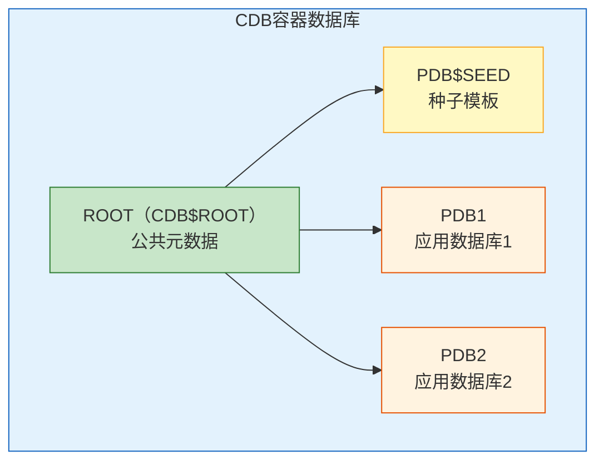
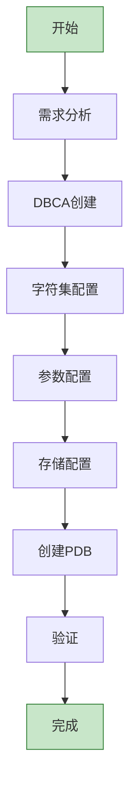

# Oracle实例创建与配置

## 一、概述

### 1.1 一句话定义

Oracle实例创建是通过DBCA（Database Configuration Assistant）或手动方式创建数据库实例，并配置字符集、初始化参数、存储结构等核心参数的过程。
它在数据库部署中出现和使用，解决从零开始构建可用数据库环境的问题。

### 1.2 为什么重要

- **不掌握的后果：** 字符集错误导致乱码，参数配置不当导致性能问题，需要重建数据库
- **掌握的价值：** 一次创建正确，避免重建的高昂代价

### 1.3 适用场景

| 场景 | 说明 |
|------|------|
| 新建数据库 | 部署新的数据库实例 |
| 多租户环境 | 创建CDB和PDB |
| 模板化部署 | 标准化批量创建 |
| 测试环境 | 快速创建测试数据库 |

### 1.4 版本演进

| 版本 | 变化说明 |
|------|---------|
| 11gR2 | 传统DBCA，单实例模式 |
| 12cR1 | 多租户架构，CDB/PDB创建 |
| 12cR2 | DBCA增强，模板改进 |
| 19c | DBCA静默模式增强，快速创建 |
| 21c | 云原生创建，自动化配置 |

## 二、术语与概念

### 2.1 核心术语表

| 术语 | 含义 | 类比 |
|------|------|------|
| DBCA | 数据库配置助手 | 创建向导 |
| CDB | 容器数据库 | 母舰 |
| PDB | 可插拔数据库 | 飞机 |
| Seed PDB | 种子PDB | 模板飞机 |
| Character Set | 字符集 | 编码规范 |
| SPFILE | 服务器参数文件 | 持久化配置 |
| ORACLE_SID | 实例标识 | 身份证号 |

## 三、核心原理

### 3.1 DBCA图形化创建

**步骤概述：**
1. 选择创建模式（典型/高级/自定义）
2. 选择部署类型（单实例/RAC/容器数据库）
3. 指定数据库标识（SID和名称）
4. 配置存储选项（文件位置、ASM）
5. 选择快速恢复区和归档
6. 选择字符集
7. 配置内存和SGA/PGA
8. 创建数据库

### 3.2 DBCA静默创建

```bash
# 创建单实例CDB
dbca -silent -createDatabase \
    -templateName General_Purpose.dbc \
    -gdbName orcl \
    -sid orcl \
    -createAsContainerDatabase true \
    -numberOfPDBs 1 \
    -pdbName pdb1 \
    -pdbAdminPassword Oracle123 \
    -sysPassword Oracle123 \
    -systemPassword Oracle123 \
    -characterSet AL32UTF8 \
    -nationalCharacterSet AL16UTF16 \
    -storageType FS \
    -datafileDestination /u02/oradata \
    -recoveryAreaDestination /u03/fra \
    -recoveryAreaSize 10240 \
    -totalMemory 4096 \
    -databaseType MULTIPURPOSE \
    -emConfiguration EMEXPRESS \
    -emExpressPort 5500

# 创建单实例非CDB（不推荐，19c已废弃）
dbca -silent -createDatabase \
    -templateName General_Purpose.dbc \
    -gdbName orcl \
    -sid orcl \
    -createAsContainerDatabase false \
    -characterSet AL32UTF8 \
    -totalMemory 4096
```

### 3.3 字符集选择

**推荐字符集：**

| 字符集 | 用途 | 建议 |
|--------|------|------|
| AL32UTF8 | 数据库字符集 | 推荐，支持所有Unicode |
| AL16UTF16 | 国家字符集 | NCHAR/NVARCHAR2使用 |
| ZHS16GBK | 中文GBK | 仅兼容旧系统 |

```sql
-- 查看当前字符集
SELECT parameter, value
FROM nls_database_parameters
WHERE parameter IN ('NLS_CHARACTERSET', 'NLS_NCHAR_CHARACTERSET');

-- 查看支持的字符集
SELECT * FROM v$nls_valid_values ORDER BY value;
```

**字符集选择原则：**
- 新数据库统一使用AL32UTF8
- 字符集一旦创建不能直接修改（需要特殊操作）
- 客户端NLS_LANG需要与数据库字符集匹配

### 3.4 关键初始化参数

```sql
-- 内存参数
ALTER SYSTEM SET memory_target = 0 SCOPE=SPFILE;          -- AMM关闭
ALTER SYSTEM SET sga_target = 8G SCOPE=SPFILE;
ALTER SYSTEM SET pga_aggregate_target = 2G SCOPE=SPFILE;
ALTER SYSTEM SET sga_max_size = 12G SCOPE=SPFILE;

-- 进程参数
ALTER SYSTEM SET processes = 1000 SCOPE=SPFILE;
ALTER SYSTEM SET sessions = 1524 SCOPE=SPFILE;            -- 1.5×processes
ALTER SYSTEM SET open_cursors = 300 SCOPE=BOTH;

-- 日志参数
ALTER SYSTEM SET db_recovery_file_dest = '/u03/fra';
ALTER SYSTEM SET db_recovery_file_dest_size = 50G;
ALTER SYSTEM SET log_archive_dest_1 = 'LOCATION=USE_DB_RECOVERY_FILE_DEST';

-- 优化器参数
ALTER SYSTEM SET optimizer_adaptive_plans = TRUE;
ALTER SYSTEM SET optimizer_adaptive_statistics = FALSE;

-- 审计参数
ALTER SYSTEM SET audit_trail = DB;

-- 诊断参数
ALTER SYSTEM SET diagnostic_dest = '/u01/app/oracle';
```

### 3.5 CDB/PDB创建

```sql
-- 查看CDB信息
SELECT name, open_mode, con_id FROM v$database;
SELECT con_id, name, open_mode FROM v$pdbs;

-- 创建新PDB
CREATE PLUGGABLE DATABASE pdb2
    ADMIN USER pdb_admin IDENTIFIED BY Oracle123
    FILE_NAME_CONVERT = ('/pdbseed/', '/pdb2/');

-- 从现有PDB克隆
CREATE PLUGGABLE DATABASE pdb3 FROM pdb2
    FILE_NAME_CONVERT = ('/pdb2/', '/pdb3/');

-- 打开PDB
ALTER PLUGGABLE DATABASE pdb2 OPEN;

-- 保存PDB状态（CDB重启时自动打开）
ALTER PLUGGABLE DATABASE pdb2 SAVE STATE;

-- 设置PDB服务
ALTER SESSION SET CONTAINER = pdb2;
```

### 3.6 数据库模板

```bash
# 从现有数据库创建模板
dbca -silent -createTemplateFromDB \
    -sourceDB orcl \
    -templateName /u01/app/oracle/templates/my_template.dbc

# 使用模板创建数据库
dbca -silent -createDatabase \
    -templateName /u01/app/oracle/templates/my_template.dbc \
    -gdbName newdb \
    -sid newdb

# 查看模板
ls -la $ORACLE_HOME/assistants/dbca/templates/
# 内置模板：
# General_Purpose.dbc - 通用
# Data_Warehouse.dbc - 数据仓库
# Transaction_Processing.dbc - 事务处理
```

## 四、架构与组件

### 4.1 CDB/PDB架构



### 4.2 创建流程



## 五、配置与调优

### 5.1 内存配置建议

| 场景 | SGA | PGA | 说明 |
|------|-----|-----|------|
| OLTP | 70%内存 | 20%内存 | 并发多，单查询小 |
| OLAP | 60%内存 | 30%内存 | 并发少，单查询大 |
| 混合 | 65%内存 | 25%内存 | 平衡配置 |

### 5.2 创建后优化

```sql
-- 创建额外的Redo日志组
ALTER DATABASE ADD LOGFILE GROUP 4 SIZE 500M;
ALTER DATABASE ADD LOGFILE GROUP 5 SIZE 500M;

-- 创建Undo表空间
CREATE UNDO TABLESPACE undotbs2
    DATAFILE '/u02/oradata/undotbs2_01.dbf' SIZE 4G AUTOEXTEND ON;

-- 创建临时表空间
CREATE TEMPORARY TABLESPACE temp2
    TEMPFILE '/u02/oradata/temp2_01.dbf' SIZE 2G AUTOEXTEND ON;

-- 创建应用表空间
CREATE TABLESPACE app_data
    DATAFILE '/u02/oradata/app_data01.dbf' SIZE 10G AUTOEXTEND ON
    EXTENT MANAGEMENT LOCAL AUTOALLOCATE
    SEGMENT SPACE MANAGEMENT AUTO;

-- 配置MTTR
ALTER SYSTEM SET fast_start_mttr_target = 60;
```

## 六、监控与诊断

### 6.1 创建验证

```sql
-- 数据库状态
SELECT instance_name, status, database_status FROM v$instance;

-- 数据库信息
SELECT name, open_mode, created, platform_name FROM v$database;

-- 组件状态
SELECT comp_name, version, status FROM dba_registry;

-- 字符集
SELECT parameter, value FROM nls_database_parameters
WHERE parameter LIKE '%CHARACTERSET%';

-- 参数文件
SHOW PARAMETER spfile;

-- 数据文件
SELECT tablespace_name, file_name, bytes/1024/1024 AS mb
FROM dba_data_files ORDER BY tablespace_name;
```

## 七、实战案例

### 7.1 案例：创建多租户生产数据库

```bash
# 1. 创建CDB
dbca -silent -createDatabase \
    -templateName General_Purpose.dbc \
    -gdbName prod \
    -sid prod \
    -createAsContainerDatabase true \
    -numberOfPDBs 0 \
    -characterSet AL32UTF8 \
    -totalMemory 16384 \
    -storageType FS \
    -datafileDestination /u02/oradata \
    -recoveryAreaDestination /u03/fra

# 2. 创建PDB
sqlplus / as sysdba
CREATE PLUGGABLE DATABASE app_pdb
    ADMIN USER app_admin IDENTIFIED BY "SecurePass123"
    ROLES = (CONNECT, DBA)
    FILE_NAME_CONVERT = ('/pdbseed/', '/app_pdb/');

ALTER PLUGGABLE DATABASE app_pdb OPEN;
ALTER PLUGGABLE DATABASE app_pdb SAVE STATE;
```

## 八、常见错误与排查

| 错误 | 问题 | 解决方法 |
|------|------|---------|
| ORA-65040 | PDB操作错误 | 确认在正确的容器中 |
| ORA-01119 | 数据文件创建失败 | 检查目录权限 |
| ORA-12514 | 监听无法识别服务 | 注册服务到监听 |
| DBCA失败 | 预检查未通过 | 查看DBCA日志 |

## 九、最佳实践

### 9.1 官方推荐

- 使用CDB/PDB多租户架构
- 字符集统一使用AL32UTF8
- 使用SPFILE而非PFILE
- 创建后立即应用安全补丁

### 9.2 反模式

| 反模式 | 问题 | 正确做法 |
|--------|------|---------|
| 使用非CDB | 已废弃 | 使用CDB/PDB |
| 默认字符集 | 可能乱码 | 明确指定AL32UTF8 |
| 默认参数 | 性能不佳 | 按负载调优 |
| 不创建模板 | 重复配置 | 创建标准模板 |

## 十、命令与视图汇总

| 命令/视图 | 用途 |
|-----------|------|
| `dbca -silent -createDatabase` | 静默创建数据库 |
| `CREATE PLUGGABLE DATABASE` | 创建PDB |
| `ALTER PLUGGABLE DATABASE ... SAVE STATE` | 保存PDB状态 |
| V$DATABASE | 数据库信息 |
| V$PDBS | PDB信息 |
| DBA_REGISTRY | 组件状态 |
| NLS_DATABASE_PARAMETERS | 字符集信息 |

## 十一、总结速查

### 11.1 黄金法则

1. **使用CDB/PDB** - 多租户是未来方向
2. **AL32UTF8** - 统一字符集标准
3. **SPFILE管理** - 持久化参数配置
4. **模板化部署** - 标准化创建流程

## 附录

### A. 官方参考

- [Oracle Database Administrator's Guide - Creating a Database](https://docs.oracle.com/en/database/oracle/oracle-database/19c/admin/)
- [Oracle Database Administrator's Guide - Managing a Multitenant Environment](https://docs.oracle.com/en/database/oracle/oracle-database/19c/multi/)

### B. 修订记录

| 日期 | 版本 | 修改内容 | 修改人 |
|------|------|---------|--------|
| 2026-07-02 | v1.0 | 初始版本 | YashanDB知识库生成器 |
