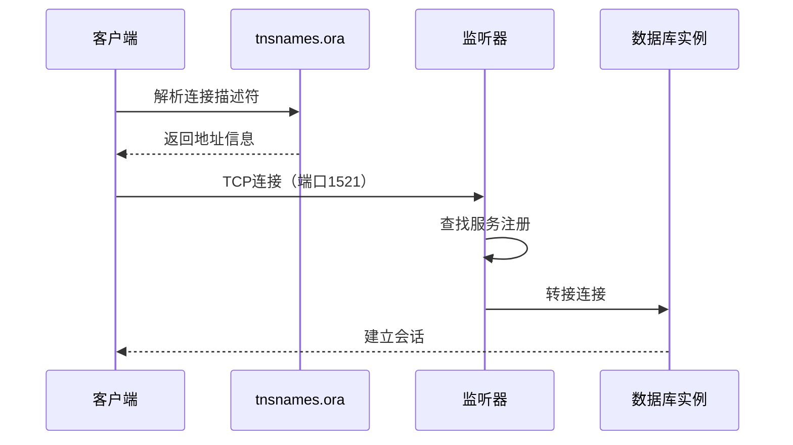
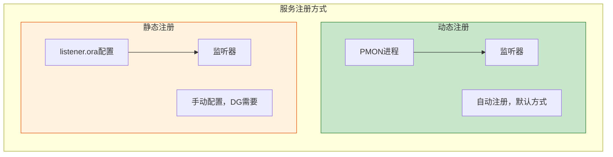
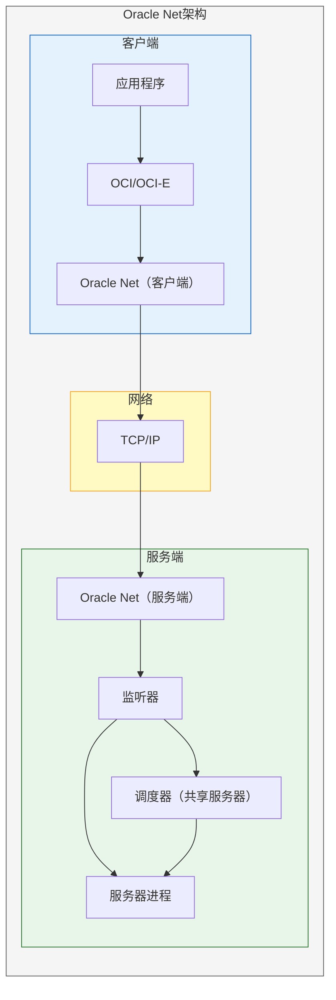
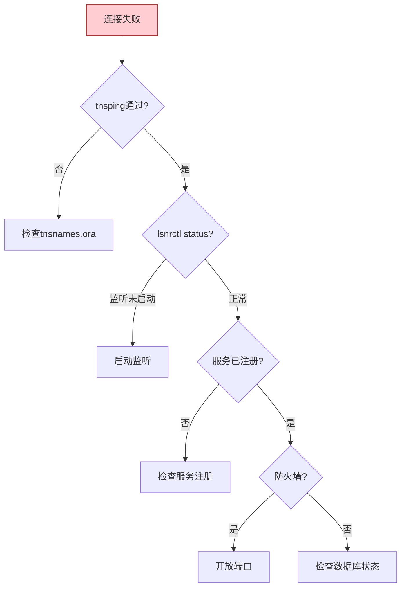

# Oracle网络配置详解

## 一、概述

### 1.1 一句话定义

Oracle网络配置是通过Oracle Net Services设置客户端与数据库服务器之间通信连接的过程，包括监听器配置、命名解析、连接描述符等核心组件。
它在数据库部署和连接管理中出现和使用，解决客户端如何找到并连接到数据库的问题。

### 1.2 为什么重要

- **不掌握的后果：** 客户端无法连接数据库，连接超时，安全漏洞
- **掌握的价值：** 确保连接稳定可靠，优化网络性能，保障连接安全

### 1.3 适用场景

| 场景 | 说明 |
|------|------|
| 初始部署 | 配置监听和客户端连接 |
| 连接问题排查 | 诊断TNS错误 |
| 安全加固 | 加密和认证配置 |
| 高可用 | SCAN和连接管理器 |

### 1.4 版本演进

| 版本 | 变化说明 |
|------|---------|
| 11gR2 | 传统Oracle Net配置 |
| 12cR1 | 多租户服务注册 |
| 12cR2 | 连接管理增强 |
| 19c | TCPS默认支持，安全增强 |
| 21c | 云网络连接优化 |

## 二、术语与概念

### 2.1 核心术语表

| 术语 | 含义 | 类比 |
|------|------|------|
| Listener | 监听器 | 前台接待 |
| TNS | 透明网络底层 | 电话网络 |
| tnsnames.ora | 连接描述文件 | 电话簿 |
| listener.ora | 监听配置文件 | 接待规则 |
| sqlnet.ora | 网络参数文件 | 通信规则 |
| Service Name | 服务名 | 部门名称 |
| SID | 实例标识 | 工位号 |
| SCAN | 单客户端访问名 | 统一号码 |
| CMAN | 连接管理器 | 总机转接 |

### 2.2 连接流程



## 三、核心原理

### 3.1 listener.ora配置

```
# listener.ora - 监听器配置
LISTENER =
  (DESCRIPTION_LIST =
    (DESCRIPTION =
      (ADDRESS = (PROTOCOL = TCP)(HOST = dbserver)(PORT = 1521))
      (ADDRESS = (PROTOCOL = IPC)(KEY = EXTPROC1521))
    )
  )

# 静态注册（Data Guard等场景需要）
SID_LIST_LISTENER =
  (SID_LIST =
    (SID_DESC =
      (GLOBAL_DBNAME = orcl)
      (ORACLE_HOME = /u01/app/oracle/product/19.0.0/dbhome_1)
      (SID_NAME = orcl)
    )
  )

# ADR基础
ADR_BASE_LISTENER = /u01/app/oracle

# 连接速率限制
INBOUND_CONNECT_TIMEOUT_LISTENER = 60
LOG_DIRECTORY_LISTENER = /u01/app/oracle/diag/tnslsnr/dbserver/listener/trace
LOG_FILE_LISTENER = /u01/app/oracle/diag/tnslsnr/dbserver/listener/trace/listener.log
```

**监听器管理命令：**
```bash
# 启动监听
lsnrctl start

# 停止监听
lsnrctl stop

# 查看状态
lsnrctl status

# 查看服务
lsnrctl services

# 重新加载配置
lsnrctl reload

# 查看监听日志
lsnrctl set log_status on
```

### 3.2 动态注册 vs 静态注册



```sql
-- 动态注册参数
SHOW PARAMETER local_listener;
SHOW PARAMETER remote_listener;

-- 修改动态注册端口（非默认1521时）
ALTER SYSTEM SET local_listener = '(ADDRESS=(PROTOCOL=TCP)(HOST=dbserver)(PORT=1522))';
ALTER SYSTEM REGISTER;  -- 手动触发注册
```

### 3.3 tnsnames.ora配置

```
# tnsnames.ora - 连接描述符

# 基本连接
ORCL =
  (DESCRIPTION =
    (ADDRESS = (PROTOCOL = TCP)(HOST = dbserver)(PORT = 1521))
    (CONNECT_DATA =
      (SERVER = DEDICATED)
      (SERVICE_NAME = orcl)
    )
  )

# PDB连接
PDB1 =
  (DESCRIPTION =
    (ADDRESS = (PROTOCOL = TCP)(HOST = dbserver)(PORT = 1521))
    (CONNECT_DATA =
      (SERVER = DEDICATED)
      (SERVICE_NAME = pdb1)
    )
  )

# RAC连接（多地址）
RACDB =
  (DESCRIPTION =
    (ADDRESS_LIST =
      (LOAD_BALANCE = ON)
      (FAILOVER = ON)
      (ADDRESS = (PROTOCOL = TCP)(HOST = rac1-vip)(PORT = 1521))
      (ADDRESS = (PROTOCOL = TCP)(HOST = rac2-vip)(PORT = 1521))
    )
    (CONNECT_DATA =
      (SERVICE_NAME = racdb)
    )
  )

# SCAN连接
SCANDB =
  (DESCRIPTION =
    (ADDRESS_LIST =
      (ADDRESS = (PROTOCOL = TCP)(HOST = scan-cluster:1521))
    )
    (CONNECT_DATA =
      (SERVICE_NAME = orcl)
    )
  )

# Easy Connect语法
# sqlplus user/pass@dbserver:1521/orcl
# sqlplus user/pass@//dbserver:1521/orcl
```

### 3.4 sqlnet.ora配置

```
# sqlnet.ora - 客户端网络参数

# 命名方法优先级
NAMES.DIRECTORY_PATH = (TNSNAMES, LDAP, EZCONNECT)

# 连接超时
SQLNET.OUTBOUND_CONNECT_TIMEOUT = 10
SQLNET.RECV_TIMEOUT = 30
SQLNET.SEND_TIMEOUT = 30

# 加密配置
SQLNET.ENCRYPTION_TYPES_SERVER = (AES256, AES192)
SQLNET.ENCRYPTION_SERVER = REQUIRED
SQLNET.CRYPTO_CHECKSUM_TYPES_SERVER = (SHA256)
SQLNET.CRYPTO_CHECKSUM_SERVER = REQUIRED

# 日志和跟踪
TRACE_LEVEL_CLIENT = OFF
LOG_DIRECTORY_CLIENT = /u01/app/oracle/diag/clients
LOG_FILE_CLIENT = sqlnet.log

# 死连接检测
SQLNET.EXPIRE_TIME = 10
```

### 3.5 命名方法

| 方法 | 说明 | 适用场景 |
|------|------|---------|
| TNSNAMES | 本地文件解析 | 小规模环境 |
| LDAP | 目录服务解析 | 大规模企业环境 |
| EZCONNECT | 简单连接语法 | 快速测试 |
| HOSTNAME | 主机名解析 | 简单环境 |

### 3.6 连接描述符详解

```
# 完整连接描述符
ORCL =
  (DESCRIPTION =
    (ADDRESS_LIST =
      (LOAD_BALANCE = OFF)
      (FAILOVER = ON)
      (ADDRESS = (PROTOCOL = TCP)(HOST = primary)(PORT = 1521))
      (ADDRESS = (PROTOCOL = TCP)(HOST = standby)(PORT = 1521))
    )
    (CONNECT_DATA =
      (SERVICE_NAME = orcl)
      (SERVER = DEDICATED)
      (FAILOVER_MODE =
        (TYPE = SELECT)
        (METHOD = BASIC)
        (RETRIES = 3)
        (DELAY = 5)
      )
    )
    (SECURITY =
      (SSL_SERVER_CERT_DN = "cn=orcl")
    )
  )
```

### 3.7 连接管理器（CMAN）

```
# cman.ora - 连接管理器配置
CMAN =
  (CONFIGURATION =
    (ADDRESS = (PROTOCOL = TCP)(HOST = cman-server)(PORT = 1521))
    (PARAMETER_LIST =
      (MAX_RELAYS = 100)
      (CONNECTION_TIMEOUT = 30)
      (LOG_DIRECTORY = /u01/app/oracle/diag/cman)
      (LOG_LEVEL = SUPPORT)
      (RULE_LIST =
        (RULE =
          (SRC = 10.0.0.0/8)
          (DST = *)
          (SRV = *)
          (ACT = ACCEPT)
        )
      )
    )
  )
```

```bash
# 启动连接管理器
cmctl startup
cmctl status
cmctl show status
```

## 四、架构与组件

### 4.1 Oracle Net架构



## 五、配置与调优

### 5.1 性能优化

```sql
-- 配置SDU（Session Data Unit）
-- sqlnet.ora
DEFAULT_SDU_SIZE = 65535

-- tnsnames.ora中添加
(SDU = 65535)

-- 配置连接池
-- 应用层配置
```

### 5.2 安全配置

```
# sqlnet.ora 安全配置
# 强制加密
SQLNET.ENCRYPTION_SERVER = REQUIRED
SQLNET.ENCRYPTION_TYPES_SERVER = (AES256)

# TCPS配置
# listener.ora
(ADDRESS = (PROTOCOL = TCPS)(HOST = dbserver)(PORT = 2484))

# 限制无效登录
SQLNET.RECV_TIMEOUT = 30
INBOUND_CONNECT_TIMEOUT_LISTENER = 60

# ACL访问控制
# 19c网络ACL
BEGIN
    DBMS_NETWORK_ACL_ADMIN.APPEND_HOST_ACE(
        host => '*',
        ace  => xs$ace_type(
            privilege_list => xs$name_list('connect'),
            principal_name => 'APP_USER',
            principal_type => xs_acl.ptype_db
        )
    );
END;
/
```

## 六、监控与诊断

### 6.1 网络连接诊断

```bash
# tnsping测试连接
tnsping orcl
tnsping pdb1

# 检查监听状态
lsnrctl status
lsnrctl services

# 网络跟踪
# sqlnet.ora
TRACE_LEVEL_CLIENT = 16
TRACE_DIRECTORY_CLIENT = /tmp/trace
TRACE_FILE_CLIENT = sqlnet_trace.trc

# 监听器跟踪
lsnrctl set trc_level 16
lsnrctl set trc_directory /tmp
lsnrctl set trc_file listener.trc
```

```sql
-- 查看当前连接信息
SELECT sid, serial#, username, machine, program,
       service_name, type
FROM v$session
WHERE username IS NOT NULL;

-- 查看服务注册
SELECT name, network_name, status
FROM v$active_services;

-- 查看连接统计
SELECT name, value FROM v$sysstat
WHERE name LIKE '%connection%' OR name LIKE '%login%';
```

### 6.2 常见TNS错误

| 错误 | 问题 | 解决方法 |
|------|------|---------|
| ORA-12541 | 无监听器 | 启动监听 |
| ORA-12514 | 服务未注册 | 检查服务名 |
| ORA-12170 | 连接超时 | 检查网络和防火墙 |
| ORA-12154 | TNS无法解析 | 检查tnsnames.ora |
| ORA-12560 | 协议适配器错误 | 检查Oracle Net配置 |
| TNS-03505 | 无法解析名称 | 检查命名方法 |

## 七、实战案例

### 7.1 案例：配置RAC SCAN连接

```
# tnsnames.ora
RACDB =
  (DESCRIPTION =
    (ADDRESS_LIST =
      (ADDRESS = (PROTOCOL = TCP)(HOST = scan-cluster)(PORT = 1521))
    )
    (CONNECT_DATA =
      (SERVICE_NAME = racdb)
      (FAILOVER_MODE =
        (TYPE = SELECT)
        (METHOD = BASIC)
      )
    )
  )
```

```bash
# 验证SCAN
nslookup scan-cluster
tnsping racdb
sqlplus user/pass@racdb
```

## 八、常见错误与排查

### 8.1 排查流程



## 九、最佳实践

### 9.1 官方推荐

- 使用Service Name而非SID连接
- 配置SQLNET.EXPIRE_TIME检测死连接
- 生产环境使用SCAN（RAC）
- 启用网络加密

### 9.2 反模式

| 反模式 | 问题 | 正确做法 |
|--------|------|---------|
| 使用SID连接 | 不支持负载均衡 | 使用Service Name |
| 不配置超时 | 死连接占用资源 | 设置超时参数 |
| 不启用加密 | 数据明文传输 | 启用TCPS |
| 监听器默认密码 | 安全风险 | 设置监听密码 |

## 十、命令与视图汇总

| 命令/视图 | 用途 |
|-----------|------|
| `lsnrctl status/services/start/stop` | 监听管理 |
| `tnsping` | 连接测试 |
| `cmctl` | 连接管理器管理 |
| V$SESSION | 会话信息 |
| V$ACTIVE_SERVICES | 活动服务 |
| V$LISTENER_NETWORK | 监听网络 |

## 十一、总结速查

### 11.1 黄金法则

1. **使用Service Name** - 支持负载均衡和故障切换
2. **配置超时参数** - 防止死连接
3. **启用网络加密** - 保护数据传输
4. **使用SCAN** - RAC环境统一接入

## 附录

### A. 官方参考

- [Oracle Database Net Services Administrator's Guide](https://docs.oracle.com/en/database/oracle/oracle-database/19c/netag/)
- [Oracle Database Net Services Reference](https://docs.oracle.com/en/database/oracle/oracle-database/19c/refrn/)

### B. 修订记录

| 日期 | 版本 | 修改内容 | 修改人 |
|------|------|---------|--------|
| 2026-07-02 | v1.0 | 初始版本 | YashanDB知识库生成器 |
