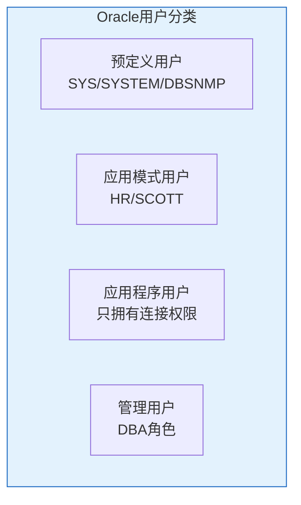
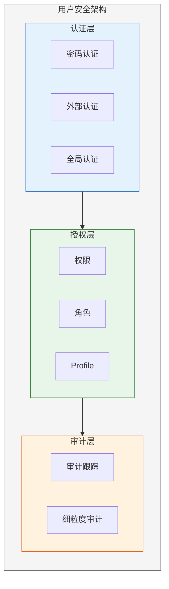

# Oracle用户管理

## 一、概述

### 1.1 一句话定义

Oracle用户管理是创建、配置和维护数据库用户账户的过程，包括密码策略、资源限制、空间配额等安全控制。
它在数据库安全管理中出现和使用，解决谁能访问数据库以及如何使用资源的问题。

### 1.2 为什么重要

- **不掌握的后果：** 弱密码导致安全漏洞，无限制的资源使用导致系统崩溃
- **掌握的价值：** 建立安全的访问控制体系，防止未授权访问和资源滥用

### 1.3 适用场景

| 场景 | 说明 |
|------|------|
| 新用户创建 | 应用或开发人员需要数据库访问 |
| 密码策略 | 设置密码复杂度和过期策略 |
| 资源限制 | 控制用户使用的系统资源 |
| 账户安全 | 锁定/解锁、密码重置 |

### 1.4 版本演进

| 版本 | 变化说明 |
|------|---------|
| 11gR2 | 密码大小写敏感，Profile增强 |
| 12cR1 | 通用用户（Common User），多租户用户 |
| 12cR2 | 密码版本控制增强 |
| 19c | 密码验证函数增强，安全默认值 |
| 21c | 云安全集成 |

## 二、术语与概念

### 2.1 核心术语表

| 术语 | 含义 | 类比 |
|------|------|------|
| Schema | 模式 | 文件柜 |
| Profile | 配置文件 | 规则手册 |
| Password Policy | 密码策略 | 门禁规则 |
| Quota | 配额 | 空间限额 |
| Account Lock | 账户锁定 | 冻结账户 |
| Common User | 通用用户 | 跨PDB用户 |
| Local User | 本地用户 | 单PDB用户 |

### 2.2 用户分类



## 三、核心原理

### 3.1 用户创建

```sql
-- 创建基本用户
CREATE USER app_user IDENTIFIED BY "SecurePass123!"
    DEFAULT TABLESPACE users
    TEMPORARY TABLESPACE temp
    QUOTA 1G ON users
    QUOTA 0 ON system;

-- 创建用户并指定Profile
CREATE USER dev_user IDENTIFIED BY "DevPass456!"
    DEFAULT TABLESPACE users
    TEMPORARY TABLESPACE temp
    QUOTA UNLIMITED ON users
    PROFILE app_profile;

-- 多租户环境 - 通用用户（CDB级别）
CREATE USER c##common_user IDENTIFIED BY "CommonPass!"
    CONTAINER = ALL;

-- 多租户环境 - 本地用户（PDB级别）
ALTER SESSION SET CONTAINER = pdb1;
CREATE USER local_user IDENTIFIED BY "LocalPass!";
```

### 3.2 Profile管理

Profile是密码策略和资源限制的集合。

```sql
-- 创建Profile
CREATE PROFILE app_profile LIMIT
    -- 密码策略
    PASSWORD_LIFE_TIME 90          -- 密码有效期（天）
    PASSWORD_GRACE_TIME 7          -- 宽限期（天）
    PASSWORD_REUSE_TIME 365        -- 密码重用间隔
    PASSWORD_REUSE_MAX 10          -- 重用前需更换次数
    PASSWORD_LOCK_TIME 1           -- 锁定时间（天）
    FAILED_LOGIN_ATTEMPTS 5        -- 失败登录次数
    PASSWORD_VERIFY_FUNCTION verify_function_19C
    -- 资源限制
    SESSIONS_PER_USER 3            -- 每用户会话数
    CPU_PER_SESSION 10000          -- 每会话CPU时间（1/100秒）
    CONNECT_TIME 480               -- 连接时间（分钟）
    IDLE_TIME 30                   -- 空闲时间（分钟）
    LOGICAL_READS_PER_SESSION 1000000;

-- 修改Profile
ALTER PROFILE app_profile LIMIT
    PASSWORD_LIFE_TIME 60
    FAILED_LOGIN_ATTEMPTS 3;

-- 查看Profile
SELECT profile, resource_name, limit
FROM dba_profiles
WHERE profile = 'APP_PROFILE'
ORDER BY resource_name;

-- 将Profile分配给用户
ALTER USER app_user PROFILE app_profile;
```

### 3.3 密码策略

```sql
-- 查看密码参数
SELECT resource_name, limit
FROM dba_profiles
WHERE profile = 'DEFAULT'
  AND resource_name LIKE 'PASSWORD%';

-- Oracle 19c 内置密码验证函数
-- verify_function_19C - 标准验证
-- 要求：至少8位，包含大小写、数字、特殊字符

-- 自定义密码验证函数
CREATE OR REPLACE FUNCTION custom_verify_function(
    username VARCHAR2,
    password VARCHAR2,
    old_password VARCHAR2
) RETURN BOOLEAN AS
BEGIN
    -- 最少10位
    IF LENGTH(password) < 10 THEN
        RAISE_APPLICATION_ERROR(-20001, '密码长度至少10位');
    END IF;
    
    -- 不能与用户名相同
    IF LOWER(password) = LOWER(username) THEN
        RAISE_APPLICATION_ERROR(-20002, '密码不能与用户名相同');
    END IF;
    
    RETURN TRUE;
END;
/

-- 使用自定义函数
CREATE PROFILE strict_profile LIMIT
    PASSWORD_VERIFY_FUNCTION custom_verify_function;
```

### 3.4 用户配额管理

```sql
-- 设置配额
ALTER USER app_user QUOTA 5G ON users;
ALTER USER app_user QUOTA UNLIMITED ON app_data;
ALTER USER app_user QUOTA 0 ON system;  -- 禁止使用SYSTEM表空间

-- 查看配额
SELECT username, tablespace_name, 
       bytes/1024/1024 AS used_mb,
       max_bytes/1024/1024 AS quota_mb
FROM dba_ts_quotas
WHERE username = 'APP_USER';

-- 查看表空间使用
SELECT owner, tablespace_name, 
       SUM(bytes)/1024/1024 AS used_mb
FROM dba_segments
WHERE owner = 'APP_USER'
GROUP BY owner, tablespace_name;
```

### 3.5 用户锁定与解锁

```sql
-- 手动锁定用户
ALTER USER app_user ACCOUNT LOCK;

-- 解锁用户
ALTER USER app_user ACCOUNT UNLOCK;

-- 密码过期强制修改
ALTER USER app_user PASSWORD EXPIRE;

-- 查看锁定状态
SELECT username, account_status, lock_date, expiry_date
FROM dba_users
WHERE username = 'APP_USER';

-- 查看登录失败信息
SELECT username, userhost, terminal,
       TO_CHAR(timestamp, 'YYYY-MM-DD HH24:MI:SS') AS fail_time
FROM dba_audit_trail
WHERE returncode = 1017  -- ORA-01017: 无效登录
  AND username = 'APP_USER'
ORDER BY timestamp DESC;
```

### 3.6 用户修改与删除

```sql
-- 修改用户属性
ALTER USER app_user
    IDENTIFIED BY "NewPass789!"
    DEFAULT TABLESPACE app_data
    TEMPORARY TABLESPACE temp2
    QUOTA 10G ON app_data;

-- 删除用户（无对象）
DROP USER app_user;

-- 删除用户及其所有对象
DROP USER app_user CASCADE;

-- 查看用户依赖（删除前检查）
SELECT owner, object_type, object_name
FROM dba_objects
WHERE owner = 'APP_USER';
```

## 四、架构与组件

### 4.1 用户安全架构



## 五、配置与调优

### 5.1 安全加固

```sql
-- 锁定默认不必要账户
ALTER USER ANONYMOUS ACCOUNT LOCK;
ALTER USER CTXSYS ACCOUNT LOCK;
ALTER USER DBSNMP ACCOUNT LOCK;
ALTER USER MDSYS ACCOUNT LOCK;
ALTER USER OUTLN ACCOUNT LOCK;
ALTER USER XDB ACCOUNT LOCK;

-- 查看活跃用户
SELECT username, account_status, created, profile
FROM dba_users
WHERE account_status = 'OPEN'
ORDER BY created;

-- 检查弱密码（使用安全工具）
-- 建议使用Oracle Database Vault或第三方工具
```

### 5.2 多租户用户管理

```sql
-- CDB中创建通用用户
CREATE USER c##app_admin IDENTIFIED BY "AdminPass!"
    CONTAINER = ALL
    DEFAULT TABLESPACE users
    QUOTA UNLIMITED ON users;

-- 授予通用角色
GRANT CREATE SESSION TO c##app_admin CONTAINER = ALL;
GRANT DBA TO c##app_admin CONTAINER = ALL;

-- 在PDB中创建本地用户
ALTER SESSION SET CONTAINER = pdb1;
CREATE USER pdb_app IDENTIFIED BY "PdbPass!";
GRANT CREATE SESSION, CREATE TABLE TO pdb_app;
```

## 六、监控与诊断

### 6.1 用户监控

```sql
-- 查看当前登录用户
SELECT username, machine, program, logon_time
FROM v$session
WHERE type = 'USER';

-- 查看用户资源使用
SELECT s.username, s.sid, s.serial#,
       s.status, s.machine, s.program,
       p.spid, s.logon_time
FROM v$session s
JOIN v$process p ON s.paddr = p.addr
WHERE s.type = 'USER'
ORDER BY s.logon_time;

-- 查看用户会话数
SELECT username, COUNT(*) AS sessions
FROM v$session
WHERE username IS NOT NULL
GROUP BY username
ORDER BY sessions DESC;
```

## 七、实战案例

### 7.1 案例：建立应用用户安全体系

```sql
-- 1. 创建应用Profile
CREATE PROFILE app_profile LIMIT
    PASSWORD_LIFE_TIME 90
    PASSWORD_REUSE_MAX 10
    FAILED_LOGIN_ATTEMPTS 5
    PASSWORD_LOCK_TIME 1
    SESSIONS_PER_USER 10
    IDLE_TIME 60
    PASSWORD_VERIFY_FUNCTION verify_function_19C;

-- 2. 创建应用Schema用户
CREATE USER app_schema IDENTIFIED BY "SchemaPass!"
    DEFAULT TABLESPACE app_data
    TEMPORARY TABLESPACE temp
    QUOTA UNLIMITED ON app_data
    PROFILE app_profile;

-- 3. 创建应用连接用户
CREATE USER app_conn IDENTIFIED BY "ConnPass!"
    DEFAULT TABLESPACE users
    TEMPORARY TABLESPACE temp
    QUOTA 0 ON system
    PROFILE app_profile;

-- 4. 授权
GRANT CREATE SESSION TO app_conn;
GRANT SELECT ON app_schema.employees TO app_conn;
```

## 八、常见错误与排查

| 错误 | 问题 | 解决方法 |
|------|------|---------|
| ORA-01017 | 无效用户名/密码 | 检查凭据 |
| ORA-28000 | 账户锁定 | 解锁并检查失败原因 |
| ORA-28001 | 密码过期 | 修改密码 |
| ORA-01950 | 无表空间配额 | 增加配额 |
| ORA-01045 | 用户无CREATE SESSION | 授予权限 |

## 九、最佳实践

### 9.1 官方推荐

- 使用Profile管理密码策略
- 应用使用分离的Schema和连接用户
- 定期审查活跃用户
- 锁定不必要的默认账户

### 9.2 反模式

| 反模式 | 问题 | 正确做法 |
|--------|------|---------|
| 共享账户 | 无法审计 | 每人独立账户 |
| 不设密码策略 | 弱密码风险 | 使用Profile |
| 给应用DBA权限 | 权限过大 | 最小权限原则 |
| 不审查用户 | 僵尸账户 | 定期审查 |

## 十、命令与视图汇总

| 命令/视图 | 用途 |
|-----------|------|
| `CREATE USER` | 创建用户 |
| `ALTER USER` | 修改用户 |
| `DROP USER` | 删除用户 |
| `CREATE PROFILE` | 创建配置文件 |
| DBA_USERS | 用户信息 |
| DBA_PROFILES | Profile信息 |
| DBA_TS_QUOTAS | 表空间配额 |

## 十一、总结速查

### 11.1 黄金法则

1. **Profile管理密码** - 统一密码策略
2. **最小权限原则** - 按需授权
3. **Schema/连接分离** - 安全和灵活兼顾
4. **定期审查** - 清理僵尸账户

## 附录

### A. 官方参考

- [Oracle Database Security Guide - Managing Users](https://docs.oracle.com/en/database/oracle/oracle-database/19c/dbseg/)

### B. 修订记录

| 日期 | 版本 | 修改内容 | 修改人 |
|------|------|---------|--------|
| 2026-07-02 | v1.0 | 初始版本 | YashanDB知识库生成器 |
