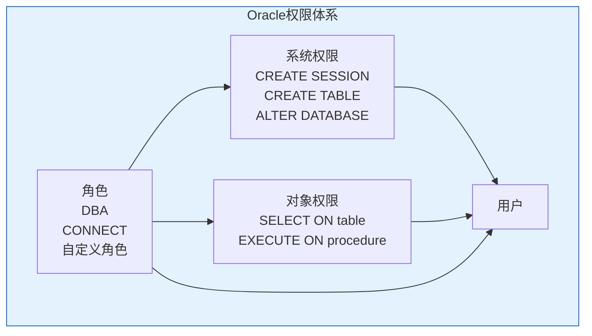
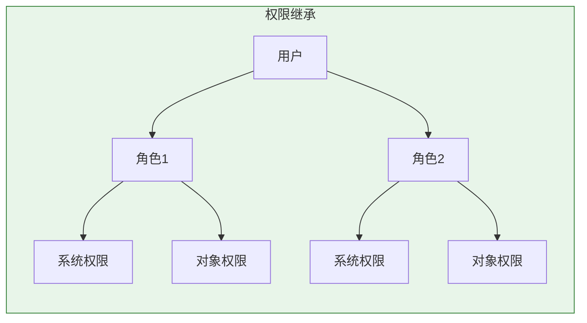
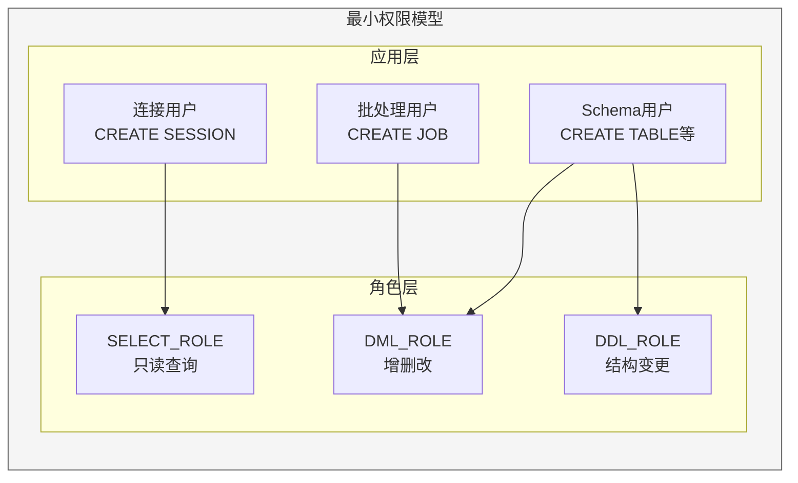

# Oracle权限管理体系

## 一、概述

### 1.1 一句话定义

Oracle权限管理是通过系统权限和对象权限控制用户对数据库资源和数据访问的安全机制。
它在数据库安全管理中出现和使用，解决用户能做什么操作以及能访问哪些数据的问题。

### 1.2 为什么重要

- **不掌握的后果：** 权限过大导致数据泄露或误操作，权限过小影响业务运行
- **掌握的价值：** 建立精确的访问控制，满足安全合规要求

### 1.3 适用场景

| 场景 | 说明 |
|------|------|
| 权限分配 | 新用户需要数据库操作权限 |
| 权限审计 | 检查谁有危险权限 |
| 权限回收 | 员工离职或角色变更 |
| 安全合规 | 满足最小权限原则 |

## 二、术语与概念

### 2.1 核心术语表

| 术语 | 含义 | 类比 |
|------|------|------|
| System Privilege | 系统权限 | 通用钥匙 |
| Object Privilege | 对象权限 | 房间钥匙 |
| ANY Privilege | ANY权限 | 万能钥匙 |
| GRANT | 授权 | 给钥匙 |
| REVOKE | 回收 | 收钥匙 |
| WITH ADMIN OPTION | 管理选项 | 可以复制钥匙 |
| WITH GRANT OPTION | 授予选项 | 可以转交房间钥匙 |

### 2.2 权限体系结构



## 三、核心原理

### 3.1 系统权限分类

**数据库级权限：**

| 权限 | 说明 | 风险等级 |
|------|------|---------|
| CREATE SESSION | 连接数据库 | 低 |
| CREATE TABLE | 创建表 | 中 |
| CREATE VIEW | 创建视图 | 中 |
| CREATE PROCEDURE | 创建存储过程 | 中 |
| CREATE TRIGGER | 创建触发器 | 中 |
| CREATE SEQUENCE | 创建序列 | 低 |
| CREATE SYNONYM | 创建同义词 | 低 |
| CREATE TYPE | 创建类型 | 中 |
| UNLIMITED TABLESPACE | 无限表空间 | 高 |

**ANY权限（高风险）：**

| 权限 | 说明 | 风险 |
|------|------|------|
| CREATE ANY TABLE | 在任何Schema创建表 | 高 |
| SELECT ANY TABLE | 查询任何表 | 高 |
| DELETE ANY TABLE | 删除任何表的行 | 高 |
| DROP ANY TABLE | 删除任何表 | 高 |
| ALTER ANY TABLE | 修改任何表 | 高 |
| EXECUTE ANY PROCEDURE | 执行任何过程 | 高 |
| ALTER SYSTEM | 修改系统参数 | 极高 |
| ALTER DATABASE | 修改数据库 | 极高 |

```sql
-- 授予系统权限
GRANT CREATE SESSION TO app_user;
GRANT CREATE TABLE, CREATE VIEW, CREATE SEQUENCE TO dev_user;

-- 授予ANY权限（谨慎）
GRANT SELECT ANY TABLE TO report_user;

-- 回收权限
REVOKE CREATE TABLE FROM dev_user;
REVOKE SELECT ANY TABLE FROM report_user;
```

### 3.2 对象权限

| 对象类型 | 可用权限 |
|---------|---------|
| TABLE | SELECT, INSERT, UPDATE, DELETE, ALTER, INDEX, REFERENCES |
| VIEW | SELECT, INSERT, UPDATE, DELETE |
| PROCEDURE/FUNCTION | EXECUTE |
| SEQUENCE | SELECT |
| DIRECTORY | READ, WRITE |
| TYPE | EXECUTE |

```sql
-- 授予对象权限
GRANT SELECT ON hr.employees TO app_user;
GRANT INSERT, UPDATE ON hr.employees TO app_user;
GRANT EXECUTE ON hr.add_employee TO app_user;

-- 授予列级权限
GRANT SELECT(employee_id, first_name, salary) ON hr.employees TO app_user;

-- 回收对象权限
REVOKE UPDATE ON hr.employees FROM app_user;

-- WITH GRANT OPTION（允许转授）
GRANT SELECT ON hr.employees TO manager WITH GRANT OPTION;

-- 被转授后
-- manager可以：
GRANT SELECT ON hr.employees TO other_user;
```

### 3.3 权限查询

```sql
-- 查看用户的系统权限
SELECT grantee, privilege, admin_option
FROM dba_sys_privs
WHERE grantee = 'APP_USER';

-- 查看用户的对象权限
SELECT grantee, owner, table_name, privilege, grantable
FROM dba_tab_privs
WHERE grantee = 'APP_USER';

-- 查看用户通过角色获得的权限
SELECT rp.grantee, r.role, sp.privilege
FROM dba_role_privs rp
JOIN dba_roles r ON rp.granted_role = r.role
JOIN role_sys_privs sp ON r.role = sp.role
WHERE rp.grantee = 'APP_USER';

-- 查看所有ANY权限的授予
SELECT grantee, privilege
FROM dba_sys_privs
WHERE privilege LIKE '%ANY%'
ORDER BY grantee;

-- 查看谁有DBA角色
SELECT grantee, admin_option, default_role
FROM dba_role_privs
WHERE granted_role = 'DBA';
```

### 3.4 权限继承



```sql
-- 角色继承的权限也算作用户的有效权限
-- 查看用户的所有有效权限（包括通过角色）

-- 查看用户的所有角色
SELECT granted_role, admin_option, default_role
FROM dba_role_privs
WHERE grantee = 'APP_USER';

-- 查看角色的系统权限
SELECT role, privilege, admin_option
FROM role_sys_privs
WHERE role = 'APP_ROLE';

-- 查看角色的对象权限
SELECT owner, table_name, privilege
FROM role_tab_privs
WHERE role = 'APP_ROLE';
```

### 3.5 权限审计

```sql
-- 启用权限审计
AUDIT CREATE TABLE;
AUDIT SELECT ANY TABLE;
AUDIT DELETE ON hr.employees;

-- 查看审计记录
SELECT username, timestamp, action_name, obj_name
FROM dba_audit_trail
WHERE action_name IN ('CREATE TABLE', 'SELECT ANY TABLE')
ORDER BY timestamp DESC;

-- 停止审计
NOAUDIT CREATE TABLE;
NOAUDIT SELECT ANY TABLE;
```

## 四、架构与组件

### 4.1 最小权限模型



## 五、配置与调优

### 5.1 安全加固

```sql
-- 回收不必要的ANY权限
REVOKE CREATE ANY TABLE FROM app_user;
REVOKE DROP ANY TABLE FROM app_user;

-- 使用细粒度访问控制（DBMS_RLS）
-- 创建策略函数
CREATE FUNCTION hr_sec_policy(schema_name VARCHAR2, table_name VARCHAR2)
RETURN VARCHAR2 AS
BEGIN
    RETURN 'department_id = SYS_CONTEXT(''USERENV'',''CLIENT_INFO'')';
END;
/

-- 添加策略
BEGIN
    DBMS_RLS.ADD_POLICY(
        object_schema => 'HR',
        object_name => 'EMPLOYEES',
        policy_name => 'HR_DEPT_POLICY',
        function_schema => 'SEC_ADMIN',
        policy_function => 'HR_SEC_POLICY',
        statement_types => 'SELECT,UPDATE,DELETE'
    );
END;
/
```

## 六、监控与诊断

### 6.1 权限审计查询

```sql
-- 高权限用户列表
SELECT grantee, privilege
FROM dba_sys_privs
WHERE privilege LIKE '%ANY%'
   OR privilege IN ('ALTER DATABASE', 'ALTER SYSTEM', 'BECOME USER')
ORDER BY grantee, privilege;

-- 检查DBA角色成员
SELECT grantee, admin_option
FROM dba_role_privs
WHERE granted_role = 'DBA';

-- 查看默认角色
SELECT username, default_role
FROM dba_users
WHERE account_status = 'OPEN';
```

## 七、实战案例

### 7.1 案例：建立应用权限体系

```sql
-- 1. 创建角色
CREATE ROLE app_select_role;
CREATE ROLE app_dml_role;

-- 2. 授予对象权限到角色
GRANT SELECT ON hr.employees TO app_select_role;
GRANT SELECT ON hr.departments TO app_select_role;
GRANT INSERT, UPDATE, DELETE ON hr.employees TO app_dml_role;

-- 3. 将角色授予用户
GRANT app_select_role TO report_user;
GRANT app_select_role, app_dml_role TO app_user;

-- 4. 验证权限
SELECT * FROM session_privs;  -- 当前会话权限
SELECT * FROM session_roles;  -- 当前会话角色
```

## 八、常见错误与排查

| 错误 | 问题 | 解决方法 |
|------|------|---------|
| ORA-00942 | 表或视图不存在 | 授予SELECT权限 |
| ORA-01031 | 权限不足 | 检查系统权限 |
| ORA-01017 | 无效凭据 | 检查用户名密码 |
| ORA-00904 | 无效标识符 | 检查对象权限 |

## 九、最佳实践

### 9.1 官方推荐

- 使用角色管理权限，不直接授予用户
- 最小权限原则
- 定期审计高权限用户
- 避免使用ANY权限

### 9.2 反模式

| 反模式 | 问题 | 正确做法 |
|--------|------|---------|
| 直接给用户DBA | 权限过大 | 使用自定义角色 |
| 大量ANY权限 | 安全风险 | 精确对象权限 |
| 不审计权限 | 权限蔓延 | 定期审计 |
| 不回收权限 | 权限积累 | 离职/转岗回收 |

## 十、命令与视图汇总

| 命令/视图 | 用途 |
|-----------|------|
| `GRANT` | 授予权限 |
| `REVOKE` | 回收权限 |
| DBA_SYS_PRIVS | 系统权限 |
| DBA_TAB_PRIVS | 对象权限 |
| DBA_ROLE_PRIVS | 角色权限 |
| SESSION_PRIVS | 当前会话权限 |

## 十一、总结速查

### 11.1 黄金法则

1. **最小权限** - 按需授权
2. **角色管理** - 通过角色批量授权
3. **避免ANY** - 精确对象权限
4. **定期审计** - 清理多余权限

## 附录

### A. 官方参考

- [Oracle Database Security Guide - Privileges](https://docs.oracle.com/en/database/oracle/oracle-database/19c/dbseg/)

### B. 修订记录

| 日期 | 版本 | 修改内容 | 修改人 |
|------|------|---------|--------|
| 2026-07-02 | v1.0 | 初始版本 | YashanDB知识库生成器 |

## 补充：深入分析与实战

### 深入原理

本章节补充了该主题的核心原理和内部机制。在实际生产环境中，理解这些底层原理对于诊断和优化至关重要。

关键要点：
- 内部实现机制决定了外部行为特征
- 参数配置需要结合具体场景
- 监控数据是调优的基础

### 实战案例

**案例一：生产环境问题诊断**

```sql
-- 诊断步骤
-- 1. 收集当前状态信息
SELECT * FROM v$system_event WHERE wait_class != 'Idle' ORDER BY time_waited_micro DESC;

-- 2. 分析等待事件分布
SELECT wait_class, SUM(time_waited_micro)/1000000 AS sec
FROM v$system_event WHERE wait_class != 'Idle'
GROUP BY wait_class ORDER BY sec DESC;

-- 3. 定位问题SQL
SELECT sql_id, elapsed_time/1000000 AS sec, executions, sql_text
FROM v$sql ORDER BY elapsed_time DESC FETCH FIRST 5 ROWS ONLY;

-- 4. 检查执行计划
SELECT * FROM TABLE(DBMS_XPLAN.DISPLAY_CURSOR('&sql_id'));
```

**案例二：性能优化实践**

```sql
-- 优化前：全表扫描
SELECT * FROM orders WHERE order_date > SYSDATE - 30;

-- 优化后：索引扫描
CREATE INDEX idx_orders_date ON orders(order_date);
-- 执行计划从TABLE ACCESS FULL变为INDEX RANGE SCAN
```

### 最佳实践清单

- 建立标准化操作流程
- 定期审查和更新配置
- 监控关键指标趋势
- 建立性能基线
- 文档记录所有变更

### 常见问题FAQ

| 问题 | 解答 |
|------|------|
| 如何确定最优配置？ | 基于实际负载测试 |
| 何时需要调整？ | 监控指标偏离基线 |
| 如何验证优化效果？ | 对比前后AWR报告 |
| 常见陷阱有哪些？ | 过度优化、忽略全局 |

### 版本差异说明

| 版本 | 变化 |
|------|------|
| 19c | 自动管理增强 |
| 21c | 自适应优化 |
