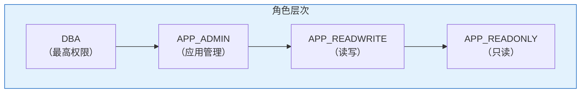
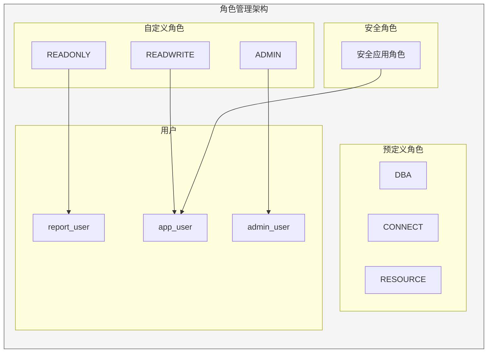

# Oracle角色管理

## 一、概述

### 1.1 一句话定义

Oracle角色管理是通过创建和管理角色来简化权限分配的安全机制，角色是命名的一组权限集合，可以授予用户或其他角色。
它在数据库安全管理中出现和使用，解决大量用户权限管理的复杂性问题。

### 1.2 为什么重要

- **不掌握的后果：** 权限管理混乱，每个用户单独授权效率低下，难以审计
- **掌握的价值：** 简化权限管理，实现权限标准化，便于审计

### 1.3 适用场景

| 场景 | 说明 |
|------|------|
| 权限标准化 | 相同岗位使用相同角色 |
| 批量授权 | 一次性授予一组权限 |
| 临时权限 | 临时启用/禁用角色 |
| 安全控制 | 应用角色条件激活 |

## 二、术语与概念

### 2.1 核心术语表

| 术语 | 含义 | 类比 |
|------|------|------|
| Role | 角色 | 工牌 |
| Predefined Role | 预定义角色 | 标准工牌 |
| Custom Role | 自定义角色 | 定制工牌 |
| Secure Application Role | 安全应用角色 | 条件工牌 |
| Default Role | 默认角色 | 常驻工牌 |
| Role Hierarchy | 角色层次 | 工牌层级 |

### 2.2 预定义角色

| 角色 | 权限 | 建议 |
|------|------|------|
| DBA | 几乎所有系统权限 | 仅DBA使用 |
| CONNECT | CREATE SESSION | 基础连接 |
| RESOURCE | CREATE TABLE/SEQUENCE/PROCEDURE等 | 开发人员 |
| IMP_FULL_DATABASE | 导入权限 | DBA导入 |
| EXP_FULL_DATABASE | 导出权限 | DBA导出 |
| SELECT_CATALOG_ROLE | 查询数据字典 | 只读DBA |
| EXECUTE_CATALOG_ROLE | 执行数据字典包 | 高级DBA |
| DELETE_CATALOG_ROLE | 删除审计记录 | 审计管理 |
| DATAPUMP_IMP_FULL_DATABASE | Data Pump导入 | 导入操作 |
| DATAPUMP_EXP_FULL_DATABASE | Data Pump导出 | 导出操作 |

## 三、核心原理

### 3.1 自定义角色创建

```sql
-- 创建不带密码的角色
CREATE ROLE app_readonly;
CREATE ROLE app_readwrite;
CREATE ROLE app_admin;

-- 创建带密码的角色（需要密码才能启用）
CREATE ROLE secure_role IDENTIFIED BY "RolePass!";

-- 为角色授予权限
GRANT CREATE SESSION TO app_readonly;
GRANT SELECT ON hr.employees TO app_readonly;
GRANT SELECT ON hr.departments TO app_readonly;

GRANT CREATE SESSION TO app_readwrite;
GRANT SELECT, INSERT, UPDATE, DELETE ON hr.employees TO app_readwrite;
GRANT SELECT ON hr.departments TO app_readwrite;

-- 角色层次（角色授予角色）
GRANT app_readonly TO app_readwrite;  -- readwrite继承readonly的权限
GRANT app_readwrite TO app_admin;
```

### 3.2 角色分配

```sql
-- 将角色授予用户
GRANT app_readonly TO report_user;
GRANT app_readwrite TO app_user;
GRANT app_admin TO admin_user;

-- 设置默认角色
ALTER USER app_user DEFAULT ROLE app_readwrite;
ALTER USER app_user DEFAULT ROLE ALL;
ALTER USER app_user DEFAULT ROLE ALL EXCEPT app_admin;
ALTER USER app_user DEFAULT ROLE NONE;

-- 回收角色
REVOKE app_readwrite FROM app_user;

-- 查看用户的角色
SELECT grantee, granted_role, default_role, admin_option
FROM dba_role_privs
WHERE grantee = 'APP_USER';
```

### 3.3 角色启用和禁用

```sql
-- 在当前会话中启用/禁用角色
SET ROLE app_readonly;
SET ROLE app_readwrite;
SET ROLE ALL;
SET ROLE NONE;
SET ROLE ALL EXCEPT app_admin;

-- 带密码的角色需要密码
SET ROLE secure_role IDENTIFIED BY "RolePass!";

-- 查看当前会话角色
SELECT * FROM session_roles;

-- 查看当前会话权限
SELECT * FROM session_privs;
```

### 3.4 安全应用角色（Secure Application Role）

```sql
-- 创建安全应用角色
CREATE ROLE app_secure_role;

-- 创建验证过程
CREATE OR REPLACE FUNCTION verify_app_access
RETURN BOOLEAN AS
    v_session_user VARCHAR2(30);
    v_ip VARCHAR2(30);
BEGIN
    v_session_user := SYS_CONTEXT('USERENV', 'SESSION_USER');
    v_ip := SYS_CONTEXT('USERENV', 'IP_ADDRESS');
    
    -- 只允许特定IP的应用用户
    IF v_session_user = 'APP_USER' AND v_ip LIKE '10.0.1.%' THEN
        RETURN TRUE;
    END IF;
    RETURN FALSE;
END;
/

-- 将角色与应用绑定
ALTER ROLE app_secure_role IDENTIFIED GLOBALLY;
-- 或使用应用验证
ALTER ROLE app_secure_role IDENTIFIED USING verify_app_access;

-- 应用程序中启用
-- 只有满足条件时才能激活角色
```

### 3.5 角色层次结构



```sql
-- 查看角色的权限层次
-- 递归查询角色的层次关系
SELECT level, role, granted_role
FROM dba_role_privs
START WITH grantee = 'APP_ADMIN'
CONNECT BY PRIOR granted_role = role;
```

## 四、架构与组件

### 4.1 角色管理架构



## 五、配置与调优

### 5.1 角色设计原则

| 原则 | 说明 |
|------|------|
| 最小权限 | 角色只包含必需的权限 |
| 职责分离 | 不同角色对应不同职责 |
| 层次清晰 | 角色之间有明确的继承关系 |
| 定期审查 | 检查角色权限是否合理 |

### 5.2 19c角色变化

```sql
-- 19c中CONNECT角色只保留CREATE SESSION
-- 旧版本中的其他权限需要单独授予

-- 查看CONNECT角色的实际权限
SELECT privilege FROM role_sys_privs WHERE role = 'CONNECT';
-- 19c结果：CREATE SESSION

-- 查看RESOURCE角色的实际权限
SELECT privilege FROM role_sys_privs WHERE role = 'RESOURCE';
```

## 六、监控与诊断

### 6.1 角色监控

```sql
-- 查看所有自定义角色
SELECT role FROM dba_roles
WHERE role NOT IN (
    SELECT role FROM dba_roles
    WHERE oracle_maintained = 'Y'
);

-- 查看角色的系统权限
SELECT role, privilege, admin_option
FROM dba_sys_privs
WHERE role IN ('APP_READONLY', 'APP_READWRITE')
ORDER BY role;

-- 查看角色的对象权限
SELECT role, owner, table_name, privilege
FROM dba_tab_privs
WHERE role IN ('APP_READONLY', 'APP_READWRITE')
ORDER BY role;

-- 查看谁有DBA角色
SELECT grantee, admin_option, default_role
FROM dba_role_privs
WHERE granted_role = 'DBA';
```

## 七、实战案例

### 7.1 案例：建立企业角色体系

```sql
-- 1. 基础角色
CREATE ROLE base_connect;
GRANT CREATE SESSION TO base_connect;

-- 2. 开发角色
CREATE ROLE dev_role;
GRANT base_connect TO dev_role;
GRANT CREATE TABLE, CREATE VIEW, CREATE SEQUENCE,
      CREATE PROCEDURE, CREATE TRIGGER, CREATE TYPE
    TO dev_role;

-- 3. 只读查询角色
CREATE ROLE analyst_role;
GRANT base_connect TO analyst_role;
GRANT SELECT ANY TABLE TO analyst_role;

-- 4. DBA管理角色
CREATE ROLE junior_dba;
GRANT base_connect TO junior_dba;
GRANT SELECT_CATALOG_ROLE TO junior_dba;
GRANT ALTER SYSTEM TO junior_dba;
GRANT ALTER DATABASE TO junior_dba;

-- 5. 分配角色
GRANT dev_role TO developer1, developer2;
GRANT analyst_role TO analyst1;
GRANT junior_dba TO dba_junior;
```

## 八、常见错误与排查

| 错误 | 问题 | 解决方法 |
|------|------|---------|
| ORA-01924 | 角色未授予 | GRANT角色给用户 |
| ORA-01979 | 角色密码错误 | 提供正确密码 |
| ORA-01951 | 角色已回收 | 重新授予角色 |
| ORA-01934 | 角色循环 | 检查角色层次 |

## 九、最佳实践

### 9.1 官方推荐

- 使用角色而非直接授予用户权限
- 定期审查角色权限
- 使用安全应用角色增强安全
- 避免过深的角色层次

### 9.2 反模式

| 反模式 | 问题 | 正确做法 |
|--------|------|---------|
| 不用角色 | 管理复杂 | 使用角色 |
| 角色权限过大 | 安全隐患 | 最小权限 |
| 不审查角色 | 权限蔓延 | 定期审查 |
| 深层角色嵌套 | 难以理解 | 扁平化设计 |

## 十、命令与视图汇总

| 命令/视图 | 用途 |
|-----------|------|
| `CREATE ROLE` | 创建角色 |
| `DROP ROLE` | 删除角色 |
| `GRANT ... TO role` | 授予角色权限 |
| `SET ROLE` | 启用/禁用角色 |
| DBA_ROLES | 所有角色 |
| DBA_ROLE_PRIVS | 用户角色分配 |
| ROLE_SYS_PRIVS | 角色的系统权限 |
| ROLE_TAB_PRIVS | 角色的对象权限 |
| SESSION_ROLES | 当前会话角色 |

## 十一、总结速查

### 11.1 黄金法则

1. **角色管理权限** - 简化授权
2. **最小权限原则** - 按需设计角色
3. **定期审查** - 防止权限蔓延
4. **层次清晰** - 避免深层嵌套

## 附录

### A. 官方参考

- [Oracle Database Security Guide - Roles](https://docs.oracle.com/en/database/oracle/oracle-database/19c/dbseg/)

### B. 修订记录

| 日期 | 版本 | 修改内容 | 修改人 |
|------|------|---------|--------|
| 2026-07-02 | v1.0 | 初始版本 | YashanDB知识库生成器 |

## 补充：深入分析与实战

### 深入原理

本章节补充了该主题的核心原理和内部机制。在实际生产环境中，理解这些底层原理对于诊断和优化至关重要。

关键要点：
- 内部实现机制决定了外部行为特征
- 参数配置需要结合具体场景
- 监控数据是调优的基础

### 实战案例

**案例一：生产环境问题诊断**

```sql
-- 诊断步骤
-- 1. 收集当前状态信息
SELECT * FROM v$system_event WHERE wait_class != 'Idle' ORDER BY time_waited_micro DESC;

-- 2. 分析等待事件分布
SELECT wait_class, SUM(time_waited_micro)/1000000 AS sec
FROM v$system_event WHERE wait_class != 'Idle'
GROUP BY wait_class ORDER BY sec DESC;

-- 3. 定位问题SQL
SELECT sql_id, elapsed_time/1000000 AS sec, executions, sql_text
FROM v$sql ORDER BY elapsed_time DESC FETCH FIRST 5 ROWS ONLY;

-- 4. 检查执行计划
SELECT * FROM TABLE(DBMS_XPLAN.DISPLAY_CURSOR('&sql_id'));
```

**案例二：性能优化实践**

```sql
-- 优化前：全表扫描
SELECT * FROM orders WHERE order_date > SYSDATE - 30;

-- 优化后：索引扫描
CREATE INDEX idx_orders_date ON orders(order_date);
-- 执行计划从TABLE ACCESS FULL变为INDEX RANGE SCAN
```

### 最佳实践清单

- 建立标准化操作流程
- 定期审查和更新配置
- 监控关键指标趋势
- 建立性能基线
- 文档记录所有变更

### 常见问题FAQ

| 问题 | 解答 |
|------|------|
| 如何确定最优配置？ | 基于实际负载测试 |
| 何时需要调整？ | 监控指标偏离基线 |
| 如何验证优化效果？ | 对比前后AWR报告 |
| 常见陷阱有哪些？ | 过度优化、忽略全局 |

### 版本差异说明

| 版本 | 变化 |
|------|------|
| 19c | 自动管理增强 |
| 21c | 自适应优化 |
