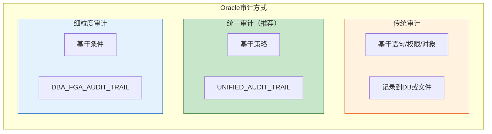
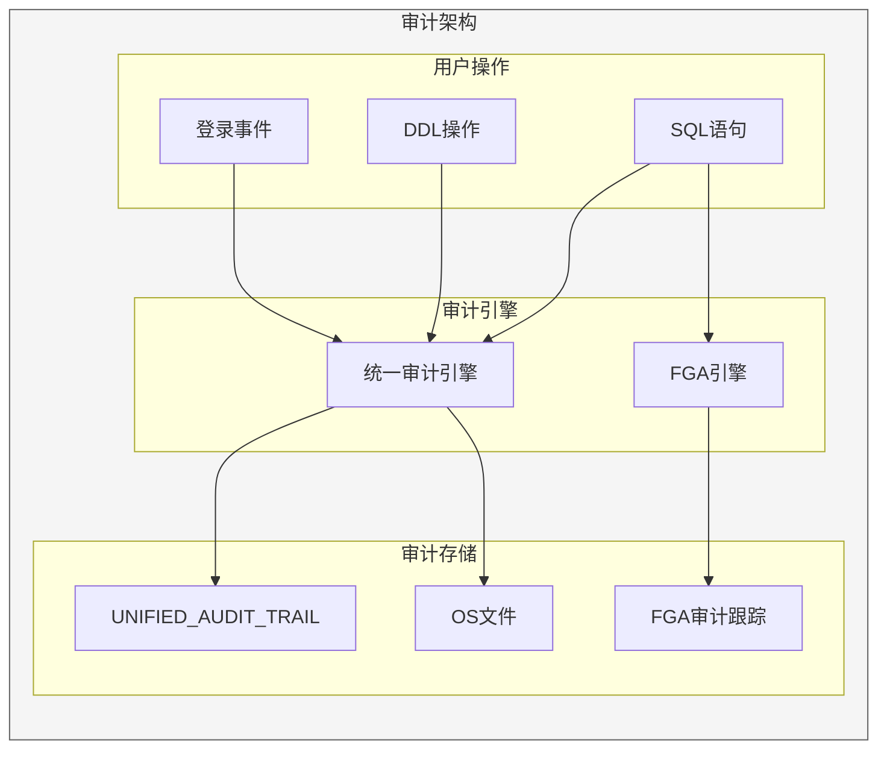

# Oracle审计技术详解

## 一、概述

### 1.1 一句话定义

Oracle审计是记录和监控数据库活动的安全机制，包括传统审计、统一审计（12c+）和细粒度审计（FGA），用于追踪用户操作、满足合规要求。
它在数据库安全管理中出现和使用，解决"谁在什么时候对什么数据做了什么操作"的问题。

### 1.2 为什么重要

- **不掌握的后果：** 无法满足合规要求（等保、SOX、GDPR），安全事件无法追溯
- **掌握的价值：** 完整的安全审计链，满足合规要求，快速定位安全事件

### 1.3 适用场景

| 场景 | 说明 |
|------|------|
| 合规审计 | 满足等保/SOX/GDPR要求 |
| 安全监控 | 检测异常操作 |
| 变更追踪 | 记录DDL变更 |
| 数据访问 | 监控敏感数据访问 |

### 1.4 版本演进

| 版本 | 变化说明 |
|------|---------|
| 11gR2 | 传统审计为主 |
| 12cR1 | 引入统一审计（Unified Auditing） |
| 12cR2 | 统一审计默认启用 |
| 19c | 统一审计增强，传统审计废弃 |
| 21c | 统一审计完全替代传统审计 |

## 二、术语与概念

### 2.1 核心术语表

| 术语 | 含义 | 类比 |
|------|------|------|
| Traditional Auditing | 传统审计 | 老式监控 |
| Unified Auditing | 统一审计 | 新一代监控 |
| FGA | 细粒度审计 | 精准监控 |
| Audit Trail | 审计记录 | 监控录像 |
| Audit Policy | 审计策略 | 监控规则 |
| UNIFIED_AUDIT_TRAIL | 统一审计视图 | 综合监控面板 |

### 2.2 审计方式对比



## 三、核心原理

### 3.1 统一审计（推荐）

```sql
-- 查看统一审计状态
SELECT parameter, value
FROM v$option
WHERE parameter = 'Unified Auditing';

-- 查看预定义审计策略
SELECT policy_name, enabled_option
FROM audit_unified_policies
ORDER BY policy_name;

-- 查看启用的审计策略
SELECT policy_name, enabled_option, entity_name
FROM audit_unified_enabled_policies;

-- 创建自定义审计策略
CREATE AUDIT POLICY app_audit_policy
    PRIVILEGES CREATE ANY TABLE, DROP ANY TABLE
    ACTIONS CREATE TABLE, DROP TABLE, ALTER TABLE
    ROLES DBA;

-- 启用审计策略
AUDIT POLICY app_audit_policy;

-- 为特定用户启用
AUDIT POLICY app_audit_policy BY app_user;

-- 排除特定用户
AUDIT POLICY app_audit_policy EXCEPT sys;

-- 查看统一审计记录
SELECT event_timestamp, dbusername, action_name,
       object_schema, object_name, return_code
FROM unified_audit_trail
ORDER BY event_timestamp DESC
FETCH FIRST 20 ROWS ONLY;

-- 停止审计策略
NOAUDIT POLICY app_audit_policy;

-- 删除审计策略
DROP AUDIT POLICY app_audit_policy;
```

### 3.2 传统审计

```sql
-- 语句审计
AUDIT SELECT TABLE;
AUDIT INSERT TABLE BY app_user;
AUDIT DELETE TABLE BY app_user WHENEVER NOT SUCCESSFUL;

-- 权限审计
AUDIT CREATE TABLE;
AUDIT ALTER SYSTEM;
AUDIT GRANT ROLE;

-- 对象审计
AUDIT SELECT ON hr.employees;
AUDIT INSERT ON hr.employees BY app_user;

-- 查看审计设置
SELECT * FROM dba_stmt_audit_opts;
SELECT * FROM dba_priv_audit_opts;
SELECT * FROM dba_obj_audit_opts;

-- 停止审计
NOAUDIT SELECT TABLE;
NOAUDIT CREATE TABLE;
NOAUDIT SELECT ON hr.employees;
```

### 3.3 细粒度审计（FGA）

```sql
-- 创建FGA策略
BEGIN
    DBMS_FGA.ADD_POLICY(
        object_schema => 'HR',
        object_name => 'EMPLOYEES',
        policy_name => 'EMP_SALARY_ACCESS',
        audit_condition => 'SALARY > 10000',  -- 条件
        audit_column => 'SALARY,COMMISSION_PCT',  -- 审计列
        statement_types => 'SELECT,UPDATE',
        handler_schema => 'SEC_ADMIN',
        handler_module => 'FGA_HANDLER',
        enable => TRUE
    );
END;
/

-- 查看FGA策略
SELECT object_schema, object_name, policy_name,
       audit_condition, audit_column, enabled
FROM dba_audit_policies;

-- 查看FGA审计记录
SELECT timestamp, db_user, object_schema, object_name,
       sql_text, sql_bind
FROM dba_fga_audit_trail
ORDER BY timestamp DESC;

-- 禁用FGA策略
BEGIN
    DBMS_FGA.DISABLE_POLICY(
        object_schema => 'HR',
        object_name => 'EMPLOYEES',
        policy_name => 'EMP_SALARY_ACCESS'
    );
END;
/

-- 删除FGA策略
BEGIN
    DBMS_FGA.DROP_POLICY(
        object_schema => 'HR',
        object_name => 'EMPLOYEES',
        policy_name => 'EMP_SALARY_ACCESS'
    );
END;
/
```

### 3.4 审计日志管理

```sql
-- 查看审计跟踪类型
SHOW PARAMETER audit_trail;
-- DB: 记录到SYS.AUD$表
-- OS: 记录到操作系统文件
-- XML: XML格式
-- NONE: 不审计

-- 查看审计表大小
SELECT COUNT(*) AS total_records,
       SUM(bytes)/1024/1024 AS size_mb
FROM dba_segments
WHERE segment_name = 'AUD$';

-- 清理审计记录
-- 传统审计
DELETE FROM sys.aud$ WHERE ntimestamp# < SYSDATE - 90;

-- 使用DBMS_AUDIT_MGMT（推荐）
BEGIN
    DBMS_AUDIT_MGMT.INIT_CLEANUP(
        audit_trail_type => DBMS_AUDIT_MGMT.AUDIT_TRAIL_UNIFIED,
        default_cleanup_interval => 24  -- 小时
    );
END;
/

-- 设置最后归档时间戳
BEGIN
    DBMS_AUDIT_MGMT.SET_LAST_ARCHIVE_TIMESTAMP(
        audit_trail_type => DBMS_AUDIT_MGMT.AUDIT_TRAIL_UNIFIED,
        last_archive_time => SYSTIMESTAMP - 90
    );
END;
/

-- 执行清理
BEGIN
    DBMS_AUDIT_MGMT.CLEAN_AUDIT_TRAIL(
        audit_trail_type => DBMS_AUDIT_MGMT.AUDIT_TRAIL_UNIFIED,
        use_last_arch_timestamp => TRUE
    );
END;
/
```

## 四、架构与组件

### 4.1 审计架构



## 五、配置与调优

### 5.1 审计性能优化

| 策略 | 说明 | 效果 |
|------|------|------|
| 选择性审计 | 只审计关键操作 | 减少审计量 |
| 排除SYS | 不审计SYS操作 | 减少噪声 |
| 异步写入 | 减少I/O影响 | 提高性能 |
| 定期清理 | 控制审计表大小 | 保持性能 |

```sql
-- 优化审计配置
-- 1. 使用统一审计策略，精确指定审计内容
CREATE AUDIT POLICY critical_ops
    PRIVILEGES ALTER SYSTEM, ALTER DATABASE
    ACTIONS CREATE USER, DROP USER, GRANT
    ROLES DBA
    ONLY ON SUCCESS;

-- 2. 排除高频率低价值操作
AUDIT POLICY critical_ops EXCEPT sys;
```

## 六、监控与诊断

### 6.1 审计监控

```sql
-- 查看审计策略使用
SELECT policy_name, enabled_option, entity_name
FROM audit_unified_enabled_policies;

-- 查看审计记录增长
SELECT TO_CHAR(event_timestamp, 'YYYY-MM-DD') AS day,
       COUNT(*) AS events
FROM unified_audit_trail
WHERE event_timestamp > SYSDATE - 7
GROUP BY TO_CHAR(event_timestamp, 'YYYY-MM-DD')
ORDER BY day;

-- 查看失败登录
SELECT dbusername, userhost, return_code,
       COUNT(*) AS attempts
FROM unified_audit_trail
WHERE action_name = 'LOGON'
  AND return_code != 0
  AND event_timestamp > SYSDATE - 1
GROUP BY dbusername, userhost, return_code;
```

## 七、实战案例

### 7.1 案例：等保合规审计配置

```sql
-- 1. 创建合规审计策略
CREATE AUDIT POLICY compliance_policy
    PRIVILEGES ALTER SYSTEM, ALTER DATABASE,
               CREATE ANY TABLE, DROP ANY TABLE,
               CREATE USER, DROP USER, ALTER USER,
               GRANT, REVOKE
    ACTIONS LOGON, LOGOFF,
            CREATE TABLE, DROP TABLE, ALTER TABLE,
            TRUNCATE TABLE
    ON HIGH;

-- 2. 启用策略
AUDIT POLICY compliance_policy;

-- 3. 敏感表FGA
BEGIN
    DBMS_FGA.ADD_POLICY(
        object_schema => 'HR',
        object_name => 'EMPLOYEES',
        policy_name => 'SALARY_AUDIT',
        audit_column => 'SALARY',
        statement_types => 'SELECT,UPDATE'
    );
END;
/

-- 4. 配置审计清理
BEGIN
    DBMS_AUDIT_MGMT.INIT_CLEANUP(
        audit_trail_type => DBMS_AUDIT_MGMT.AUDIT_TRAIL_UNIFIED,
        default_cleanup_interval => 24
    );
    DBMS_AUDIT_MGMT.SET_LAST_ARCHIVE_TIMESTAMP(
        audit_trail_type => DBMS_AUDIT_MGMT.AUDIT_TRAIL_UNIFIED,
        last_archive_time => SYSTIMESTAMP - 365
    );
END;
/
```

## 八、常见错误与排查

| 错误 | 问题 | 解决方法 |
|------|------|---------|
| ORA-46385 | 审计策略不存在 | 检查策略名称 |
| ORA-46271 | 审计表空间满 | 清理审计记录 |
| ORA-46375 | 审计策略已存在 | 使用不同名称 |

## 九、最佳实践

### 9.1 官方推荐

- 使用统一审计（12c+）
- 配置审计清理策略
- 审计关键操作和登录事件
- 使用FGA保护敏感数据

### 9.2 反模式

| 反模式 | 问题 | 正确做法 |
|--------|------|---------|
| 审计所有操作 | 性能影响大 | 选择性审计 |
| 不清理审计记录 | 空间耗尽 | 定期清理 |
| 不审计登录 | 无法追踪入侵 | 审计LOGON |
| 传统审计 | 已废弃 | 使用统一审计 |

## 十、命令与视图汇总

| 命令/视图 | 用途 |
|-----------|------|
| `CREATE AUDIT POLICY` | 创建审计策略 |
| `AUDIT POLICY` | 启用审计策略 |
| `DBMS_FGA.ADD_POLICY` | 创建FGA策略 |
| UNIFIED_AUDIT_TRAIL | 统一审计记录 |
| DBA_FGA_AUDIT_TRAIL | FGA审计记录 |
| DBA_AUDIT_POLICIES | FGA策略信息 |
| AUDIT_UNIFIED_POLICIES | 统一审计策略 |

## 十一、总结速查

### 11.1 黄金法则

1. **统一审计** - 使用新一代审计框架
2. **选择性审计** - 只审计关键操作
3. **定期清理** - 控制审计表大小
4. **FGA保护** - 敏感数据细粒度审计

## 附录

### A. 官方参考

- [Oracle Database Security Guide - Auditing](https://docs.oracle.com/en/database/oracle/oracle-database/19c/dbseg/)

### B. 修订记录

| 日期 | 版本 | 修改内容 | 修改人 |
|------|------|---------|--------|
| 2026-07-02 | v1.0 | 初始版本 | YashanDB知识库生成器 |
