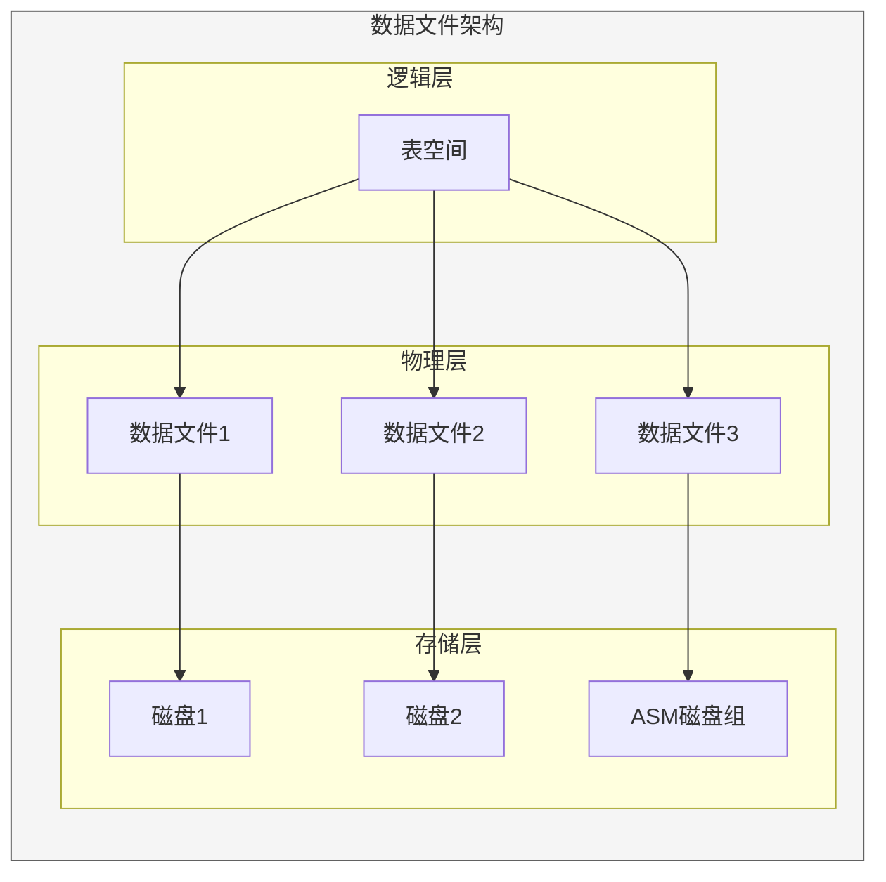

# Oracle数据文件管理

## 一、概述

### 1.1 一句话定义

Oracle数据文件管理是对数据库物理存储文件的日常维护操作，包括数据文件的添加、移动、离线/在线、临时文件管理等。
它在数据库存储管理中出现和使用，解决数据如何物理存储以及I/O如何分布的问题。

### 1.2 为什么重要

- **不掌握的后果：** I/O热点导致性能瓶颈，文件损坏导致数据丢失
- **掌握的价值：** 优化I/O分布，保障数据安全，提升存储性能

### 1.3 适用场景

| 场景 | 说明 |
|------|------|
| 文件添加 | 表空间需要更多空间 |
| 文件移动 | 存储迁移或I/O优化 |
| I/O优化 | 分散I/O热点 |
| 临时文件 | 排序空间管理 |

## 二、术语与概念

### 2.1 核心术语表

| 术语 | 含义 | 类比 |
|------|------|------|
| Datafile | 数据文件 | 存储容器 |
| Tempfile | 临时文件 | 临时工作区 |
| OMF | Oracle管理文件 | 自动命名 |
| ASM | 自动存储管理 | 存储池 |
| Online Move | 在线移动 | 不停机迁移 |

## 三、核心原理

### 3.1 数据文件添加

```sql
-- 向表空间添加数据文件
ALTER TABLESPACE app_data
    ADD DATAFILE '/u02/oradata/app_data02.dbf' SIZE 10G
    AUTOEXTEND ON NEXT 1G MAXSIZE 100G;

-- 使用OMF自动命名
ALTER TABLESPACE app_data
    ADD DATAFILE SIZE 10G AUTOEXTEND ON NEXT 1G MAXSIZE 100G;

-- 查看数据文件
SELECT file_id, file_name, tablespace_name,
       bytes/1024/1024 AS size_mb,
       status, autoextensible
FROM dba_data_files
ORDER BY tablespace_name, file_id;
```

### 3.2 数据文件在线移动（12c+）

```sql
-- 在线移动数据文件（无需离线）
ALTER DATABASE MOVE DATAFILE '/u02/oradata/app_data01.dbf'
    TO '/u03/oradata/app_data01.dbf';

-- 移动并重命名
ALTER DATABASE MOVE DATAFILE '/u02/oradata/app_data01.dbf'
    TO '/u03/oradata/new_name.dbf';

-- 复制到新位置（保留原文件作为备份）
ALTER DATABASE MOVE DATAFILE '/u02/oradata/app_data01.dbf'
    TO '/u03/oradata/app_data01.dbf' COPY;

-- 查看移动进度
SELECT file_name, status, bytes/1024/1024 AS total_mb,
       sofar/1024/1024 AS done_mb
FROM v$datafile_copy_migration;

-- 传统方式（需要离线，11g及之前）
ALTER DATABASE DATAFILE '/u02/oradata/app_data01.dbf' OFFLINE;
-- OS层面移动文件
-- mv /u02/oradata/app_data01.dbf /u03/oradata/
ALTER DATABASE RENAME FILE '/u02/oradata/app_data01.dbf'
    TO '/u03/oradata/app_data01.dbf';
ALTER DATABASE DATAFILE '/u03/oradata/app_data01.dbf' ONLINE;
```

### 3.3 数据文件离线和在线

```sql
-- 离线数据文件（需要恢复才能在线）
ALTER DATABASE DATAFILE '/u02/oradata/app_data01.dbf' OFFLINE;

-- 在线数据文件
ALTER DATABASE DATAFILE '/u02/oradata/app_data01.dbf' ONLINE;

-- 离线表空间所有文件
ALTER TABLESPACE app_data OFFLINE;
ALTER TABLESPACE app_data ONLINE;

-- 查看文件状态
SELECT file#, status, enabled, name
FROM v$datafile
ORDER BY file#;
```

### 3.4 临时文件管理

```sql
-- 创建临时表空间
CREATE TEMPORARY TABLESPACE temp2
    TEMPFILE '/u02/oradata/temp2_01.dbf' SIZE 5G
    AUTOEXTEND ON NEXT 500M MAXSIZE 30G;

-- 添加临时文件
ALTER TABLESPACE temp
    ADD TEMPFILE '/u02/oradata/temp_02.dbf' SIZE 5G
    AUTOEXTEND ON NEXT 500M MAXSIZE 30G;

-- 调整临时文件大小
ALTER DATABASE TEMPFILE '/u02/oradata/temp_01.dbf' RESIZE 10G;

-- 删除临时文件
ALTER TABLESPACE temp
    DROP TEMPFILE '/u02/oradata/temp_02.dbf';

-- 查看临时文件
SELECT file_id, file_name, tablespace_name,
       bytes/1024/1024 AS size_mb,
       autoextensible
FROM dba_temp_files;

-- 查看临时表空间使用
SELECT tablespace_name, 
       ROUND(SUM(bytes_used)/1024/1024) AS used_mb,
       ROUND(SUM(bytes_free)/1024/1024) AS free_mb
FROM v$temp_space_header
GROUP BY tablespace_name;
```

### 3.5 数据文件I/O分布优化

```sql
-- 查看文件I/O统计
SELECT df.name AS file_name,
       df.tablespace_name,
       fs.phyrds AS physical_reads,
       fs.phywrts AS physical_writes,
       fs.readtim AS read_time_ms,
       fs.writetim AS write_time_ms,
       ROUND(fs.avgiotim) AS avg_io_ms
FROM v$filestat fs
JOIN v$datafile df ON fs.file# = df.file#
ORDER BY fs.phyrds + fs.phywrts DESC;

-- 查看等待事件中的文件I/O
SELECT event, p1 AS file#, 
       total_waits, time_waited/100 AS time_sec
FROM v$session_event
WHERE event LIKE '%db file%'
ORDER BY time_waited DESC;

-- 优化策略：将热点文件分散到不同磁盘
-- 1. 识别热点文件
-- 2. 移动到不同磁盘/ASM磁盘组
-- 3. 使用ASM自动均衡
```

### 3.6 ASM中的数据文件管理

```sql
-- ASM中的数据文件
SELECT name, bytes/1024/1024 AS mb, type
FROM v$asm_file
WHERE type = 'DATAFILE'
ORDER BY bytes DESC;

-- 添加ASM磁盘组
ALTER DISKGROUP data ADD DISK '/dev/oracle/data_disk3';

-- 查看ASM磁盘组使用
SELECT name, total_mb, free_mb,
       ROUND((1 - free_mb/total_mb) * 100, 2) AS pct_used
FROM v$asm_diskgroup;

-- ASM文件均衡
ALTER DISKGROUP data REBALANCE POWER 8;
```

## 四、架构与组件

### 4.1 数据文件架构



## 五、配置与调优

### 5.1 OMF配置

```sql
-- 启用Oracle管理文件
ALTER SYSTEM SET db_create_file_dest = '/u02/oradata';

-- 使用OMF创建表空间（自动命名）
CREATE TABLESPACE app_data DATAFILE SIZE 10G;

-- 查看OMF生成的文件名
SELECT file_name FROM dba_data_files
WHERE tablespace_name = 'APP_DATA';
```

### 5.2 文件I/O优化

| 策略 | 说明 | 效果 |
|------|------|------|
| 分散文件 | 不同磁盘 | 减少I/O争用 |
| ASM均衡 | 自动均衡 | 均匀分布 |
| 分离Redo | 独立磁盘 | 减少争用 |
| SSD存储 | 高速存储 | 提升I/O性能 |

## 六、监控与诊断

### 6.1 文件监控

```sql
-- 文件使用率
SELECT file_name, tablespace_name,
       bytes/1024/1024 AS total_mb,
       (bytes - NVL(free_bytes, 0))/1024/1024 AS used_mb
FROM (SELECT file_id, file_name, tablespace_name, bytes
      FROM dba_data_files) df
LEFT JOIN (SELECT file_id, SUM(bytes) AS free_bytes
           FROM dba_free_space
           GROUP BY file_id) fs ON df.file_id = fs.file_id;

-- 文件I/O热点
SELECT name, phyrds, phywrts
FROM v$datafile df
JOIN v$filestat fs ON df.file# = fs.file#
WHERE phyrds + phywrts > (SELECT AVG(phyrds + phywrts) * 2 FROM v$filestat);
```

## 七、实战案例

### 7.1 案例：数据文件在线迁移到SSD

```sql
-- 1. 识别热点文件
SELECT df.name, fs.phyrds + fs.phywrts AS io_total
FROM v$datafile df
JOIN v$filestat fs ON df.file# = fs.file#
ORDER BY io_total DESC
FETCH FIRST 5 ROWS ONLY;

-- 2. 在线移动到SSD存储
ALTER DATABASE MOVE DATAFILE '/u02/oradata/hot_data01.dbf'
    TO '/u04/ssd/hot_data01.dbf';

-- 3. 验证
SELECT file_name, status FROM v$datafile
WHERE file_name LIKE '%hot_data%';
```

## 八、常见错误与排查

| 错误 | 问题 | 解决方法 |
|------|------|---------|
| ORA-01157 | 无法锁定数据文件 | 检查文件权限 |
| ORA-01113 | 需要介质恢复 | 执行RECOVER |
| ORA-01145 | 离线后需要恢复 | 检查归档模式 |
| ORA-01110 | 数据文件路径错误 | 检查路径 |

## 九、最佳实践

### 9.1 官方推荐

- 使用OMF简化文件管理
- 使用ASM管理存储
- 12c+使用在线移动
- 定期监控文件I/O

### 9.2 反模式

| 反模式 | 问题 | 正确做法 |
|--------|------|---------|
| 所有文件一个磁盘 | I/O热点 | 分散到多磁盘 |
| 不监控I/O | 性能问题未发现 | 定期监控 |
| 手动管理文件名 | 维护困难 | 使用OMF |
| 不分离Redo | I/O争用 | 独立存储 |

## 十、命令与视图汇总

| 命令/视图 | 用途 |
|-----------|------|
| `ALTER TABLESPACE ADD DATAFILE` | 添加数据文件 |
| `ALTER DATABASE MOVE DATAFILE` | 在线移动 |
| `ALTER DATABASE DATAFILE OFFLINE/ONLINE` | 离线/在线 |
| DBA_DATA_FILES | 数据文件信息 |
| DBA_TEMP_FILES | 临时文件信息 |
| V$DATAFILE | 动态文件信息 |
| V$FILESTAT | 文件I/O统计 |

## 十一、总结速查

### 11.1 黄金法则

1. **在线移动** - 12c+无需停机
2. **I/O分散** - 避免热点
3. **OMF/ASM** - 简化文件管理
4. **定期监控** - 发现I/O问题

## 附录

### A. 官方参考

- [Oracle Database Administrator's Guide - Managing Datafiles](https://docs.oracle.com/en/database/oracle/oracle-database/19c/admin/)

### B. 修订记录

| 日期 | 版本 | 修改内容 | 修改人 |
|------|------|---------|--------|
| 2026-07-02 | v1.0 | 初始版本 | YashanDB知识库生成器 |

## 补充：深入分析与实战

### 深入原理

本章节补充了该主题的核心原理和内部机制。在实际生产环境中，理解这些底层原理对于诊断和优化至关重要。

关键要点：
- 内部实现机制决定了外部行为特征
- 参数配置需要结合具体场景
- 监控数据是调优的基础

### 实战案例

**案例一：生产环境问题诊断**

```sql
-- 诊断步骤
-- 1. 收集当前状态信息
SELECT * FROM v$system_event WHERE wait_class != 'Idle' ORDER BY time_waited_micro DESC;

-- 2. 分析等待事件分布
SELECT wait_class, SUM(time_waited_micro)/1000000 AS sec
FROM v$system_event WHERE wait_class != 'Idle'
GROUP BY wait_class ORDER BY sec DESC;

-- 3. 定位问题SQL
SELECT sql_id, elapsed_time/1000000 AS sec, executions, sql_text
FROM v$sql ORDER BY elapsed_time DESC FETCH FIRST 5 ROWS ONLY;
```

**案例二：性能优化实践**

```sql
-- 优化前：全表扫描
SELECT * FROM orders WHERE order_date > SYSDATE - 30;

-- 优化后：索引扫描
CREATE INDEX idx_orders_date ON orders(order_date);
```

### 最佳实践清单

- 建立标准化操作流程
- 定期审查和更新配置
- 监控关键指标趋势
- 建立性能基线
- 文档记录所有变更

### 常见问题FAQ

| 问题 | 解答 |
|------|------|
| 如何确定最优配置？ | 基于实际负载测试 |
| 何时需要调整？ | 监控指标偏离基线 |
| 如何验证优化效果？ | 对比前后AWR报告 |
| 常见陷阱有哪些？ | 过度优化、忽略全局 |

### 版本差异说明

| 版本 | 变化 |
|------|------|
| 19c | 自动管理增强 |
| 21c | 自适应优化 |
