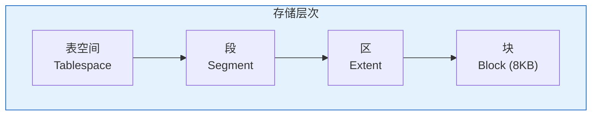
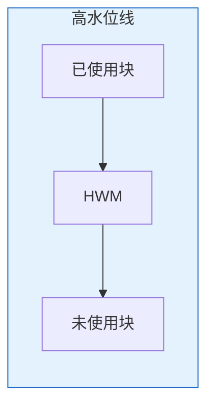
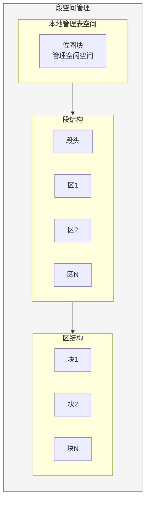

# Oracle段与区管理

## 一、概述

### 1.1 一句话定义

Oracle段与区管理是对数据库逻辑存储结构（段、区、块）的日常维护操作，包括段的创建、收缩、重组以及区的分配和回收。
它在数据库存储管理中出现和使用，解决数据在表空间内如何组织和分配空间的问题。

### 1.2 为什么重要

- **不掌握的后果：** 存储碎片影响性能，空间浪费严重
- **掌握的价值：** 优化存储使用，减少碎片，提升I/O性能

### 1.3 适用场景

| 场景 | 说明 |
|------|------|
| 空间回收 | 大量DELETE后回收空间 |
| 碎片整理 | 减少存储碎片 |
| 性能优化 | 优化区的分配策略 |
| 容量规划 | 了解段的空间使用 |

## 二、术语与概念

### 2.1 核心术语表

| 术语 | 含义 | 类比 |
|------|------|------|
| Segment | 段 | 仓库区域 |
| Extent | 区 | 货架单元 |
| Block | 块 | 货架格子 |
| HWM | 高水位线 | 使用上限 |
| Shrink | 收缩 | 压缩空间 |
| Move | 移动重组 | 重新整理 |

### 2.2 存储层次关系



## 三、核心原理

### 3.1 段的类型

| 段类型 | 说明 | 示例 |
|--------|------|------|
| TABLE | 表数据段 | 表存储 |
| INDEX | 索引段 | 索引存储 |
| LOB | 大对象段 | CLOB/BLOB |
| LOBINDEX | LOB索引段 | LOB索引 |
| TEMPORARY | 临时段 | 排序操作 |
| ROLLBACK/UNDO | 撤销段 | 事务回滚 |

### 3.2 区管理方式

```sql
-- 本地管理（推荐）
CREATE TABLESPACE app_data
    DATAFILE '/u02/oradata/app_data01.dbf' SIZE 10G
    EXTENT MANAGEMENT LOCAL
    AUTOALLOCATE;  -- 自动分配区大小

-- 统一区大小
CREATE TABLESPACE app_uniform
    DATAFILE '/u02/oradata/app_uniform01.dbf' SIZE 10G
    EXTENT MANAGEMENT LOCAL
    UNIFORM SIZE 1M;  -- 统一1MB区

-- 查看段信息
SELECT segment_name, segment_type, tablespace_name,
       bytes/1024/1024 AS size_mb,
       extents AS extent_count,
       blocks AS block_count
FROM dba_segments
WHERE owner = 'HR'
ORDER BY bytes DESC;
```

### 3.3 高水位线（HWM）



```sql
-- 查看表的HWM
SELECT segment_name, blocks AS hwm_blocks,
       bytes/1024/1024 AS size_mb
FROM dba_segments
WHERE segment_name = 'EMPLOYEES' AND owner = 'HR';

-- 查看实际使用的块
SELECT COUNT(DISTINCT DBMS_ROWID.ROWID_BLOCK_NUMBER(rowid)) AS used_blocks
FROM hr.employees;

-- 对比HWM和实际使用
-- 如果差异大，需要收缩或重组
```

### 3.4 段收缩（Shrink）

```sql
-- 启用行移动（前提条件）
ALTER TABLE hr.employees ENABLE ROW MOVEMENT;

-- 收缩段（释放空间并降低HWM）
ALTER TABLE hr.employees SHRINK SPACE;

-- 只收缩不降低HWM（不移动行）
ALTER TABLE hr.employees SHRINK SPACE COMPACT;

-- 只降低HWM不释放空间
ALTER TABLE hr.employees SHRINK SPACE CASCADE;  -- 包括索引

-- 收缩相关对象
ALTER TABLE hr.employees MODIFY LOB (resume) (SHRINK SPACE);
ALTER INDEX hr.emp_name_idx SHRINK SPACE;
```

### 3.5 段重组（Move）

```sql
-- 移动段到新位置（重组数据）
ALTER TABLE hr.employees MOVE TABLESPACE app_data;

-- 移动并压缩
ALTER TABLE hr.employees MOVE TABLESPACE app_data COMPRESS;

-- 在线重组（12c+）
ALTER TABLE hr.employees MOVE ONLINE TABLESPACE app_data;

-- 重建索引
ALTER INDEX hr.emp_name_idx REBUILD ONLINE;
ALTER INDEX hr.emp_name_idx REBUILD TABLESPACE app_index;
```

### 3.6 空间回收

```sql
-- 回收DELETE后的空间
-- 方法1：SHRINK（推荐）
ALTER TABLE hr.employees ENABLE ROW MOVEMENT;
ALTER TABLE hr.employees SHRINK SPACE;

-- 方法2：MOVE（需要重建索引）
ALTER TABLE hr.employees MOVE;
ALTER INDEX hr.emp_pk REBUILD;
ALTER INDEX hr.emp_name_idx REBUILD;

-- 方法3：EXPDP/IMPDP（大表）
-- expdp hr/pass tables=employees directory=dp dumpfile=emp.dmp
-- truncate table hr.employees;
-- impdp hr/pass tables=employees directory=dp dumpfile=emp.dmp

-- 回收表空间空闲空间
ALTER TABLESPACE app_data SHRINK SPACE;
```

## 四、架构与组件

### 4.1 段空间管理架构



## 五、配置与调优

### 5.1 区分配策略

| 策略 | 说明 | 适用场景 |
|------|------|---------|
| AUTOALLOCATE | 自动分配 | 通用场景 |
| UNIFORM | 统一大小 | 数据仓库 |

### 5.2 段压缩

```sql
-- 表级压缩
CREATE TABLE hr.employees_comp
    COMPRESS FOR ALL OPERATIONS
    AS SELECT * FROM hr.employees;

-- OLTP压缩（19c推荐）
ALTER TABLE hr.employees MODIFY
    COMPRESS FOR OLTP;

-- 查看压缩效果
SELECT segment_name, 
       bytes/1024/1024 AS size_mb,
       blocks
FROM dba_segments
WHERE segment_name IN ('EMPLOYEES', 'EMPLOYEES_COMP');
```

## 六、监控与诊断

### 6.1 段监控

```sql
-- 大对象TOP 20
SELECT owner, segment_name, segment_type,
       bytes/1024/1024/1024 AS size_gb
FROM dba_segments
ORDER BY bytes DESC
FETCH FIRST 20 ROWS ONLY;

-- 碎片分析
SELECT owner, segment_name, segment_type,
       extents, blocks,
       avg_blocks AS avg_extent_blocks
FROM (SELECT owner, segment_name, segment_type,
             extents, blocks,
             ROUND(blocks/extents) AS avg_blocks
      FROM dba_segments
      WHERE owner = 'HR');

-- 表空间碎片
SELECT tablespace_name,
       ROUND(SUM(bytes)/1024/1024) AS free_mb,
       COUNT(*) AS free_chunks,
       ROUND(MAX(bytes)/1024/1024) AS max_chunk_mb
FROM dba_free_space
GROUP BY tablespace_name
ORDER BY free_chunks DESC;
```

## 七、实战案例

### 7.1 案例：DELETE后空间回收

```sql
-- 1. 查看表大小
SELECT bytes/1024/1024 AS mb FROM dba_segments
WHERE segment_name = 'LARGE_TABLE';
-- 结果：5000MB

-- 2. DELETE大量数据
DELETE FROM large_table WHERE create_date < SYSDATE - 365;
-- 删除了80%的数据

-- 3. 查看空间使用
-- 段大小仍是5000MB，但实际数据只有1000MB

-- 4. 收缩段
ALTER TABLE large_table ENABLE ROW MOVEMENT;
ALTER TABLE large_table SHRINK SPACE CASCADE;

-- 5. 验证
SELECT bytes/1024/1024 AS mb FROM dba_segments
WHERE segment_name = 'LARGE_TABLE';
-- 结果：约1200MB
```

## 八、常见错误与排查

| 错误 | 问题 | 解决方法 |
|------|------|---------|
| ORA-10631 | 收缩不支持的数据类型 | 使用MOVE替代 |
| ORA-01652 | 临时空间不足 | 扩展临时表空间 |
| ORA-01653 | 表空间不足 | 扩展表空间 |

## 九、最佳实践

### 9.1 官方推荐

- 使用本地管理表空间AUTOALLOCATE
- 定期回收DELETE后的空间
- 使用SHRINK而非MOVE（在线操作）
- 考虑OLTP压缩减少存储

### 9.2 反模式

| 反模式 | 问题 | 正确做法 |
|--------|------|---------|
| 大量DELETE后不回收 | 空间浪费 | 定期SHRINK |
| 不监控大对象 | 空间失控 | 定期TOP N分析 |
| 使用字典管理表空间 | 性能差 | 使用本地管理 |

## 十、命令与视图汇总

| 命令/视图 | 用途 |
|-----------|------|
| `ALTER TABLE ... SHRINK SPACE` | 段收缩 |
| `ALTER TABLE ... MOVE` | 段重组 |
| `ALTER INDEX ... REBUILD` | 索引重建 |
| DBA_SEGMENTS | 段信息 |
| DBA_EXTENTS | 区信息 |
| DBA_FREE_SPACE | 空闲空间 |

## 十一、总结速查

### 11.1 黄金法则

1. **本地管理** - 使用AUTOALLOCATE
2. **定期回收** - DELETE后SHRINK
3. **在线操作** - 优先SHRINK/MOVE ONLINE
4. **监控大对象** - 定期TOP N分析

## 附录

### A. 官方参考

- [Oracle Database Administrator's Guide - Managing Schema Objects](https://docs.oracle.com/en/database/oracle/oracle-database/19c/admin/)

### B. 修订记录

| 日期 | 版本 | 修改内容 | 修改人 |
|------|------|---------|--------|
| 2026-07-02 | v1.0 | 初始版本 | YashanDB知识库生成器 |

## 补充：深入分析与实战

### 深入原理

本章节补充了该主题的核心原理和内部机制。在实际生产环境中，理解这些底层原理对于诊断和优化至关重要。

关键要点：
- 内部实现机制决定了外部行为特征
- 参数配置需要结合具体场景
- 监控数据是调优的基础

### 实战案例

**案例一：生产环境问题诊断**

```sql
-- 诊断步骤
-- 1. 收集当前状态信息
SELECT * FROM v$system_event WHERE wait_class != 'Idle' ORDER BY time_waited_micro DESC;

-- 2. 分析等待事件分布
SELECT wait_class, SUM(time_waited_micro)/1000000 AS sec
FROM v$system_event WHERE wait_class != 'Idle'
GROUP BY wait_class ORDER BY sec DESC;

-- 3. 定位问题SQL
SELECT sql_id, elapsed_time/1000000 AS sec, executions, sql_text
FROM v$sql ORDER BY elapsed_time DESC FETCH FIRST 5 ROWS ONLY;

-- 4. 检查执行计划
SELECT * FROM TABLE(DBMS_XPLAN.DISPLAY_CURSOR('&sql_id'));
```

**案例二：性能优化实践**

```sql
-- 优化前：全表扫描
SELECT * FROM orders WHERE order_date > SYSDATE - 30;

-- 优化后：索引扫描
CREATE INDEX idx_orders_date ON orders(order_date);
-- 执行计划从TABLE ACCESS FULL变为INDEX RANGE SCAN
```

### 最佳实践清单

- 建立标准化操作流程
- 定期审查和更新配置
- 监控关键指标趋势
- 建立性能基线
- 文档记录所有变更

### 常见问题FAQ

| 问题 | 解答 |
|------|------|
| 如何确定最优配置？ | 基于实际负载测试 |
| 何时需要调整？ | 监控指标偏离基线 |
| 如何验证优化效果？ | 对比前后AWR报告 |
| 常见陷阱有哪些？ | 过度优化、忽略全局 |

### 版本差异说明

| 版本 | 变化 |
|------|------|
| 19c | 自动管理增强 |
| 21c | 自适应优化 |
