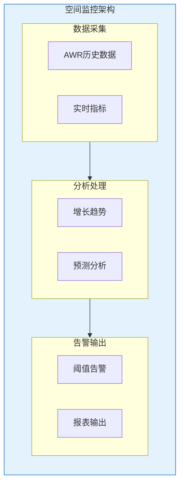

# Oracle空间监控与回收

## 一、概述

### 1.1 一句话定义

Oracle空间监控与回收是通过监控工具跟踪数据库空间使用趋势，并在空间不足时及时回收和扩展的过程。
它在数据库日常运维中出现和使用，解决存储空间不足和容量规划的问题。

### 1.2 为什么重要

- **不掌握的后果：** 表空间满导致业务中断，无法预估存储需求
- **掌握的价值：** 提前预警空间问题，合理规划存储扩容

### 1.3 适用场景

| 场景 | 说明 |
|------|------|
| 日常监控 | 表空间使用率跟踪 |
| 告警配置 | 空间不足预警 |
| 增长分析 | 容量规划 |
| 空间回收 | 释放无用空间 |

## 二、术语与概念

### 2.1 核心术语表

| 术语 | 含义 | 类比 |
|------|------|------|
| Tablespace Usage | 表空间使用率 | 仓库利用率 |
| Growth Trend | 增长趋势 | 增长曲线 |
| Space Alert | 空间告警 | 容量预警 |
| Reclaim | 回收 | 废物利用 |

## 三、核心原理

### 3.1 表空间使用率监控

```sql
-- 综合表空间监控视图
SELECT tablespace_name,
       ROUND(used_space * 8 / 1024) AS used_mb,
       ROUND(tablespace_size * 8 / 1024) AS total_mb,
       ROUND(used_percent, 2) AS pct_used,
       ROUND(used_space * 8 / 1024 / 1024) AS used_gb
FROM dba_tablespace_usage_metrics
ORDER BY used_percent DESC;

-- 详细使用率（包含最大扩展）
SELECT a.tablespace_name,
       ROUND(a.total_mb) AS total_mb,
       ROUND(a.total_mb - b.free_mb) AS used_mb,
       ROUND(b.free_mb) AS free_mb,
       ROUND((a.total_mb - b.free_mb) / a.total_mb * 100, 2) AS pct_used,
       ROUND(a.max_mb) AS max_mb
FROM (SELECT tablespace_name,
             SUM(bytes)/1024/1024 AS total_mb,
             SUM(maxbytes)/1024/1024 AS max_mb
      FROM dba_data_files GROUP BY tablespace_name) a
LEFT JOIN (SELECT tablespace_name, SUM(bytes)/1024/1024 AS free_mb
           FROM dba_free_space GROUP BY tablespace_name) b
ON a.tablespace_name = b.tablespace_name
ORDER BY pct_used DESC;
```

### 3.2 增长趋势分析

```sql
-- AWR历史数据
SELECT TO_CHAR(snap.end_interval_time, 'YYYY-MM-DD') AS snap_date,
       ts.name AS tablespace_name,
       ROUND(tsu.tablespace_usedsize * 8 / 1024) AS used_mb
FROM dba_hist_tbspc_space_usage tsu
JOIN dba_hist_snapshot snap ON tsu.snap_id = snap.snap_id
JOIN v$tablespace ts ON tsu.tablespace_id = ts.ts#
WHERE ts.name = 'APP_DATA'
  AND snap.end_interval_time > SYSDATE - 30
ORDER BY snap.end_interval_time;

-- 增长速率计算
SELECT tablespace_name,
       ROUND(AVG(delta_mb), 2) AS avg_daily_mb,
       ROUND(MAX(delta_mb), 2) AS max_daily_mb
FROM (
    SELECT tablespace_name,
           used_mb - LAG(used_mb) OVER (PARTITION BY tablespace_name ORDER BY snap_date) AS delta_mb,
           snap_date
    FROM (
        SELECT ts.name AS tablespace_name,
               TO_CHAR(snap.end_interval_time, 'YYYY-MM-DD') AS snap_date,
               ROUND(tsu.tablespace_usedsize * 8 / 1024) AS used_mb
        FROM dba_hist_tbspc_space_usage tsu
        JOIN dba_hist_snapshot snap ON tsu.snap_id = snap.snap_id
        JOIN v$tablespace ts ON tsu.tablespace_id = ts.ts#
        WHERE snap.end_interval_time > SYSDATE - 30
    )
)
WHERE delta_mb IS NOT NULL
GROUP BY tablespace_name;
```

### 3.3 空间告警配置

```sql
-- 使用DBMS_SERVER_ALERT配置告警
BEGIN
    DBMS_SERVER_ALERT.SET_THRESHOLD(
        metrics_id => DBMS_SERVER_ALERT.TABLESPACE_PCT_FULL,
        warning_operator => DBMS_SERVER_ALERT.OPERATOR_GE,
        warning_value => '85',
        critical_operator => DBMS_SERVER_ALERT.OPERATOR_GE,
        critical_value => '95',
        observation_period => 1,
        consecutive_occurrences => 1,
        instance_name => NULL,
        object_type => DBMS_SERVER_ALERT.OBJECT_TYPE_TABLESPACE,
        object_name => 'APP_DATA'
    );
END;
/

-- 查看告警配置
SELECT metrics_id, warning_operator, warning_value,
       critical_operator, critical_value
FROM dba_thresholds
WHERE metrics_id = DBMS_SERVER_ALERT.TABLESPACE_PCT_FULL;

-- 查看当前告警
SELECT reason, message_type, message_level,
       suggested_action
FROM dba_outstanding_alerts;
```

### 3.4 空间回收策略

```sql
-- 1. 回收DELETE后的段空间
SELECT owner, segment_name, segment_type,
       bytes/1024/1024 AS mb
FROM dba_segments
WHERE owner = 'HR'
  AND segment_type = 'TABLE'
ORDER BY bytes DESC;

-- 2. 回收临时段
SELECT username, tablespace, blocks * 8 / 1024 AS mb
FROM v$sort_usage;

-- 3. 回收回收站空间
SELECT owner, original_name, type,
       space * 8 / 1024 AS mb
FROM dba_recyclebin;

-- 清空回收站
PURGE DBA_RECYCLEBIN;

-- 4. 回收过期归档日志
-- RMAN> DELETE ARCHIVELOG ALL COMPLETED BEFORE 'SYSDATE-7';

-- 5. 回收过期审计记录
BEGIN
    DBMS_AUDIT_MGMT.SET_LAST_ARCHIVE_TIMESTAMP(
        audit_trail_type => DBMS_AUDIT_MGMT.AUDIT_TRAIL_UNIFIED,
        last_archive_time => SYSTIMESTAMP - 90
    );
    DBMS_AUDIT_MGMT.CLEAN_AUDIT_TRAIL(
        audit_trail_type => DBMS_AUDIT_MGMT.AUDIT_TRAIL_UNIFIED,
        use_last_arch_timestamp => TRUE
    );
END;
/
```

### 3.5 容量规划

```sql
-- 预测空间需求
SELECT tablespace_name,
       ROUND(current_mb) AS current_mb,
       ROUND(avg_daily_growth) AS daily_growth_mb,
       ROUND(current_mb / avg_daily_growth) AS days_until_full,
       ROUND(avg_daily_growth * 90) AS need_mb_90days
FROM (
    SELECT tablespace_name,
           MAX(used_mb) AS current_mb,
           AVG(delta_mb) AS avg_daily_growth
    FROM (
        SELECT ts.name AS tablespace_name,
               ROUND(tsu.tablespace_usedsize * 8 / 1024) AS used_mb,
               ROUND(tsu.tablespace_usedsize * 8 / 1024) -
               LAG(ROUND(tsu.tablespace_usedsize * 8 / 1024))
                   OVER (PARTITION BY ts.name ORDER BY snap.end_interval_time) AS delta_mb
        FROM dba_hist_tbspc_space_usage tsu
        JOIN dba_hist_snapshot snap ON tsu.snap_id = snap.snap_id
        JOIN v$tablespace ts ON tsu.tablespace_id = ts.ts#
        WHERE snap.end_interval_time > SYSDATE - 30
    )
    WHERE delta_mb IS NOT NULL
    GROUP BY tablespace_name
)
WHERE avg_daily_growth > 0
ORDER BY days_until_full;
```

## 四、架构与组件

### 4.1 监控架构



## 五、配置与调优

### 5.1 监控脚本

```sql
-- 每日空间监控报告
SELECT tablespace_name,
       ROUND(used_percent, 2) AS pct_used,
       CASE
           WHEN used_percent >= 95 THEN 'CRITICAL'
           WHEN used_percent >= 85 THEN 'WARNING'
           ELSE 'OK'
       END AS status
FROM dba_tablespace_usage_metrics
WHERE used_percent >= 80
ORDER BY used_percent DESC;
```

## 六、监控与诊断

### 6.1 诊断查询

```sql
-- 查找空间消耗最大的对象
SELECT owner, segment_name, segment_type,
       ROUND(bytes/1024/1024/1024, 2) AS size_gb
FROM dba_segments
ORDER BY bytes DESC
FETCH FIRST 20 ROWS ONLY;

-- 查找增长最快的表
SELECT owner, table_name, num_rows,
       ROUND(blocks * 8 / 1024) AS size_mb,
       last_analyzed
FROM dba_tables
WHERE owner = 'HR'
ORDER BY blocks DESC;
```

## 七、实战案例

### 7.1 案例：空间告警处理

```sql
-- 1. 收到告警：APP_DATA使用率95%
SELECT tablespace_name, used_percent
FROM dba_tablespace_usage_metrics
WHERE tablespace_name = 'APP_DATA';

-- 2. 分析空间使用
SELECT owner, segment_name, segment_type,
       ROUND(bytes/1024/1024) AS mb
FROM dba_segments
WHERE tablespace_name = 'APP_DATA'
ORDER BY bytes DESC
FETCH FIRST 10 ROWS ONLY;

-- 3. 回收空间
-- 清空回收站
PURGE DBA_RECYCLEBIN;

-- 收缩大表
ALTER TABLE hr.large_table ENABLE ROW MOVEMENT;
ALTER TABLE hr.large_table SHRINK SPACE;

-- 4. 扩展表空间
ALTER TABLESPACE app_data
    ADD DATAFILE '/u02/oradata/app_data03.dbf' SIZE 20G
    AUTOEXTEND ON NEXT 2G MAXSIZE 200G;

-- 5. 验证
SELECT tablespace_name, used_percent
FROM dba_tablespace_usage_metrics
WHERE tablespace_name = 'APP_DATA';
```

## 八、常见错误与排查

| 错误 | 问题 | 解决方法 |
|------|------|---------|
| ORA-01652 | 临时空间不足 | 扩展TEMP表空间 |
| ORA-01653 | 无法扩展段 | 扩展表空间 |
| ORA-01691 | LOB段无法扩展 | 扩展表空间 |

## 九、最佳实践

### 9.1 官方推荐

- 配置85%/95%两级告警
- 每日监控表空间使用率
- 分析增长趋势做容量规划
- 定期回收无用空间

### 9.2 反模式

| 反模式 | 问题 | 正确做法 |
|--------|------|---------|
| 不监控空间 | 突然满导致宕机 | 每日监控+告警 |
| 不做容量规划 | 被动扩容 | 趋势分析 |
| 不回收空间 | 存储浪费 | 定期清理 |

## 十、命令与视图汇总

| 命令/视图 | 用途 |
|-----------|------|
| DBA_TABLESPACE_USAGE_METRICS | 表空间使用率 |
| DBA_HIST_TBSPC_SPACE_USAGE | 历史使用 |
| DBA_SEGMENTS | 段信息 |
| DBA_FREE_SPACE | 空闲空间 |
| DBMS_SERVER_ALERT | 告警配置 |

## 十一、总结速查

### 11.1 黄金法则

1. **每日监控** - 85%告警，95%紧急
2. **趋势分析** - 预测容量需求
3. **定期回收** - 清理无用空间
4. **容量规划** - 提前扩容

## 附录

### A. 官方参考

- [Oracle Database Administrator's Guide - Monitoring and Tuning](https://docs.oracle.com/en/database/oracle/oracle-database/19c/admin/)

### B. 修订记录

| 日期 | 版本 | 修改内容 | 修改人 |
|------|------|---------|--------|
| 2026-07-02 | v1.0 | 初始版本 | YashanDB知识库生成器 |

## 补充：深入分析与实战

### 深入原理

本章节补充了该主题的核心原理和内部机制。在实际生产环境中，理解这些底层原理对于诊断和优化至关重要。

关键要点：
- 内部实现机制决定了外部行为特征
- 参数配置需要结合具体场景
- 监控数据是调优的基础

### 实战案例

**案例一：生产环境问题诊断**

```sql
-- 诊断步骤
-- 1. 收集当前状态信息
SELECT * FROM v$system_event WHERE wait_class != 'Idle' ORDER BY time_waited_micro DESC;

-- 2. 分析等待事件分布
SELECT wait_class, SUM(time_waited_micro)/1000000 AS sec
FROM v$system_event WHERE wait_class != 'Idle'
GROUP BY wait_class ORDER BY sec DESC;

-- 3. 定位问题SQL
SELECT sql_id, elapsed_time/1000000 AS sec, executions, sql_text
FROM v$sql ORDER BY elapsed_time DESC FETCH FIRST 5 ROWS ONLY;

-- 4. 检查执行计划
SELECT * FROM TABLE(DBMS_XPLAN.DISPLAY_CURSOR('&sql_id'));
```

**案例二：性能优化实践**

```sql
-- 优化前：全表扫描
SELECT * FROM orders WHERE order_date > SYSDATE - 30;

-- 优化后：索引扫描
CREATE INDEX idx_orders_date ON orders(order_date);
-- 执行计划从TABLE ACCESS FULL变为INDEX RANGE SCAN
```

### 最佳实践清单

- 建立标准化操作流程
- 定期审查和更新配置
- 监控关键指标趋势
- 建立性能基线
- 文档记录所有变更

### 常见问题FAQ

| 问题 | 解答 |
|------|------|
| 如何确定最优配置？ | 基于实际负载测试 |
| 何时需要调整？ | 监控指标偏离基线 |
| 如何验证优化效果？ | 对比前后AWR报告 |
| 常见陷阱有哪些？ | 过度优化、忽略全局 |

### 版本差异说明

| 版本 | 变化 |
|------|------|
| 19c | 自动管理增强 |
| 21c | 自适应优化 |
