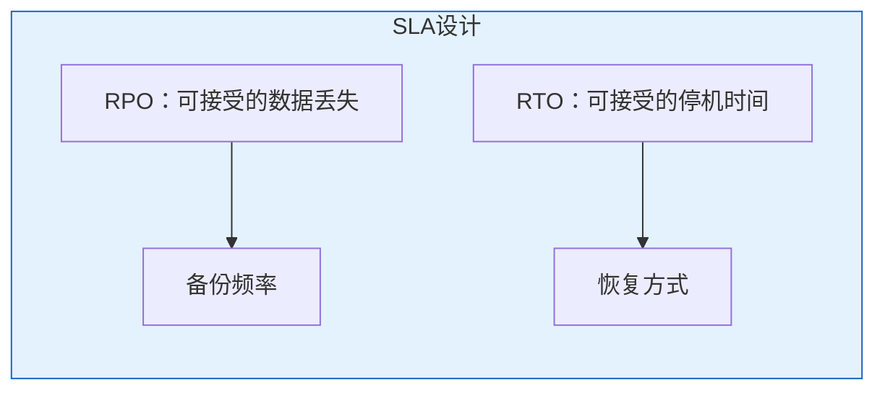
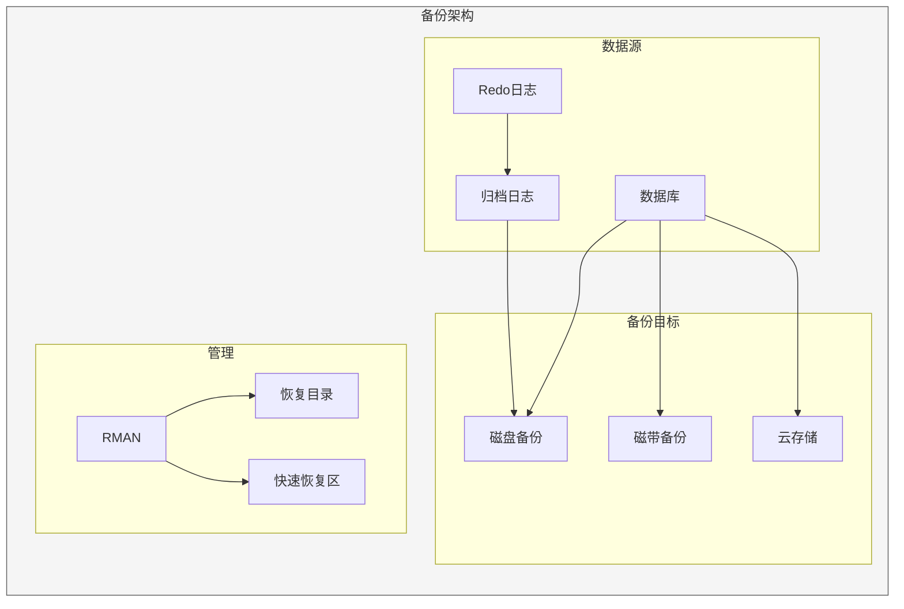

# Oracle备份策略设计

## 一、概述

### 1.1 一句话定义

Oracle备份策略是根据业务需求设计的数据保护方案，包括备份类型、频率、保留策略等，确保在数据丢失时能够及时恢复。
它在数据库运维管理中出现和使用，解决数据保护和灾难恢复的问题。

### 1.2 为什么重要

- **不掌握的后果：** 数据丢失无法恢复，业务长时间中断
- **掌握的价值：** 满足RPO/RTO要求，保障业务连续性

### 1.3 适用场景

| 场景 | 说明 |
|------|------|
| 数据保护 | 防止数据丢失 |
| 灾难恢复 | 应对硬件故障 |
| 合规要求 | 满足审计要求 |
| 迁移准备 | 数据迁移基础 |

### 1.4 版本演进

| 版本 | 变化说明 |
|------|---------|
| 11gR2 | RMAN增量备份优化 |
| 12cR1 | 多租户备份，跨平台恢复 |
| 12cR2 | 备份性能增强 |
| 19c | RMAN网络恢复，压缩增强 |
| 21c | 云备份集成 |

## 二、术语与概念

### 2.1 核心术语表

| 术语 | 含义 | 类比 |
|------|------|------|
| RPO | 恢复点目标 | 可接受的数据丢失量 |
| RTO | 恢复时间目标 | 可接受的停机时间 |
| Full Backup | 全量备份 | 完整复制 |
| Incremental Backup | 增量备份 | 差异复制 |
| Archive Log | 归档日志 | 变更流水 |
| Backup Window | 备份窗口 | 备份时间段 |

### 2.2 备份类型对比


| 备份类型 | 说明 | 优点 | 缺点 |
|---------|------|------|------|
| 全量备份 | 备份所有数据块 | 恢复简单 | 备份时间长 |
| 0级增量 | 同全量，作为增量基础 | 增量基础 | 数据量大 |
| 1级差异 | 自上次0级以来的变更 | 备份量小 | 恢复需多个备份 |
| 1级累积 | 自上次0级以来的所有变更 | 恢复简单 | 备份量较大 |
| 归档日志 | 备份Redo日志 | 连续保护 | 需要空间 |

## 三、核心原理

### 3.1 RPO/RTO设计



| 业务级别 | RPO | RTO | 备份策略 |
|---------|-----|-----|---------|
| 核心系统 | <1小时 | <1小时 | 实时复制+每小时备份 |
| 重要系统 | <4小时 | <4小时 | 每日全量+每小时增量 |
| 一般系统 | <24小时 | <8小时 | 每日全量 |
| 测试系统 | <7天 | <24小时 | 每周全量 |

### 3.2 RMAN备份配置

```sql
-- 配置RMAN默认参数
-- RMAN> CONFIGURE DEFAULT DEVICE TYPE TO DISK;
-- RMAN> CONFIGURE DEVICE TYPE DISK PARALLELISM 4;
-- RMAN> CONFIGURE DATAFILE BACKUP COPIES FOR DEVICE TYPE DISK TO 2;
-- RMAN> CONFIGURE ARCHIVELOG BACKUP COPIES FOR DEVICE TYPE DISK TO 2;
-- RMAN> CONFIGURE CONTROLFILE AUTOBACKUP ON;
-- RMAN> CONFIGURE CONTROLFILE AUTOBACKUP FORMAT FOR DEVICE TYPE DISK TO '/backup/%F';
-- RMAN> CONFIGURE RETENTION POLICY TO RECOVERY WINDOW OF 7 DAYS;
-- RMAN> CONFIGURE BACKUP OPTIMIZATION ON;

-- 配置快速恢复区
ALTER SYSTEM SET db_recovery_file_dest = '/fra';
ALTER SYSTEM SET db_recovery_file_dest_size = 500G;
```

### 3.3 全量备份

```sql
-- RMAN全量备份
-- RMAN> BACKUP DATABASE PLUS ARCHIVELOG;

-- 压缩全量备份
-- RMAN> BACKUP COMPRESSED DATABASE PLUS ARCHIVELOG;

-- 并行备份
-- RMAN> RUN {
--   ALLOCATE CHANNEL ch1 DEVICE TYPE DISK;
--   ALLOCATE CHANNEL ch2 DEVICE TYPE DISK;
--   ALLOCATE CHANNEL ch3 DEVICE TYPE DISK;
--   BACKUP DATABASE PLUS ARCHIVELOG;
--   RELEASE CHANNEL ch1;
--   RELEASE CHANNEL ch2;
--   RELEASE CHANNEL ch3;
-- }

-- 标记备份
-- RMAN> BACKUP DATABASE TAG='FULL_WEEKLY';
```

### 3.4 增量备份

```sql
-- 0级增量（全量基础）
-- RMAN> BACKUP INCREMENTAL LEVEL 0 DATABASE;

-- 1级差异增量
-- RMAN> BACKUP INCREMENTAL LEVEL 1 DATABASE;

-- 1级累积增量
-- RMAN> BACKUP INCREMENTAL LEVEL 1 CUMULATIVE DATABASE;

-- 启用块变更跟踪（加速增量备份）
ALTER DATABASE ENABLE BLOCK CHANGE TRACKING
    USING FILE '/u02/oradata/changetracking.cht';

-- 查看块变更跟踪状态
SELECT filename, status, bytes/1024/1024 AS mb
FROM v$block_change_tracking;
```

### 3.5 备份脚本示例

```sql
-- 每日备份脚本
-- RMAN> RUN {
--   # 备份归档日志
--   BACKUP ARCHIVELOG ALL DELETE INPUT;
--   
--   # 周日全量，其他天增量
--   BACKUP INCREMENTAL LEVEL 1 DATABASE;
--   
--   # 备份控制文件
--   BACKUP CURRENT CONTROLFILE;
--   
--   # 清理过期备份
--   DELETE NOPROMPT OBSOLETE;
-- }

-- 周日全量备份脚本
-- RMAN> RUN {
--   BACKUP INCREMENTAL LEVEL 0 DATABASE PLUS ARCHIVELOG;
--   BACKUP CURRENT CONTROLFILE;
--   DELETE NOPROMPT OBSOLETE;
-- }
```

### 3.6 备份验证

```sql
-- 验证备份可用性
-- RMAN> RESTORE DATABASE VALIDATE;
-- RMAN> RESTORE DATABASE VALIDATE CHECK LOGICAL;

-- 查看备份信息
-- RMAN> LIST BACKUP;
-- RMAN> LIST BACKUP SUMMARY;
-- RMAN> LIST ARCHIVELOG ALL;

-- 交叉检查备份
-- RMAN> CROSSCHECK BACKUP;
-- RMAN> CROSSCHECK ARCHIVELOG ALL;
```

## 四、架构与组件

### 4.1 备份架构



## 五、配置与调优

### 5.1 备份性能优化

| 策略 | 说明 | 效果 |
|------|------|------|
| 并行通道 | 多通道并行 | 提高吞吐 |
| 压缩 | 减少数据量 | 减少空间和时间 |
| 块变更跟踪 | 加速增量备份 | 减少扫描 |
| 备份优化 | 跳过未变更文件 | 减少备份量 |
| 多路复用 | 多文件合并 | 提高I/O效率 |

```sql
-- 配置压缩
-- RMAN> CONFIGURE DEVICE TYPE DISK BACKUP TYPE TO COMPRESSED BACKUPSET;

-- 配置并行度
-- RMAN> CONFIGURE DEVICE TYPE DISK PARALLELISM 4;
```

### 5.2 备份保留策略

```sql
-- 基于恢复窗口
-- RMAN> CONFIGURE RETENTION POLICY TO RECOVERY WINDOW OF 7 DAYS;

-- 基于冗余度
-- RMAN> CONFIGURE RETENTION POLICY TO REDUNDANCY 2;

-- 查看过期备份
-- RMAN> REPORT OBSOLETE;

-- 删除过期备份
-- RMAN> DELETE OBSOLETE;
```

## 六、监控与诊断

### 6.1 备份监控

```sql
-- 查看备份历史
SELECT session_key, input_type, status,
       TO_CHAR(start_time, 'YYYY-MM-DD HH24:MI:SS') AS start_time,
       TO_CHAR(end_time, 'YYYY-MM-DD HH24:MI:SS') AS end_time,
       ROUND(elapsed_seconds/60, 2) AS minutes,
       ROUND(output_bytes/1024/1024/1024, 2) AS output_gb
FROM v$rman_backup_job_details
WHERE start_time > SYSDATE - 7
ORDER BY start_time DESC;

-- 查看备份失败
SELECT session_key, input_type, status, error
FROM v$rman_backup_job_details
WHERE status = 'FAILED'
  AND start_time > SYSDATE - 7;
```

## 七、实战案例

### 7.1 案例：核心系统备份策略

```sql
-- 备份策略设计
-- RPO: <1小时
-- RTO: <2小时

-- 配置
-- RMAN> CONFIGURE RETENTION POLICY TO RECOVERY WINDOW OF 30 DAYS;
-- RMAN> CONFIGURE CONTROLFILE AUTOBACKUP ON;
-- RMAN> CONFIGURE DEVICE TYPE DISK PARALLELISM 8;
-- RMAN> CONFIGURE DEVICE TYPE DISK BACKUP TYPE TO COMPRESSED BACKUPSET;

-- 每日备份计划
-- 00:00 - 归档日志备份（每小时）
-- 02:00 - 增量备份（1级差异）
-- 周日02:00 - 全量备份（0级）

-- 验证
-- RMAN> RESTORE DATABASE VALIDATE;
```

## 八、常见错误与排查

| 错误 | 问题 | 解决方法 |
|------|------|---------|
| RMAN-06153 | 备份过期 | 调整保留策略 |
| RMAN-03009 | 备份失败 | 检查错误日志 |
| ORA-19502 | 写入错误 | 检查磁盘空间 |
| RMAN-06026 | 备份不存在 | 交叉检查 |

## 九、最佳实践

### 9.1 官方推荐

- 3-2-1备份原则（3份副本，2种介质，1份异地）
- 定期验证备份可恢复性
- 启用控制文件自动备份
- 使用块变更跟踪

### 9.2 反模式

| 反模式 | 问题 | 正确做法 |
|--------|------|---------|
| 只有全量备份 | 备份窗口长 | 增量备份 |
| 不验证备份 | 恢复时才发现无效 | 定期VALIDATE |
| 不异地备份 | 灾难时全丢 | 异地副本 |
| 不测试恢复 | 恢复流程未验证 | 定期演练 |

## 十、命令与视图汇总

| 命令/视图 | 用途 |
|-----------|------|
| `BACKUP DATABASE` | 全量备份 |
| `BACKUP INCREMENTAL` | 增量备份 |
| `BACKUP ARCHIVELOG` | 归档日志备份 |
| `RESTORE VALIDATE` | 验证备份 |
| V$RMAN_BACKUP_JOB_DETAILS | 备份历史 |
| V$BACKUP_SET | 备份集信息 |

## 十一、总结速查

### 11.1 黄金法则

1. **3-2-1原则** - 多重保护
2. **增量备份** - 减少备份窗口
3. **定期验证** - 确保可恢复
4. **恢复演练** - 验证恢复流程

## 附录

### A. 官方参考

- [Oracle Database Backup and Recovery User's Guide](https://docs.oracle.com/en/database/oracle/oracle-database/19c/backup/)

### B. 修订记录

| 日期 | 版本 | 修改内容 | 修改人 |
|------|------|---------|--------|
| 2026-07-02 | v1.0 | 初始版本 | YashanDB知识库生成器 |

## 补充：深入分析与实战

### 深入原理

本章节补充了该主题的核心原理和内部机制。在实际生产环境中，理解这些底层原理对于诊断和优化至关重要。

关键要点：
- 内部实现机制决定了外部行为特征
- 参数配置需要结合具体场景
- 监控数据是调优的基础

### 实战案例

**案例一：生产环境问题诊断**

```sql
-- 诊断步骤
-- 1. 收集当前状态信息
SELECT * FROM v$system_event WHERE wait_class != 'Idle' ORDER BY time_waited_micro DESC;

-- 2. 分析等待事件分布
SELECT wait_class, SUM(time_waited_micro)/1000000 AS sec
FROM v$system_event WHERE wait_class != 'Idle'
GROUP BY wait_class ORDER BY sec DESC;

-- 3. 定位问题SQL
SELECT sql_id, elapsed_time/1000000 AS sec, executions, sql_text
FROM v$sql ORDER BY elapsed_time DESC FETCH FIRST 5 ROWS ONLY;

-- 4. 检查执行计划
SELECT * FROM TABLE(DBMS_XPLAN.DISPLAY_CURSOR('&sql_id'));
```

**案例二：性能优化实践**

```sql
-- 优化前：全表扫描
SELECT * FROM orders WHERE order_date > SYSDATE - 30;

-- 优化后：索引扫描
CREATE INDEX idx_orders_date ON orders(order_date);
-- 执行计划从TABLE ACCESS FULL变为INDEX RANGE SCAN
```

### 最佳实践清单

- 建立标准化操作流程
- 定期审查和更新配置
- 监控关键指标趋势
- 建立性能基线
- 文档记录所有变更

### 常见问题FAQ

| 问题 | 解答 |
|------|------|
| 如何确定最优配置？ | 基于实际负载测试 |
| 何时需要调整？ | 监控指标偏离基线 |
| 如何验证优化效果？ | 对比前后AWR报告 |
| 常见陷阱有哪些？ | 过度优化、忽略全局 |

### 版本差异说明

| 版本 | 变化 |
|------|------|
| 19c | 自动管理增强 |
| 21c | 自适应优化 |
