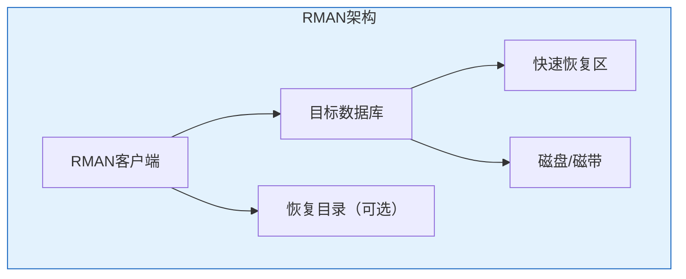

# Oracle RMAN物理备份

## 一、概述

### 1.1 一句话定义

Oracle RMAN（Recovery Manager）是Oracle提供的专用物理备份恢复工具，支持全量备份、增量备份、压缩、加密等多种备份方式。
它在数据库备份恢复中出现和使用，解决数据物理层面的保护和恢复问题。

### 1.2 为什么重要

- **不掌握的后果：** 无法高效备份大型数据库，备份窗口过长
- **掌握的价值：** 实现高效可靠的物理备份，满足RPO/RTO要求

### 1.3 适用场景

| 场景 | 说明 |
|------|------|
| 日常备份 | 数据库定期物理备份 |
| 灾难恢复 | 物理故障后的恢复 |
| 迁移复制 | 跨环境数据复制 |
| 归档保留 | 长期备份保留 |

## 二、术语与概念

### 2.1 核心术语表

| 术语 | 含义 | 类比 |
|------|------|------|
| RMAN | 恢复管理器 | 备份管家 |
| Backup Set | 备份集 | 打包行李 |
| Backup Piece | 备份片 | 行李件 |
| Image Copy | 镜像复制 | 精确复制 |
| Channel | 通道 | 搬运工 |
| Catalog | 恢复目录 | 备份目录 |

## 三、核心原理

### 3.1 RMAN架构



### 3.2 全量备份

```sql
-- RMAN> BACKUP DATABASE;
-- RMAN> BACKUP DATABASE PLUS ARCHIVELOG;
-- RMAN> BACKUP AS BACKUPSET DATABASE;
-- RMAN> BACKUP AS COPY DATABASE;

-- 压缩备份
-- RMAN> BACKUP COMPRESSED DATABASE;

-- 并行备份
-- RMAN> RUN {
--   ALLOCATE CHANNEL ch1 DEVICE TYPE DISK;
--   ALLOCATE CHANNEL ch2 DEVICE TYPE DISK;
--   BACKUP DATABASE;
-- }

-- 标记备份
-- RMAN> BACKUP DATABASE TAG='WEEKLY_FULL';
```

### 3.3 增量备份

```sql
-- 0级增量（作为基础）
-- RMAN> BACKUP INCREMENTAL LEVEL 0 DATABASE;

-- 1级差异增量
-- RMAN> BACKUP INCREMENTAL LEVEL 1 DATABASE;

-- 1级累积增量
-- RMAN> BACKUP INCREMENTAL LEVEL 1 CUMULATIVE DATABASE;

-- 启用块变更跟踪
ALTER DATABASE ENABLE BLOCK CHANGE TRACKING
    USING FILE '/u02/oradata/bct.cht';
```

### 3.4 备份压缩

```sql
-- 配置默认压缩
-- RMAN> CONFIGURE DEVICE TYPE DISK BACKUP TYPE TO COMPRESSED BACKUPSET;

-- 压缩算法选择
-- RMAN> CONFIGURE COMPRESSION ALGORITHM 'MEDIUM';
-- BASIC | LOW | MEDIUM | HIGH

-- 查看压缩效果
-- RMAN> LIST BACKUP SUMMARY;
```

### 3.5 备份加密

```sql
-- 透明加密（推荐）
-- RMAN> CONFIGURE ENCRYPTION FOR DATABASE ON;
-- RMAN> CONFIGURE ENCRYPTION ALGORITHM 'AES256';

-- 密码加密
-- RMAN> SET ENCRYPTION ON IDENTIFIED BY 'backup_pass';
-- RMAN> BACKUP DATABASE;

-- 恢复时需要密码
-- RMAN> SET DECRYPTION IDENTIFIED BY 'backup_pass';
-- RMAN> RESTORE DATABASE;
```

### 3.6 备份脚本

```sql
-- 完整备份脚本
-- RMAN> RUN {
--   ALLOCATE CHANNEL ch1 DEVICE TYPE DISK;
--   ALLOCATE CHANNEL ch2 DEVICE TYPE DISK;
--   
--   BACKUP INCREMENTAL LEVEL 0 DATABASE
--     FORMAT '/backup/full_%d_%T_%U'
--     TAG='WEEKLY_FULL';
--   
--   BACKUP ARCHIVELOG ALL
--     FORMAT '/backup/arch_%d_%T_%U'
--     DELETE INPUT;
--   
--   BACKUP CURRENT CONTROLFILE
--     FORMAT '/backup/ctl_%d_%T_%U';
--   
--   BACKUP SPFILE
--     FORMAT '/backup/spfile_%d_%T_%U';
--   
--   DELETE NOPROMPT OBSOLETE;
--   
--   RELEASE CHANNEL ch1;
--   RELEASE CHANNEL ch2;
-- }
```

## 四、架构与组件

### 4.1 备份类型对比

| 类型 | 说明 | 恢复速度 | 备份大小 |
|------|------|---------|---------|
| Full Backup | 全量 | 最快 | 最大 |
| Level 0 | 增量基础 | 快 | 大 |
| Level 1 Differential | 差异增量 | 中 | 小 |
| Level 1 Cumulative | 累积增量 | 较快 | 中 |

## 五、配置与调优

### 5.1 RMAN配置

```sql
-- 常用配置
-- RMAN> CONFIGURE DEFAULT DEVICE TYPE TO DISK;
-- RMAN> CONFIGURE DEVICE TYPE DISK PARALLELISM 4;
-- RMAN> CONFIGURE CONTROLFILE AUTOBACKUP ON;
-- RMAN> CONFIGURE RETENTION POLICY TO RECOVERY WINDOW OF 7 DAYS;
-- RMAN> CONFIGURE BACKUP OPTIMIZATION ON;

-- 查看所有配置
-- RMAN> SHOW ALL;
```

### 5.2 性能优化

| 策略 | 说明 | 效果 |
|------|------|------|
| 多通道 | 并行备份 | 提高吞吐 |
| 压缩 | 减少数据量 | 减少空间和时间 |
| 块变更跟踪 | 加速增量 | 减少扫描 |
| 多路复用 | 文件合并 | 提高I/O效率 |

## 六、监控与诊断

### 6.1 备份监控

```sql
-- 查看备份进度
SELECT sid, serial#, opname, 
       ROUND(sofar/totalwork*100, 2) AS pct,
       time_remaining
FROM v$session_longops
WHERE opname LIKE '%RMAN%';

-- 查看备份历史
SELECT session_key, input_type, status,
       TO_CHAR(start_time, 'MM-DD HH24:MI') AS start_time,
       ROUND(elapsed_seconds/60) AS minutes
FROM v$rman_backup_job_details
WHERE start_time > SYSDATE - 7
ORDER BY start_time DESC;
```

## 七、实战案例

### 7.1 案例：大型数据库备份优化

```sql
-- 问题：500GB数据库备份超过12小时
-- 优化方案：
-- 1. 启用块变更跟踪
-- 2. 使用8个并行通道
-- 3. 使用MEDIUM压缩
-- 4. 每日增量备份

-- 优化后：备份时间从12小时降至2小时
```

## 八、常见错误与排查

| 错误 | 问题 | 解决方法 |
|------|------|---------|
| RMAN-03009 | 备份失败 | 检查日志 |
| ORA-19502 | 写入错误 | 检查磁盘空间 |
| RMAN-06059 | 归档日志缺失 | 交叉检查 |

## 九、最佳实践

### 9.1 官方推荐

- 启用控制文件自动备份
- 使用块变更跟踪
- 定期验证备份
- 配置合理的保留策略

## 十、命令与视图汇总

| 命令/视图 | 用途 |
|-----------|------|
| `BACKUP DATABASE` | 全量备份 |
| `BACKUP INCREMENTAL` | 增量备份 |
| `BACKUP ARCHIVELOG` | 归档备份 |
| `SHOW ALL` | 查看配置 |
| V$RMAN_BACKUP_JOB_DETAILS | 备份历史 |

## 十一、总结速查

### 11.1 黄金法则

1. **增量备份** - 减少备份窗口
2. **并行通道** - 提高备份速度
3. **压缩加密** - 安全和效率
4. **定期验证** - 确保可恢复

## 附录

### A. 官方参考

- [Oracle Database Backup and Recovery User's Guide](https://docs.oracle.com/en/database/oracle/oracle-database/19c/backup/)

### B. 修订记录

| 日期 | 版本 | 修改内容 | 修改人 |
|------|------|---------|--------|
| 2026-07-02 | v1.0 | 初始版本 | YashanDB知识库生成器 |

## 七、RMAN高级备份策略

### 7.1 增量备份策略

```sql
-- Level 0 基础备份（每周日）
RMAN> BACKUP INCREMENTAL LEVEL 0 DATABASE;

-- Level 1 差异增量（周一至周六）
RMAN> BACKUP INCREMENTAL LEVEL 1 DATABASE;

-- Level 1 累积增量
RMAN> BACKUP INCREMENTAL LEVEL 1 CUMULATIVE DATABASE;

-- 块变更跟踪（加速增量备份）
ALTER DATABASE ENABLE BLOCK CHANGE TRACKING
    USING FILE '/u01/oradata/bct.chg';

-- 查看块变更跟踪状态
SELECT status, filename FROM v$block_change_tracking;
```

### 7.2 备份优化

```sql
-- 跳过已备份的数据文件
CONFIGURE BACKUP OPTIMIZATION ON;

-- 压缩备份
RMAN> BACKUP AS COMPRESSED BACKUPSET DATABASE;

-- 并行备份
RMAN> CONFIGURE DEVICE TYPE DISK PARALLELISM 4;

-- 限制备份速率
RMAN> BACKUP DATABASE MAXSETSIZE 10G;
```

### 7.3 备份验证

```sql
-- 验证备份可用性
RMAN> RESTORE VALIDATE DATABASE;

-- 交叉检查备份
RMAN> CROSSCHECK BACKUP;
RMAN> CROSSCHECK COPY;

-- 删除过期备份
RMAN> DELETE OBSOLETE;
RMAN> DELETE EXPIRED BACKUP;

-- 查看备份信息
RMAN> LIST BACKUP SUMMARY;
RMAN> LIST BACKUP OF DATABASE;
```

## 八、RMAN恢复操作

### 8.1 完整恢复

```sql
-- 完全恢复
RMAN> STARTUP MOUNT;
RMAN> RESTORE DATABASE;
RMAN> RECOVER DATABASE;
RMAN> ALTER DATABASE OPEN;

-- 恢复单个数据文件
RMAN> RUN {
    SQL 'ALTER DATABASE DATAFILE 5 OFFLINE';
    RESTORE DATAFILE 5;
    RECOVER DATAFILE 5;
    SQL 'ALTER DATABASE DATAFILE 5 ONLINE';
}
```

### 8.2 不完全恢复

```sql
-- 基于时间点恢复
RMAN> STARTUP MOUNT;
RMAN> RUN {
    SET UNTIL TIME "TO_DATE('2026-07-02 14:00:00', 'YYYY-MM-DD HH24:MI:SS')";
    RESTORE DATABASE;
    RECOVER DATABASE;
}
RMAN> ALTER DATABASE OPEN RESETLOGS;

-- 基于SCN恢复
RMAN> SET UNTIL SCN 12345678;

-- 基于日志序列号恢复
RMAN> SET UNTIL SEQUENCE 100 THREAD 1;
```

## 九、RMAN监控视图

| 视图 | 用途 |
|------|------|
| `v$rman_backup_job_details` | 备份作业详情 |
| `v$rman_status` | RMAN操作状态 |
| `v$backup_set` | 备份集信息 |
| `v$backup_piece` | 备份片信息 |
| `v$database_block_corruption` | 块损坏 |

## 十、最佳实践

- 使用增量备份减少备份窗口
- 启用块变更跟踪加速增量备份
- 定期验证备份可用性
- 备份到多个目标（磁盘+磁带）
- 设置合理的备份保留策略
- 定期测试恢复流程

## 十一、总结速查

| 命令 | 用途 |
|------|------|
| `BACKUP DATABASE` | 全库备份 |
| `BACKUP INCREMENTAL` | 增量备份 |
| `RESTORE DATABASE` | 恢复 |
| `RECOVER DATABASE` | 应用Redo |
| `CROSSCHECK` | 交叉检查 |
| `DELETE OBSOLETE` | 清理过期 |
