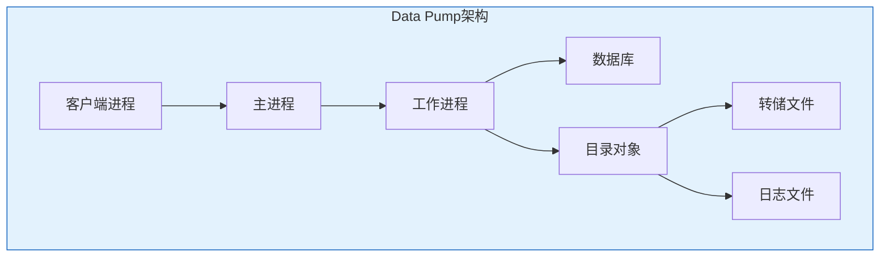

# Oracle逻辑备份技术

## 一、概述

### 1.1 一句话定义

Oracle逻辑备份是通过Data Pump（EXPDP/IMPDP）将数据库对象以逻辑格式导出为文件的过程，支持跨平台迁移和选择性恢复。
它在数据迁移和逻辑备份中出现和使用，解决数据跨环境迁移和选择性备份恢复的问题。

### 1.2 为什么重要

- **不掌握的后果：** 无法跨平台迁移数据，无法选择性恢复对象
- **掌握的价值：** 灵活的数据迁移和选择性恢复能力

### 1.3 适用场景

| 场景 | 说明 |
|------|------|
| 数据迁移 | 跨平台/跨版本迁移 |
| 选择性备份 | 备份特定Schema |
| 数据复制 | 环境间数据同步 |
| 数据抽取 | 提取部分数据 |

### 1.4 版本演进

| 版本 | 变化说明 |
|------|---------|
| 11gR2 | Data Pump增强，网络导入 |
| 12cR1 | 多租户支持，Sharding |
| 12cR2 | 性能优化 |
| 19c | 云迁移增强 |
| 21c | 云原生导出 |

## 二、术语与概念

### 2.1 核心术语表

| 术语 | 含义 | 类比 |
|------|------|------|
| Data Pump | 数据泵 | 数据搬运机 |
| EXPDP | 导出工具 | 打包工具 |
| IMPDP | 导入工具 | 解包工具 |
| Directory | 目录对象 | 文件路径 |
| Dump File | 转储文件 | 数据包裹 |
| Parallel | 并行度 | 搬运工数量 |

## 三、核心原理

### 3.1 Directory配置

```sql
-- 创建目录对象
CREATE OR REPLACE DIRECTORY dpump_dir AS '/backup/dpump';

-- 授权
GRANT READ, WRITE ON DIRECTORY dpump_dir TO dba;
GRANT EXECUTE ON DIRECTORY dpump_dir TO dba;

-- 查看目录
SELECT directory_name, directory_path
FROM dba_directories
WHERE directory_name LIKE '%DPUMP%';

-- OS层面确保目录存在且权限正确
-- mkdir -p /backup/dpump
-- chown oracle:oinstall /backup/dpump
-- chmod 750 /backup/dpump
```

### 3.2 数据导出（EXPDP）

```bash
# 导出整个数据库
expdp system/password@orcl directory=dpump_dir \
    dumpfile=full_export_%U.dmp \
    logfile=full_export.log \
    full=y \
    parallel=4 \
    compression=all

# 导出Schema
expdp system/password@orcl directory=dpump_dir \
    dumpfile=schema_hr.dmp \
    logfile=schema_hr.log \
    schemas=hr \
    parallel=2

# 导出指定表
expdp system/password@orcl directory=dpump_dir \
    dumpfile=tables_export.dmp \
    logfile=tables_export.log \
    tables=hr.employees,hr.departments

# 导出查询结果
expdp system/password@orcl directory=dpump_dir \
    dumpfile=query_export.dmp \
    tables=hr.employees \
    query='WHERE department_id=10'

# 导出元数据（不含数据）
expdp system/password@orcl directory=dpump_dir \
    dumpfile=metadata_only.dmp \
    content=metadata_only \
    schemas=hr

# 按时间导出（一致性导出）
expdp system/password@orcl directory=dpump_dir \
    dumpfile=consistent_export.dmp \
    flashback_time="TO_TIMESTAMP('2026-07-02 10:00:00','YYYY-MM-DD HH24:MI:SS')"
```

### 3.3 数据导入（IMPDP）

```bash
# 导入整个数据库
impdp system/password@orcl directory=dpump_dir \
    dumpfile=full_export_%U.dmp \
    logfile=full_import.log \
    full=y \
    parallel=4

# 导入Schema
impdp system/password@orcl directory=dpump_dir \
    dumpfile=schema_hr.dmp \
    logfile=schema_import.log \
    schemas=hr

# 导入到不同Schema
impdp system/password@orcl directory=dpump_dir \
    dumpfile=schema_hr.dmp \
    remap_schema=hr:hr_new

# 导入到不同表空间
impdp system/password@orcl directory=dpump_dir \
    dumpfile=schema_hr.dmp \
    remap_tablespace=users:app_data

# 只导入元数据
impdp system/password@orcl directory=dpump_dir \
    dumpfile=metadata_only.dmp \
    content=metadata_only

# 导入指定表
impdp system/password@orcl directory=dpump_dir \
    dumpfile=tables_export.dmp \
    tables=hr.employees

# 追加数据（不删除现有数据）
impdp system/password@orcl directory=dpump_dir \
    dumpfile=schema_hr.dmp \
    schemas=hr \
    table_exists_action=append

# 替换现有表
impdp system/password@orcl directory=dpump_dir \
    dumpfile=schema_hr.dmp \
    schemas=hr \
    table_exists_action=replace
```

### 3.4 网络导入（直接迁移）

```bash
# 从源库直接导入到目标库（无需中间文件）
impdp system/password@target_db directory=dpump_dir \
    network_link=source_db_link \
    schemas=hr \
    remap_schema=hr:hr_new
```

### 3.5 Data Pump作业管理

```sql
-- 查看Data Pump作业
SELECT owner_name, job_name, operation, job_mode, state
FROM dba_datapump_jobs;

-- 附加到运行中的作业
-- expdp system/password attach=SYS_EXPORT_FULL_01

-- 在作业中执行命令
-- Export> status
-- Export> kill_job
-- Export> exit
```

## 四、架构与组件

### 4.1 Data Pump架构



## 五、配置与调优

### 5.1 性能优化

| 参数 | 说明 | 建议 |
|------|------|------|
| PARALLEL | 并行度 | CPU核数的1/2 |
| COMPRESSION | 压缩 | ALL减少空间 |
| REUSE_DUMPFILES | 覆盖文件 | 谨慎使用 |
| FILESIZE | 文件大小限制 | 2GB分片 |

```bash
# 高性能导出
expdp system/password directory=dpump_dir \
    dumpfile=fast_export_%U.dmp \
    parallel=8 \
    compression=all \
    filesize=2G \
    cluster=n  # 单实例
```

## 六、监控与诊断

### 6.1 导出导入监控

```sql
-- 查看Data Pump作业
SELECT * FROM dba_datapump_jobs WHERE state = 'EXECUTING';

-- 查看Data Pump会话
SELECT s.sid, s.serial#, s.username, s.program
FROM v$session s
WHERE s.program LIKE '%DW%';
```

## 七、实战案例

### 7.1 案例：跨平台数据库迁移

```bash
# 1. 源库导出
expdp system/pass directory=dpump_dir \
    dumpfile=migration_%U.dmp \
    full=y parallel=8 compression=all

# 2. 传输文件到目标
scp /backup/dpump/migration_* target:/backup/dpump/

# 3. 目标库导入
impdp system/pass directory=dpump_dir \
    dumpfile=migration_%U.dmp \
    full=y parallel=8 \
    remap_tablespace=old_ts:new_ts
```

## 八、常见错误与排查

| 错误 | 问题 | 解决方法 |
|------|------|---------|
| ORA-39001 | 参数值无效 | 检查参数 |
| ORA-39002 | 操作无效 | 检查数据库状态 |
| ORA-39070 | 无法打开日志 | 检查目录权限 |
| ORA-31633 | 无法创建会话 | 检查资源 |

## 九、最佳实践

### 9.1 官方推荐

- 使用Data Pump而非传统EXP/IMP
- 配置合理的并行度
- 使用压缩减少空间
- 定期测试导入恢复

## 十、命令与视图汇总

| 命令/视图 | 用途 |
|-----------|------|
| `expdp` | 数据导出 |
| `impdp` | 数据导入 |
| DBA_DATAPUMP_JOBS | 作业信息 |
| DBA_DIRECTORIES | 目录对象 |

## 十一、总结速查

### 11.1 黄金法则

1. **Data Pump** - 使用新一代工具
2. **并行导出** - 提高性能
3. **压缩** - 减少存储空间
4. **测试导入** - 验证备份有效

## 附录

### A. 官方参考

- [Oracle Database Utilities - Data Pump](https://docs.oracle.com/en/database/oracle/oracle-database/19c/sutil/)

### B. 修订记录

| 日期 | 版本 | 修改内容 | 修改人 |
|------|------|---------|--------|
| 2026-07-02 | v1.0 | 初始版本 | YashanDB知识库生成器 |

## 补充：深入分析与实战

### 深入原理

本章节补充了该主题的核心原理和内部机制。在实际生产环境中，理解这些底层原理对于诊断和优化至关重要。

关键要点：
- 内部实现机制决定了外部行为特征
- 参数配置需要结合具体场景
- 监控数据是调优的基础

### 实战案例

**案例一：生产环境问题诊断**

```sql
-- 诊断步骤
-- 1. 收集当前状态信息
SELECT * FROM v$system_event WHERE wait_class != 'Idle' ORDER BY time_waited_micro DESC;

-- 2. 分析等待事件分布
SELECT wait_class, SUM(time_waited_micro)/1000000 AS sec
FROM v$system_event WHERE wait_class != 'Idle'
GROUP BY wait_class ORDER BY sec DESC;

-- 3. 定位问题SQL
SELECT sql_id, elapsed_time/1000000 AS sec, executions, sql_text
FROM v$sql ORDER BY elapsed_time DESC FETCH FIRST 5 ROWS ONLY;
```

**案例二：性能优化实践**

```sql
-- 优化前：全表扫描
SELECT * FROM orders WHERE order_date > SYSDATE - 30;

-- 优化后：索引扫描
CREATE INDEX idx_orders_date ON orders(order_date);
```

### 最佳实践清单

- 建立标准化操作流程
- 定期审查和更新配置
- 监控关键指标趋势
- 建立性能基线
- 文档记录所有变更

### 常见问题FAQ

| 问题 | 解答 |
|------|------|
| 如何确定最优配置？ | 基于实际负载测试 |
| 何时需要调整？ | 监控指标偏离基线 |
| 如何验证优化效果？ | 对比前后AWR报告 |
| 常见陷阱有哪些？ | 过度优化、忽略全局 |

### 版本差异说明

| 版本 | 变化 |
|------|------|
| 19c | 自动管理增强 |
| 21c | 自适应优化 |

## 补充：监控与诊断

### 关键监控指标

```sql
-- 通用监控查询
SELECT name, value FROM v$sysstat
WHERE name LIKE '%relevant%' ORDER BY value DESC;

-- 性能基线对比
SELECT snap_id, begin_time, value
FROM dba_hist_sysstat
WHERE stat_name = 'relevant_stat'
AND snap_id > (SELECT MAX(snap_id) - 24 FROM dba_hist_snapshot);
```

### 诊断检查清单

- [ ] 检查系统资源使用情况
- [ ] 分析等待事件分布
- [ ] 审查TOP SQL执行计划
- [ ] 验证配置参数合理性
- [ ] 确认备份和恢复策略
- [ ] 检查安全审计日志

### 相关视图和工具

| 视图/工具 | 用途 |
|-----------|------|
| `v$system_event` | 等待事件统计 |
| `v$sql` | SQL执行统计 |
| `v$sesstat` | 会话级统计 |
| `AWR Report` | 历史性能分析 |
| `ASH Report` | 实时性能分析 |

### 参考资料

- Oracle Database Performance Tuning Guide
- Oracle Database Administration Guide
- Oracle Database Concepts
