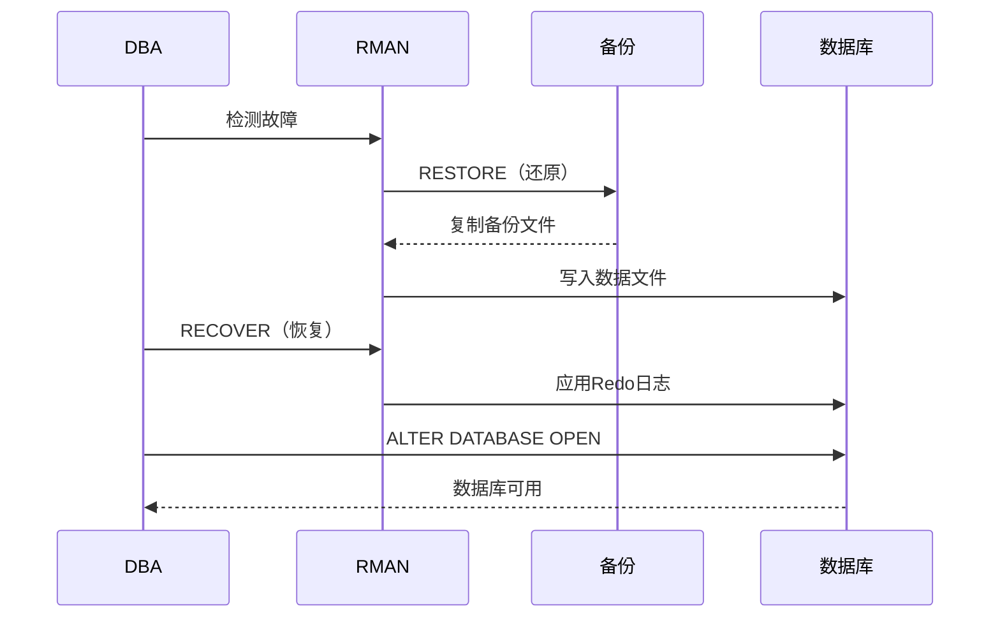
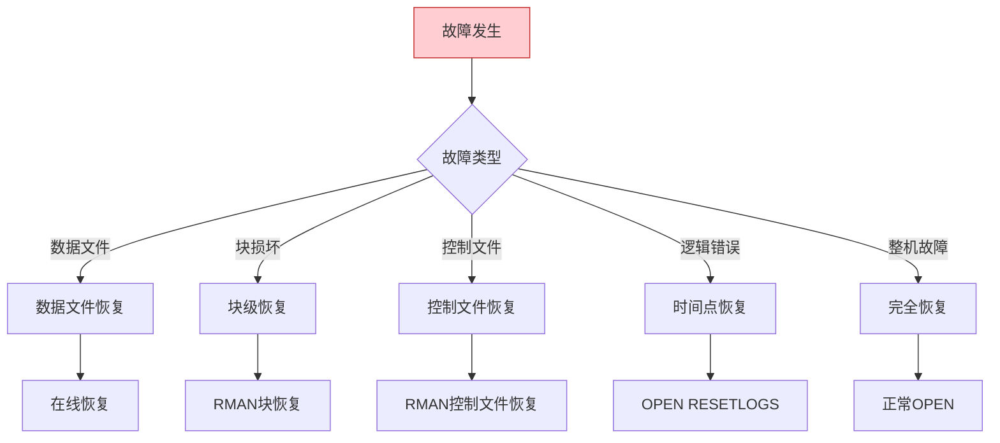

# Oracle恢复操作指南

## 一、概述

### 1.1 一句话定义

Oracle恢复操作是在数据丢失或损坏后，使用备份将数据库恢复到可用状态的过程，包括完全恢复和不完全恢复两种模式。
它在灾难恢复中出现和使用，解决数据丢失后的恢复问题。

### 1.2 为什么重要

- **不掌握的后果：** 数据永久丢失，业务长时间中断
- **掌握的价值：** 快速恢复数据，最小化业务影响

### 1.3 适用场景

| 场景 | 说明 |
|------|------|
| 介质故障 | 磁盘损坏 |
| 人为错误 | 误删除数据 |
| 灾难恢复 | 整机故障 |
| 数据损坏 | 块损坏修复 |

## 二、术语与概念

### 2.1 核心术语表

| 术语 | 含义 | 类比 |
|------|------|------|
| Complete Recovery | 完全恢复 | 恢复到最新 |
| Incomplete Recovery | 不完全恢复 | 恢复到时间点 |
| RESTORE | 还原 | 复制备份 |
| RECOVER | 恢复 | 应用日志 |
| RESETLOGS | 重置日志 | 重新开始 |

### 2.2 恢复类型对比

| 类型 | 说明 | 数据丢失 | OPEN方式 |
|------|------|---------|---------|
| 完全恢复 | 恢复到最新 | 无 | 正常OPEN |
| 不完全恢复 | 恢复到时间点 | 有 | OPEN RESETLOGS |

## 三、核心原理

### 3.1 完全恢复流程



```sql
-- 数据文件级完全恢复
-- 1. 离线数据文件
ALTER DATABASE DATAFILE 5 OFFLINE;

-- 2. RMAN还原和恢复
-- RMAN> RESTORE DATAFILE 5;
-- RMAN> RECOVER DATAFILE 5;

-- 3. 上线数据文件
ALTER DATABASE DATAFILE 5 ONLINE;

-- 表空间级恢复
ALTER TABLESPACE users OFFLINE IMMEDIATE;
-- RMAN> RESTORE TABLESPACE users;
-- RMAN> RECOVER TABLESPACE users;
ALTER TABLESPACE users ONLINE;

-- 数据库级恢复（需要MOUNT状态）
SHUTDOWN IMMEDIATE;
STARTUP MOUNT;
-- RMAN> RESTORE DATABASE;
-- RMAN> RECOVER DATABASE;
ALTER DATABASE OPEN;
```

### 3.2 不完全恢复

```sql
-- 基于时间的恢复
SHUTDOWN IMMEDIATE;
STARTUP MOUNT;
-- RMAN> SET UNTIL TIME "TO_DATE('2026-07-02 10:00:00','YYYY-MM-DD HH24:MI:SS')";
-- RMAN> RESTORE DATABASE;
-- RMAN> RECOVER DATABASE;
ALTER DATABASE OPEN RESETLOGS;

-- 基于SCN的恢复
-- RMAN> SET UNTIL SCN 12345678;
-- RMAN> RESTORE DATABASE;
-- RMAN> RECOVER DATABASE;
ALTER DATABASE OPEN RESETLOGS;

-- 基于日志序列的恢复
-- RMAN> SET UNTIL SEQUENCE 100 THREAD 1;
-- RMAN> RESTORE DATABASE;
-- RMAN> RECOVER DATABASE;
ALTER DATABASE OPEN RESETLOGS;
```

### 3.3 块级恢复

```sql
-- 检测块损坏
SELECT file#, block#, blocks, corruption_change#
FROM v$database_block_corruption;

-- RMAN块恢复
-- RMAN> BLOCKRECOVER DATAFILE 5 BLOCK 100, 200;

-- 自动块恢复
-- RMAN> RECOVER CORRUPTION LIST;
```

### 3.4 控制文件恢复

```sql
-- 从自动备份恢复控制文件
-- RMAN> STARTUP FORCE NOMOUNT;
-- RMAN> RESTORE CONTROLFILE FROM AUTOBACKUP;
-- RMAN> ALTER DATABASE MOUNT;
-- RMAN> RESTORE DATABASE;
-- RMAN> RECOVER DATABASE;
-- RMAN> ALTER DATABASE OPEN RESETLOGS;
```

### 3.5 恢复后处理

```sql
-- 1. 确认数据库状态
SELECT open_mode FROM v$database;

-- 2. 确认化身
SELECT incarnation#, status FROM v$database_incarnation;

-- 3. 重新备份（RESETLOGS后必须）
-- RMAN> BACKUP DATABASE PLUS ARCHIVELOG;

-- 4. 验证数据完整性
SELECT COUNT(*) FROM hr.employees;
```

## 四、架构与组件

### 4.1 恢复决策树



## 五、配置与调优

### 5.1 恢复优化

| 策略 | 说明 | 效果 |
|------|------|------|
| 并行恢复 | 多通道并行 | 加速恢复 |
| 增量备份 | 减少恢复量 | 减少恢复时间 |
| FRA | 集中管理 | 简化恢复 |

```sql
-- 配置并行恢复
ALTER SYSTEM SET recovery_parallelism = 4;
```

## 六、监控与诊断

### 6.1 恢复监控

```sql
-- 查看恢复进度
SELECT * FROM v$recovery_progress;

-- 查看恢复的文件
SELECT file#, status FROM v$datafile_header;

-- 查看需要的归档日志
SELECT * FROM v$recovery_log;
```

## 七、实战案例

### 7.1 案例：数据文件损坏恢复

```sql
-- 1. 检测故障
-- alert.log: ORA-01157: cannot identify data file 5

-- 2. 离线文件
ALTER DATABASE DATAFILE 5 OFFLINE;

-- 3. 恢复
-- RMAN> RESTORE DATAFILE 5;
-- RMAN> RECOVER DATAFILE 5;

-- 4. 上线
ALTER DATABASE DATAFILE 5 ONLINE;

-- 5. 验证
SELECT file#, status FROM v$datafile WHERE file# = 5;
```

## 八、常见错误与排查

| 错误 | 问题 | 解决方法 |
|------|------|---------|
| ORA-01157 | 无法锁定文件 | 检查文件存在性 |
| ORA-01113 | 需要恢复 | 执行RECOVER |
| ORA-00279 | 归档日志缺失 | 找到缺失日志 |
| ORA-01194 | 需要更多恢复 | 应用更多Redo |

## 九、最佳实践

### 9.1 官方推荐

- 定期测试恢复流程
- 保持完整的归档日志链
- 使用块级恢复最小化停机
- RESETLOGS后立即备份

### 9.2 反模式

| 反模式 | 问题 | 正确做法 |
|--------|------|---------|
| 不测试恢复 | 恢复流程未验证 | 定期演练 |
| 不保留归档日志 | 无法完全恢复 | 完整日志链 |
| RESETLOGS后不备份 | 新化身无备份 | 立即备份 |

## 十、命令与视图汇总

| 命令/视图 | 用途 |
|-----------|------|
| `RESTORE` | 还原备份 |
| `RECOVER` | 应用日志 |
| `ALTER DATABASE OPEN RESETLOGS` | 重置日志 |
| V$RECOVERY_PROGRESS | 恢复进度 |
| V$DATABASE_BLOCK_CORRUPTION | 块损坏 |

## 十一、总结速查

### 11.1 黄金法则

1. **定期演练** - 验证恢复流程
2. **完整日志链** - 保证可恢复
3. **块级恢复** - 最小化停机
4. **RESETLOGS后备份** - 新化身保护

## 附录

### A. 官方参考

- [Oracle Database Backup and Recovery User's Guide](https://docs.oracle.com/en/database/oracle/oracle-database/19c/backup/)

### B. 修订记录

| 日期 | 版本 | 修改内容 | 修改人 |
|------|------|---------|--------|
| 2026-07-02 | v1.0 | 初始版本 | YashanDB知识库生成器 |

## 七、高级恢复场景

### 7.1 表空间时间点恢复

```sql
-- 恢复单个表空间到时间点
RMAN> RUN {
    SQL 'ALTER TABLESPACE users OFFLINE IMMEDIATE';
    SET UNTIL TIME "SYSDATE - 1/24";  -- 1小时前
    RESTORE TABLESPACE users;
    RECOVER TABLESPACE users;
    SQL 'ALTER TABLESPACE users ONLINE';
}
```

### 7.2 归档日志恢复

```sql
-- 恢复特定范围的归档日志
RMAN> RESTORE ARCHIVELOG FROM SEQUENCE 100 UNTIL SEQUENCE 120;

-- 恢复到指定位置
RMAN> SET ARCHIVELOG DESTINATION TO '/tmp/arch_restore';
RMAN> RESTORE ARCHIVELOG FROM SEQUENCE 100;
```

### 7.3 数据文件恢复

```sql
-- 恢复丢失的数据文件（数据库运行中）
RMAN> RUN {
    SQL 'ALTER DATABASE DATAFILE 5 OFFLINE';
    RESTORE DATAFILE 5;
    RECOVER DATAFILE 5;
    SQL 'ALTER DATABASE DATAFILE 5 ONLINE';
}

-- 恢复到新位置
RMAN> RUN {
    SET NEWNAME FOR DATAFILE 5 TO '/u02/oradata/users01.dbf';
    RESTORE DATAFILE 5;
    RECOVER DATAFILE 5;
    SWITCH DATAFILE 5;
    SQL 'ALTER DATABASE DATAFILE 5 ONLINE';
}
```

## 八、恢复验证

```sql
-- 验证恢复可行性
RMAN> RESTORE VALIDATE DATABASE;

-- 检查块损坏
RMAN> BACKUP VALIDATE CHECK LOGICAL DATABASE;

-- 查看损坏记录
SELECT file#, block#, blocks, corruption_type
FROM v$database_block_corruption;

-- 恢复预览
RMAN> RESTORE DATABASE PREVIEW;
```

## 九、恢复后操作

```sql
-- 1. 验证数据完整性
SELECT COUNT(*) FROM critical_tables;

-- 2. 重建索引（如需要）
ALTER INDEX idx_name REBUILD ONLINE;

-- 3. 收集统计信息
EXEC DBMS_STATS.GATHER_DATABASE_STATS;

-- 4. 验证应用功能
-- 运行关键业务验证SQL

-- 5. 记录恢复操作
INSERT INTO recovery_log(action, time, status)
VALUES ('Database recovery', SYSDATE, 'SUCCESS');
```

## 十、常见错误

| 错误 | 原因 | 解决方案 |
|------|------|---------|
| ORA-01113 | 需要介质恢复 | RECOVER命令 |
| ORA-01194 | 需要更多恢复 | 应用更多归档 |
| ORA-01157 | 数据文件无法识别 | 检查文件路径 |
| ORA-01110 | 数据文件错误 | 检查文件状态 |

## 十一、总结速查

| 恢复类型 | 命令 | 场景 |
|---------|------|------|
| 完全恢复 | RESTORE + RECOVER | 数据文件丢失 |
| 时间点恢复 | SET UNTIL | 逻辑错误 |
| 块恢复 | BLOCKRECOVER | 块损坏 |
| 表空间恢复 | RESTORE TABLESPACE | 表空间损坏 |
| 归档恢复 | RESTORE ARCHIVELOG | 归档丢失 |
