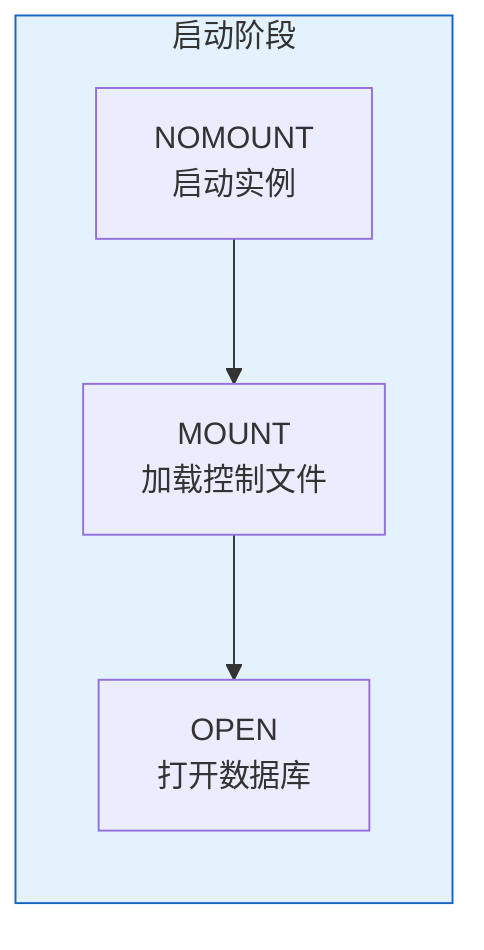

# Oracle启停与状态检查

## 一、概述

### 1.1 一句话定义

Oracle启停与状态检查是数据库日常运维的基础操作，包括数据库的正常启停、异常处理以及健康状态检查。
它在数据库日常运维中出现和使用，解决数据库如何安全启停以及如何判断运行状态的问题。

### 1.2 为什么重要

- **不掌握的后果：** 不当关闭导致数据损坏，异常状态无法诊断
- **掌握的价值：** 安全启停数据库，快速诊断运行问题

### 1.3 适用场景

| 场景 | 说明 |
|------|------|
| 计划维护 | 定期维护窗口 |
| 故障处理 | 异常状态诊断 |
| 健康检查 | 日常状态巡检 |
| 版本升级 | 升级前后操作 |

## 二、术语与概念

### 2.1 核心术语表

| 术语 | 含义 | 类比 |
|------|------|------|
| STARTUP | 启动 | 开机 |
| SHUTDOWN | 关闭 | 关机 |
| MOUNT | 挂载 | 加载配置 |
| OPEN | 打开 | 开始服务 |
| NOMOUNT | 未挂载 | 仅启动实例 |

### 2.2 启动阶段



## 三、核心原理

### 3.1 数据库启动

```sql
-- 正常启动（完整流程）
STARTUP;

-- 分阶段启动
STARTUP NOMOUNT;   -- 启动实例（读取参数文件）
ALTER DATABASE MOUNT;  -- 加载控制文件
ALTER DATABASE OPEN;   -- 打开数据库

-- 限制模式启动（仅DBA可连接）
STARTUP RESTRICT;

-- 强制启动（异常处理）
STARTUP FORCE;

-- 只读打开
ALTER DATABASE OPEN READ ONLY;

-- 升级模式
STARTUP UPGRADE;
```

### 3.2 数据库关闭

```sql
-- 正常关闭（推荐）
SHUTDOWN NORMAL;    -- 等待所有用户断开
SHUTDOWN IMMEDIATE; -- 立即关闭，不回滚
SHUTDOWN TRANSACTIONAL; -- 等待事务完成
SHUTDOWN ABORT;     -- 立即中止（异常）

-- 关闭后启动到MOUNT
SHUTDOWN IMMEDIATE;
STARTUP MOUNT;
```

### 3.3 状态检查

```sql
-- 实例状态
SELECT instance_name, status, database_status
FROM v$instance;

-- 数据库状态
SELECT name, open_mode, database_role, protection_mode
FROM v$database;

-- 会话状态
SELECT status, COUNT(*) FROM v$session GROUP BY status;

-- 等待事件
SELECT event, total_waits, time_waited/100 AS seconds
FROM v$system_event
WHERE wait_class != 'Idle'
ORDER BY time_waited DESC
FETCH FIRST 10 ROWS ONLY;

-- 表空间使用
SELECT tablespace_name, 
       ROUND(used_percent, 2) AS pct_used
FROM dba_tablespace_usage_metrics
WHERE used_percent > 80;

-- 告警日志
SELECT originating_timestamp, message_text
FROM v$diag_alert_ext
WHERE originating_timestamp > SYSTIMESTAMP - INTERVAL '1' HOUR
ORDER BY originating_timestamp DESC;
```

### 3.4 健康检查脚本

```sql
-- 综合健康检查
-- 1. 实例状态
SELECT 'Instance: ' || instance_name || ' - ' || status AS check_result
FROM v$instance;

-- 2. 数据库状态
SELECT 'Database: ' || name || ' - ' || open_mode AS check_result
FROM v$database;

-- 3. 表空间使用
SELECT 'Tablespace ' || tablespace_name || ': ' || 
       ROUND(used_percent, 2) || '% used' AS check_result
FROM dba_tablespace_usage_metrics
WHERE used_percent > 85;

-- 4. 无效对象
SELECT 'Invalid objects: ' || COUNT(*) AS check_result
FROM dba_objects WHERE status = 'INVALID';

-- 5. 失败的作业
SELECT 'Failed jobs (24h): ' || COUNT(*) AS check_result
FROM dba_scheduler_job_run_details
WHERE status = 'FAILED'
  AND log_date > SYSDATE - 1;

-- 6. 阻塞会话
SELECT 'Blocking sessions: ' || COUNT(DISTINCT sid) AS check_result
FROM v$session WHERE blocking_session IS NOT NULL;
```

## 四、架构与组件

### 4.1 关闭方式对比

| 方式 | 等待会话 | 等待事务 | 检查点 | 恢复需求 |
|------|---------|---------|--------|---------|
| NORMAL | 是 | 是 | 是 | 否 |
| TRANSACTIONAL | 否 | 是 | 是 | 否 |
| IMMEDIATE | 否 | 否 | 是 | 否 |
| ABORT | 否 | 否 | 否 | 是 |

## 五、配置与调优

### 5.1 自动启动配置

```bash
# /etc/oratab配置
orcl:/u01/app/oracle/product/19.0.0/dbhome_1:Y

# dbstart/dbshut脚本
$ORACLE_HOME/bin/dbstart $ORACLE_HOME
$ORACLE_HOME/bin/dbshut $ORACLE_HOME

# systemd服务（Linux）
# /etc/systemd/system/oracle.service
[Unit]
Description=Oracle Database
After=network.target

[Service]
Type=forking
User=oracle
ExecStart=/u01/app/oracle/product/19.0.0/dbhome_1/bin/dbstart /u01/app/oracle/product/19.0.0/dbhome_1
ExecStop=/u01/app/oracle/product/19.0.0/dbhome_1/bin/dbshut /u01/app/oracle/product/19.0.0/dbhome_1

[Install]
WantedBy=multi-user.target
```

## 六、监控与诊断

### 6.1 启动问题诊断

```sql
-- 查看启动参数
SHOW PARAMETER spfile;
SHOW PARAMETER pfile;

-- 查看控制文件
SELECT name FROM v$controlfile;

-- 查看数据文件
SELECT name, status FROM v$datafile;

-- 查看Redo日志
SELECT group#, status, bytes/1024/1024 AS mb FROM v$log;
```

## 七、实战案例

### 7.1 案例：数据库无法正常关闭

```sql
-- 问题：SHUTDOWN IMMEDIATE长时间挂起
-- 诊断：
SELECT sid, serial#, username, status, event
FROM v$session
WHERE type = 'USER' AND status = 'ACTIVE';

-- 解决：找出阻塞会话并终止
ALTER SYSTEM KILL SESSION 'sid,serial#' IMMEDIATE;

-- 或强制关闭
SHUTDOWN ABORT;
STARTUP;
```

## 八、常见错误与排查

| 错误 | 问题 | 解决方法 |
|------|------|---------|
| ORA-01034 | Oracle不可用 | 检查实例状态 |
| ORA-01078 | 参数文件问题 | 检查spfile/pfile |
| ORA-01157 | 数据文件问题 | 检查文件状态 |
| ORA-00600 | 内部错误 | 查看告警日志 |

## 九、最佳实践

### 9.1 官方推荐

- 优先使用SHUTDOWN IMMEDIATE
- 避免使用SHUTDOWN ABORT
- 定期检查数据库状态
- 配置自动启动

## 十、命令与视图汇总

| 命令/视图 | 用途 |
|-----------|------|
| `STARTUP` | 启动数据库 |
| `SHUTDOWN` | 关闭数据库 |
| V$INSTANCE | 实例状态 |
| V$DATABASE | 数据库状态 |
| V$SESSION | 会话信息 |

## 十一、总结速查

### 11.1 黄金法则

1. **正常关闭** - 优先IMMEDIATE
2. **避免ABORT** - 需要恢复
3. **健康检查** - 每日巡检
4. **自动启动** - 减少人工干预

## 附录

### A. 官方参考

- [Oracle Database Administrator's Guide - Starting Up and Shut Down](https://docs.oracle.com/en/database/oracle/oracle-database/19c/admin/)

### B. 修订记录

| 日期 | 版本 | 修改内容 | 修改人 |
|------|------|---------|--------|
| 2026-07-02 | v1.0 | 初始版本 | YashanDB知识库生成器 |

## 七、高级启停操作

### 7.1 受限模式启动

```sql
-- 受限模式启动（仅允许RESTRICTED SESSION权限用户）
STARTUP RESTRICT;

-- 检查是否受限模式
SELECT logins FROM v$instance;
-- RESTRICTED = 受限模式

-- 退出受限模式
ALTER SYSTEM DISABLE RESTRICTED SESSION;

-- 维护模式（挂起数据库）
ALTER SYSTEM SUSPEND;  -- 暂停I/O
ALTER SYSTEM RESUME;   -- 恢复I/O
```

### 7.2  FORCE启动

```sql
-- 当正常启动失败时使用FORCE
STARTUP FORCE;  -- 等价于SHUTDOWN ABORT + STARTUP

-- 强制MOUNT（不打开）
STARTUP FORCE MOUNT;

-- PFILE启动（SPFILE损坏时）
STARTUP PFILE='/u01/oradata/initORCL.ora';
```

### 7.3 优雅关闭策略

```sql
-- NORMAL: 等待所有用户断开（最安全）
SHUTDOWN NORMAL;

-- TRANSACTIONAL: 等待当前事务完成后断开
SHUTDOWN TRANSACTIONAL;

-- IMMEDIATE: 立即终止SQL，回滚未提交事务
SHUTDOWN IMMEDIATE;

-- ABORT: 立即终止，不回滚（最后手段）
SHUTDOWN ABORT;
-- 下次启动需要实例恢复
```

## 八、状态检查脚本

### 8.1 综合健康检查

```sql
-- 1. 实例状态
SELECT instance_name, status, database_status,
       TO_CHAR(startup_time, 'YYYY-MM-DD HH24:MI:SS') AS startup_time
FROM v$instance;

-- 2. 数据库状态
SELECT name, open_mode, protection_mode, database_role FROM v$database;

-- 3. 会话统计
SELECT status, type, COUNT(*) AS cnt
FROM v$session GROUP BY status, type;

-- 4. 表空间使用
SELECT tablespace_name, ROUND(used_percent, 2) AS used_pct
FROM dba_tablespace_usage_metrics
WHERE used_percent > 80 ORDER BY used_percent DESC;

-- 5. 无效对象
SELECT owner, object_type, COUNT(*) AS cnt
FROM dba_objects WHERE status = 'INVALID'
GROUP BY owner, object_type;

-- 6. 失败作业
SELECT owner, job_name, state, failure_count
FROM dba_scheduler_jobs WHERE state = 'BROKEN';

-- 7. 告警日志最近错误
-- 检查 alert log 中的 ORA- 错误

-- 8. 数据文件状态
SELECT file_name, status, online_status
FROM dba_data_files f
JOIN dba_tablespaces t ON f.tablespace_name = t.tablespace_name
WHERE t.status != 'ONLINE';
```

## 九、常见错误与排查

| 错误 | 原因 | 解决方案 |
|------|------|---------|
| ORA-01034 | Oracle不可用 | 检查实例状态 |
| ORA-01109 | 数据库未打开 | ALTER DATABASE OPEN |
| ORA-00600 | 内部错误 | 查看trace文件 |
| ORA-01536 | 空间配额不足 | 增加配额 |
| ORA-01555 | 快照过旧 | 增大undo表空间 |

## 十、最佳实践

- 正常关闭使用SHUTDOWN IMMEDIATE
- 维护时使用RESTRICT模式
- 定期检查告警日志
- 建立标准启停SOP
- 关闭前检查活跃会话和事务

## 十一、总结速查

| 命令 | 用途 | 影响 |
|------|------|------|
| STARTUP | 启动 | 打开数据库 |
| STARTUP MOUNT | 挂载 | 不打开 |
| STARTUP RESTRICT | 受限启动 | 仅DBA |
| SHUTDOWN NORMAL | 正常关闭 | 等待用户 |
| SHUTDOWN IMMEDIATE | 立即关闭 | 终止SQL |
| SHUTDOWN ABORT | 强制关闭 | 不回滚 |
