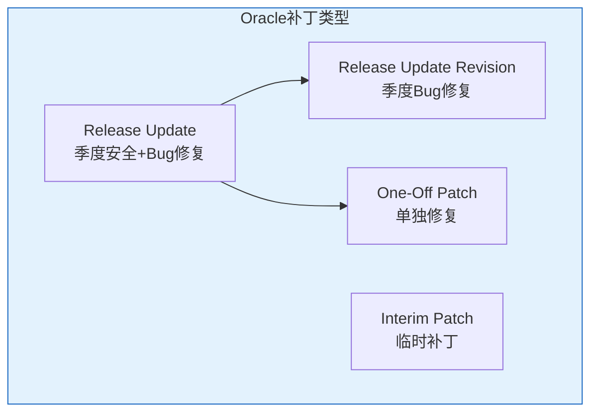
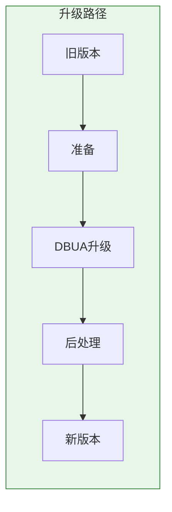
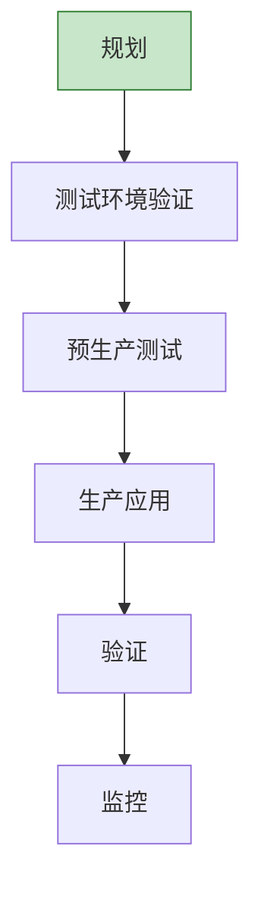
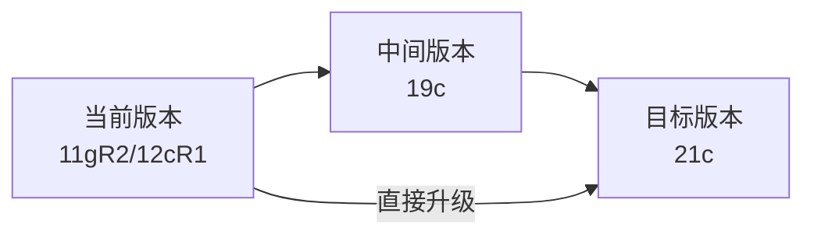

# Oracle补丁与升级

## 一、概述

### 1.1 一句话定义

Oracle补丁与升级是通过OPatch工具应用安全补丁和版本升级，保持数据库安全性和稳定性的运维操作。
它在数据库生命周期管理中出现和使用，解决安全漏洞修复和功能升级的问题。

### 1.2 为什么重要

- **不掌握的后果：** 安全漏洞暴露，错过重要功能更新
- **掌握的价值：** 保障数据库安全，获取最新功能

### 1.3 适用场景

| 场景 | 说明 |
|------|------|
| 安全修复 | 修复CVE漏洞 |
| Bug修复 | 解决已知问题 |
| 版本升级 | 跨版本升级 |
| 季度更新 | 应用Release Update |

### 1.4 版本演进

| 版本 | 变化说明 |
|------|---------|
| 11gR2 | PSU（Patch Set Update） |
| 12cR1 | RU（Release Update）引入 |
| 12cR2 | RUR（Release Update Revision） |
| 19c | 长期支持版本，季度RU |
| 21c | 创新版本，短期支持 |

## 二、术语与概念

### 2.1 核心术语表

| 术语 | 含义 | 类比 |
|------|------|------|
| OPatch | 补丁工具 | 补丁管理器 |
| RU | Release Update | 季度更新 |
| RUR | Release Update Revision | 修订更新 |
| One-Off | 单独补丁 | 紧急修复 |
| DBUA | 数据库升级助手 | 升级向导 |
| Data Pump | 数据泵 | 迁移工具 |

### 2.2 补丁类型



## 三、核心原理

### 3.1 OPatch使用

```bash
# 查看OPatch版本
$ORACLE_HOME/OPatch/opatch version

# 查看已安装补丁
$ORACLE_HOME/OPatch/opatch lspatches

# 查看补丁详情
$ORACLE_HOME/OPatch/opatch lsinventory

# 检查补丁冲突
$ORACLE_HOME/OPatch/opatch prereq CheckConflictAgainstOHWithDetail -ph ./<patch_id>

# 应用补丁
cd <patch_id>
$ORACLE_HOME/OPatch/opatch apply

# 回滚补丁
cd <patch_id>
$ORACLE_HOME/OPatch/opatch rollback -id <patch_id>

# 更新OPatch本身
unzip p6880880_190000_Linux-x86-64.zip -d $ORACLE_HOME/
```

### 3.2 Release Update应用

```bash
# 1. 下载最新RU
# 从My Oracle Support下载

# 2. 解压RU
unzip p35742441_190000_Linux-x86-64.zip
cd 35742441

# 3. 检查冲突
$ORACLE_HOME/OPatch/opatch prereq CheckConflictAgainstOHWithDetail -ph .

# 4. 关闭数据库
sqlplus / as sysdba
SHUTDOWN IMMEDIATE;

# 5. 应用RU
$ORACLE_HOME/OPatch/opatch apply

# 6. 启动数据库并应用SQL变更
STARTUP;
cd $ORACLE_HOME/rdbms/admin
$ORACLE_HOME/perl/bin/perl catcon.pl -n 1 -l /tmp -b catbundle catbundle.sql

# 或datapatch
$ORACLE_HOME/OPatch/datapatch -verbose

# 7. 验证
$ORACLE_HOME/OPatch/opatch lspatches
sqlplus / as sysdba
SELECT patch_id, status FROM dba_registry_sqlpatch;
```

### 3.3 版本升级



```bash
# 使用DBUA升级（图形界面）
$ORACLE_HOME/bin/dbua

# 使用DBCA静默升级
dbua -silent -upgrade -sid orcl

# 手动升级步骤
# 1. 安装新版本软件（不创建数据库）
# 2. 关闭旧版本数据库
# 3. 设置环境变量指向新版本
# 4. 启动到UPGRADE模式
STARTUP UPGRADE;
# 5. 运行升级脚本
cd $ORACLE_HOME/rdbms/admin
$ORACLE_HOME/perl/bin/perl catcon.pl -n 1 -l /tmp -b preupgrade preupgrd.sql
# 6. 运行升级脚本
@?/rdbms/admin/catupgrd.sql
# 7. 编译无效对象
@?/rdbms/admin/utlrp.sql
# 8. 正常启动
SHUTDOWN IMMEDIATE;
STARTUP;
```

### 3.4 Data Pump迁移升级

```bash
# 跨版本迁移
# 1. 源库导出
expdp system/pass directory=dpump_dir dumpfile=upgrade_%U.dmp full=y

# 2. 传输到新环境
scp dumpfile new_server:/backup/

# 3. 目标库导入
impdp system/pass directory=dpump_dir dumpfile=upgrade_%U.dmp full=y
```

## 四、架构与组件

### 4.1 补丁管理流程



## 五、配置与调优

### 5.1 补丁策略

| 策略 | 说明 | 频率 |
|------|------|------|
| 季度RU | 安全+Bug修复 | 每季度 |
| 紧急补丁 | 安全漏洞 | 即时 |
| 版本升级 | 大版本更新 | 1-3年 |

## 六、监控与诊断

### 6.1 补丁状态检查

```sql
-- 查看已安装补丁
SELECT patch_id, patch_uid, version, action, status,
       TO_CHAR(action_time, 'YYYY-MM-DD HH24:MI:SS') AS apply_time
FROM dba_registry_sqlpatch
ORDER BY action_time DESC;

-- 查看组件版本
SELECT comp_name, version, status
FROM dba_registry;
```

## 七、实战案例

### 7.1 案例：19c季度RU应用

```bash
# 1. 下载RU补丁
# p35742441_190000_Linux-x86-64.zip

# 2. 测试环境验证
# 3. 生产环境应用
SHUTDOWN IMMEDIATE;
$ORACLE_HOME/OPatch/opatch apply
STARTUP;
$ORACLE_HOME/OPatch/datapatch -verbose

# 4. 验证
$ORACLE_HOME/OPatch/opatch lspatches
SELECT patch_id, status FROM dba_registry_sqlpatch;
```

## 八、常见错误与排查

| 错误 | 问题 | 解决方法 |
|------|------|---------|
| OPatch-xxx | 补丁冲突 | 检查冲突 |
| ORA-32004 | 参数废弃 | 更新参数 |
| Datapatch失败 | SQL变更失败 | 查看日志 |

## 九、最佳实践

### 9.1 官方推荐

- 每季度应用RU
- 测试环境先验证
- 备份后再打补丁
- 关注安全公告

### 9.2 反模式

| 反模式 | 问题 | 正确做法 |
|--------|------|---------|
| 不打补丁 | 安全漏洞 | 季度RU |
| 直接生产打补丁 | 风险高 | 测试验证 |
| 不备份 | 回滚困难 | 先备份 |

## 十、命令与视图汇总

| 命令/视图 | 用途 |
|-----------|------|
| `opatch apply` | 应用补丁 |
| `opatch rollback` | 回滚补丁 |
| `datapatch` | 应用SQL变更 |
| DBA_REGISTRY_SQLPATCH | 补丁状态 |
| DBA_REGISTRY | 组件版本 |

## 十一、总结速查

### 11.1 黄金法则

1. **季度更新** - 保持安全
2. **测试先行** - 验证补丁
3. **备份保护** - 可回滚
4. **监控验证** - 确认生效

## 附录

### A. 官方参考

- [Oracle Database Release Notes](https://docs.oracle.com/en/database/oracle/oracle-database/19c/reln/)
- [OPatch User's Guide](https://docs.oracle.com/en/database/oracle/oracle-database/19c/opatch/)

### B. 修订记录

| 日期 | 版本 | 修改内容 | 修改人 |
|------|------|---------|--------|
| 2026-07-02 | v1.0 | 初始版本 | YashanDB知识库生成器 |

## 七、补丁管理

### 7.1 OPatch工具

```bash
# 查看已安装补丁
$ORACLE_HOME/OPatch/opatch lspatches

# 查看OPatch版本
$ORACLE_HOME/OPatch/opatch version

# 应用补丁（先停止数据库）
$ORACLE_HOME/OPatch/opatch apply /path/to/patch

# 回滚补丁
$ORACLE_HOME/OPatch/opatch rollback -id <patch_id>

# 检查冲突
$ORACLE_HOME/OPatch/opatch prereq CheckConflictAgainstOHWithDetail -ph /path/to/patch

# 查看补丁详细信息
$ORACLE_HOME/OPatch/opatch query /path/to/patch
```

### 7.2 补丁类型

| 类型 | 说明 | 频率 |
|------|------|------|
| RU (Release Update) | 季度更新 | 每季度 |
| RUR (Release Update Revision) | 修订更新 | 每月 |
| PSU (Patch Set Update) | 补丁集更新 | 旧版 |
| BP (Bundle Patch) | 捆绑补丁 | Windows |
| One-off | 单个修复 | 按需 |

## 八、升级策略

### 8.1 升级路径



### 8.2 DBUA升级

```
DBUA（Database Upgrade Assistant）步骤：
1. 运行预升级检查
   @$ORACLE_HOME/rdbms/admin/preupgrd.sql

2. 启动DBUA
   $ORACLE_HOME/bin/dbua

3. 选择升级类型
   - 升级现有数据库
   - 移动数据库到新位置

4. 选择目标版本和选项

5. 执行升级

6. 运行后升级脚本
   @$ORACLE_HOME/rdbms/admin/postupgrade.sql
```

### 8.3 手动升级

```sql
-- 1. 关闭旧版本数据库
SHUTDOWN IMMEDIATE;

-- 2. 设置环境变量到新ORACLE_HOME
export ORACLE_HOME=/u01/app/oracle/product/21c
export PATH=$ORACLE_HOME/bin:$PATH

-- 3. 启动到UPGRADE模式
STARTUP UPGRADE;

-- 4. 执行升级脚本
@$ORACLE_HOME/rdbms/admin/catupgrd.sql

-- 5. 重启到正常模式
SHUTDOWN IMMEDIATE;
STARTUP;

-- 6. 运行后升级脚本
@$ORACLE_HOME/rdbms/admin/catuppst.sql
@$ORACLE_HOME/rdbms/admin/utlrp.sql
```

## 九、升级前检查清单

```
□ 运行预升级检查脚本
□ 备份数据库（RMAN全备）
□ 记录当前参数
□ 检查废弃参数
□ 检查无效对象
□ 收集数据字典统计
□ 确保足够空间（SYSAUX/SYSTEM）
□ 检查时区文件版本
□ 准备回滚计划
□ 通知相关团队
```

## 十、常见错误

| 错误 | 原因 | 解决方案 |
|------|------|---------|
| OPatch失败 | 权限不足 | 使用oracle用户 |
| 升级失败 | 空间不足 | 扩展表空间 |
| 参数不兼容 | 废弃参数 | 移除旧参数 |
| 时区不匹配 | 时区文件旧 | 更新时区文件 |

## 十一、总结速查

| 操作 | 工具 | 说明 |
|------|------|------|
| 补丁查看 | opatch lspatches | 已安装补丁 |
| 补丁应用 | opatch apply | 安装补丁 |
| 补丁回滚 | opatch rollback | 撤销补丁 |
| 升级辅助 | DBUA | 图形升级 |
| 手动升级 | catupgrd.sql | 脚本升级 |
