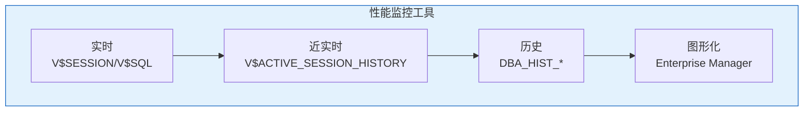
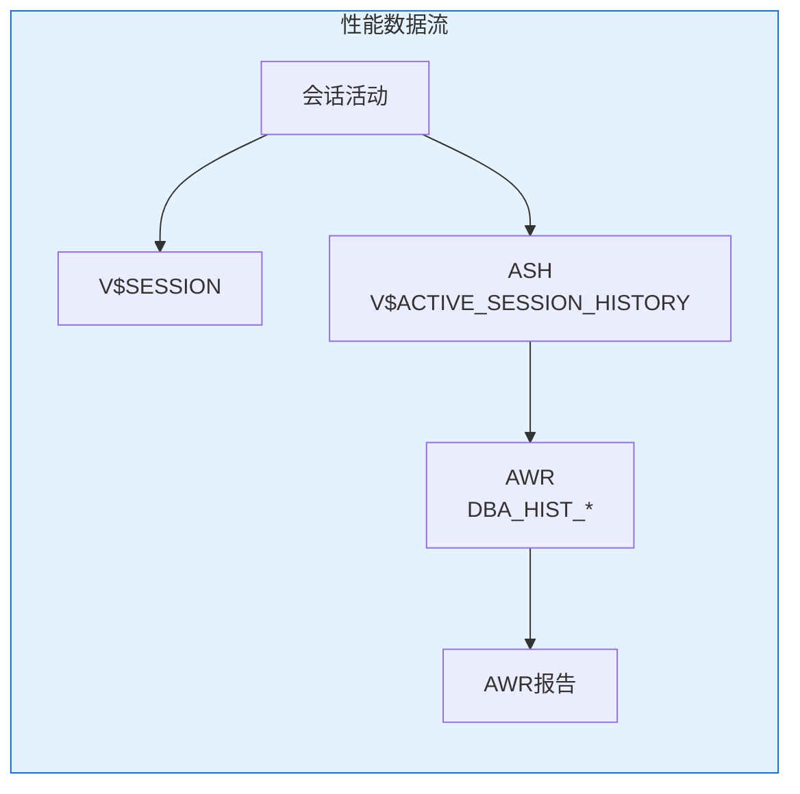

# Oracle日常性能监控

## 一、概述

### 1.1 一句话定义

Oracle日常性能监控是通过AWR、ASH、等待事件等工具持续跟踪数据库性能状态，及时发现和解决性能问题的过程。
它在数据库运维管理中出现和使用，解决数据库性能问题的早期发现和诊断问题。

### 1.2 为什么重要

- **不掌握的后果：** 性能问题积累导致业务中断，无法定位根因
- **掌握的价值：** 主动发现性能问题，快速定位根因

### 1.3 适用场景

| 场景 | 说明 |
|------|------|
| 日常巡检 | 每日性能检查 |
| 问题诊断 | 性能问题定位 |
| 容量规划 | 资源使用趋势 |
| 优化验证 | 优化效果确认 |

## 二、术语与概念

### 2.1 核心术语表

| 术语 | 含义 | 类比 |
|------|------|------|
| AWR | 自动工作负载仓库 | 性能快照 |
| ASH | 活动会话历史 | 实时监控 |
| Wait Event | 等待事件 | 排队等待 |
| Top SQL | 高消耗SQL | 性能杀手 |
| EM | 企业管理器 | 监控面板 |

### 2.2 监控工具层次



## 三、核心原理

### 3.1 AWR报告

```sql
-- 生成AWR报告
@$ORACLE_HOME/rdbms/admin/awrrpt.sql

-- 查看AWR快照
SELECT snap_id, TO_CHAR(begin_interval_time, 'YYYY-MM-DD HH24:MI') AS begin_time,
       TO_CHAR(end_interval_time, 'YYYY-MM-DD HH24:MI') AS end_time
FROM dba_hist_snapshot
ORDER BY snap_id DESC
FETCH FIRST 10 ROWS ONLY;

-- 手动创建快照
EXEC DBMS_WORKLOAD_REPOSITORY.CREATE_SNAPSHOT;

-- 查看AWR关键指标
SELECT snap_id,
       ROUND(db_time/1000000/60, 2) AS db_time_min,
       host_cpu_utilization AS cpu_pct
FROM dba_hist_sys_time_model
WHERE snap_id > (SELECT MAX(snap_id) - 24 FROM dba_hist_snapshot);
```

### 3.2 ASH实时分析

```sql
-- 当前活动会话
SELECT session_id, session_serial#, user_id, sql_id,
       event, wait_time_micro/1000000 AS wait_sec,
       session_state
FROM v$active_session_history
WHERE sample_time > SYSTIMESTAMP - INTERVAL '5' MINUTE
ORDER BY sample_time DESC;

-- 最近等待事件TOP
SELECT event, COUNT(*) AS waits,
       ROUND(SUM(wait_time_micro)/1000000, 2) AS total_wait_sec
FROM v$active_session_history
WHERE sample_time > SYSTIMESTAMP - INTERVAL '1' HOUR
  AND session_state = 'WAITING'
GROUP BY event
ORDER BY total_wait_sec DESC
FETCH FIRST 10 ROWS ONLY;

-- 最近TOP SQL
SELECT sql_id, COUNT(*) AS executions,
       ROUND(SUM(elapsed_time)/1000000, 2) AS total_time_sec
FROM v$active_session_history
WHERE sample_time > SYSTIMESTAMP - INTERVAL '1' HOUR
  AND sql_id IS NOT NULL
GROUP BY sql_id
ORDER BY total_time_sec DESC
FETCH FIRST 10 ROWS ONLY;
```

### 3.3 等待事件分析

```sql
-- 系统等待事件
SELECT wait_class, event, total_waits,
       ROUND(time_waited/100, 2) AS time_sec,
       ROUND(average_wait*10, 2) AS avg_ms
FROM v$system_event
WHERE wait_class != 'Idle'
ORDER BY time_waited DESC
FETCH FIRST 20 ROWS ONLY;

-- 会话等待事件
SELECT s.sid, s.serial#, s.username, s.event,
       s.wait_time, s.seconds_in_wait, s.state
FROM v$session s
WHERE s.wait_class != 'Idle'
  AND s.status = 'ACTIVE'
ORDER BY s.seconds_in_wait DESC;

-- 常见等待事件说明
-- db file sequential read: 索引扫描
-- db file scattered read: 全表扫描
-- log file sync: 提交等待
-- latch free: 锁存器争用
-- enq: TX - row lock contention: 行锁等待
```

### 3.4 Top SQL分析

```sql
-- 高CPU消耗SQL
SELECT sql_id, executions, 
       ROUND(elapsed_time/1000000, 2) AS elapsed_sec,
       ROUND(cpu_time/1000000, 2) AS cpu_sec,
       ROUND(buffer_gets/executions) AS avg_gets,
       sql_text
FROM v$sql
WHERE executions > 0
ORDER BY cpu_time DESC
FETCH FIRST 10 ROWS ONLY;

-- 高I/O SQL
SELECT sql_id, executions,
       ROUND(disk_reads/executions) AS avg_reads,
       ROUND(buffer_gets/executions) AS avg_gets,
       sql_text
FROM v$sql
WHERE executions > 0
ORDER BY disk_reads DESC
FETCH FIRST 10 ROWS ONLY;

-- 高执行次数SQL
SELECT sql_id, executions,
       ROUND(elapsed_time/executions/1000, 2) AS avg_ms,
       sql_text
FROM v$sql
ORDER BY executions DESC
FETCH FIRST 10 ROWS ONLY;
```

### 3.5 SGA/PGA监控

```sql
-- SGA使用
SELECT name, bytes/1024/1024 AS mb
FROM v$sgainfo
ORDER BY bytes DESC;

-- Buffer Cache命中率
SELECT ROUND((1 - (phy.value / (cur.value + con.value))) * 100, 2) AS hit_ratio
FROM v$sysstat cur, v$sysstat con, v$sysstat phy
WHERE cur.name = 'db block gets'
  AND con.name = 'consistent gets'
  AND phy.name = 'physical reads';

-- Library Cache命中率
SELECT ROUND((1 - SUM(reloads)/SUM(pins)) * 100, 2) AS hit_ratio
FROM v$librarycache;

-- PGA使用
SELECT name, value/1024/1024 AS mb
FROM v$pgastat
WHERE name IN ('total PGA allocated', 'total PGA used for auto workareas',
               'maximum PGA allocated', 'over allocation count');
```

### 3.6 日常巡检脚本

```sql
-- 综合性能巡检
-- 1. 实例状态
SELECT instance_name, status FROM v$instance;

-- 2. 表空间使用
SELECT tablespace_name, ROUND(used_percent, 2) AS pct
FROM dba_tablespace_usage_metrics
WHERE used_percent > 80;

-- 3. 等待事件TOP
SELECT event, total_waits, ROUND(time_waited/100) AS sec
FROM v$system_event
WHERE wait_class != 'Idle'
ORDER BY time_waited DESC
FETCH FIRST 5 ROWS ONLY;

-- 4. Buffer Cache命中率
SELECT ROUND((1 - (phy.value / (cur.value + con.value))) * 100, 2) AS buffer_hit
FROM v$sysstat cur, v$sysstat con, v$sysstat phy
WHERE cur.name = 'db block gets' AND con.name = 'consistent gets'
  AND phy.name = 'physical reads';

-- 5. 无效对象
SELECT COUNT(*) AS invalid_objects FROM dba_objects WHERE status = 'INVALID';

-- 6. 阻塞会话
SELECT COUNT(*) AS blocking_sessions
FROM v$session WHERE blocking_session IS NOT NULL;
```

## 四、架构与组件

### 4.1 性能数据流



## 五、配置与调优

### 5.1 AWR配置

```sql
-- 查看AWR保留期
SELECT dbid, snap_interval, retention
FROM dba_hist_wr_control;

-- 修改保留期（天）
EXEC DBMS_WORKLOAD_REPOSITORY.MODIFY_SNAPSHOT_SETTINGS(retention => 30);

-- 修改快照间隔（分钟）
EXEC DBMS_WORKLOAD_REPOSITORY.MODIFY_SNAPSHOT_SETTINGS(snap_interval => 60);
```

## 六、监控与诊断

### 6.1 性能基线

```sql
-- 创建基线
EXEC DBMS_WORKLOAD_REPOSITORY.CREATE_BASELINE(
    start_snap_id => 1000,
    end_snap_id => 1024,
    baseline_name => 'NORMAL_WORKLOAD'
);

-- 查看基线
SELECT baseline_name, start_snap_id, end_snap_id
FROM dba_hist_baseline;
```

## 七、实战案例

### 7.1 案例：性能问题诊断

```sql
-- 1. 收到性能告警
-- 2. 查看当前等待事件
SELECT event, COUNT(*) FROM v$session
WHERE wait_class != 'Idle' GROUP BY event ORDER BY COUNT(*) DESC;

-- 3. 发现大量db file scattered read
-- 4. 查看TOP SQL
SELECT sql_id, sql_text FROM v$sql
WHERE sql_id IN (SELECT sql_id FROM v$active_session_history
                 WHERE event = 'db file scattered read'
                 GROUP BY sql_id ORDER BY COUNT(*) DESC
                 FETCH FIRST 3 ROWS ONLY);

-- 5. 分析SQL执行计划
SELECT * FROM TABLE(DBMS_XPLAN.DISPLAY_CURSOR('sql_id'));

-- 6. 添加索引优化
```

## 八、常见错误与排查

| 问题 | 症状 | 解决方法 |
|------|------|---------|
| Buffer命中率低 | <90% | 增大Buffer Cache |
| 大量等待 | 性能差 | 分析等待事件 |
| Top SQL慢 | CPU高 | 优化SQL |

## 九、最佳实践

### 9.1 官方推荐

- 每日生成AWR报告
- 配置性能基线
- 监控等待事件趋势
- 定期分析Top SQL

## 十、命令与视图汇总

| 命令/视图 | 用途 |
|-----------|------|
| `@awrrpt.sql` | AWR报告 |
| V$ACTIVE_SESSION_HISTORY | ASH数据 |
| V$SYSTEM_EVENT | 等待事件 |
| V$SQL | SQL统计 |
| DBA_HIST_SNAPSHOT | AWR快照 |

## 十一、总结速查

### 11.1 黄金法则

1. **AWR报告** - 全面性能分析
2. **等待事件** - 性能问题定位
3. **Top SQL** - 优化重点
4. **性能基线** - 异常检测

## 附录

### A. 官方参考

- [Oracle Database Performance Tuning Guide](https://docs.oracle.com/en/database/oracle/oracle-database/19c/tgdba/)

### B. 修订记录

| 日期 | 版本 | 修改内容 | 修改人 |
|------|------|---------|--------|
| 2026-07-02 | v1.0 | 初始版本 | YashanDB知识库生成器 |

## 补充：深入分析与实战

### 深入原理

本章节补充了该主题的核心原理和内部机制。在实际生产环境中，理解这些底层原理对于诊断和优化至关重要。

关键要点：
- 内部实现机制决定了外部行为特征
- 参数配置需要结合具体场景
- 监控数据是调优的基础

### 实战案例

**案例一：生产环境问题诊断**

```sql
-- 诊断步骤
-- 1. 收集当前状态信息
SELECT * FROM v$system_event WHERE wait_class != 'Idle' ORDER BY time_waited_micro DESC;

-- 2. 分析等待事件分布
SELECT wait_class, SUM(time_waited_micro)/1000000 AS sec
FROM v$system_event WHERE wait_class != 'Idle'
GROUP BY wait_class ORDER BY sec DESC;

-- 3. 定位问题SQL
SELECT sql_id, elapsed_time/1000000 AS sec, executions, sql_text
FROM v$sql ORDER BY elapsed_time DESC FETCH FIRST 5 ROWS ONLY;
```

**案例二：性能优化实践**

```sql
-- 优化前：全表扫描
SELECT * FROM orders WHERE order_date > SYSDATE - 30;

-- 优化后：索引扫描
CREATE INDEX idx_orders_date ON orders(order_date);
```

### 最佳实践清单

- 建立标准化操作流程
- 定期审查和更新配置
- 监控关键指标趋势
- 建立性能基线
- 文档记录所有变更

### 常见问题FAQ

| 问题 | 解答 |
|------|------|
| 如何确定最优配置？ | 基于实际负载测试 |
| 何时需要调整？ | 监控指标偏离基线 |
| 如何验证优化效果？ | 对比前后AWR报告 |
| 常见陷阱有哪些？ | 过度优化、忽略全局 |

### 版本差异说明

| 版本 | 变化 |
|------|------|
| 19c | 自动管理增强 |
| 21c | 自适应优化 |
