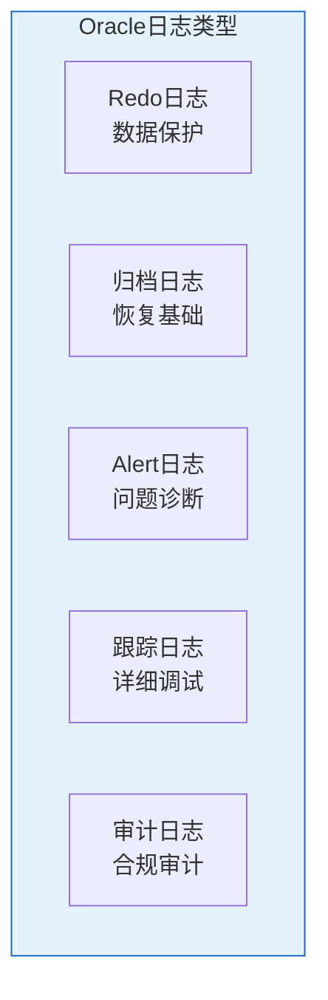
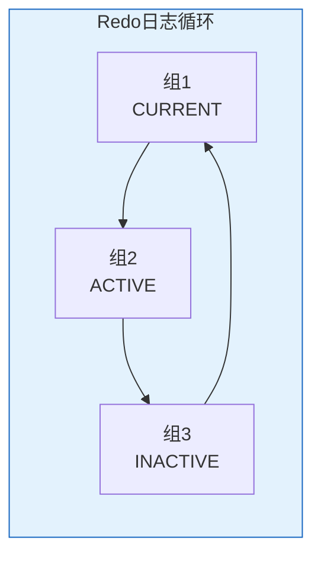

# Oracle日志管理

## 一、概述

### 1.1 一句话定义

Oracle日志管理是对数据库各类日志文件（Redo日志、归档日志、Alert日志、审计日志、跟踪日志）的配置、监控和维护。
它在数据库日常运维中出现和使用，解决数据保护、问题诊断和合规审计的问题。

### 1.2 为什么重要

- **不掌握的后果：** Redo日志配置不当影响性能，Alert日志过大难以诊断
- **掌握的价值：** 保障数据安全，快速诊断问题，满足合规要求

### 1.3 适用场景

| 场景 | 说明 |
|------|------|
| Redo管理 | 日志组配置和优化 |
| 归档管理 | 归档日志空间管理 |
| Alert日志 | 问题诊断 |
| 审计日志 | 合规审计 |

## 二、术语与概念

### 2.1 核心术语表

| 术语 | 含义 | 类比 |
|------|------|------|
| Redo Log | 重做日志 | 变更流水 |
| Archive Log | 归档日志 | 历史流水 |
| Alert Log | 告警日志 | 系统日记 |
| Trace File | 跟踪文件 | 调试记录 |
| Audit Trail | 审计跟踪 | 操作记录 |

### 2.2 日志类型



## 三、核心原理

### 3.1 Redo日志管理

```sql
-- 查看Redo日志组
SELECT group#, sequence#, bytes/1024/1024 AS mb,
       members, status, archived
FROM v$log ORDER BY group#;

-- 查看Redo日志成员
SELECT group#, member, status
FROM v$logfile ORDER BY group#;

-- 添加日志组
ALTER DATABASE ADD LOGFILE GROUP 4
    ('/u02/oradata/redo04a.log', '/u03/oradata/redo04b.log')
    SIZE 500M;

-- 添加日志成员
ALTER DATABASE ADD LOGFILE MEMBER
    '/u03/oradata/redo01b.log' TO GROUP 1;

-- 删除日志组
ALTER DATABASE DROP LOGFILE GROUP 4;

-- 清除日志
ALTER DATABASE CLEAR LOGFILE GROUP 1;

-- 切换日志
ALTER SYSTEM SWITCH LOGFILE;

-- 检查点
ALTER SYSTEM CHECKPOINT;
```

### 3.2 归档日志管理

```sql
-- 查看归档模式
ARCHIVE LOG LIST;
SELECT log_mode FROM v$database;

-- 启用归档模式
SHUTDOWN IMMEDIATE;
STARTUP MOUNT;
ALTER DATABASE ARCHIVELOG;
ALTER DATABASE OPEN;

-- 查看归档日志
SELECT sequence#, first_time, next_time,
       blocks * block_size / 1024/1024 AS mb,
       status
FROM v$archived_log
WHERE first_time > SYSDATE - 1
ORDER BY first_time DESC;

-- 归档日志空间
SELECT name, space_limit/1024/1024/1024 AS limit_gb,
       space_used/1024/1024/1024 AS used_gb
FROM v$recovery_file_dest;

-- 清理过期归档日志
-- RMAN> DELETE ARCHIVELOG ALL COMPLETED BEFORE 'SYSDATE-7';
```

### 3.3 Alert日志管理

```sql
-- 查看Alert日志位置
SELECT value FROM v$diag_info WHERE name = 'Diag Trace';

-- 查看Alert日志内容
SELECT originating_timestamp, message_text
FROM v$diag_alert_ext
WHERE originating_timestamp > SYSTIMESTAMP - INTERVAL '1' HOUR
ORDER BY originating_timestamp DESC;

-- 查看ORA错误
SELECT originating_timestamp, message_text
FROM v$diag_alert_ext
WHERE message_text LIKE '%ORA-%'
  AND originating_timestamp > SYSTIMESTAMP - INTERVAL '1' DAY
ORDER BY originating_timestamp DESC;

-- Alert日志轮转
-- OS层面：
-- adrci> purge  -- 清理ADR
-- 或使用logrotate配置自动轮转
```

### 3.4 跟踪日志管理

```sql
-- 启用SQL跟踪
ALTER SESSION SET SQL_TRACE = TRUE;
-- 或使用DBMS_MONITOR
EXEC DBMS_MONITOR.SESSION_TRACE_ENABLE(session_id => 123, serial_num => 456);

-- 查看跟踪文件
SELECT value FROM v$diag_info WHERE name = 'Default Trace File';

-- 格式化跟踪文件
-- tkprof trace_file.trc output.txt explain=system/pass

-- ADR管理
-- adrci> show tracefile
-- adrci> purge
```

### 3.5 审计日志管理

```sql
-- 查看统一审计记录
SELECT event_timestamp, dbusername, action_name,
       object_schema, object_name, return_code
FROM unified_audit_trail
ORDER BY event_timestamp DESC
FETCH FIRST 20 ROWS ONLY;

-- 审计日志清理
BEGIN
    DBMS_AUDIT_MGMT.SET_LAST_ARCHIVE_TIMESTAMP(
        audit_trail_type => DBMS_AUDIT_MGMT.AUDIT_TRAIL_UNIFIED,
        last_archive_time => SYSTIMESTAMP - 90
    );
    DBMS_AUDIT_MGMT.CLEAN_AUDIT_TRAIL(
        audit_trail_type => DBMS_AUDIT_MGMT.AUDIT_TRAIL_UNIFIED,
        use_last_arch_timestamp => TRUE
    );
END;
/
```

### 3.6 日志管理脚本

```sql
-- 日志健康检查
-- 1. Redo日志切换频率
SELECT TO_CHAR(first_time, 'YYYY-MM-DD HH24') AS hour,
       COUNT(*) AS switches
FROM v$log_history
WHERE first_time > SYSDATE - 1
GROUP BY TO_CHAR(first_time, 'YYYY-MM-DD HH24')
ORDER BY hour;

-- 2. 归档日志生成量
SELECT TO_CHAR(first_time, 'YYYY-MM-DD') AS day,
       COUNT(*) AS logs,
       ROUND(SUM(blocks * block_size)/1024/1024/1024, 2) AS gb
FROM v$archived_log
WHERE first_time > SYSDATE - 7
GROUP BY TO_CHAR(first_time, 'YYYY-MM-DD')
ORDER BY day;

-- 3. Alert日志错误统计
SELECT TO_CHAR(originating_timestamp, 'YYYY-MM-DD') AS day,
       COUNT(*) AS errors
FROM v$diag_alert_ext
WHERE message_text LIKE '%ORA-%'
  AND originating_timestamp > SYSTIMESTAMP - 7
GROUP BY TO_CHAR(originating_timestamp, 'YYYY-MM-DD')
ORDER BY day;
```

## 四、架构与组件

### 4.1 Redo日志循环



## 五、配置与调优

### 5.1 Redo日志优化

| 建议 | 说明 |
|------|------|
| 3-5组 | 避免频繁切换 |
| 500MB-2GB | 适合大多数场景 |
| 多成员 | 镜像保护 |
| 独立存储 | 减少I/O争用 |

## 六、监控与诊断

### 6.1 日志监控

```sql
-- Redo生成速率
SELECT TO_CHAR(first_time, 'HH24') AS hour,
       COUNT(*) AS switches
FROM v$log_history
WHERE first_time > SYSDATE - 1
GROUP BY TO_CHAR(first_time, 'HH24');

-- 日志切换等待
SELECT event, total_waits, time_waited/100 AS sec
FROM v$system_event
WHERE event = 'log file switch completion';
```

## 七、实战案例

### 7.1 案例：Redo日志优化

```sql
-- 问题：日志切换过于频繁（每小时20次）
-- 分析：Redo日志太小（100MB）
-- 解决：增大到1GB
ALTER DATABASE ADD LOGFILE GROUP 4 SIZE 1G;
ALTER DATABASE ADD LOGFILE GROUP 5 SIZE 1G;
-- 切换后删除旧组
```

## 八、常见错误与排查

| 错误 | 问题 | 解决方法 |
|------|------|---------|
| ORA-00257 | 归档空间满 | 清理归档日志 |
| ORA-00312 | 日志文件不可用 | 检查文件状态 |
| ORA-16038 | 日志无法归档 | 检查归档空间 |

## 九、最佳实践

### 9.1 官方推荐

- Redo日志至少3组，每组500MB+
- 启用归档模式
- 定期清理Alert日志
- 配置审计日志保留策略

## 十、命令与视图汇总

| 命令/视图 | 用途 |
|-----------|------|
| V$LOG | Redo日志信息 |
| V$LOGFILE | 日志成员 |
| V$ARCHIVED_LOG | 归档日志 |
| V$DIAG_ALERT_EXT | Alert日志 |
| UNIFIED_AUDIT_TRAIL | 审计日志 |

## 十一、总结速查

### 11.1 黄金法则

1. **Redo优化** - 合适大小和数量
2. **归档管理** - 定期清理
3. **Alert监控** - 及时发现错误
4. **审计保留** - 合规要求

## 附录

### A. 官方参考

- [Oracle Database Administrator's Guide - Managing Redo Log Files](https://docs.oracle.com/en/database/oracle/oracle-database/19c/admin/)

### B. 修订记录

| 日期 | 版本 | 修改内容 | 修改人 |
|------|------|---------|--------|
| 2026-07-02 | v1.0 | 初始版本 | YashanDB知识库生成器 |

## 七、高级日志管理

### 7.1 日志组管理

```sql
-- 添加日志组
ALTER DATABASE ADD LOGFILE GROUP 4 ('/u01/oradata/redo04a.log', '/u02/oradata/redo04b.log') SIZE 1G;

-- 删除日志组（必须为INACTIVE状态）
ALTER DATABASE DROP LOGFILE GROUP 1;

-- 添加日志成员
ALTER DATABASE ADD LOGFILE MEMBER '/u03/oradata/redo04c.log' TO GROUP 4;

-- 删除日志成员
ALTER DATABASE DROP LOGFILE MEMBER '/u03/oradata/redo04c.log';

-- 手动切换日志组
ALTER SYSTEM SWITCH LOGFILE;

-- 强制检查点
ALTER SYSTEM CHECKPOINT;
```

### 7.2 日志切换监控

```sql
-- 查看日志切换频率
SELECT TO_CHAR(first_time, 'YYYY-MM-DD HH24') AS hour,
       COUNT(*) AS switches
FROM v$log_history
WHERE first_time > SYSDATE - 1
GROUP BY TO_CHAR(first_time, 'YYYY-MM-DD HH24')
ORDER BY hour;

-- 查看日志组状态
SELECT group#, sequence#, bytes/1024/1024 AS mb,
       status, archived, first_time
FROM v$log ORDER BY sequence#;

-- 查看日志文件路径
SELECT group#, member, status FROM v$logfile ORDER BY group#;

-- 日志切换历史（AWR）
SELECT snap_id, begin_time,
       value AS log_switches
FROM dba_hist_sysstat
WHERE stat_name = 'log switches (implied)'
AND snap_id > (SELECT MAX(snap_id) - 48 FROM dba_hist_snapshot);
```

### 7.3 归档日志管理

```sql
-- 查看归档日志
SELECT name, sequence#, first_time, next_time,
       blocks * block_size / 1024 / 1024 AS mb
FROM v$archived_log
WHERE first_time > SYSDATE - 7
ORDER BY first_time DESC;

-- 查看归档目的地
SELECT dest_id, status, destination, target
FROM v$archive_dest WHERE status = 'VALID';

-- 查看快速恢复区使用
SELECT name, space_limit/1024/1024/1024 AS limit_gb,
       space_used/1024/1024/1024 AS used_gb,
       space_reclaimable/1024/1024/1024 AS reclaimable_gb
FROM v$recovery_file_dest;

-- RMAN清理过期归档
-- RMAN> DELETE ARCHIVELOG ALL COMPLETED BEFORE 'SYSDATE-7';
```

## 八、日志性能优化

### 8.1 优化建议

| 建议 | 说明 |
|------|------|
| 日志文件大小 | 1-4GB，减少切换频率 |
| 日志组数量 | 至少3组循环 |
| 日志文件位置 | 放在最快存储上 |
| 多路复用 | 每组至少2个成员 |
| 异步I/O | 启用disk_asynch_io |

### 8.2 日志相关等待事件

```sql
-- 日志等待事件诊断
SELECT event, total_waits, time_waited_micro/1000000 AS sec,
       average_wait*10 AS avg_ms
FROM v$system_event
WHERE event IN ('log file sync', 'log file parallel write',
                'log buffer space', 'log file switch completion')
ORDER BY time_waited_micro DESC;
```

## 九、常见错误

| 错误 | 原因 | 解决方案 |
|------|------|---------|
| ORA-00257 | 归档空间不足 | 清理或扩容 |
| ORA-00313 | 日志文件丢失 | 恢复日志文件 |
| ORA-00312 | 日志文件不可用 | 检查路径权限 |
| ORA-00354 | 日志文件损坏 | 恢复或重建 |

## 十、总结速查

| 操作 | 命令 | 说明 |
|------|------|------|
| 添加日志组 | ALTER DATABASE ADD LOGFILE | 新日志组 |
| 切换日志 | ALTER SYSTEM SWITCH LOGFILE | 手动切换 |
| 归档模式 | ALTER DATABASE ARCHIVELOG | 启用归档 |
| 查看日志 | v$log / v$logfile | 日志信息 |
| 清理归档 | RMAN DELETE ARCHIVELOG | 释放空间 |
