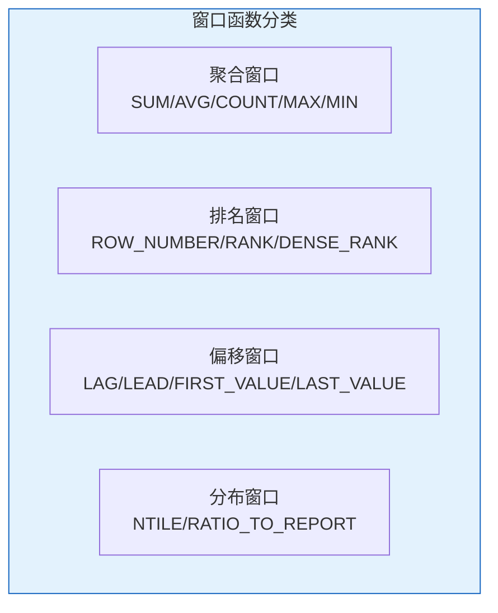
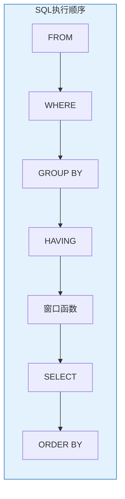

# Oracle窗口函数详解

## 一、概述

### 1.1 一句话定义

Oracle窗口函数（分析函数）是在结果集的某个窗口（分区）上执行计算的函数，不折叠行，每行保留原始粒度同时获得聚合或排名信息。
它在复杂查询和报表开发中出现和使用，解决需要同时看到明细和汇总统计的问题。

### 1.2 为什么重要

- **不掌握的后果：** 复杂查询需要自连接或子查询，性能差且代码复杂
- **掌握的价值：** 简化复杂查询，提高性能和可读性

### 1.3 适用场景

| 场景 | 说明 |
|------|------|
| 排名计算 | 销售排名、成绩排名 |
| 累计计算 | 累计销售额、移动平均 |
| 行间比较 | 环比、同比 |
| 分组TOP N | 每组前N条记录 |

## 二、术语与概念

### 2.1 核心术语表

| 术语 | 含义 | 类比 |
|------|------|------|
| PARTITION BY | 分区 | 分组 |
| ORDER BY | 排序 | 窗口内排序 |
| Window Frame | 窗口框架 | 计算范围 |
| ROWS | 物理行范围 | 按行计 |
| RANGE | 逻辑值范围 | 按值计 |

### 2.2 窗口函数分类



## 三、核心原理

### 3.1 基本语法

```sql
-- 窗口函数基本语法
function_name(args) OVER (
    [PARTITION BY partition_expression]
    [ORDER BY sort_expression]
    [window_frame]
)
```

### 3.2 聚合窗口函数

```sql
-- 部门内累计销售额
SELECT employee_id, department_id, hire_date, salary,
       SUM(salary) OVER (PARTITION BY department_id ORDER BY hire_date
                         ROWS BETWEEN UNBOUNDED PRECEDING AND CURRENT ROW) AS running_total,
       AVG(salary) OVER (PARTITION BY department_id) AS dept_avg,
       COUNT(*) OVER (PARTITION BY department_id) AS dept_count,
       MAX(salary) OVER (PARTITION BY department_id) AS dept_max,
       MIN(salary) OVER (PARTITION BY department_id) AS dept_min
FROM employees;

-- 移动平均（3行窗口）
SELECT hire_date, salary,
       AVG(salary) OVER (ORDER BY hire_date
                         ROWS BETWEEN 1 PRECEDING AND 1 FOLLOWING) AS moving_avg
FROM employees;
```

### 3.3 排名窗口函数

```sql
-- 三种排名函数对比
SELECT employee_id, department_id, salary,
       ROW_NUMBER() OVER (PARTITION BY department_id ORDER BY salary DESC) AS row_num,
       RANK()       OVER (PARTITION BY department_id ORDER BY salary DESC) AS rank_val,
       DENSE_RANK() OVER (PARTITION BY department_id ORDER BY salary DESC) AS dense_rank_val
FROM employees;

-- ROW_NUMBER: 1,2,3,4（唯一）
-- RANK: 1,1,3,4（相同值同排名，跳号）
-- DENSE_RANK: 1,1,2,3（相同值同排名，不跳号）

-- 百分比排名
SELECT employee_id, salary,
       PERCENT_RANK() OVER (ORDER BY salary) AS pct_rank,
       CUME_DIST() OVER (ORDER BY salary) AS cume_dist
FROM employees;
```

### 3.4 偏移窗口函数

```sql
-- LAG/LEAD：与前/后行比较
SELECT employee_id, hire_date, salary,
       LAG(salary, 1) OVER (ORDER BY hire_date) AS prev_salary,
       LEAD(salary, 1) OVER (ORDER BY hire_date) AS next_salary,
       salary - LAG(salary, 1) OVER (ORDER BY hire_date) AS salary_change,
       ROUND((salary - LAG(salary, 1) OVER (ORDER BY hire_date)) / 
             LAG(salary, 1) OVER (ORDER BY hire_date) * 100, 2) AS pct_change
FROM employees;

-- FIRST_VALUE/LAST_VALUE
SELECT employee_id, department_id, salary,
       FIRST_VALUE(employee_id) OVER (
           PARTITION BY department_id ORDER BY salary DESC
           ROWS BETWEEN UNBOUNDED PRECEDING AND UNBOUNDED FOLLOWING
       ) AS highest_paid_emp,
       LAST_VALUE(employee_id) OVER (
           PARTITION BY department_id ORDER BY salary DESC
           ROWS BETWEEN UNBOUNDED PRECEDING AND UNBOUNDED FOLLOWING
       ) AS lowest_paid_emp
FROM employees;

-- NTH_VALUE
SELECT employee_id, department_id, salary,
       NTH_VALUE(employee_id, 2) OVER (
           PARTITION BY department_id ORDER BY salary DESC
           ROWS BETWEEN UNBOUNDED PRECEDING AND UNBOUNDED FOLLOWING
       ) AS second_highest
FROM employees;
```

### 3.5 分布窗口函数

```sql
-- NTILE：等分桶
SELECT employee_id, salary,
       NTILE(4) OVER (ORDER BY salary) AS quartile
FROM employees;

-- RATIO_TO_REPORT：占比
SELECT department_id, 
       SUM(salary) AS dept_salary,
       ROUND(RATIO_TO_REPORT(SUM(salary)) OVER () * 100, 2) AS pct_of_total
FROM employees
GROUP BY department_id;
```

### 3.6 窗口框架

```sql
-- ROWS：物理行
ROWS BETWEEN 2 PRECEDING AND CURRENT ROW  -- 前2行到当前行
ROWS BETWEEN UNBOUNDED PRECEDING AND CURRENT ROW  -- 从开始到当前
ROWS BETWEEN 1 PRECEDING AND 1 FOLLOWING  -- 前后各1行

-- RANGE：逻辑值
RANGE BETWEEN INTERVAL '1' HOUR PRECEDING AND CURRENT ROW
RANGE BETWEEN UNBOUNDED PRECEDING AND UNBOUNDED FOLLOWING  -- 整个分区
```

### 3.7 实战场景

```sql
-- 场景1：每组TOP N
SELECT * FROM (
    SELECT employee_id, department_id, salary,
           ROW_NUMBER() OVER (PARTITION BY department_id ORDER BY salary DESC) AS rn
    FROM employees
) WHERE rn <= 3;

-- 场景2：连续登录天数
SELECT user_id, login_date,
       login_date - ROW_NUMBER() OVER (PARTITION BY user_id ORDER BY login_date) AS grp
FROM login_history;

-- 场景3：同比环比
SELECT month, revenue,
       LAG(revenue, 1) OVER (ORDER BY month) AS prev_month,
       LAG(revenue, 12) OVER (ORDER BY month) AS prev_year,
       ROUND((revenue - LAG(revenue, 1) OVER (ORDER BY month)) / 
             LAG(revenue, 1) OVER (ORDER BY month) * 100, 2) AS mom_pct,
       ROUND((revenue - LAG(revenue, 12) OVER (ORDER BY month)) / 
             LAG(revenue, 12) OVER (ORDER BY month) * 100, 2) AS yoy_pct
FROM monthly_sales;
```

## 四、架构与组件

### 4.1 窗口函数执行顺序



## 五、配置与调优

### 5.1 性能优化

| 技巧 | 说明 |
|------|------|
| 减少分区列 | 分区键越少越好 |
| 避免复杂排序 | 排序影响性能 |
| 使用索引 | 排序列有索引 |
| 合并窗口 | 相同窗口可复用 |

## 六、监控与诊断

### 6.1 执行计划分析

```sql
-- 查看窗口函数执行计划
EXPLAIN PLAN FOR
SELECT employee_id, salary,
       ROW_NUMBER() OVER (ORDER BY salary) AS rn
FROM employees;
SELECT * FROM TABLE(DBMS_XPLAN.DISPLAY);
```

## 七、实战案例

### 7.1 案例：销售排行榜

```sql
-- 按部门、月份的销售排行
SELECT department_id, 
       TO_CHAR(sale_date, 'YYYY-MM') AS month,
       employee_id,
       sales_amount,
       RANK() OVER (PARTITION BY department_id, TO_CHAR(sale_date, 'YYYY-MM')
                    ORDER BY sales_amount DESC) AS rank_in_dept
FROM sales
WHERE sale_date >= ADD_MONTHS(SYSDATE, -3);
```

## 八、常见错误与排查

| 错误 | 问题 | 解决方法 |
|------|------|---------|
| ORA-30483 | 窗口函数后不能再有窗口 | 检查语法 |
| ORA-30485 | 缺少ORDER BY | 添加排序 |
| ORA-00907 | 缺少右括号 | 检查语法 |

## 九、最佳实践

### 9.1 官方推荐

- 优先使用窗口函数替代自连接
- 理解窗口框架的语义
- 注意NULL值处理
- 合理使用分区键

## 十、命令与视图汇总

| 函数 | 用途 |
|------|------|
| ROW_NUMBER | 唯一行号 |
| RANK/DENSE_RANK | 排名 |
| LAG/LEAD | 前后行 |
| FIRST/LAST_VALUE | 首尾值 |
| SUM/AVG OVER | 聚合窗口 |
| NTILE | 分桶 |

## 十一、总结速查

### 11.1 黄金法则

1. **理解分区** - PARTITION BY定义窗口
2. **理解排序** - ORDER BY定义顺序
3. **理解框架** - ROWS/RANGE定义范围
4. **性能意识** - 减少复杂窗口

## 附录

### A. 官方参考

- [Oracle Database SQL Language Reference - Analytic Functions](https://docs.oracle.com/en/database/oracle/oracle-database/19c/sqlrf/)

### B. 修订记录

| 日期 | 版本 | 修改内容 | 修改人 |
|------|------|---------|--------|
| 2026-07-02 | v1.0 | 初始版本 | YashanDB知识库生成器 |

## 七、高级窗口函数

### 7.1 LAG/LEAD高级用法

```sql
-- 计算环比增长
SELECT month, revenue,
    LAG(revenue, 1) OVER (ORDER BY month) AS prev_month,
    ROUND((revenue - LAG(revenue, 1) OVER (ORDER BY month)) / 
          NULLIF(LAG(revenue, 1) OVER (ORDER BY month), 0) * 100, 2) AS growth_pct
FROM monthly_sales;

-- 计算时间差
SELECT employee_id, hire_date,
    hire_date - LAG(hire_date) OVER (ORDER BY hire_date) AS days_since_last_hire
FROM employees;

-- LEAD预测下一值
SELECT product_id, sale_date, amount,
    LEAD(amount, 1, 0) OVER (PARTITION BY product_id ORDER BY sale_date) AS next_sale
FROM sales;
```

### 7.2 FIRST_VALUE/LAST_VALUE

```sql
-- 每组中最高薪和最低薪的员工
SELECT department_id, first_name, salary,
    FIRST_VALUE(first_name) OVER (
        PARTITION BY department_id ORDER BY salary DESC
        ROWS BETWEEN UNBOUNDED PRECEDING AND UNBOUNDED FOLLOWING
    ) AS highest_paid,
    FIRST_VALUE(salary) OVER (
        PARTITION BY department_id ORDER BY salary DESC
        ROWS BETWEEN UNBOUNDED PRECEDING AND UNBOUNDED FOLLOWING
    ) AS highest_salary,
    LAST_VALUE(first_name) OVER (
        PARTITION BY department_id ORDER BY salary ASC
        ROWS BETWEEN UNBOUNDED PRECEDING AND UNBOUNDED FOLLOWING
    ) AS lowest_paid
FROM employees;
```

### 7.3 NTH_VALUE

```sql
-- 找到每组中第N高的值
SELECT department_id, first_name, salary,
    NTH_VALUE(first_name, 2) OVER (
        PARTITION BY department_id ORDER BY salary DESC
        ROWS BETWEEN UNBOUNDED PRECEDING AND UNBOUNDED FOLLOWING
    ) AS second_highest
FROM employees;
```

## 八、窗口函数性能优化

### 8.1 优化建议

| 建议 | 说明 |
|------|------|
| 减少窗口范围 | 使用ROWS/RANGE限制 |
| 合并窗口 | 相同OVER的子句合并 |
| 避免嵌套 | 窗口函数不能嵌套 |
| 索引支持 | PARTITION BY列加索引 |

```sql
-- 优化前：多个窗口函数
SELECT employee_id, salary,
    RANK() OVER (ORDER BY salary DESC) AS salary_rank,
    SUM(salary) OVER (PARTITION BY department_id) AS dept_total
FROM employees;

-- 优化后：使用WITH子句避免重复计算
WITH ranked AS (
    SELECT employee_id, department_id, salary,
        RANK() OVER (ORDER BY salary DESC) AS salary_rank
    FROM employees
)
SELECT r.*, 
    SUM(r.salary) OVER (PARTITION BY r.department_id) AS dept_total
FROM ranked r;
```

## 九、实战案例

### 9.1 连续登录天数计算

```sql
-- 计算用户连续登录天数
WITH login_groups AS (
    SELECT user_id, login_date,
        login_date - ROW_NUMBER() OVER (PARTITION BY user_id ORDER BY login_date) AS grp
    FROM (SELECT DISTINCT user_id, TRUNC(login_time) AS login_date FROM user_logins)
)
SELECT user_id, grp,
    MIN(login_date) AS start_date,
    MAX(login_date) AS end_date,
    COUNT(*) AS consecutive_days
FROM login_groups
GROUP BY user_id, grp
HAVING COUNT(*) >= 7;  -- 连续登录7天以上
```

### 9.2 移动平均计算

```sql
-- 7天移动平均
SELECT sale_date, daily_sales,
    AVG(daily_sales) OVER (
        ORDER BY sale_date
        ROWS BETWEEN 6 PRECEDING AND CURRENT ROW
    ) AS moving_avg_7d,
    AVG(daily_sales) OVER (
        ORDER BY sale_date
        ROWS BETWEEN 29 PRECEDING AND CURRENT ROW
    ) AS moving_avg_30d
FROM daily_sales_data;
```

## 十、常见错误

| 错误 | 原因 | 解决方案 |
|------|------|---------|
| ORA-30483 | 窗口函数后不能用ORDER BY | 外层排序 |
| ORA-30484 | 缺少WINDOWING子句 | 添加ROWS/RANGE |
| ORA-30485 | 排序表达式问题 | 检查ORDER BY |

## 十一、总结速查

| 函数 | 用途 | 典型场景 |
|------|------|---------|
| ROW_NUMBER | 唯一行号 | 去重、分页 |
| RANK/DENSE_RANK | 排名 | 排行榜 |
| LAG/LEAD | 前后行 | 环比分析 |
| SUM/AVG OVER | 累计计算 | 移动平均 |
| FIRST/LAST_VALUE | 极值 | 组内最高最低 |
| NTILE | 分桶 | 百分位 |
