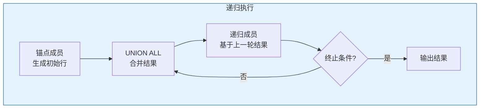

# Oracle CTE与递归查询

## 一、概述

### 1.1 一句话定义

Oracle CTE（Common Table Expression，公用表表达式）是通过WITH子句定义临时结果集，简化复杂查询的SQL构造方式；递归CTE则是CTE的自引用形式，用于处理层次数据。
它在复杂查询和层次数据处理中出现和使用，解决BOM展开、组织架构图、路径查找等问题。

### 1.2 为什么重要

- **不掌握的后果：** 复杂查询难以编写和维护，层次查询效率低
- **掌握的价值：** 简化复杂查询，优雅处理层次数据

### 1.3 适用场景

| 场景 | 说明 |
|------|------|
| 复杂查询分解 | 分步构建复杂逻辑 |
| BOM展开 | 物料清单展开 |
| 组织架构 | 上下级关系查询 |
| 路径查找 | 图结构遍历 |

## 二、术语与概念

### 2.1 核心术语表

| 术语 | 含义 | 类比 |
|------|------|------|
| CTE | 公用表表达式 | 临时视图 |
| WITH子句 | CTE定义 | 命名子查询 |
| Recursive CTE | 递归CTE | 自引用 |
| Anchor Member | 锚点成员 | 递归起点 |
| Recursive Member | 递归成员 | 递归步骤 |
| CONNECT BY | 层次查询 | 传统递归 |

## 三、核心原理

### 3.1 基本CTE

```sql
-- 基本CTE语法
WITH cte_name AS (
    SELECT ...
)
SELECT * FROM cte_name;

-- 多个CTE
WITH 
    dept_avg AS (
        SELECT department_id, AVG(salary) AS avg_sal
        FROM employees GROUP BY department_id
    ),
    high_earners AS (
        SELECT e.*
        FROM employees e
        JOIN dept_avg d ON e.department_id = d.department_id
        WHERE e.salary > d.avg_sal
    )
SELECT * FROM high_earners;

-- CTE用于复杂查询分解
WITH 
    monthly_sales AS (
        SELECT TO_CHAR(order_date, 'YYYY-MM') AS month,
               SUM(amount) AS total
        FROM orders
        GROUP BY TO_CHAR(order_date, 'YYYY-MM')
    ),
    growth AS (
        SELECT month, total,
               LAG(total) OVER (ORDER BY month) AS prev_month,
               ROUND((total - LAG(total) OVER (ORDER BY month)) / 
                     LAG(total) OVER (ORDER BY month) * 100, 2) AS growth_pct
        FROM monthly_sales
    )
SELECT * FROM growth;
```

### 3.2 递归CTE

```sql
-- 递归CTE语法
WITH recursive_cte (col1, col2, ...) AS (
    -- 锚点成员（起始行）
    SELECT ...
    UNION ALL
    -- 递归成员（引用自身）
    SELECT ... FROM recursive_cte WHERE ...
)
SELECT * FROM recursive_cte;

-- 示例：数字序列
WITH nums (n) AS (
    SELECT 1 FROM dual          -- 锚点
    UNION ALL
    SELECT n + 1 FROM nums WHERE n < 10  -- 递归
)
SELECT * FROM nums;

-- 组织架构查询
WITH org_tree (employee_id, name, manager_id, level, path) AS (
    -- 锚点：顶级管理者
    SELECT employee_id, name, manager_id, 1,
           CAST(name AS VARCHAR2(4000))
    FROM employees
    WHERE manager_id IS NULL
    
    UNION ALL
    
    -- 递归：下属
    SELECT e.employee_id, e.name, e.manager_id, t.level + 1,
           CAST(t.path || ' > ' || e.name AS VARCHAR2(4000))
    FROM employees e
    JOIN org_tree t ON e.manager_id = t.employee_id
)
SELECT LPAD(' ', (level-1)*2) || name AS org_chart,
       level, path
FROM org_tree
ORDER BY path;
```

### 3.3 BOM展开

```sql
-- 物料清单（BOM）展开
WITH bom_tree (component_id, component_name, parent_id, level, qty, path) AS (
    -- 锚点：顶级产品
    SELECT component_id, component_name, parent_id, 1, quantity,
           CAST(component_name AS VARCHAR2(4000))
    FROM bom
    WHERE parent_id = 'PRODUCT_A'
    
    UNION ALL
    
    -- 递归：子组件
    SELECT b.component_id, b.component_name, b.parent_id, t.level + 1,
           t.qty * b.quantity,
           CAST(t.path || ' > ' || b.component_name AS VARCHAR2(4000))
    FROM bom b
    JOIN bom_tree t ON b.parent_id = t.component_id
    WHERE t.level < 10  -- 防止无限递归
)
SELECT LPAD(' ', (level-1)*2) || component_name AS bom_chart,
       level, qty, path
FROM bom_tree
ORDER SIBLINGS BY component_name;
```

### 3.4 CTE vs CONNECT BY

```sql
-- CONNECT BY方式（传统）
SELECT LPAD(' ', (LEVEL-1)*2) || name AS org_chart,
       LEVEL, employee_id, manager_id
FROM employees
START WITH manager_id IS NULL
CONNECT BY PRIOR employee_id = manager_id;

-- 递归CTE方式（现代）
WITH org (employee_id, name, manager_id, lvl) AS (
    SELECT employee_id, name, manager_id, 1
    FROM employees WHERE manager_id IS NULL
    UNION ALL
    SELECT e.employee_id, e.name, e.manager_id, o.lvl + 1
    FROM employees e JOIN org o ON e.manager_id = o.employee_id
)
SELECT LPAD(' ', (lvl-1)*2) || name, lvl
FROM org;
```

| 对比项 | CONNECT BY | 递归CTE |
|--------|-----------|---------|
| 语法 | 简洁 | 灵活 |
| 标准 | Oracle专有 | SQL标准 |
| 多根 | 支持 | 支持 |
| 路径计算 | SYS_CONNECT_BY_PATH | 手动拼接 |
| 性能 | 优化较好 | 视情况 |

### 3.5 CTE的物化与内联

```sql
-- 物化CTE（MATERIALIZED）- 结果缓存
WITH /*+ MATERIALIZE */ large_data AS (
    SELECT /* complex query */
)
SELECT * FROM large_data;

-- 内联CTE（INLINE）- 不缓存
WITH /*+ INLINE */ simple_data AS (
    SELECT ...
)
SELECT * FROM simple_data;

-- Oracle 12c+ 自动优化器决定
```

## 四、架构与组件

### 4.1 递归执行流程



## 五、配置与调优

### 5.1 性能优化

| 技巧 | 说明 |
|------|------|
| 限制递归深度 | WHERE level < N |
| 使用索引 | 连接列有索引 |
| 物化CTE | 避免重复计算 |
| 选择合适方式 | CONNECT BY或CTE |

## 六、监控与诊断

### 6.1 递归深度监控

```sql
-- 查看递归深度
WITH nums (n, depth) AS (
    SELECT 1, 1 FROM dual
    UNION ALL
    SELECT n+1, depth+1 FROM nums WHERE n < 100
)
SELECT MAX(depth) FROM nums;

-- 防止无限递归（Oracle默认限制500层）
-- ORA-32044: recursion limit exceeded
```

## 七、实战案例

### 7.1 案例：组织架构报表

```sql
WITH org_tree AS (
    SELECT employee_id, name, manager_id, 1 AS level,
           CAST(name AS VARCHAR2(4000)) AS path
    FROM employees WHERE manager_id IS NULL
    UNION ALL
    SELECT e.employee_id, e.name, e.manager_id, t.level + 1,
           CAST(t.path || ' > ' || e.name AS VARCHAR2(4000))
    FROM employees e JOIN org_tree t ON e.manager_id = t.employee_id
)
SELECT level, LPAD(' ', (level-1)*3) || name AS org_chart,
       path
FROM org_tree
ORDER BY path;
```

## 八、常见错误与排查

| 错误 | 问题 | 解决方法 |
|------|------|---------|
| ORA-32044 | 递归超限 | 添加终止条件 |
| ORA-01790 | UNION类型不匹配 | 统一数据类型 |
| ORA-32039 | 缺少列名 | 指定列别名 |

## 九、最佳实践

### 9.1 官方推荐

- 使用CTE分解复杂查询
- 递归查询必须有终止条件
- 大数据量考虑CONNECT BY
- 使用MATERIALIZED提示优化

## 十、命令与视图汇总

| 语法 | 用途 |
|------|------|
| `WITH ... AS` | CTE定义 |
| `UNION ALL` | 递归合并 |
| `CONNECT BY` | 传统层次查询 |
| `START WITH` | 递归起点 |

## 十一、总结速查

### 11.1 黄金法则

1. **CTE分解** - 简化复杂查询
2. **终止条件** - 防止无限递归
3. **选择工具** - CTE或CONNECT BY
4. **性能意识** - 合理使用提示

## 附录

### A. 官方参考

- [Oracle Database SQL Language Reference - Hierarchical Queries](https://docs.oracle.com/en/database/oracle/oracle-database/19c/sqlrf/)

### B. 修订记录

| 日期 | 版本 | 修改内容 | 修改人 |
|------|------|---------|--------|
| 2026-07-02 | v1.0 | 初始版本 | YashanDB知识库生成器 |

## 七、递归查询高级用法

### 7.1 组织架构层级查询

```sql
-- 组织架构树
WITH org_tree AS (
    -- 锚定成员：CEO（无上级）
    SELECT employee_id, first_name, manager_id, 1 AS level,
           first_name AS path
    FROM employees WHERE manager_id IS NULL
    
    UNION ALL
    
    -- 递归成员：下属
    SELECT e.employee_id, e.first_name, e.manager_id, t.level + 1,
           t.path || ' > ' || e.first_name
    FROM employees e
    JOIN org_tree t ON e.manager_id = t.employee_id
    WHERE t.level < 10  -- 防止无限递归
)
SELECT LPAD(' ', (level-1)*3) || first_name AS org_chart,
       level, path
FROM org_tree
ORDER BY path;
```

### 7.2 BOM物料清单展开

```sql
-- 递归展开BOM
WITH bom_tree AS (
    SELECT component_id, parent_id, component_name, quantity, 1 AS level,
           component_name AS path
    FROM bom_components WHERE parent_id IS NULL
    
    UNION ALL
    
    SELECT c.component_id, c.parent_id, c.component_name, c.quantity * b.quantity,
           b.level + 1,
           b.path || ' → ' || c.component_name
    FROM bom_components c
    JOIN bom_tree b ON c.parent_id = b.component_id
    WHERE b.level < 20
)
SELECT LPAD(' ', (level-1)*2) || component_name AS bom_tree,
       level, quantity, path
FROM bom_tree
ORDER BY path;
```

### 7.3 日期序列生成

```sql
-- 生成日期序列
WITH date_seq AS (
    SELECT DATE '2026-01-01' AS dt FROM dual
    UNION ALL
    SELECT dt + 1 FROM date_seq WHERE dt < DATE '2026-12-31'
)
SELECT dt, TO_CHAR(dt, 'Day') AS day_name
FROM date_seq;

-- 生成数字序列
WITH num_seq AS (
    SELECT 1 AS n FROM dual
    UNION ALL
    SELECT n + 1 FROM num_seq WHERE n < 100
)
SELECT n FROM num_seq;
```

## 八、CTE性能优化

### 8.1 物化CTE

```sql
-- 当CTE被多次引用时，使用MATERIALIZE避免重复计算
WITH /*+ MATERIALIZE */ expensive_query AS (
    SELECT /* 复杂查询 */ * FROM big_table WHERE complex_condition
)
SELECT * FROM expensive_query WHERE condition1
UNION ALL
SELECT * FROM expensive_query WHERE condition2;

-- 使用INLINE强制内联
WITH /*+ INLINE */ simple_calc AS (
    SELECT id, value * 1.1 AS adjusted FROM data
)
SELECT * FROM simple_calc WHERE adjusted > 100;
```

### 8.2 递归查询优化

| 建议 | 说明 |
|------|------|
| 限制递归深度 | WHERE level < N |
| 使用索引 | 连接列加索引 |
| CYCLE检测 | 防止无限循环 |
| 避免大结果集 | 限制返回行数 |

```sql
-- CYCLE检测
WITH org_tree AS (
    SELECT employee_id, manager_id, 1 AS level
    FROM employees WHERE manager_id IS NULL
    UNION ALL
    SELECT e.employee_id, e.manager_id, t.level + 1
    FROM employees e JOIN org_tree t ON e.manager_id = t.employee_id
    WHERE t.level < 50
)
SEARCH DEPTH FIRST BY employee_id SET order_col
CYCLE employee_id SET is_cycle TO 'Y' DEFAULT 'N'
SELECT * FROM org_tree WHERE is_cycle = 'N';
```

## 九、常见错误

| 错误 | 原因 | 解决方案 |
|------|------|---------|
| ORA-32033 | 不支持的列别名 | 检查CTE语法 |
| ORA-32044 | 递归循环 | 添加CYCLE检测 |
| ORA-01436 | CONNECT BY循环 | 使用NOCYCLE |

## 十、总结速查

| 特性 | 用途 | 注意 |
|------|------|------|
| WITH子句 | 定义CTE | 提高可读性 |
| 递归CTE | 层级查询 | 限制深度 |
| SEARCH | 搜索顺序 | BFS/DFS |
| CYCLE | 循环检测 | 防止死循环 |
| MATERIALIZE | 物化CTE | 多次引用 |
