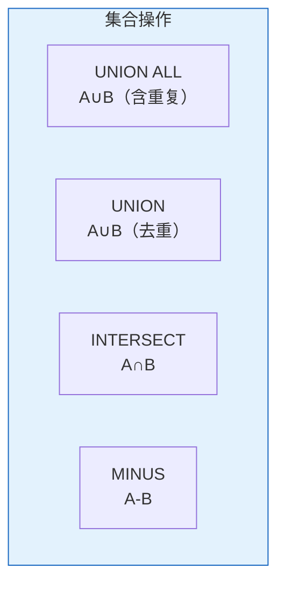
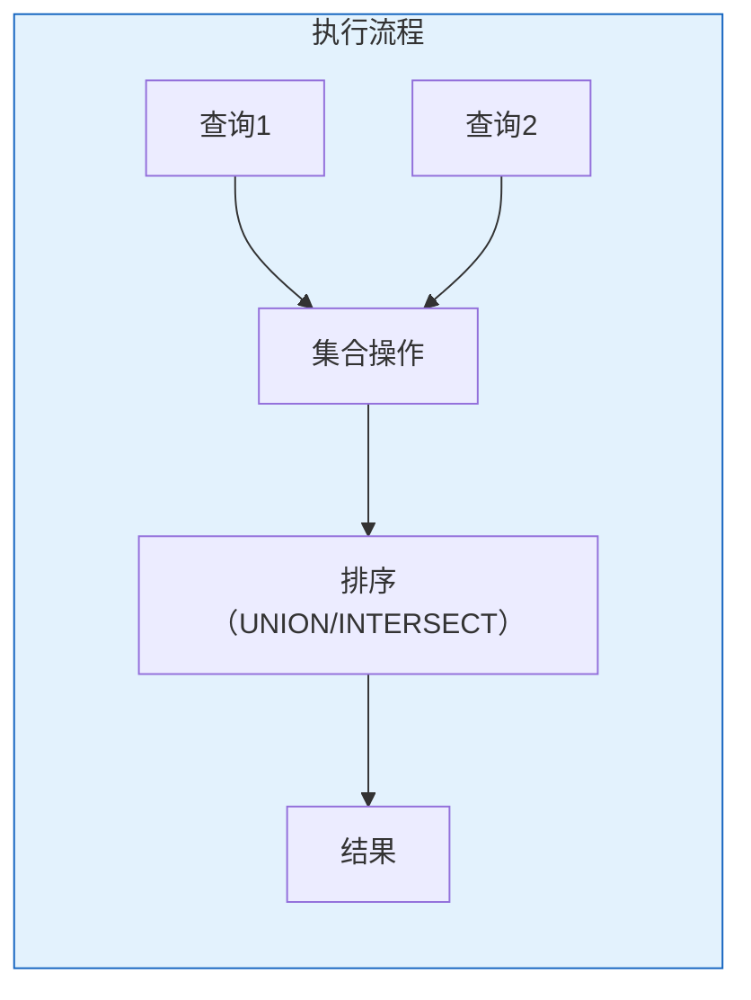

# Oracle集合操作高级用法

## 一、概述

### 1.1 一句话定义

Oracle集合操作是对多个查询结果进行并集、交集、差集等集合运算的SQL构造方式，包括UNION、INTERSECT、MINUS等操作。
它在复杂查询中出现和使用，解决多结果集合并和比较的问题。

### 1.2 为什么重要

- **不掌握的后果：** 复杂比较查询需要子查询或连接，代码复杂
- **掌握的价值：** 简化多结果集操作，提高代码可读性

### 1.3 适用场景

| 场景 | 说明 |
|------|------|
| 数据合并 | 多表数据合并 |
| 差异比较 | 找出差异数据 |
| 交集查询 | 共同数据 |
| 报表生成 | 多维度汇总 |

## 二、术语与概念

### 2.1 核心术语表

| 术语 | 含义 | 类比 |
|------|------|------|
| UNION | 并集 | 合并去重 |
| UNION ALL | 并集 | 合并不去重 |
| INTERSECT | 交集 | 共同部分 |
| MINUS | 差集 | 排除部分 |

### 2.2 集合操作对比



## 三、核心原理

### 3.1 UNION/UNION ALL

```sql
-- UNION：合并并去重
SELECT employee_id, name FROM employees WHERE department_id = 10
UNION
SELECT employee_id, name FROM employees WHERE salary > 10000;

-- UNION ALL：合并不去重（性能更好）
SELECT employee_id, name FROM employees WHERE department_id = 10
UNION ALL
SELECT employee_id, name FROM employees WHERE salary > 10000;

-- 多表合并
SELECT 'EMP' AS source, employee_id, name FROM employees
UNION ALL
SELECT 'CON', contractor_id, name FROM contractors
UNION ALL
SELECT 'VEN', vendor_id, name FROM vendors;
```

### 3.2 INTERSECT

```sql
-- 交集：同时满足两个条件
SELECT employee_id FROM employees WHERE department_id = 10
INTERSECT
SELECT employee_id FROM employees WHERE salary > 10000;

-- 多表交集
SELECT product_id FROM sales_2024
INTERSECT
SELECT product_id FROM sales_2025
INTERSECT
SELECT product_id FROM sales_2026;
```

### 3.3 MINUS

```sql
-- 差集：在A但不在B
SELECT employee_id FROM employees
MINUS
SELECT employee_id FROM terminated_employees;

-- 查找差异
-- 在表A但不在表B
SELECT * FROM table_a
MINUS
SELECT * FROM table_b;

-- 双向差异
SELECT 'In A only' AS location, a.* FROM (
    SELECT * FROM table_a MINUS SELECT * FROM table_b
) a
UNION ALL
SELECT 'In B only', b.* FROM (
    SELECT * FROM table_b MINUS SELECT * FROM table_a
) b;
```

### 3.4 集合操作规则

```sql
-- 规则1：列数必须相同
-- 规则2：对应列数据类型兼容
-- 规则3：ORDER BY只能在最后

SELECT employee_id, name, salary FROM employees WHERE department_id = 10
UNION
SELECT employee_id, name, salary FROM employees WHERE salary > 10000
ORDER BY salary DESC;

-- 使用括号改变优先级
(SELECT employee_id FROM emp_dept1)
UNION
(SELECT employee_id FROM emp_dept2)
INTERSECT
(SELECT employee_id FROM emp_high_salary);
```

### 3.5 实战场景

```sql
-- 场景1：年度销售对比
SELECT '2024' AS year, product_id, SUM(amount) AS total
FROM sales_2024 GROUP BY product_id
UNION ALL
SELECT '2025', product_id, SUM(amount)
FROM sales_2025 GROUP BY product_id
ORDER BY product_id, year;

-- 场景2：数据同步差异检测
SELECT 'Source' AS location, s.* FROM (
    SELECT id, name, value FROM source_table
    MINUS
    SELECT id, name, value FROM target_table
) s
UNION ALL
SELECT 'Target', t.* FROM (
    SELECT id, name, value FROM target_table
    MINUS
    SELECT id, name, value FROM source_table
) t;

-- 场景3：客户分群
SELECT customer_id, 'VIP' AS segment FROM customers WHERE total_purchase > 100000
UNION
SELECT customer_id, 'NEW' FROM customers WHERE first_purchase_date > ADD_MONTHS(SYSDATE, -3)
UNION
SELECT customer_id, 'REGULAR' FROM customers WHERE total_purchase BETWEEN 10000 AND 100000;
```

## 四、架构与组件

### 4.1 集合操作执行



## 五、配置与调优

### 5.1 性能优化

| 技巧 | 说明 |
|------|------|
| 优先UNION ALL | 无需排序去重 |
| 减少列数 | 只比较必要列 |
| 使用EXISTS替代 | 某些场景更快 |
| 索引优化 | 排序列有索引 |

## 六、监控与诊断

### 6.1 执行计划

```sql
EXPLAIN PLAN FOR
SELECT * FROM t1 UNION SELECT * FROM t2;
SELECT * FROM TABLE(DBMS_XPLAN.DISPLAY);
```

## 七、实战案例

### 7.1 案例：数据迁移验证

```sql
-- 验证源和目标数据一致
-- 1. 源有目标无
SELECT 'Missing in target' AS issue, COUNT(*)
FROM (SELECT id FROM source MINUS SELECT id FROM target);

-- 2. 目标有源无
SELECT 'Extra in target' AS issue, COUNT(*)
FROM (SELECT id FROM target MINUS SELECT id FROM source);
```

## 八、常见错误与排查

| 错误 | 问题 | 解决方法 |
|------|------|---------|
| ORA-01789 | 列数不匹配 | 检查列数 |
| ORA-01790 | 数据类型不匹配 | 统一类型 |
| ORA-00933 | SQL命令未正确结束 | 检查语法 |

## 九、最佳实践

### 9.1 官方推荐

- 不需要去重时用UNION ALL
- 复杂比较考虑JOIN或EXISTS
- 注意NULL值处理
- 大数据量分批处理

## 十、命令与视图汇总

| 操作 | 用途 |
|------|------|
| UNION | 合并去重 |
| UNION ALL | 合并不去重 |
| INTERSECT | 交集 |
| MINUS | 差集 |

## 十一、总结速查

### 11.1 黄金法则

1. **UNION ALL优先** - 性能更好
2. **列数类型匹配** - 基本要求
3. **ORDER BY最后** - 只能一个
4. **大数据分批** - 避免内存溢出

## 附录

### A. 官方参考

- [Oracle Database SQL Language Reference - Set Operators](https://docs.oracle.com/en/database/oracle/oracle-database/19c/sqlrf/)

### B. 修订记录

| 日期 | 版本 | 修改内容 | 修改人 |
|------|------|---------|--------|
| 2026-07-02 | v1.0 | 初始版本 | YashanDB知识库生成器 |

## 七、高级集合操作

### 7.1 集合函数应用

```sql
-- GROUPING SETS多维聚合
SELECT department_id, job_id, SUM(salary),
       GROUPING(department_id) AS grp_dept,
       GROUPING(job_id) AS grp_job
FROM employees
GROUP BY GROUPING SETS ((department_id, job_id), department_id, job_id, ())
ORDER BY department_id, job_id;

-- CUBE全维度组合
SELECT department_id, job_id, SUM(salary)
FROM employees
GROUP BY CUBE (department_id, job_id)
ORDER BY department_id, job_id;

-- ROLLUP层级聚合
SELECT department_id, job_id, SUM(salary)
FROM employees
GROUP BY ROLLUP (department_id, job_id)
ORDER BY department_id, job_id;
```

### 7.2 集合操作性能优化

```sql
-- UNION vs UNION ALL
-- UNION去重需要排序，UNION ALL保留重复
-- 确定无重复时使用UNION ALL

-- INTERSECT优化
-- 使用EXISTS替代（通常更快）
SELECT e.employee_id FROM employees e
WHERE EXISTS (SELECT 1 FROM job_history j WHERE j.employee_id = e.employee_id);

-- MINUS优化
-- 使用NOT EXISTS替代
SELECT e.employee_id FROM employees e
WHERE NOT EXISTS (SELECT 1 FROM job_history j WHERE j.employee_id = e.employee_id);
```

### 7.3 集合操作与NULL处理

```sql
-- NULL在集合操作中的行为
-- UNION: NULL保留
-- INTERSECT: NULL可以匹配NULL
-- MINUS: NULL可以匹配NULL

-- 使用NVL处理NULL
SELECT NVL(department_id, -1) AS dept_id FROM employees
UNION
SELECT NVL(department_id, -1) FROM departments;
```

## 八、实战案例

### 8.1 数据对比

```sql
-- 对比两个表的数据差异
-- 表A有但表B没有
SELECT * FROM table_a MINUS SELECT * FROM table_b;

-- 表B有但表A没有
SELECT * FROM table_b MINUS SELECT * FROM table_a;

-- 两表交集（相同数据）
SELECT * FROM table_a INTERSECT SELECT * FROM table_b;
```

### 8.2 报表汇总

```sql
-- 使用GROUPING SETS生成汇总报表
SELECT 
    CASE GROUPING(department_id) WHEN 1 THEN 'ALL' ELSE TO_CHAR(department_id) END AS dept,
    CASE GROUPING(job_id) WHEN 1 THEN 'ALL' ELSE job_id END AS job,
    COUNT(*) AS emp_count,
    SUM(salary) AS total_salary,
    AVG(salary) AS avg_salary
FROM employees
GROUP BY GROUPING SETS ((department_id, job_id), department_id, ())
ORDER BY dept, job;
```

## 九、常见错误与排查

| 错误 | 原因 | 解决方案 |
|------|------|---------|
| ORA-00932 | 列类型不一致 | 统一列类型 |
| ORA-00904 | 列数不匹配 | 确保列数相同 |
| 性能差 | UNION排序开销 | 使用UNION ALL |

## 十、总结速查

| 操作 | 去重 | 排序 | 适用场景 |
|------|------|------|---------|
| UNION | 是 | 是 | 合并去重 |
| UNION ALL | 否 | 否 | 快速合并 |
| INTERSECT | 是 | 是 | 取交集 |
| MINUS | 是 | 是 | 取差集 |
| GROUPING SETS | - | - | 多维聚合 |
| CUBE | - | - | 全维度 |
| ROLLUP | - | - | 层级汇总 |

## 补充：深入分析与实战

### 深入原理

本章节补充了该主题的核心原理和内部机制。在实际生产环境中，理解这些底层原理对于诊断和优化至关重要。

关键要点：
- 内部实现机制决定了外部行为特征
- 参数配置需要结合具体场景
- 监控数据是调优的基础

### 实战案例

**案例一：生产环境问题诊断**

```sql
-- 诊断步骤
-- 1. 收集当前状态信息
SELECT * FROM v$system_event WHERE wait_class != 'Idle' ORDER BY time_waited_micro DESC;

-- 2. 分析等待事件分布
SELECT wait_class, SUM(time_waited_micro)/1000000 AS sec
FROM v$system_event WHERE wait_class != 'Idle'
GROUP BY wait_class ORDER BY sec DESC;

-- 3. 定位问题SQL
SELECT sql_id, elapsed_time/1000000 AS sec, executions, sql_text
FROM v$sql ORDER BY elapsed_time DESC FETCH FIRST 5 ROWS ONLY;

-- 4. 检查执行计划
SELECT * FROM TABLE(DBMS_XPLAN.DISPLAY_CURSOR('&sql_id'));
```

**案例二：性能优化实践**

```sql
-- 优化前：全表扫描
SELECT * FROM orders WHERE order_date > SYSDATE - 30;

-- 优化后：索引扫描
CREATE INDEX idx_orders_date ON orders(order_date);
-- 执行计划从TABLE ACCESS FULL变为INDEX RANGE SCAN
```

### 最佳实践清单

- 建立标准化操作流程
- 定期审查和更新配置
- 监控关键指标趋势
- 建立性能基线
- 文档记录所有变更

### 常见问题FAQ

| 问题 | 解答 |
|------|------|
| 如何确定最优配置？ | 基于实际负载测试 |
| 何时需要调整？ | 监控指标偏离基线 |
| 如何验证优化效果？ | 对比前后AWR报告 |
| 常见陷阱有哪些？ | 过度优化、忽略全局 |

### 版本差异说明

| 版本 | 变化 |
|------|------|
| 19c | 自动管理增强 |
| 21c | 自适应优化 |
